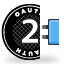
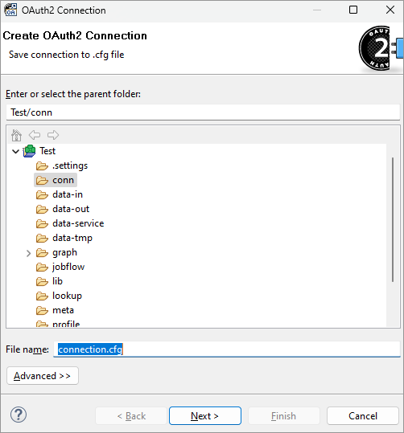
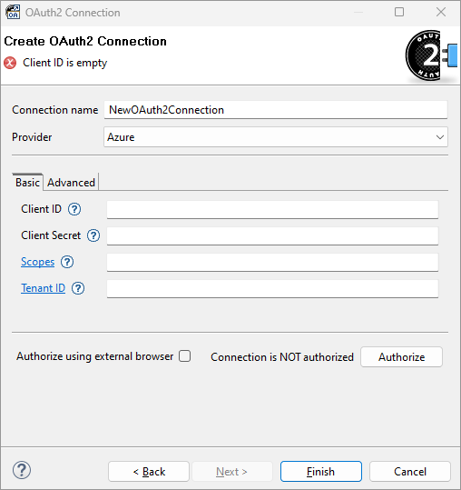
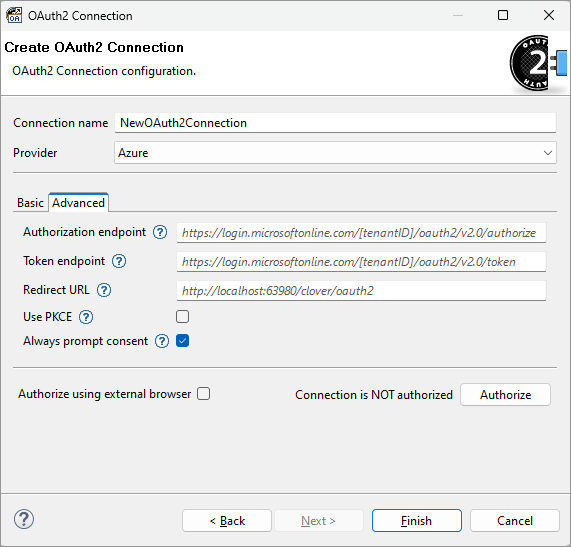

<!-- Development > Job elements > Connections > OAuth2 connections -->

### OAuth2 connections

| [Creating OAuth2 Connection](oauth2-connections.md#creating-oauth2-connection) |
| --- |
| [Basic](oauth2-connections.md#basic) |
| [Advanced](oauth2-connections.md#advanced) |
| [Authorize connection](oauth2-connections.md#authorize-connection) |

#### Short description

**OAuth2 connection** allows you to obtain OAuth2 access token which can by used for authorization with API of external services. The connection can be used together with **HTTPConnector** component or it can provide tokens in CTL2 language.

OAuth2 connections support only **Authorization Code** flow. Other OAuth2 flows are not supported, such as **Client Credentials** flow.

#### Creating OAuth2 connection

To use OAuth2, you first need to register an application in the service where you want to connect. Providers (Google/Azure/other) usually offer free app registrations in their cloud console UI. The registered app will have its `Client ID`, `Client Secret` and it will let you register a `Redirect URL`. For details on what Redirect URL to register, see its section below.

To create a OAuth2 connection, right click **Connections** in **Outline** and choose **Connections** ****Create OAuth2 connection**.

OAuth2 connection is always an external connection, so as the first step you have to specify a file into which the configuration of a new connection will be saved.

*Figure 265. OAuth2 connection dialog - Save connection tab*

In the **Create OAuth2 connection** dialog, fill in the **Connection name**, select the **Provider**, and authorize the connection. Only an authorized connection can provide OAuth2 access token.

Click on **Finish** to save the connection configuration.

#### Basic

Connection properties on the **Basic** tab are mandatory. Some are **Provider** dependent and may not be displayed when you change the **Provider**.

*Figure 266. OAuth2 connection dialog - Basic tab*
**Connection name**
A name for this connection.

Connection name is used to reference the connection in CTL2 function [getOAuth2Token](miscellaneous-functions-ctl2.md#getoauth2token).
**Provider**
Provider is external provider of OAuth2 authorization service. Selecting a specific provider changes default URLs needed to use authorization service and enables behavior specific for that provider (if any).
**Client ID**
Client ID defined in application registration. This ID specifies application registered with authorization service Provider.
**Client secret**
Client secret defined in application registration. This secret protects access to the application registered with authorization service Provider. Use **Secure parameters** to encrypt Client secret property (see [Secure Graph Parameters](parameters.md#secure-graph-parameters)).
**Scopes**
Scopes are permissions of the connection. Their values depend on the application provider. If you have more than one scope, separate individual scopes by spaces.
**Tenant ID**
Only applies for Azure provider. Tenant ID is identifier of Azure Subscription.

#### Advanced

Connection properties on the **Advanced** tab have default values generated based on selected **Provider** and **CloverDX** server/runtime to which the designer project is connected.

*Figure 267. OAuth2 connection dialog - Advanced tab*
**Authorization endpoint**
An URL used for sending authorization request.
**Token endpoint**
An URL used for obtaining OAuth2 access token.
**Redirect URL**
An URL registered together with client application. After successful authorization the user is redirected to this URL. Default value is generated based on project setup and is used when the property is left empty. Unless you use a specific setup like proxy or load balancer for your server, you can leave this value empty and use the default.

Note that the redirect URL registered in provider must match to this URL. Most providers allow differences in ports on localhost URLs. For local projects, registering redirect URL `http://localhost/clover/oauth2` should suffice. Some providers require exact match even with localhost URLs, in those cases you must register the exact URL you see in the connection dialog.

For server projects, register hostname of your server followed by `/oauth2`. Note that OAuth2 protocol requires using HTTPS for non-localhost URLs. An example of full URL: `https://some-server.com:8083/clover/oauth2`.
**Use PKCE**
Enables an extension to the authorization flow to prevent code injection attacks.
**Always prompt consent**
Enables displaying and approval of consent screen during every authorization - even if user previously approved the same scopes. It’s recommended to keep this enabled because some providers (google) do not provide refresh tokens otherwise. This adds 'prompt=consent' parameter to the OAuth2 authorization flow. Disabling this property might help in Azure when 'Admin consent' is enabled on the OAuth2 app.

#### Authorize connection

To use connection in graphs, the connection has to be authorized. Authorization is a manual interactive process in which user gives the connection access to their resources. This access is limited by the OAuth2 scopes.

The connection can be authorized using the **Authorize** button. You may decide whether you want to use embedded web browser or an external browser. When using external browser, the browser set as default system browser in your OS is used.

During authorization you may be asked to fill in user credentials and confirm client access permissions. After successful authorization the dialog is made read-only and connection is ready to use in graphs. You may unlock the connection editing by using the **Re-authorize** button. Connection can be re-authorized as many times as you need.

Authorized connections keep their OAuth2 tokens in a special `.tokens` file in the same directory as connection’s `.cfg` file. You may transfer both of these files between environments to keep the connection authorized. As long as master password is the same, the connection will stay authorized.

#### Details

OAuth2 access tokens are usually short-lived. The expiration time depends on the provider and ranges anywhere between 15 minutes and several months. OAuth2 connection in **CloverDX** handles refreshing of tokens automatically, if provider supports it. The connection always provides a non-expired access token.

If provider doesn’t support refreshing of access tokens, the connection dialog displays date and time when will the current access token expire. User has to manually re-authorize OAuth2 connection using the connection dialog.

#### Compatibility

| Version | Compatibility Notice |
| --- | --- |
| 5.12.0 | OAuth2 connections are available since **5.12.0**. |

#### See also:

| [HTTPConnector](httpconnector.html) |
| --- |
| [EmailReader](emailreader.md) |
| [EmailSender](emailsender.md) |
| [getOAuth2Token](miscellaneous-functions-ctl2.md#getoauth2token) |
