<!-- Development > Advanced > Data partitioning (parallel running) -->

## 48. Data partitioning (parallel running)

This chapter describes ways to speed up graph runs with help of data partitioning.
> [!TIP]
> If you’re interested in learning more about this subject, we offer the [Parallel Processing course](https://academy.cloverdx.com/courses/parallel-procesing) in our CloverDX Academy.

### What is data partitioning

**Data partitioning** runs parts of graphs in parallel. A component that is a bottleneck of a graph is run in multiple instances and each instance processes one part of the original data stream.

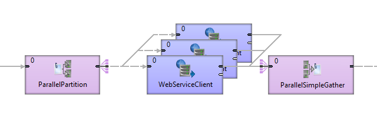
*Figure 496. Illustration of parallel run*

The processing can be further scaled to cluster without modification to the graph.

#### When to use data partitioning

Data partitioning is convenient to speed up processing when:

- components communicate over the network with high latency ([HTTPConnector](httpconnector.html), [WebServiceClient](webserviceclient.md));

#### Benefits of data partitioning

- **Clean design, no duplication.** Avoid copying parts of graph to speed-up the processing. Set the number of parallel workers with a single option.
- **Scales to cluster.** You can use the same graph on a multi-node cluster without any additional modifications.
- **Maximize use of available hardware.** Take advantage of parallel processing on multi-core processors.
- some components are significantly slower than other components in a graph.

#### Things to consider when going parallel

- When you run some component in parallel, you should be aware of limits of hardware and other systems.
- If you run parallel a component that does many I/O operations (e.g [FastSort](fastsort.md)), you may be limited by speed of hard drive.
- If you run parallel a component that opens many files (e.g [FastSort](fastsort.md)), you may reach limit on number of opened files.
- If you run parallel a component that connects to a web service, you may reach the limit of parallel connections to the service or run out of the quota on number of requests.
- Consider other jobs running on server. Too many jobs running in parallel may slow down run of other graphs.
- Some tasks cannot be easily parallelized.

### 1. Parallel components

In **Designer** and **Server**, you can speed up processing with copying the slow component and running it in parallel.

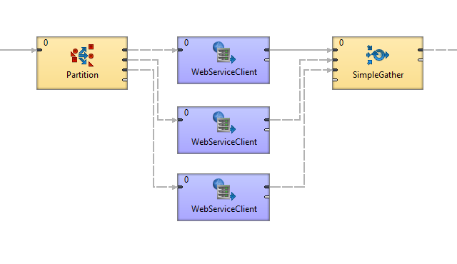
*Figure 497. Parallel run*

### 2. Parallel processing in Server

The parallel processing approch offers a more efficient and scalable option to component duplication. By dividing data across multiple workers, you can significantly accelerate job execution without modifying your graph. This method also seamlessly runs in CloverDX cluster.

To use this approach, replace [Partition](partition.md) with [ParallelPartition](clusterpartition.md) and [SimpleGather](simplegather.md) with [ParallelSimpleGather](clustersimplegather.md).

Set allocation to the components positioned between the cluster components: right click the component and choose **Set Allocation**.

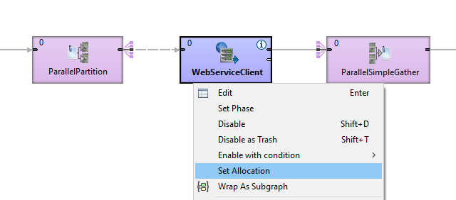
*Figure 498. Parallel run with cluster components*

In **Component Allocation** dialog choose **By number of workers** and enter the number of parallel workers.

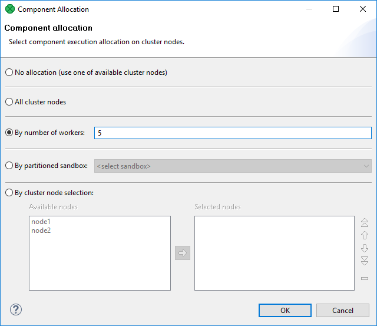
*Figure 499. Component allocation*

Components in your graph will contain text denoting the allocation.

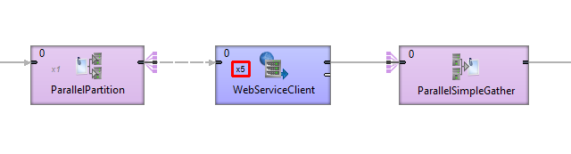
*Figure 500. Component allocation*

### 3. Parallel processing in Server cluster

| [Graph allocation](parallel-running.md#graph-allocation) |
| --- |
| [Component allocation](parallel-running.md#component-allocation) |
| [Partitioning/gathering data](parallel-running.md#partitioninggathering-data) |
| [Node allocation limitations](parallel-running.md#node-allocation-limitations) |

This type of scalability is currently only available for Graphs. Jobflows **cannot** run in parallel.

When a transformation is processed in parallel, the whole graph (or its parts) runs in parallel on multiple cluster nodes having each node process just a part of the data. The data may be split (partitioned) before the graph execution or by the graph itself on the fly. The resulting data may be stored in partitions or gathered and stored as one group of data.

Ideally, the more nodes we have in a cluster, the more data can be processed in a specified time. However, if there is a single data source which cannot be read by multiple readers in parallel, the speed of further data transformation is limited. In such cases, parallel data processing is not beneficial since the transformation would have to wait for input data.

#### Graph allocation

Each graph executed in a clustered environment is automatically subjected to a transformation analysis. The object of this analysis is to find a graph **allocation**. The graph allocation is a set of instructions defining how the transformation should be executed:

First of all, the analysis finds an allocation for individual components. The component allocation is a set of cluster nodes where the component should be running. There are several ways how the component allocation can be specified (see the following section), but a component can be requested to run in multiple instances. In the next step an optimal graph decomposition is decided to ensure all component allocation will be satisfied, and the number of remote edges between graph instances is minimized.

Resulted analysis shows how many instances (workers) of the graph need to be executed, on which cluster nodes they will be running and which components will be present in them. In other words, one executed graph can run in many instances, each instance can be processed on an arbitrary cluster node and each contains only convenient components.

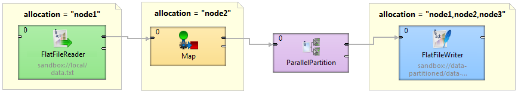
*Figure 501. Component allocations example*

This figure shows a sample graph with components with various allocations.

- **FlatFileReader**: node1
- **Map**: node2
- **FlatFileWriter**: node1, node2 and node3
- **ParallelPartition** can change cardinality of allocation of two interconnected components (detailed description of cluster partitioning and gathering follows this section).

Visualization of the transformation analysis is shown in the following figure:

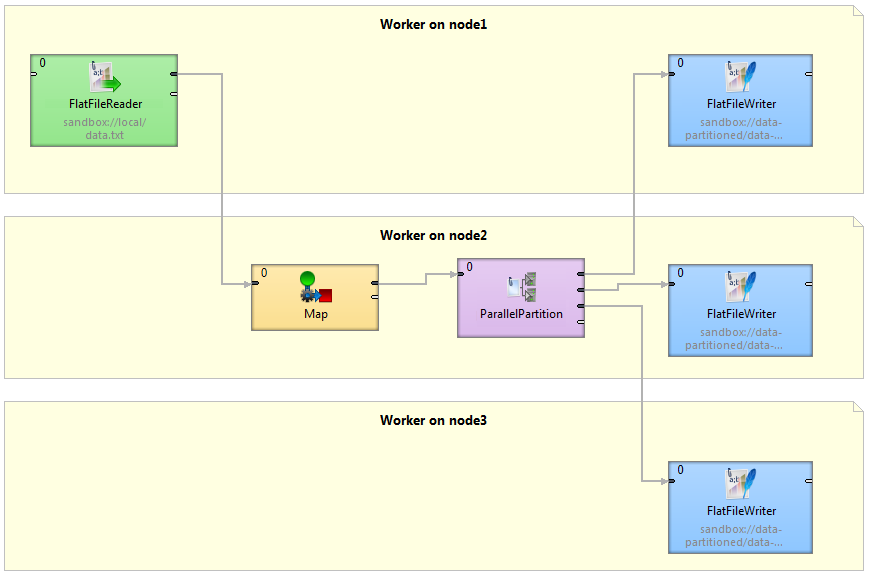
*Figure 502. Graph decomposition based on component allocations*

Three workers (graphs) will be executed, each on a different cluster node. Worker on cluster node1 contains **FlatFileReader** and first of three instances of the **FlatFileWriter** component. Both components are connected by remote edges with components which are running on node2. The worker running on node3 contains **FlatFileWriter** fed by data remotely transferred from **ParallelPartitioner** running on node2.

##### Component allocation

Allocation of a single component can be derived in several ways (list is ordered according to priority):

- **Explicit definition** - all components have a common attribute **Allocation**:
  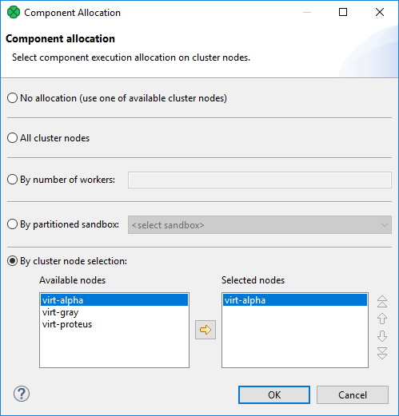
  *Figure 503. Component allocation dialog*
  Three different approaches are available for explicit allocation definition:
  - **Allocation based on the number of workers** - the component will be executed in requested instances on some cluster nodes which are preferred by **CloverDX** cluster. Server can use a build-in load balancing algorithm to ensure the fastest data processing.
  - **Allocation based on reference on a partitioned sandbox** - component allocation corresponds with locations of given partitioned sandbox. Each partitioned sandbox has a list of locations, each bound to a specific cluster node. Thus allocation would be equivalent to the list of locations. For more information, see [Partitioned sandboxes](../admin/cluster-setup-index.md#partitioned-sandbox).
  - **Allocation defined by a list of cluster node identifiers** (a single cluster node can be used more times)
- **Reference to a partitioned sandbox** FlatFileReader, FlatFileWriter and ParallelReader components derive their allocation from the `fileURL` attribute. In case the URL refers to a file in a partitioned sandbox, the component allocation is automatically derived from locations of the partitioned sandbox. So in case you manipulate with one of these components with a file in partitioned sandbox, a suitable allocation is used automatically.
- **Adoption from neighbor components** By default, allocation is inherited from neighbor components. Components on the left side have a higher priority. cluster partitioners and cluster gathers are nature bounds for recursive allocation inheritance.

#### Partitioning/gathering data

As mentioned before, data may be partitioned and gathered in several ways:

- **Partitioning/gathering "on the fly"**
  There are six special components to consider: [ParallelPartition](clusterpartition.md), [ParallelLoadBalancingPartition](clusterloadbalancingpartition.md), [ParallelSimpleCopy](clustersimplecopy.md), [ParallelSimpleGather](clustersimplegather.md), [ParallelMerge](clustermerge.md), [ParallelRepartition](clusterrepartition.md). They work similarly to their non-cluster variations, but their splitting or gathering nature is used to change data flow allocation, so they may be used to change distribution of the data among workers.
  **ParallelPartition** and **ParallelLoadBalancingPartition** work similar to a common partitioner - they change the data allocation from 1 to N. The component preceding the ParallelPartitioner runs on just one node, whereas the component behind the ParallelPartitioner runs in parallel according to node allocation.
  **ParallelSimpleCopy** can be used in similar locations. This component does not distribute the data records, but copies them to all output workers.
  **ParallelSimpleGather** and **ParallelMerge** work in the opposite way. They change the data allocation from N to 1. The component preceding the gather/merge runs in parallel while the component behind the gather runs on just one node.
- **Partitioning/gathering data by external tools**
  Partitioning data on the fly may in some cases be an unnecessary bottleneck. Splitting data using low-level tools can be much better for scalability. The optimal case being that each running worker reads data from an independent data source, so there is no need for a ParallelPartitioner component, and the graph runs in parallel from the beginning.
  Or the whole graph may run in parallel, however the results would be partitioned.

#### Node allocation limitations

As described above, each component may have its own node allocation specified, which may result in conflicts.

- **Node allocation of neighboring components must have the same cardinality.**
  It does not have to be the same allocation, but the cardinality must be the same. For example, there is a graph with 2 components: **DataGenerator** and **Trash**.
  - **DataGenerator** allocated on NodeA sending data to **Trash** allocated on NodeB works.
  - **DataGenerator** allocated on NodeA sending data to **Trash** allocated on NodeA and NodeB fails.
- **Node allocation behind the ParallelGather and ParallelMerge must have cardinality 1.**
  It may be of any allocation, but the cardinality must be just 1.
- **Node allocation of components in front of the ParallelPartition, ParallelLoadBalancingPartition and ParallelSimpleCopy must have cardinality 1.**

#### Graph allocation examples

##### Basic component allocation

This example shows a graph with two components, where allocation ensures that the first component will be executed on cluster node1 and the second component will be executed on cluster node2.

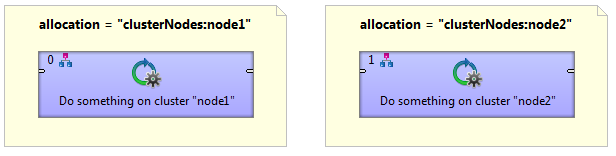

##### Basic component allocation with remote data transfer

Two components connected with an edge can have a different allocation. The first is executed on node1 and the second is executed on node2. cluster environment automatically ensures remote data records transfer.

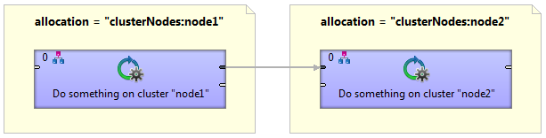

##### Multiple execution

A graph with multiple node allocation is executed in parallel. In this example, both components have a same allocation, so three identical transformations will be executed on cluster node1, node2 and node3.

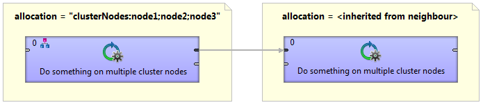

##### Cluster data partitioning

A graph with two allocations. The first component has a single node allocation which is not specified and is automatically derived to ensure a minimal number of remote edges. The **ParallelPartition** component distribute records for further data processing on the cluster node1, node2 and node3.

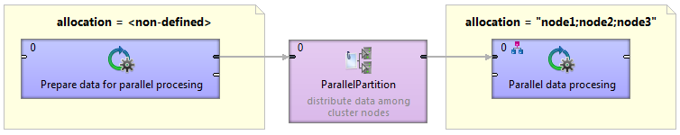

##### Cluster data gathering

A graph with two allocations. Resulted data records of parallel data processing in the first component are collected in the **ParallelSimpleGather** component and passed to the cluster node4 for further single node processing.

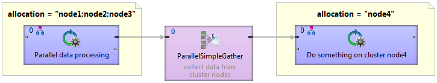

### Partitioned sandboxes in Server cluster

In [CloverDX Server cluster](../admin/cluster-setup-index.md#cluster-introduction), you can partition files with temporary data to multiple cluster nodes using **Partitioned sandboxes**. A file stored in a partitioned sandbox is split into several parts. Each part of the file is on a different cluster node. This way, you can partition both: processing and data. It reduces amount of data being transferred between nodes.
