<!-- Development > Job elements > Parameters -->

## 25. Parameters

Parameters are a set of key-value pairs that are often used for job configuration. The are defined once - in Parameters section of the Outline - and can be reused as many times as needed in the whole graph. This provides nice benefit of centralization (later change the values only in one place) and configuration.

Values of graph parameters are resolved before jobs are parsed and therefore provide very powerful facility for dynamic job behavior. Since values are evaluated during "preprocessing" stage of the job execution, all values are converted to strings before they are applied. For example, if the value is represented by a CTL code returning a non-string result, the result will be converted to string before it is used.

Every value, number, path, filename, attribute, etc. can be set up or changed with the help of parameters. This includes even fragments of the graph code which makes parameters particularly powerful in complex orchestration scenarios.

### Creating parameters

Graph parameters can be created using [Graph Parameters Editor](parameters.md#graph-parameters-editor) or using **Export As Graph parameter** button in [Edit component dialog](components.md#edit-component-dialog).

#### Parameter name

The names of parameters may contain uppercase and lowercase letters (`A-Z,a-z`), digits (`0-9`) and the underscore character (`_`). Additionally, the name must not start with a digit.
Example 13. Parameter name
`PARAMETER1` - valid parameter name

`My_Cool_Parameter_002` - valid parameter name

`127001` - invalid parameter name - begins with digit

`My parameter` - invalid parameter name - contains space character

`My-Great-Parameter` - invalid parameter name - contains hyphen character

`Bücher` - invalid parameter name - contains diacritics.

#### Priorities of parameters

Graph parameters have lower priority than those specified in the **Main** tab or **Parameters** tab of **Run Configurations…​**. In other words, both internal and external parameters can be overwritten by those specified in **Run Configurations…​**. However, both external and internal parameters have higher priority than all environment variables and can overwrite them.

Each parameter can be created as:

- **Internal**: See [Internal parameters](parameters.md#internal-parameters).
  Internal parameters can be **Externalized**: See [Externalizing internal parameters](parameters.md#externalizing-internal-parameters).
- **External (shared)**: See [External (shared) parameters](parameters.md#external-shared-parameters).
  External parameters can be **Internalized**: See [Internalizing external (shared) parameters](parameters.md#internalizing-external-shared-parameters).

The value of parameters can be:

- **Static** - parameter contains a fixed string value
- **Dynamic** - parameter value is a CTL expression to be evaluated; see [Dynamic parameters (parameters with CTL2 expressions)](parameters.md#dynamic-parameters-parameters-with-ctl2-expressions)

**Graph Parameters Editor** is described in [Graph Parameters Editor](parameters.md#graph-parameters-editor).

#### List of parameters

The list of parameters related to the project structure can be found in [Standard structure of all CloverDX projects](structure-of-projects.md#standard-structure-of-all-cloverdx-projects).

There are also [some parameters](../developer/graph-parameters.md) that can be used in graphs or jobflows.
> [!NOTE]
> Compatibility notice
> **CloverETL 3.5.x** and later uses a new format of parameters different from **CloverETL 3.4.x** (and earlier).
>
> New versions can read the old format and convert it to new format, but the new format is not compatible with older versions.

### Internal parameters

Internal parameters are stored in a graph, and thus are present in a source. Internal parameters are useful for parameterization within a single graph.

#### Creating internal parameters

Internal parameters can be created in the **Outline** pane. Double-click the **Parameters** item to open the **Graph Parameters Editor**. See [Graph Parameters Editor](parameters.md#graph-parameters-editor).

#### Externalizing Internal parameters

Once you have created internal parameters as a part of a graph, you have them in your graph, but you may want to convert them into external (shared) parameters, so you would be able to use the same parameters for multiple graphs.

You can externalize chosen internal parameter items into external (shared) file in the **Outline**.

1. Choose the internal parameters to be externalized.
2. Right-click and select **Externalize parameters** from the context menu.
3. A new wizard containing a list of projects of your workspace opens. The corresponding project is offered as the location for this new external (shared) parameter file. The wizard allows you to change the suggested name of the parameter file.
4. After that, the internal parameter items disappears from the **Outline** pane **Parameters** group, but at the same location, there appears the newly created external (shared) parameter file which are already linked. The same parameter file appears in the selected project and it can be seen in the **Project Explorer** pane.

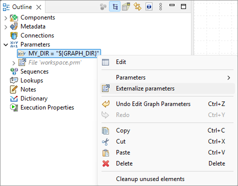
*Figure 273. Externalizing Internal parameters*

### External (shared) parameters

| [Creating external parameters](parameters.md#creating-external-parameters) |
| --- |
| [Linking external parameters](parameters.md#linking-external-parameters) |
| [Internalizing external (shared) parameters](parameters.md#internalizing-external-shared-parameters) |
| [XML schema of external parameters](parameters.md#xml-schema-of-external-parameters) |

External (shared) parameters are stored outside a graph in a separate file within the project folder. External (shared) parameters are suitable for parameters used by multiple graphs.
> [!NOTE]
> If you would like to give someone your graph, do not forget to include a file with external graph parameters. It is the same as with metadata and connections.

#### Creating external parameters

1. Right click **Parameters** in **Outline** and select **Parameters** ****New parameter file** from the context menu.
   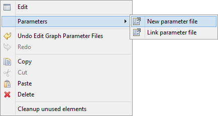
2. Select the location and name of the new parameter file. Confirm the name by the **OK** button.
3. Parameter file appears in your project and the file is already linked into your graph. Just double-click the empty parameter file and add some new share external parameters.

#### Linking external parameters

Existing external (shared) parameter files can be linked to each graph in which they should be used.

1. Right-click either the **Parameters** group or any of its items.
2. Select **parameters** ****Link parameter file** from the context menu.
   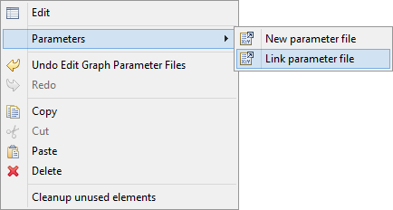
3. Locate the desired parameter file from the files contained in the project (parameter files have the `.prm` extension).

#### Internalizing external (shared) parameters

You can internalize any linked external (shared) parameter files into internal parameters.

1. Right-clicking some of the external (shared) parameters items in the **Outline** pane and select **Internalize parameters** from the context menu.
2. The linked external (shared) parameters disappear from the **Outline** pane. **Parameters** group and the newly created internal parameter items appear at the same location.

The original external (shared) parameter files still remain in the project and can be seen in the **Project Explorer** pane (parameter files have the `.prm` extension).

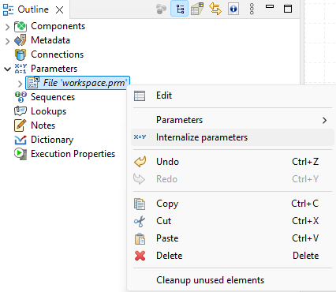
*Figure 274. Internalizing external (shared) parameter*

#### XML schema of external parameters

External graph parameters are serialized in XML format with following schema:

```xml
<?xml version="1.0" encoding="UTF-8"?>
<schema xmlns="http://www.w3.org/2001/XMLSchema" targetNamespace="http://www.example.org/GraphParameters"
    xmlns:tns="http://www.example.org/GraphParameters" elementFormDefault="qualified">

    <element name="GraphParameters" type="tns:GraphParametersType"></element>

    <complexType name="GraphParametersType">
        <sequence>
            <element name="GraphParameter" type="tns:GraphParameterType"
                maxOccurs="unbounded" minOccurs="0"></element>
        </sequence>
    </complexType>

    <complexType name="GraphParameterType">
        <sequence>
            <element name="attr" type="tns:attrType" maxOccurs="unbounded"
                minOccurs="0">
            </element>
            <choice>
                <element name="SingleType" type="tns:SingleTypeType"></element>
                <element name="ComponentReference" type="tns:ComponentReferenceType">
                </element>
            </choice>
        </sequence>
        <attribute name="name" type="string" use="required"></attribute>
        <attribute name="value" type="string" use="required"></attribute>
        <attribute name="dynamicValue" type="string"></attribute>
        <attribute name="secure" type="boolean"></attribute>
        <attribute name="description" type="string"></attribute>
        <attribute name="public" type="boolean"></attribute>
        <attribute name="required" type="boolean"></attribute>
        <attribute name="label" type="string"></attribute>
        <attribute name="defaultHint" type="string"></attribute>
        <attribute name="category" type="string"></attribute>
    </complexType>

    <complexType name="ComponentReferenceType">
        <attribute name="referencedComponent" type="string"></attribute>
        <attribute name="referencedProperty" type="string"></attribute>
    </complexType>

    <complexType name="SingleTypeType">
        <attribute name="name" type="string"></attribute>
    </complexType>

    <complexType name="attrType">
        <attribute name="name" type="string"></attribute>
    </complexType>
</schema>
```

For example:

```xml
<?xml version="1.0" encoding="UTF-8"?>
<GraphParameters>
    <GraphParameter name="PROJECT" value=".">
        <attr name="description">Project root path</attr>
    </GraphParameter>
    <GraphParameter name="CONN_DIR" value="${PROJECT}/conn">
        <attr name="description">Default folder for external connections</attr>
    </GraphParameter>
    <GraphParameter name="DATAIN_DIR" value="${PROJECT}/data-in">
        <attr name="description">Default folder for input data files</attr>
    </GraphParameter>
    <GraphParameter name="DATAOUT_DIR" value="${PROJECT}/data-out">
        <attr name="description">Default folder for output data files</attr>
    </GraphParameter>
    <GraphParameter name="DATATMP_DIR" value="${PROJECT}/data-tmp">
        <attr name="description">Default folder for temporary data files</attr>
    </GraphParameter>
    <GraphParameter name="GRAPH_DIR" value="${PROJECT}/graph">
        <attr name="description">Default folder for transformation graphs (grf)</attr>
    </GraphParameter>
    <GraphParameter label="Public parameter" name="PUBLIC_PARAM" public="true" required="true" value="default value">
        <SingleType name="multiline"/>
    </GraphParameter>
</GraphParameters>
```

### Graph Parameters Editor

| [Detailed list of available operations](parameters.md#detailed-list-of-available-operations) |
| --- |
| [Properties of graph parameters](parameters.md#properties-of-graph-parameters) |
| [Graph parameter type editor](parameters.md#graph-parameter-type-editor) |

Graph parameters are managed by **Graph Parameters Editor**. Main purpose of this editor is to create, edit and remove internal graph parameters, link and unlink external parameter files and edit particular graph parameters inside parameter files.

**Graph Parameters Editor** is available via **Outline view**. Just double-click on the **Graph parameters** section.

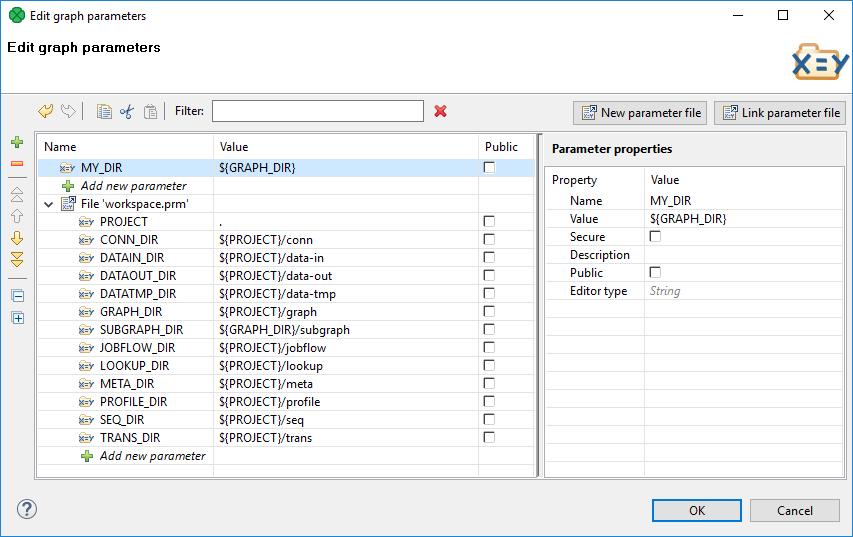
*Figure 275. Graph Parameters Editor*

Both internal and external graph parameters are managed by this editor at once. Internal parameters are on top-level of tree and external parameter files are represented by sub-trees (for example workspace.prm in the figure above).

Order of graph parameters defines usage priority. In the case of parameters name collision, the parameter above the other has a higher priority. The order of graph parameters can be changed using drag and drop or move actions available on left-side toolbar.

If an error is detected in graph parameters setting, yellow exclamation mark icon is shown over affected graph parameters and an error message is displayed in a tooltip on corrupted graph parameter.

#### Detailed list of available operations

- **Adding a new graph parameter use**
  To add a new parameter to the end of the list, use in-line editing of **Add new parameter** cell at the end of each parameter section. To insert a new graph parameter above current position, use **Plus** button on the left side.
- **Removing a graph parameter**
  Use the **Minus** button or Delete key to remove selected parameters. Multi-selection is supported. If you would like to remove unused graph parameters, use [Cleanup Unused Elements](designer-layout.md#cleanup-unused-elements).
- **Name and value editing**
  Edit the name and value of a graph parameter directly in parameters viewer.
- **Changing the order of parameters**
  Use left-side toolbar (Move top, Move up, Move down, Move bottom) or Drag&Drop to move the selected graph parameter. Order of parameter files can be changed as well. Multi-selection is supported.
- **Creating a new parameter file**
  Create a new parameter file using the **New parameter file** button.
- **Linking an existing parameter file**
  Link an existing parameter file using the **Link parameter file** button.
- **Filtering parameters**
  parameters filtering is based on a substring of parameter name and value.

Dialog supports commonly used operations known from graph editor:

- Copy (Ctrl+C), Cut (Ctrl+X) and Paste (Ctrl+V) operation on selected graph parameters.
- Undo (Ctrl+Z) and Redo (Ctrl+Y) operations.

#### Properties of graph parameters

- **Name**
  Identifier of the parameter.
- **Value**
  Value of the parameter. The **Value** field can use different editors to edit the value. The editors are set up using property **Editor type**.
- **Secure**
  The parameter is considered as a **Secure parameter**. See [Secure graph parameters](parameters.md#secure-graph-parameters)
- **Description**
  **Description** is user defined text for a graph parameter or for a graph parameter file. Contrary to the **label** the description can be several paragraphs long.
- **Public**
  **Public parameters** serve for configuration of subgraphs. See [Configuring subgraphs](subgraphs.md#configuring-subgraphs).
- **Required**
  This field is available in public parameters only. If a parameter of a subgraph is marked as **required** and the subgraph is used as a component, the corresponding attribute of the **subgraph component** is mandatory and the user has to set it up.
- **Label**
  Label is a short description of the field appearing as an attribute name in a subgraph component. This field is available in public parameters only.
- **Value Hint**
  This value is displayed in the **value** column in the properties of subgraphs component. The value helps the user of subgraph to decide which value should be filled in to the user-defined graph attribute. The field is available in public parameters only.
- **Category**
  Category of component attributes in which the parameter is displayed: **Basic** or **Advanced**. Basic is the default category. This field is available in public parameters.
- **Editor Type**
  The public parameters can use a type of editor corresponding to the field of the component using the parameter. For example, you can use **File URL Editor** or **Transform Editor**. This field is available for all parameters.
  The editor type is primarily used for public parameters when setting them in parent graph (when configuring a subgraph).
  **See also:**[Graph parameter type editor](parameters.md#graph-parameter-type-editor)

#### Graph parameter type editor

| [Simple type](parameters.md#simple-type) |
| --- |
| [Component binding](parameters.md#component-binding) |

**Graph parameter type editor** serves to set up correct editor to particular graph parameters. You can choose between **Simple Type** or **Component binding**. The dialog is opened from the parameter property **Editor type** in **Graph Parameters Editor**.

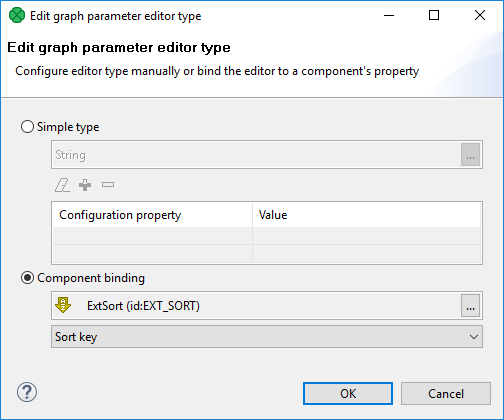
*Figure 276. Graph parameters type editor*

##### Simple type

**Simple type** can be one of:

- **Basic**
  - **String** - inline editing or external dialog ([Edit parameter Value](parameters.md#edit-parameter-value) or [Edit parameter CTL2 Value](parameters.md#edit-parameter-ctl2-value))
  - **Multiline string** - external dialog [Multiline String Editor](parameters.md#multiline-string-editor).
  - **Integer** - inline editor, allows to insert whole numbers only
  - **Decimal** - inline editor, allows to insert decimal numbers
  - **Boolean** - inline editor - user selects true, false or empty value
- **Advanced**
  - **File URL** - external dialog (**File Url Dialog**). A configuration of the dialog is described in [File URL](parameters.md#file-url). For details on **File URL Dialog**, see [URL File Dialog](common-dialogs.md#url-file-dialog).
  - **Date/Time** - inline editor, allows user to set up date using calendar.
  - **Properties** - inline editor, serves to set up key-value pairs. See [Properties](parameters.md#properties).
- **Metadata Related**
  - **Single Field** - external dialog, allows to choose one metadata field. See [Single field](parameters.md#single-field).
  - **Multiple Fields** - external dialog, allows to choose one or more fields. See [Multiple fields](parameters.md#multiple-fields).
  - **Sort key** - external dialog, lets the user define sort key. See [Sort key](components.md#sort-key).
  - **Field mapping** - external editor, allows the user to set up field mapping. See [Field mapping](parameters.md#field-mapping).
  - **Join key** - external editor, allows the user to set up fields to be joined. See [Join key](parameters.md#join-key)
- **Enumerations**
  - **Enumeration** - inline or external editor, allows the user to choose one option from a list; the user may be allowed to define its own value. See [Enumeration](parameters.md#enumeration).
  - **Character set** - external dialog, for choosing character set. See [Character set](parameters.md#character-set).
  - **Time zone** - external dialog, for choosing time zone. See [Time yone](parameters.md#time-zone).
  - **Field Type** - inline editor, for choosing field data type. See [Field type](parameters.md#field-type).
  - **Locale** - external dialog, for choosing locale. See [Locale](parameters.md#locale).
> [!NOTE]
> To store the password, use secure graph parameters. See [Secure graph parameters](parameters.md#secure-graph-parameters)

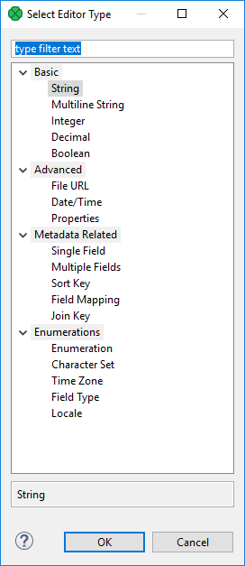
*Figure 277. Select Editor Type Dialog*

##### Component Binding

**Component binding** serves to bind the parameter to an attribute of existing component of subgraph. For example, you can set up the **Transform** parameter in the **Map** component using public graph parameters.

Content of lists of components available in **Component binding** depends on components available in subgraph.

##### Edit parameter Value

**Edit parameter Value** serves to set up a parameter value. The value of the parameter can be converted to the CTL2 code using the **Convert to dynamic** button.

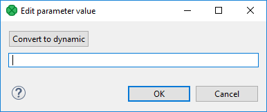
*Figure 278. Edit parameter Value*

If the **Convert to dynamic** button is used, the editor is changed.

**See also:**[Edit parameter CTL2 Value](parameters.md#edit-parameter-ctl2-value)

##### Edit parameter CTL2 Value

The **Edit parameter CTL2 Value** dialog serves to place a CTL2 code as a parameter value.

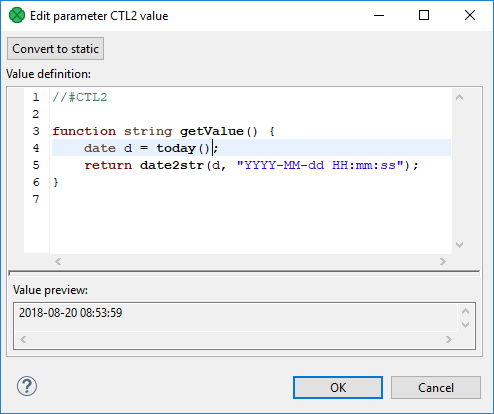
*Figure 279. Edit parameter Value*

The value can be converted to string using the **Convert to static** button. If the button is used, the editor changes.

**See also:**[Edit parameter value](parameters.md#edit-parameter-value)

##### Multiline String Editor

**Multiline string** parameter type lets you use a multiline string as a parameter value. If the parameter value is in xml or json format, its syntax can be checked.

Use **Validation** configuration property to switch on XML or JSON syntax validation.

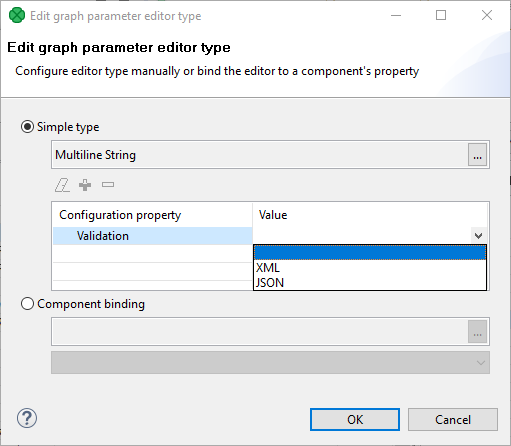
*Figure 280. Multiline string parameter - configuration*
> [!NOTE]
> To enable the support for JSON highlighting, please install the **JavaScript Development Tools** plugin. Go to **Help** ****Install New Software…​** and choose the site from the drop-down list that matches the Designer’s Eclipse Platform version, and search for **JavaScript Development Tools**.

##### File URL

File URL parameter type lets you configure File URL Dialog.

**File Extension** makes a File URL dialog to display files with particular suffix. It can be utilized to display files matching some pattern too. For example, you can display file having txt suffix (`*.txt`) or XML files whose name starts with "a" (`a*.xml`).

**Selection Mode** displays **files** or **directories** or **files or directories**.

The **Allow Multiple Selection** checkbox lets you deny multiple file selection. If you uncheck the checkbox, you cannot select multiple files.

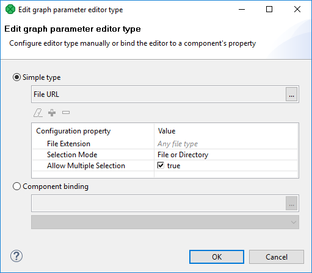
*Figure 281. File URL Dialog - configuration*

In the **Select Types** dialog, tick the file extensions to be available in **File URL Dialog**.

If a suffix is not available in the list, use the **Other extensions** field below. The suffix you define should start with an asterisk. If more extensions are defined, separate them with a comma.

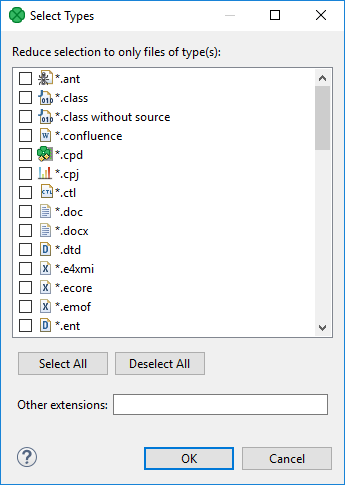
*Figure 282. Select Types dialog - choosing file extension(s)*

See also [URL File Dialog](common-dialogs.md#url-file-dialog).

##### Properties

**Properties** type lets you use key-value pairs.

**Properties** can be parsed with the function [parseProperties](miscellaneous-functions-ctl2.md#parseproperties).

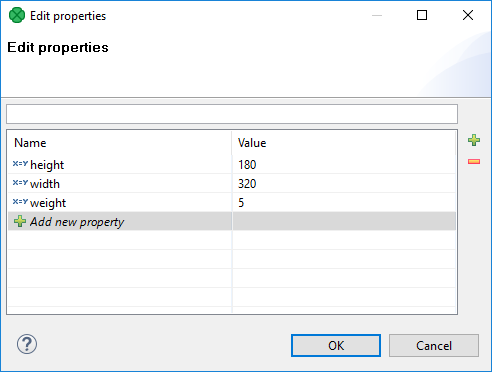
*Figure 283. Properties - usage*

##### Single field

The **Single Field** type allows to choose one metadata field from the list.

Configuration of **Single Field** specifies subset of fields of one existing metadata; the user chooses one field of the set. The metadata can be either static or referenced from a particular edge of subgraph. Available metadata fields can be filtered depending on metadata field type or container type.

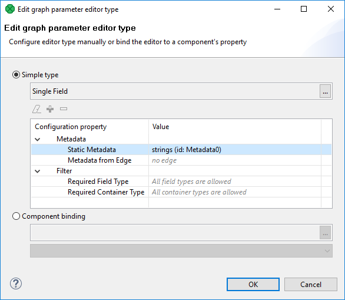
*Figure 284. Single field - configuration*

If you use the parameter, you can choose one field using the following dialog.

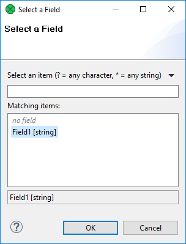
*Figure 285. Single field - choosing the field*

##### Multiple fields

The **Multiple Fields** parameter type serves to choose one or more metadata fields from the set.

Available fields are a subset of fields of existing metadata. The fields can be of static metadata or metadata of an edge. Available metadata fields can be filtered depending on metadata field type or container type.

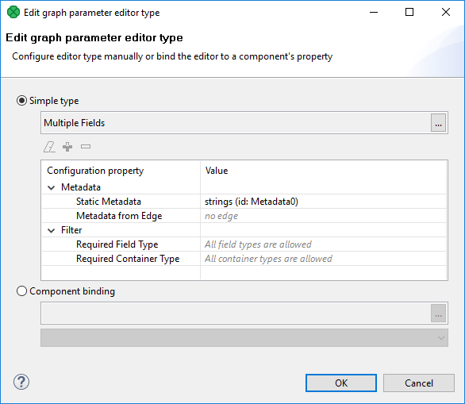
*Figure 286. Multiple fields - configuration*

Use **arrows** to add fields to the list or add field(s) using drag and drop.

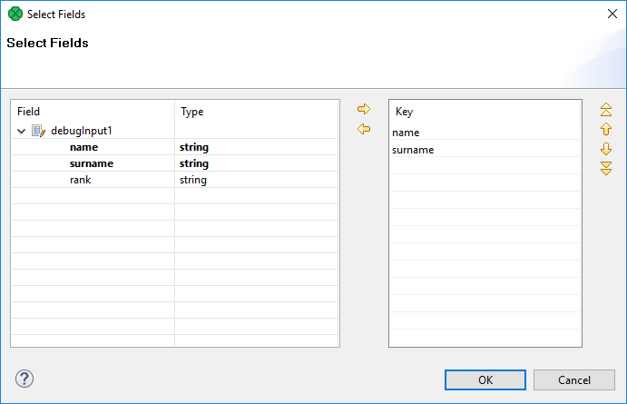
*Figure 287. Multiple fields - choosing the field*

##### Field mapping

The **Field mapping** type requires metadata of both sides of mapping. You specify fields of which metadata could be mapped using the parameter.

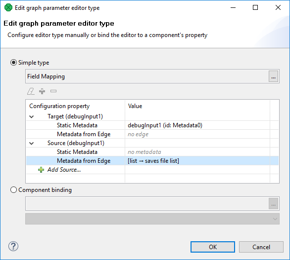
*Figure 288. Field mapping - configuration*

In the **Field mapping** dialog, you can define mapping for transformation.

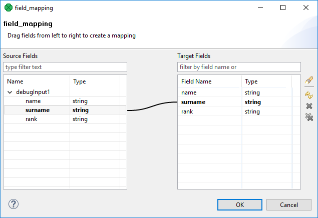
*Figure 289. Field mapping - choosing the field*

See also [Mapping functions](mapping-functions-ctl2.md).

##### Join key

When you define the **Join key** parameter type, choose which metadata take part in joining:

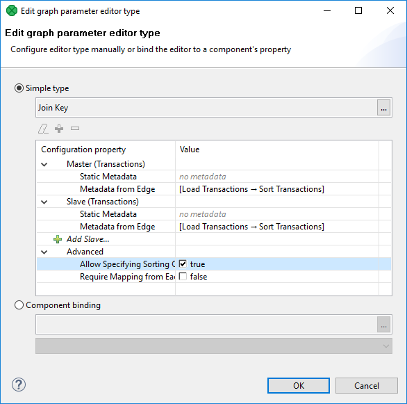
*Figure 290. Join key - configuration*

The **Join key** parameter value specifies joining fields.

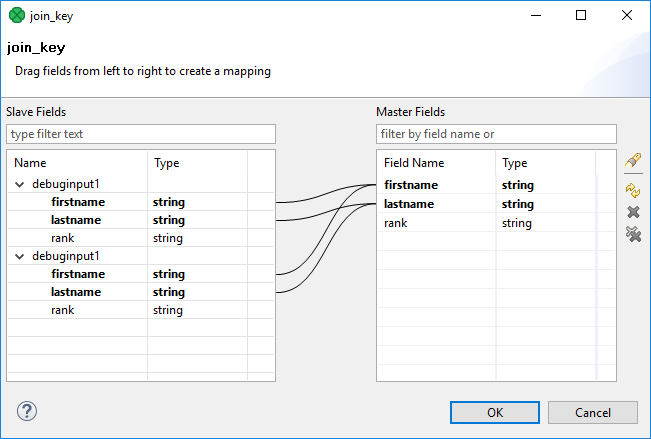
*Figure 291. Join key - configuration*

See also [Mapping functions](mapping-functions-ctl2.md).

##### Enumeration

The dialog below serves to set up available values in the selection list of enumeration. Values available in the list are defined in **Values**. The pipe character is displayed escaped, the semicolon is surrounded by the `"` character.

User-defined values are allowed using the **Allow Custom Value** checkbox.

You can choose the value using inline editor. If there are more than 10 (ten) values defined, choose the value using external dialog.

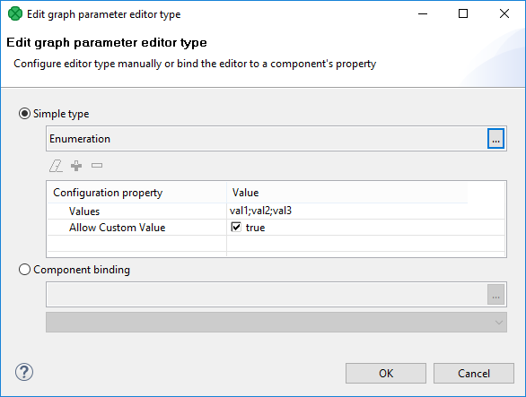
*Figure 292. Enumeration - configuration*

##### Character set

The **Character set** parameter type lets you choose one of the available character sets.

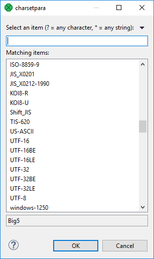
*Figure 293. Character set*

##### Time zone

**Time zone** lets you choose time zone from a list. You can use either Java time zones or Joda time zones.

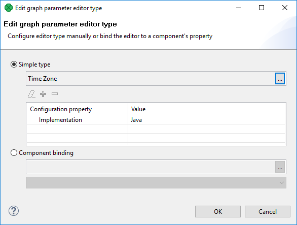
*Figure 294. Time zone - configuration*

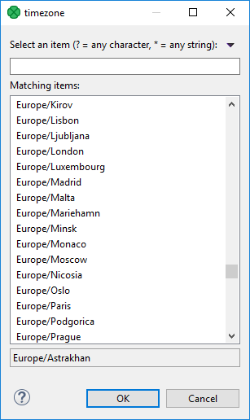
*Figure 295. Time zone - usage*

##### Field type

**Field Type** lets you choose field type from a list.

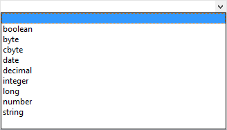
*Figure 296. Field type*

##### Locale

**Locale** lets you set locale.

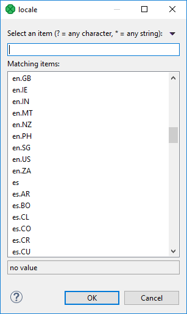
*Figure 297. Locale*

### Secure graph parameters

Secure parameters enable you to store sensitive information (e.g. database password) in an encrypted form.

Regular graph parameters are persisted either in *.grf files (internal parameters) or in *.prm files (external parameters). This means that values of your graph parameters are stored in plain xml files. This behavior is absolutely correct for most usage of graph parameters. But sometimes a graph parameter can represent sensitive information, which should not be saved in a plain text file on your file system - e.g. password to database. For this purpose, **CloverDX Designer** and **CloverDX Server** provide the secure parameters feature.
> [!NOTE]
> Only String and Multiline string types are supported for parameters that are set as secure. If other type is set, it is ignored and the default String type is used. This also applies for component binding.

#### Using secure graph parameters

To use secure parameters you have to have **Master password**. To set up the **Master password** on **CloverDX Designer**, see [Master password](../admin/designer-configuration.md#master-password). To set up the **Master password** on **CloverDX Server**, see the [Secure parameters](../admin/secure-parameters.md) section.

Use the text as a value of the parameter.

Mark the parameter as **secure** in parameter properties.

The sensitive information in secure parameters is persisted in encrypted form on file system. Decryption of a secure parameter is automatically performed in graph runtime. The decrypted value of secure parameter is hidden in the graph log file.

For [Dynamic parameters](parameters.md#dynamic-parameters-parameters-with-ctl2-expressions) the CTL code of the parameter is persisted as plain text (not encrypted). However, the computed value of secure parameter is hidden in the graph log file.
> [!NOTE]
> Default installation of **CloverDX Server** does not support secure parameters. If you want to use this feature, please set a master password in the server web interface (Configuration/Secure parameters). The master password is necessary for correct encryption of your sensitive data.

### Dynamic parameters (parameters with CTL2 expressions)

A CTL2 expression can be used in parameters, but it has to return a `string` data type.
Example 14. Dynamic graph parameters - usage of CTL2 as a graph parameter value

```ctl
//#CTL2

function string getValue() {
    return date2str(today(), "YYYY-MM-dd HH:mm:ss");
}
```

To assign CTL2 expression to a graph parameter, use the [Edit parameter CTL2 Value](parameters.md#edit-parameter-ctl2-value) dialog.

You can access dynamic parameter’s value using `getParamValue()` or `${PARAMETER_NAME}`. However, it is evaluated only once during the graphs initialization phase, since values are cached and constant throughout graph execution.

### Environment variables

Environment variables are parameters that are not defined in **CloverDX**, they are defined in the operating system. You can often see them in scripts or various places where system configuration is discussed. On Linux, environment variables are referenced as `${PARAM_NAME}` or `$PARAM_NAM` while on Windows the syntax is `%PARAM_NAME%`.

In CloverDX, you can query their values (but not set them) using the same syntax as is used for graph parameters: `${PARAM_NAME}` (braces are required in CloverDX).

- For example, to get the value of an environment variable called `PATH`, use the following expression:
  '${PATH}'
  > [!IMPORTANT]
  > We recommend using single quotes when referring to environment variables, especially the one containing paths on Windows. These will often create sequences of characters that are interpreted as escape sequences in Java. For exampke, `ProgramData` environment variable will be usually set to `C:\ProgramData` where `\P` is interpreted as invalid Java escape sequence and will lead to an error.

You can query all environment variables at once using [getEnvironmentVariables](miscellaneous-functions-ctl2.md#getenvironmentvariables) function. Note that environment variables cannot be queried with [getParamValue](miscellaneous-functions-ctl2.md#getparamvalue) function - this function only applies to graph parameters and a `null` value will be returned for environment variables.

### Java properties

Java properties are key-value pairs that are used for configuration of the Java JVM. These are defined for the whole JVM when your CloverDX starts. Every running graph will inherit Java properties from multiple sources - from Java JVM, from its parent application container, from CLoverDX Server Core or CloverDX Server Worker process.

You can use the same syntax to query Java system properties as parameters: `${property_name}`. Note that Java properties often contain period characters (".") - e.g. `java.io.tmpdir` or similar. To query properties like these, replace the periods with underscores (i.e., `java_io_tmpdir`).

- For example, to query the location of temporary folder in Java, use the following:
  `'${java_io_tmpdir}'`
  > [!IMPORTANT]
  > As with environment variables we recommend using single quotes to avoid errors with invalid escape sequences caused by values that contain backslash (which is common on Windows).

You can use [getJavaProperties](miscellaneous-functions-ctl2.md#getjavaproperties) function to query all Java properties at once.

### Canonicalizing file paths

All parameters can be divided into two groups:

1. The `PROJECT` parameter and any other parameter with `_DIR` used as suffix (`DATAIN_DIR`, `CONN_DIR`, `MY_PARAM_DIR`, etc.).
2. All the other parameters.

Either group is distinguished with corresponding icon in the **Parameter Wizard**.

The parameters of the first group serve to automatically canonicalize file paths displayed in the **URL File dialog** and in the **Outline** pane in the following way:

1. If any of these parameters matches the beginning of a path, corresponding part of the beginning of the path is replaced with this parameter.
2. If multiple parameters match different parts of the beginning of the same path, parameter expressing the longest part of the path is selected.
Example 15. Canonicalizing file paths
- If you have two parameters:
  `MY_PARAM1_DIR` and `MY_PARAM2_DIR`
  Their values are:
  `MY_PARAM1_DIR = "mypath/to"` and `MY_PARAM2_DIR = "mypath/to/some"`
  If the path is:
  `mypath/to/some/directory/with/the/file.txt`
  The path is displayed as follows:
  `${MY_PARAM2_DIR}/directory/with/the/file.txt`
- If you had two parameters:
  `MY_PARAM1_DIR` and `MY_PARAM3_DIR`
  With the values:
  `MY_PARAM1_DIR = "mypath/to"` and `MY_PARAM3_DIR = "some"`
  With the same path as above:
  `mypath/to/some/directory/with/the/file.txt`
  The path would be displayed as follows:
  `${MY_PARAM1_DIR}/some/directory/with/the/file.txt`
- If you had a parameter:
  `MY_PARAM1`
  With the value:
  `MY_PARAM1 = "mypath/to"`
  With the same path as above:
  `mypath/to/some/directory/with/the/file.txt`
  The path would not be canonicalized at all.
  Although the same string `mypath/to` at the beginning of the path can be expressed using the parameter called `MY_PARAM1`, such parameter does not belong to the group of parameters that are able to canonicalize the paths. For this reason, the path would not be canonicalized with this parameter and the full path would be displayed as is.
> [!IMPORTANT]
> Remember that the following paths would not be displayed in **URL File dialog** and **Outline** pane:
>
> `${MY_PARAM1_DIR}/${MY_PARAM3_DIR}/directory/with/the/file.txt`
>
> `${MY_PARAM1}/some/directory/with/the/file.txt`
>
> `mypath/to/${MY_PARAM2_DIR}/directory/with/the/file.txt`

### Using parameters

#### Parameters in properties of components

When you have defined, for example, a `FILTER_EXPRESSION` (parameter) which means a filter expression, you can use `${FILTER_EXPRESSION}` instead of defining the filter expression in each **Filter**.

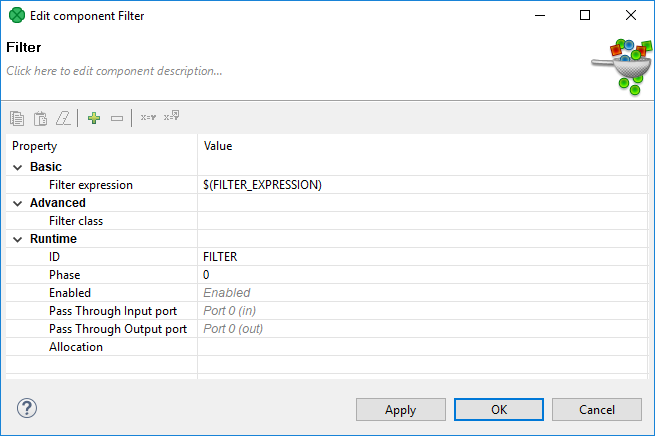
*Figure 298. Filter component configured by graph parameter*

CTL2 expressions can be used as a parameter value, see [Dynamic parameters (parameters with CTL2 expressions)](parameters.md#dynamic-parameters-parameters-with-ctl2-expressions).

#### Using parameters in CTL

If you use parameters in CTL, you should get their value via `getParamValue("MyParameter")`. Be careful when working with them, you can also use escape sequences for specifying some characters.

### Built-in execution parameters

#### Server-specific execution parameters

**CloverDX Server** passes a set of parameters to each graph or jobflow execution.

Graph parameters can be used by `${paramName}` placeholders. Keep in mind that these placeholders are resolved at the start of job execution during the initialization (loading of XML definition file).

This is a set of parameters which are always set by **CloverDX Server**:

| Key | Description |
| --- | --- |
| SANDBOX_CODE | An identifier of a sandbox which contains the executed graph. |
| JOB_FILE | A path to the file (graph, subgraph, jobflow). The path relative to the sandbox root path. |
| SANDBOX_ROOT | An absolute path to sandbox root. |
| RUN_ID | An ID of the graph execution. In a standalone mode or cluster mode, it is always unique. It may be a value lower than 0, if the run record isn’t persistent. The ID is of the `long` data type. |
| PARENT_RUN_ID | A run ID of the graph execution which is the parent to the current one. Useful when the execution is a subgraph, child-job of some jobflow or worker for distributed transformation in a cluster. When the execution doesn’t have a parent, the `PARENT_RUN_ID` is the same as `RUN_ID`. The ID is of the `long` data type. |
| ROOT_RUN_ID | A run ID of the graph execution which is the root execution to the current one (the one which doesn’t have a parent). Useful when the execution is a subgraph, child-job of some jobflow or worker for distributed transformation in a cluster. When the execution doesn’t have a parent, the `ROOT_RUN_ID` is the same as `RUN_ID`. The ID is of the `long` data type. |
| CLOVER_USERNAME | The username of the user who launched the graph or jobflow. |
| NODE_ID | An ID of the node running the graph or jobflow. |

#### Parameters based on execution type

Additional parameters are passed to jobs depending on how they are executed:

| [Executed from Web GUI](parameters.md#executed-from-web-gui) |
| --- |
| [Executed by HTTP API Run Graph operation invocation](parameters.md#executed-by-http-api-run-graph-operation-invocation) |
| [Executed by WS API method executeGraph invocation](parameters.md#executed-by-ws-api-method-executegraph-invocation) |
| [Executed by task Graph Execution by Scheduler](parameters.md#executed-by-task-graph-execution-by-scheduler) |
| [Executed from JMS Listener](parameters.md#executed-from-jms-listener) |
| [Executed by task Start a graph by Graph/Jobflow Event Listener](parameters.md#executed-by-task-start-a-graph-by-graphjobflow-event-listener) |
| [Executed by task Graph Execution by File Event Listener](parameters.md#executed-by-task-graph-execution-by-file-event-listener) |

##### Executed from Web GUI

Graphs executed from the web GUI have no additional parameters.

##### Executed by HTTP API Run Graph operation invocation

Any URL parameter with the `param_` prefix is passed to the executed graph, but without the `param_` prefix. For example, `param_FILE_NAME` specified in the URL is passed to the graph as a property named `FILE_NAME`.

##### Executed by WS API method executeGraph invocation

Parameters with values may be passed to the graph with a request for execution.

##### Executed by task Graph Execution by Scheduler

| Key | Description |
| --- | --- |
| EVENT_SCHEDULE_EVENT_TYPE | The type of a schedule: SCHEDULE_PERIODIC \| SCHEDULE_ONETIME |
| EVENT_SCHEDULE_LAST_EVENT | Date/time of a previous event |
| EVENT_SCHEDULE_DESCRIPTION | A schedule description, which is displayed in the web GUI |
| EVENT_USERNAME | The owner of the event. For schedule it is the user who created the schedule. |
| EVENT_SCHEDULE_ID | The ID of the schedule which triggered the graph |

##### Executed from JMS Listener

There are many graph parameters and dictionary entries passed, depending on the type of incoming message. See details in [JMS Message Listeners](../operations/listeners.md#jms-message-listeners).

##### Executed by task Start a Graph by graph/jobflow Event Listener

Since 3.0, only *specified* properties from a "source" job are passed to the executed job, by default. This behavior can be changed by the `graph.pass_event_params_to_graph_in_old_style` Server config property so that *all* parameters from a "source" job are passed to the executed job. This switch is implemented for backwards compatibility. With the default behavior, in the editor of graph event listener, you can specify a list of parameters to pass. For more information, see [Start a graph](../operations/tasks.md#start-a-graph).

The following parameters with current values are always passed to the target job:

| Key | Description |
| --- | --- |
| EVENT_RUN_SANDBOX | A sandbox with the graph which is the source of the event |
| EVENT_JOB_EVENT_TYPE | GRAPH_STARTED \| GRAPH_FINISHED \| GRAPH_ERROR \| GRAPH_ABORTED \| GRAPH_TIMEOUT \| GRAPH_STATUS_UNKNOWN, analogically JOBFLOW_* for jobflow event listeners. |
| EVENT_RUN_JOB_FILE | A jobFile of the job which is the source of the event. |
| EVENT_RUN_ID | An ID of the graph execution which is the source of the event. |
| EVENT_TIMEOUT | A number of milliseconds which specifies an interval of timeout. Useful only for "timeout" graph event. |
| EVENT_RUN_RESULT | A result (or current status) of the execution which is the source of the event. |
| EVENT_USERNAME | The owner of the event. For graph events it is the user who created the graph event listener. |

##### Executed by task Graph Execution by File Event Listener

| Key | Description |
| --- | --- |
| EVENT_FILE_PATH | A path to the file which is the source of the event. Does not contain a file name. Does not end with a file separator. Is passed only for the local file event listener. |
| EVENT_FILE_NAME | A filename of the file which is the source of the event. Is passed only when the "grouping" mode is disabled. Otherwise there are more than one file event. |
| EVENT_FILE_URLS | Contains string, which may be used "as is" in the **file URL** attribute of various **CloverDX** components. It may contain a URL to one or more (if grouping is enabled) files. It may contain local path(s) or remote URL(s) where credentials are replaced by placeholders (due to security reasons). |
| EVENT_FILE_AUTH_USERNAME | The username/ID to the remote location. |
| EVENT_FILE_AUTH_USERNAME_URL_ENCODED | The same as EVENT_FILE_AUTH_USERNAME, but the value is also URL encoded, so it may be used in the URL. |
| EVENT_FILE_AUTH_PASSWORD | The password/key to the remote location. It’s encrypted by the master password. It is passed only when the file listener uses user+password authentication. |
| EVENT_FILE_AUTH_PASSWORD_URL_ENCODED | The same as EVENT_FILE_AUTH_PASSWORD, but the value is also URL encoded, so it may be used in the URL (EVENT_FILE_URLS parameter). |
| EVENT_FILE_EVENT_TYPE | SIZE \| CHANGE_TIME \| APPEARANCE \| DISAPPEARANCE |
| EVENT_FILE_PATTERN | The pattern specified in a file event listener |
| EVENT_FILE_LISTENER_ID |  |
| EVENT_USERNAME | The owner of the event. For file events, it is the user who created the file event listener. |

#### Adding another graph parameters

##### Task "execute_graph" parameters

The **execute graph** task may be triggered by a schedule, graph event listener, or file event listener. The task editor allows you to specify `key=value` pairs which are passed to the executed graph.
