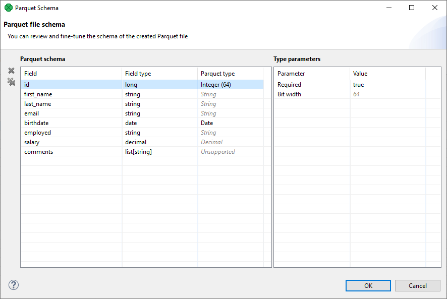

<!-- Development > Component reference > Writers > ParquetWriter -->

### ParquetWriter

| [Short description](parquetwriter.md#short-description) |
| --- |
| [Ports](parquetwriter.md#ports) |
| [Metadata](parquetwriter.md#metadata) |
| [ParquetWriter attributes](parquetwriter.md#parquetwriter-attributes) |
| [Details](parquetwriter.md#details) |
| [Limitations](parquetwriter.md#limitations) |
| [Compatibility](parquetwriter.md#compatibility) |
| [See also](parquetwriter.md#see-also) |

#### Short description

**ParquetWriter** writes data into Parquet files.

The component supports file compression, writing to local files, remote files and writing to output port.

| Data output | Input ports | Output ports | Transformation | Transf. req. | Java | CTL | Auto-propagated metadata |
| --- | --- | --- | --- | --- | --- | --- | --- |
| Parquet file | 1 | 0-3 | **✓** | **⨯** | **⨯** | **✓** | **✓** |

#### Ports

| Port type | Number | Required | Description | Metadata |
| --- | --- | --- | --- | --- |
| Input | 0 | **✓** | For records to be written to a Parquet file |  |
| Output | 0 | **⨯** | For [Output port writing](output-port-writing.md) | ParquetWriter_Output |
| 1 | **⨯** | For successfully written records | ParquetWriter_Success |  |
| 2 | **⨯** | For failed records | ParquetWriter_Error |  |

The output port writing supports both **discrete** and **stream** write modes.

#### Metadata

**ParquetWriter** propagates metadata from input port to output ports 1 and 2.

Metadata on output port 1 contains URL of the file the record was written to.

Metadata on output port 2 contains fields for troubleshooting the failure.

The component has no metadata template.

The component auto-generates a Parquet schema from the metadata on input port.

| Field name | Data type | Description |
| --- | --- | --- |
| recordNumber | long | Index of the failed record |
| fieldName | string | Field that caused the failure |
| errorMessage | string | Text of the message relatedto the failure |
| stacktrace | string | The whole stacktrace of the failure |

#### ParquetWriter attributes

| Attribute | Req | Description | Possible values |
| --- | --- | --- | --- |
| Basic |  |  |  |
| File URL | yes | URL to a Parquet file to be written. Output port writing is supported. |  |
| Parquet schema | no | User customization of CloverDX to Parquet data type conversion.  By default it is auto-generated from input port metadata. |  |
| Output mapping | no | Defines the mapping for metadata fields on output port 1. |  |
| Error mapping | no | Defines the mapping for metadata fields on output port 2. |  |
| Advanced |  |  |  |
| Create empty files |  | If set to `false`, prevents the component from creating an empty output filewhen there are no input records. | true (default) \| false |
| Create directories |  | If set to `true`, non-existing directories in the **File URL** attribute path are created. | false (default) \| true |
| Compression type |  | Type of compression used for the output file. | snappy (default) \| gzip \| uncompressed |
| Row group size |  | Row group size of the Parquet file format.  See [Apache Parquet documentation](https://parquet.apache.org/docs/) for details. | 512MB (default) |
| Page size |  | Data page size of the Parquet file format.  See [Apache Parquet documentation](https://parquet.apache.org/docs/) for details. | 8KB (default) |
| Format version |  | Parquet Data page format version.  Format version `v1` offers better compatibility with other Parquet implementations (where `v2` format might not be implemented). Format version `v2` produces smaller output files. | v1 (default) \| v2 |

#### Details

The Parquet format attributes **Row group size** and **Page size** influence how the data is organized inside the output Parquet file. These attributes can be fine-tuned to optimize output file size or write performance, more details can be found in the [Apache Parquet documentation](https://parquet.apache.org/docs/).

The component holds up to **Row group size** in heap memory at once.

The component always overwrites existing target files. Appending to an existing file is not supported.

##### Parquet Schema

The component attribute **Parquet schema** can be used for customization of CloverDX to Parquet data type conversion. The customization is done in a Parquet schema mapping dialog, shown in [Parquet file schema dialog](parquetwriter.md#parquetwriter-schema).

In this dialog, you can see all the metadata fields, their types and a target **Parquet type**. This is an abstraction above Parquet primitive and logical types (as described in [Apache Parquet documentation](https://parquet.apache.org/docs/)). The mapping of Parquet types to primitive and logical types is described in table [Parquet Types](parquetwriter.md#parquet-types-table). The **Parquet type** selection offers only those types compatible with the specific CloverDX field data type.

*Figure 380. Parquet file schema dialog*

The implicit auto-mapped types are shown in grey italic font, in contrast to manually mapped types, shown in black. If the metadata contains a field with an unsupported data type (e.g. a map), it is shown as *Unsupported* also in the mapping dialog and the Parquet type selection is disabled. For Integer Parquet type, the dialog shows the bit width also in the main table for quick overview.

The Parquet schema is stored as a JSON in the job XML. This allows for better readability of the mapping and tracking of changes.

| Parquet Type | Primitive Type | Logical Type | Properties |
| --- | --- | --- | --- |
| String | BYTE_ARRAY | STRING |  |
| Enum | BYTE_ARRAY | ENUM |  |
| Integer | INT32 (width <= 32)  INT64 (width == 64) | INT(width, signed) | Bit width (8/16/32/64) |
| Decimal | INT32 (1 <= precision <= 9)  INT64 (10 <= precision <= 18)  BYTE_ARRAY (19 <= precision) | DECIMAL | Precision (>=0)  Scale (>=0) |
| Date | INT32 | DATE |  |
| Time | INT32 (precision == millis)  INT64 (precision == micros/nanos) | TIME | Precision (millis/micros/nanos)  UTC adjustment (true/false) |
| Timestamp | INT64 | TIMESTAMP | Precision (millis/micros/nanos)  UTC adjustment (true/false) |
| Interval | FIXED_LEN_BYTE_ARRAY | INTERVAL |  |
| BSON | BYTE_ARRAY | BSON |  |
| JSON | BYTE_ARRAY | JSON |  |
| Double | DOUBLE |  |  |
| Float | FLOAT |  |  |
| Boolean | BOOLEAN |  |  |
| Binary | BYTE_ARRAY (length is empty)  FIXED_LEN_BYTE_ARRAY (length is set) |  | Length (empty or >0) |

#### Limitations

Writing of nested types (lists and maps) are not supported.

The unsigned `INT` types and the `INT96` primitive type are not supported.

The `UUID` logical type is not supported.

Partitioning (by value, or by record count) is not supported.

#### Compatibility

| Version | Compatibility Notice |
| --- | --- |
| 5.10.0 | **ParquetWriter** is available since **5.10.0**. |

#### See also

| [ParquetReader](parquetreader.md) |
| --- |
| [Common properties of components](components.md#common-properties-of-components) |
| [Specific attribute types](components.md#specific-attribute-types) |
| [Common properties of Writers](common-of-writers.md) |
| [Writers comparison](common-of-writers.md#writers-comparison) |

##### External links

*[https://parquet.apache.org/](https://parquet.apache.org/)*
