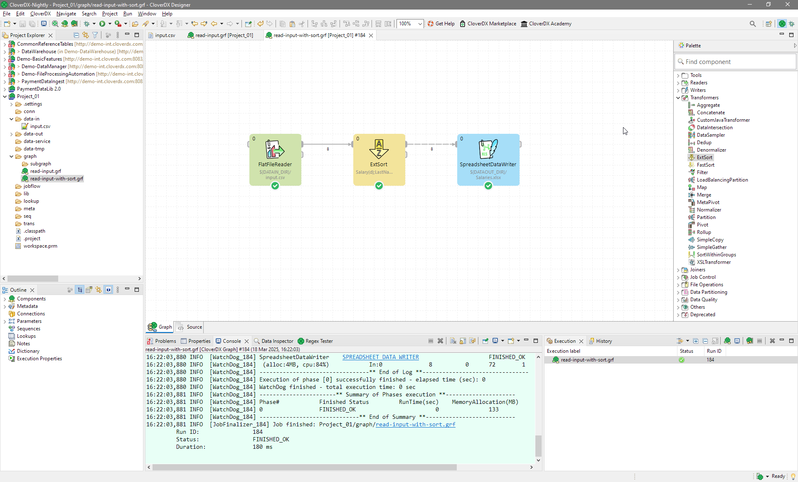

<!-- Development > Job types > Graphs & development basics -->

## 17. Graphs & development basics

### Graphs - first steps

**CloverDX graphs** are the fundamental units of executable workflows within the CloverDX platform. These graphs are constructed within CloverDX projects and represent self-contained data processing pipelines. Think of a CloverDX graph as a recipe for transforming data. Each graph contains a sequence of steps, or components, that perform specific actions on your data. These components might involve reading data from various sources, cleaning and transforming it, and then writing the results to different destinations.

Key features of CloverDX graphs:

- *Modularity*: Graphs can be created independently and reused across multiple projects, promoting code reusability and efficiency.
- *Flexibility*: CloverDX offers a wide range of components and connectors to handle various data sources and transformations, making it adaptable to diverse data processing needs.
- *Visual interface*: CloverDX provides an intuitive graphical interface for designing graphs, making it easier to understand and manage complex workflows.
- *Error handling*: Graphs can include error handling mechanisms to ensure data integrity and prevent unexpected failures.

To create your first CloverDX graph, follow these general steps:

- *Create a new project*: Start a new project where you’ll store your graphs.
- *Design your graph*: Drag and drop components from the component palette onto the graph canvas. Connect these components using edges to define the data flow.
- *Configure components and metadata*: Customize the properties of each component to specify the desired actions and parameters and specify the edge metada data types.
- *Test and debug*: Run your graph to verify its functionality and identify any errors.

For a more detailed guide on creating and working with CloverDX graphs, refer to the [CloverDX Designer tutorial](designer-tutorial.md) or see the [Self-paced Essentials training course](https://academy.cloverdx.com/courses/cloverdx-essential-self-paced) in our [CloverDX Academy](https://academy.cloverdx.com/).
