<!-- Development > Job types > Jobflows -->

## 19. Jobflows

### Jobflow overview

#### What is a jobflow?
> [!TIP]
> If you’re interested in a more in-depth course on job orchestration, explore the [Orchestration course](https://academy.cloverdx.com/courses/orchestration) in our CloverDX Academy.

A jobflow allows combining graphs and other components into complex processes - providing orchestration, conditional job execution, and error handling. Actions that can participate in jobflow include:

- CloverDX graphs
- Native OS applications and scripts
- Web services (REST/SOAP) calls
- Operations with local and remote files

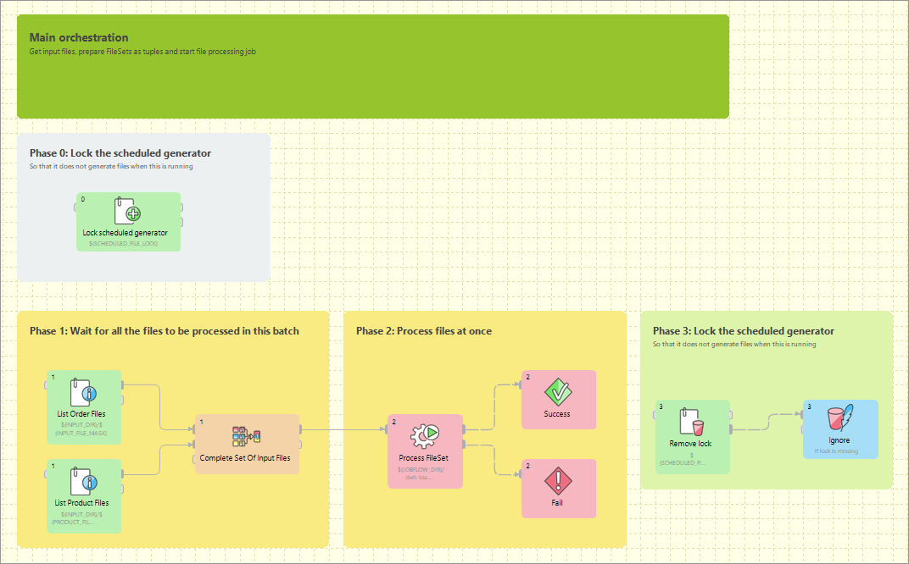
*Figure 182. An example of a jobflow*

Besides the above mentioned actions available as dedicated jobflow components, the jobflow may also include components. This allows additional flexibility in composing the jobflow logic and presents additional options for passing configuration to the jobflow from outer environment.
> [!TIP]
> You can use the [DatabaseReader](dbinputtable.md) component in a jobflow to read a list of jobs and their parameters from a database, then use **ExecuteGraph**, a jobflow component, to execute each job on the list with desired parameters. Finally, the **EmailSender** component can be attached to the flow to notify about any errors in execution.

When editing a jobflow, there are some visual modifications to the editor: components have different background color and rounded shapes, and above all **Palette** content changes. To change which components you can drag from Palette, go to **Window** ****Preferences** ****CloverDX** ****Components in Palette**

#### Design & execution

The jobflow is designed using **CloverDX Designer** and can be run both in **CloverDX Designer** and **CloverDX Server** environment. Developers can compose, deploy, and execute jobflows on the Server interactively using the Server Integration module available in **CloverDX Designer**. To automate execution of jobflow processes in the Server environment, the jobflows are fully integrated with existing automation, such as the Scheduler or File Triggers, and with Server API including SOAP and REST services.

#### Jobflow anatomy

The **CloverDX Designer** contains the design-time functional elements of the Jobflow module, both **CloverDX Designer** and **CloverDX Server** contain runtime support and **CloverDX Server** contains automation features.

Jobflow elements in **CloverDX Designer**:

- **Jobflow editors:** Dedicated UI for designing jobflows (*.jbf). Open visual editor, there are some visual modifications to the editor. Components have different background color, rounded shapes and above all **Palette** content changes.
- **Jobflow components in Palette:** The jobflow-related components are available under sections [Job Control](job-control.md) and [File Operations](file-operations.md). Additional components can be used include WebServiceClient and HTTPConnector from [Others](others.md) category. Some of the [Job Control](job-control.md) components are also available in the CloverDX perspective.
- **ProfilerProbe component:** Available in the „Data Quality" Palette category; this component allows profiling data in a graph or jobflow.
- **Predefined metadata:** Designer contains predefined metadata templates describing expected inputs or outputs provided by jobflow components. The templates generate metadata instances in which developers may decide to modify. The templates are available from edge context menu in graph editor; „New metadata from template".
- **Trackable fields:** Metadata Editor in jobflow perspective allows [*flagging selected fields*](part-jobflow.md#metadata-fields-tracking) in token metadata as „trackable". Values of trackable fields are automatically logged by jobflow components at runtime (see description of token-centric logging below). The aim is to simplify tracking of the execution flow during debugging or post-mortem job analysis.
- **CTL functions:** A set of CTL functions allowing interaction with outer environment - access to environment variables (`getEnvironmentVariables()`), graph parameters (`getParamValues()` and `getRawParamValues()`) and Java system properties (`getJavaProperties()`).
- **Log console:** Console view contains execution logs in the jobflow as well as any errors.

Jobflow elements in **CloverDX Server**:

- **Execution history:** Hierarchical view of overall execution as well as individual steps in the jobflow together with their parent-child relationships. Includes status, performance statistics as well as listing of actual parameter and dictionary values passed between jobflow steps.
- **Automated Logging:** Token-centric logging can track a token that triggers execution of particular steps. Tokens are uniquely ordered for easy identification; however, developers may opt to log additional information (e.g. file name, message identification or session identifiers) together with the default numeric token identifier.
- **Integration with automation modules:** All **CloverDX Server** modules include Scheduler, Triggers, and SOAP API to allow launching of jobflows and passing user-defined parameters for individual executions.

### Important concepts

#### Dynamic attribute setting

Besides static configuration of component attributes, the jobflow components (as well as WebServiceClient and HTTPConnector components) allow dynamic attribute configuration during runtime from a connected input port.

Values are read from incoming tokens from a connected input port and mapped to component attributes via mapping defined by the **Input Mapping** property. Dynamically set attributes are merged with any static component configuration; in the case of a conflict, the dynamic setting overrides the static configuration. The combined configurations of a component are finally used for execution triggered by a token.
> [!TIP]
> The dynamic configuration can be used for implementation of a *for-loop* by having a static configuration job in ExecuteGraph/ExecuteJobflow while passing the job parameters dynamically via **Input Mapping**.

The dynamic setting of parameters can also be used with HTTPConnector or WebServiceClient to dynamically construct the target URL, include HTTP GET parameters into URL or redirect the connection.

#### Parameter passing

The ExecuteGraph and ExecuteJobflow components allow passing of graph parameters and dictionary values from parent to child. With dictionary it is also possible for a parent to retrieve values from a child’s dictionary. This is only possible AFTER a child has finished its execution.

In order to pass a dictionary between two steps in a jobflow, it is necessary to:

1. Declare the desired dictionary entries in the child’s dictionary
2. Tag the entry as **input** (entry value is set by a parent) or **output** (parent to retrieve value from a child)
3. Define mapping for each entry in parent’s ExecuteGraph/ExecuteJobflow component’s **Input Mapping** or **Output Mapping** properties.
4. For a child to pass an entry to the parent, a value can be set during child execution using the Success, Fail, or SetJobOutput component, but it is also possible via CTL code.
5. Parameters declared in the child graph (local or from parametric file) can be set in the **Input Mapping** of ExecuteGraph/ExecuteJobflow in the parent graph. It is NOT possible for the child to change the parameter value during its runtime or the parent to retrieve parameter value from a child.

Both parameters and any input/output dictionary entries declared in the child graph are automatically displayed in the **Input Mapping** or **Output Mapping** of ExecuteGraph/ExecuteJobflow accordingly.

When to use parameters vs dictionary:

- **Parameters:** for configuration of the child graph (changing component settings, graph layout, etc.)
- **Dictionary:** for passing data (or values) to be processed by the child, to return values to the parent
> [!TIP]
> Parameters can appear anywhere in component attributes and as textual macros expanded before graph execution; they can be used to significantly change the runtime graph layout. Use them to create reusable logic by disabling processing branches in graphs, routing output to particular destination, or passing dataset restrictions/filter (e.g. business day, product type, active user). They can also be used to pass environment information in a centralized fashion.

Use a dictionary to pass result variables back to a parent or for a child to receive initial variable values from a parent. You can highlight the process of receiving or setting the dictionary entries with the **GetJobInput** and **SetJobOutput** components.

#### Pass-through mapping

Any field can be passed through the jobflow components. The **Output mapping** property can be used in mapping the incoming token fields to output combining with other component output values.
> [!TIP]
> With webservices, the pass-through mapping can be used to perform a login operation only once then pass a session token through multiple **HTTPConnector** or **WebServiceClient** components.

#### Execution status reporting

The jobflow components report the success or failure of the executed activity via two standardized output ports. The success output port (0 - zero) by default carries information about all successful executions while the output error port (1 - one) carries information about all failed executions.

Developers may choose to redirect even failed executions to the success-output using the **Redirect error output** attribute available in all jobflow components.

#### Error handling

The **ExecuteGraph**, **ExecuteScript**, **ExecuteJobflow**, and file operations components behave as natural Java try/catch block. If the executed activity finishes successfully, the result is routed to the success output port (port 0) – this case is analogous to situation where no exception was thrown.

When activity started by the component fails, the error is routed to the error output port (port 1) where a compensating logic can be attached. This behavior resembles the exception being handled by a catch block in code.

In case there is no edge connected to the error port, the component throws a regular Java exception and terminates its processing. In case the job in error was started by a parent job, the exception causes a failure in parent’s Execute in which it may choose to handle or throw the exception further.
> [!TIP]
> Using the try/catch approach, you may construct logic handling of particular errors in processing while deliberately leaving errors requiring human interaction unhandled. Uncaught errors will abort the processing and show the job as failed in Server Execution History and can be handled by production support teams.

You can use the **Fail** component in a jobflow or graph to highlight that an error is being thrown; it can be used to compose a meaningful error message from input data or to set dictionary values indicating error status to the parent job.

#### Jobflow execution model: single token

Activities in the jobflow are by default executed sequentially in the order of edge direction. The first component (having no input) in the flow starts executing, and after the action finishes, it produces an output token that is passed to the next connected component in the flow. The token serves as a triggering event for the next component and the next job is started.

This is different to graph execution where the first component produces data records for the second component but both run together in parallel.

In case where a jobflow component output is forked (e.g. via SimpleCopy) and connected to the input of two other jobflow components, the token triggers both of these components to start executing in parallel and at the same time.

The concept of phases available in Graphs can also be used in a jobflow.
> [!TIP]
> Use the branching to fork the processing into multiple parallel branches of execution. If you need to join the branches after execution, use **Combiner**, **Barrier**, or **TokenGather** component; the selection depends on how you want to process the execution results.

#### Jobflow execution model: multiple tokens

In a basic scenario, only one token passes through the jobflow; this means each action in the jobflow is started exactly once or not started at all. A more advanced use of jobflows involves multiple tokens entering the jobflow to trigger execution of certain actions repeatedly.

The concept of multiple tokens allows developers to implement for-loop iterations, **and** more specifically, to support **CloverDX** Jobflow **parallel for-loop** pattern.

In the parallel for-loop pattern, as opposed to a traditional for-loop, each new iteration of the loop is started independently in parallel with any previous iterations. In jobflow terms, this means when two tokens enter the jobflow, actions triggered by the first token may potentially execute together with actions triggered by the second token arriving later.

As the parallel execution might be undesirable at times, it is important to understand how to enforce sequential execution of the loop body or actions immediately following the loop:

- **Sequence the loop body:** forces the sequential execution of multiple steps forming the loop body, essentially means converting the parallel for loop into a traditional for loop.
  To sequence the loop body and make it behave as a traditional for loop, wrap actions in the loop body into an **ExecuteJobflow** component running in synchronous execution mode. This causes the component to wait for the completion of the underlying logic before starting a new iteration.
  > [!TIP]
  > Imagine a data warehousing scenario where we receive two files with data to be loaded into a dimension table and a fact table respectively (e.g. every day we receive two files - `dim-20120801.txt` and `fact-20120801.txt`). The data must be first inserted into a dimension table, only then the fact table can be loaded (so that the dimension keys are found). Additionally, the data from previous day must be loaded before loading data (dimension+fact) for the current day. This is necessary as a data warehouse keeps track of changes of data over time.
  To implement this using jobflow, we would use a **DataGenerator** component to generate a week’s worth of data and feed that to **ExecuteJobflow** implementing the body of the loop – loading of the warehouse for a single day. Specifically, the ExecuteJobflow would contain two **ExecuteGraph** components: LoadDimensionForDay and LoadFactTableForDay.
- **Sequence the execution of actions following the loop:** instead of having actions immediately following the loop being triggered by each new iteration, we want the actions to be triggered only once – after all iterations have completed.
  To have the actions following the loop execute once all iterations have finished, prefix the actions with the **Barrier** component with the **All tokens form one group** option enabled. In this mode, the Barrier first collects all incoming tokens (waits for all iterations), then produces a single output token (control flow is passed to actions immediately following the for loop).
  > [!TIP]
  > After loading a week’s worth of data into the data warehouse from previous example, we need to rebuild/enable indexes. This can only happen after all files have been processed. In order to do that, we can add a Barrier component followed by another ExecuteGraph into the jobflow.
  The Barrier would cause all loading to finished and only then the final ExecuteGraph step would launch one or more DBExecute components with necessary SQL statements to create the indexes.

#### Stopping on error

When multiple tokens trigger a single ExecuteGraph/ExecuteJobflow component and an unhandled error occurs in the underlying job, the default behavior of the component is not to process any further tokens to avoid starting new jobs while an exception is being thrown.

If you want to continue processing regardless of failures, the component’s behavior can be changed using the **Stop processing on fail** attribute on ExecuteGraph/ExecuteJobflow.

#### Synchronous vs. asynchronous execution

ExecuteGraph and ExecuteJobflow by default execute their child jobs synchronously; this means that they wait for the underlying job to finish. Only then they produce an output token to trigger the next component in line. While the component is waiting for its job to finish, it does not start new jobs even if more triggering tokens are available on the input.

For advanced use cases, the components also support asynchronous execution; this is controlled by the **Execution type** property. In asynchronous mode of execution, the component starts the child job as soon as a new input token is available and does not wait for the child job to finish. In such a case, the ExecuteGraph/ExecuteJobflow components only output job run `id` as job statistics might not be available.

Developers can use the **MonitorGraph** or **MonitorJobflow** component to wait for asynchronously started graphs or jobflows.
> [!TIP]
> The asynchronous execution mode is useful to start jobs in parallel when the total number of jobs is unknown.

#### Logging

Log messages produced by jobflow components are token-centric. A token represents basic triggering mechanism in a jobflow and one or multiple tokens can be present in a single running jobflow instance. Tokens are automatically numbered for easier identification of activities triggered by a token.
Example 3. Example jobflow log - token starting a graph`2012-08-21 15:27:36,922 INFO 1310734 [EXECUTE_GRAPH0_1310734] Token [#3] started etlGraph:1310735:sandbox://scenarios/jobflow/GraphFast.grf on node node01.`
Format of the log is: `date time RunID [COMPONENT_NAME] Token [#number] message`.

Every jobflow component automatically logs information on token lifecycle. The important token lifecycle messages are:

- **Token created:** a new token entered the jobflow
- **Token finalized:** a token lifecycle finished in a component; either in a terminating component (e.g. Fail, Success) or when multiple tokens resulted from the terminating one (e.g. in SimpleCopy)
- **Token sent:** a token was sent through a connected output port to the next following component
- **Token link:** logs relationships between incoming (terminating) tokens and new tokens being created as a result (e.g. in Barrier, Combine)
- **Token received:** a token was read from a connected input port from the previous component
- **Job started:** token triggered an execution of a job in ExecuteGraph/ExecuteJobflow/ExecuteScript.
- **Job finished:** a child job finished execution and the component will continue processing the next one
- **Token message:** the component produced a (user-defined) log message triggered by the token

##### Metadata fields tracking

Additionally, the developers may enable logging of additional information stored in token fields through the concept of [*trackable fields*](metadata-editor.md#trackable-fields-selection). The tracked field will be displayed in the log like this (example for field `fileName`):
2012-10-08 14:00:29,948 INFO 28 [EXECUTE_JOBFLOW0_28] Token [#1 (fileURL=${DATA_IN_DIR}/inputData.txt)] received from input port 0.> [!TIP]
> File names, directories, and session/user IDs serve as useful trackable fields as they are often iterated upon.

### Advanced concepts

#### Daemon jobs

CloverDX Jobflow allows child jobs to out live their parents. By default, this behavior is disabled meaning when the parent job finishes processing or is aborted, all its child jobs are terminated as well. The behavior can be changed by the ExecuteGraph/ExecuteJobflow property **Execute as daemon**.

#### Killing jobs

While using the try/catch to control job behavior on errors, the jobflows also allow developers to forcibly terminate jobs using the **KillGraph** and **KillJobflow** components. A job execution can be killed by using its unique run id; for mass termination of jobs, the concept of execution group can be used. A job can be tagged in an execution group using the **Execution group** property in ExecuteGraph/ExecuteJoblow components.

### Jobflow design patterns

#### Try/Catch block

All execution components simply allow to react to success and failure. In the case of job success, a token is send to the first output port. In the case of job failure, the token is sent to the second output port.

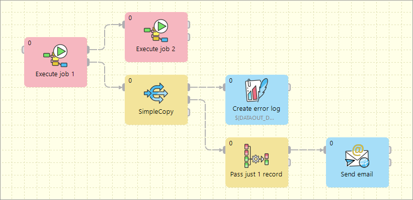

#### Try/Finally block

All execution components allow to redirect the error token to the first output port. Use the **Redirect error output** attribute for uniform reaction to job success and failure.

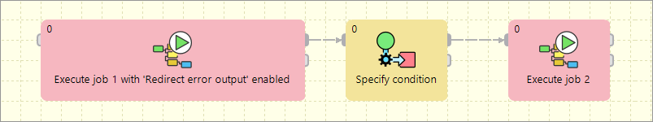

#### Fail control

You can intentionally stop processing of a jobflow using the **Fail** component. The component can report user-specified message.

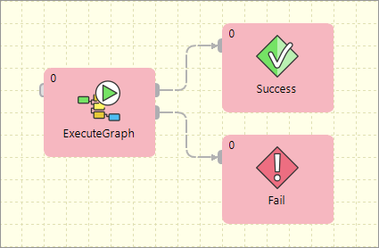

#### Sequential execution

Sequential jobs execution is performed by simple execution components chaining. Failure of any job causes jobflow termination.

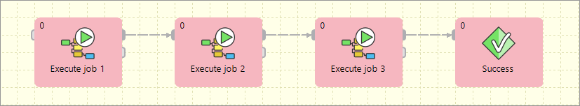

#### Sequential execution with error handling

Sequential jobs execution can be extended by common job failure handling. The **TokenGather** component is suitable for gathering all tokens representing job failures.

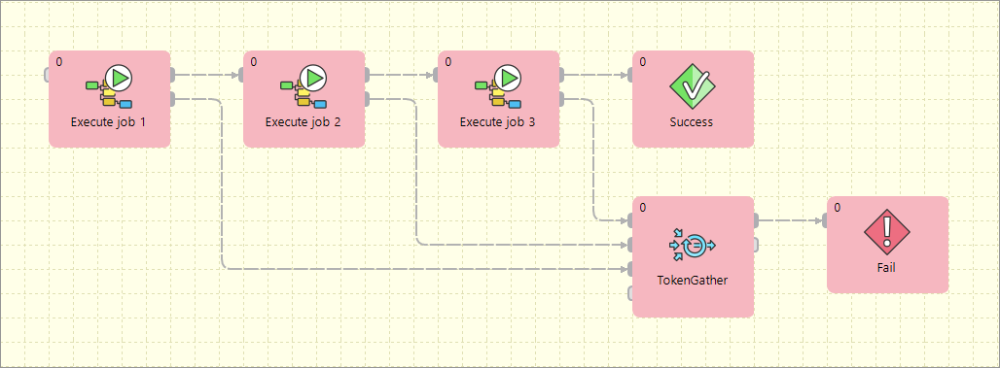

#### Parallel execution

Parallel jobs execution is simply allowed by a set of independent executors. Reaction to success and failure is available for each individual job.

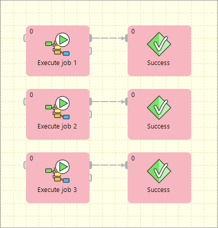

#### Parallel execution with common success/error handling

The **Barrier** component allows to react to success or failure of parallel running jobs. By default, a group of parallel running jobs is considered successful if all jobs finished successfully. **Barrier** has various settings to satisfy all your needs in this manner.

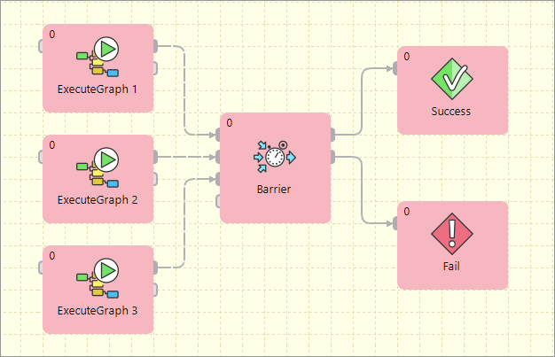

#### Conditional processing

Conditional processing is allowed by token routing. Based on results of Job`A`, you can decide using the **Condition** component which branch of processing will be used afterwards.

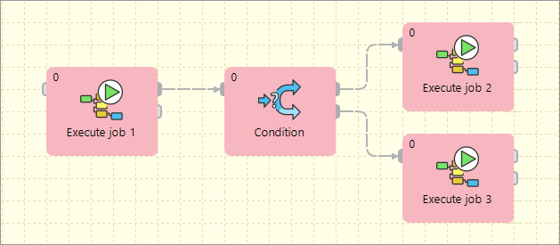

#### Dictionary driven jobflow

A parent jobflow can pass some data to a child job using input dictionary entries. These job parameters can be read by the **GetJobInput** component and can be used in further processing. On the other side, jobflow results can be written to output dictionary entries using the **SetJobOutput** component. These results are available in the parent jobflow.

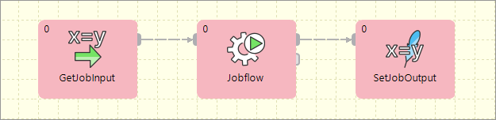

#### Asynchronous graphs execution

Parallel processing of a variable number of jobs is allowed using asynchronous job processing. The example bellow shows how to process all `csv` files in a parallel way. First, all file names are listed by the **ListFiles** component. A single graph for each file name is asynchronously executed by the **ExecuteGraph** component. Graph run identifications (runId) are sent to the **MonitorGraph** component which waits for all graph results.

Asynchronous execution is available only for graphs and jobflows.

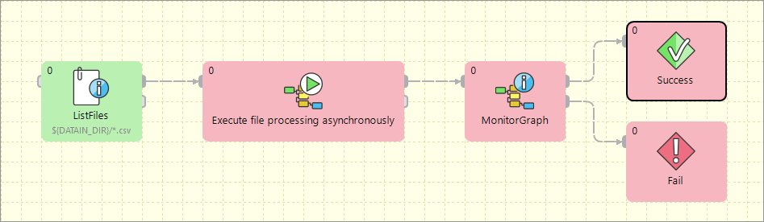

#### File operations

Jobflow provides a set of file operations components - list files, create, copy, move and delete files. This use-case shows how to use file operation components to process a set of remote files. The files are downloaded from a remote FTP server, each file is processed by a job, results are copied to a final destination and possible temporary files are deleted.

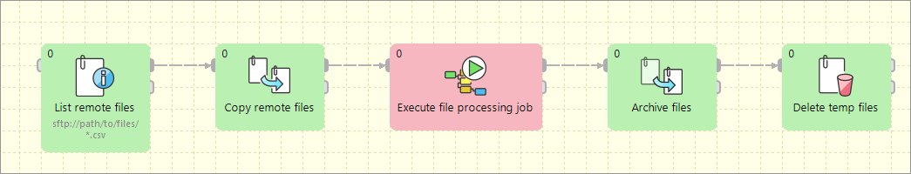

#### Aborting graphs

Graphs and jobflows can be explicitly aborted by the **KillGraph** or **KillJobflow** components. The example bellow shows how to process a list of tasks in parallel way and jobs which reached a user-specified timeout are automatically aborted.

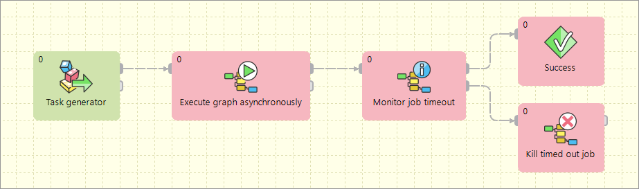
