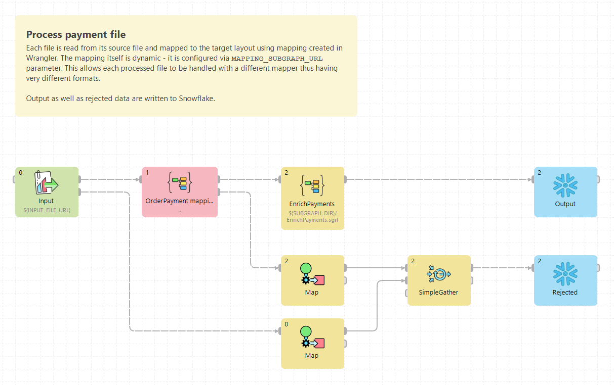

<!-- Development > First steps with CloverDX Designer -->

# First steps with CloverDX Designer

**CloverDX Designer** is an intuitive, yet powerful visual tool designed for creating, testing, and deploying data transformation workflows. It enables users to visually design processes that can connect to various data sources, apply complex transformations, and output results in a wide variety of formats. From simple data transformations to more complex enterprise-level workflows, CloverDX Designer serves as the central development environment for orchestrating these tasks. Its graphical nature makes it accessible for users of different skill levels, while still offering the depth required for more advanced configurations and operations.

This chapter is your introduction to building data transformations using CloverDX Designer. In this [tutorial](designer-tutorial.md) you will be guided through the creation of a simple transformation graph—a foundational step toward mastering the tool. By following this hands-on approach, you’ll gain familiarity with the Designer’s interface, learn how to configure components, connect data flows, and execute your first transformation job.

You will not only learn to build your first graph but also become familiar with key concepts such as components, edges, and metadata assignment. These are essential building blocks for any transformation job. By the end of the tutorial, you will understand how to construct a basic workflow, ensuring you’re ready to explore more complex features.

Before starting the tutorial, it’s important to ensure that CloverDX Designer is properly installed. If you haven’t done so yet, the [Designer installation](../admin/part-installation-instructions.md) section under Administration contains detailed steps for downloading, installing, and configuring the Designer on your machine. Once you have CloverDX Designer set up, you’ll be ready to dive into this tutorial.

For users who want to take their skills further, our [CloverDX Academy](https://academy.cloverdx.com/) offers a range of comprehensive courses covering various topics, designed to help you become proficient in different aspects of the CloverDX platform. The Academy covers everything from basic data transformation techniques to advanced concepts like automation, error handling, and optimization of data workflows. Whether you’re a beginner or an experienced user, these courses provide valuable insights to enhance your understanding of how to create, manage, and optimize transformation jobs effectively.

*Figure 1. Example of a transformation graph*
