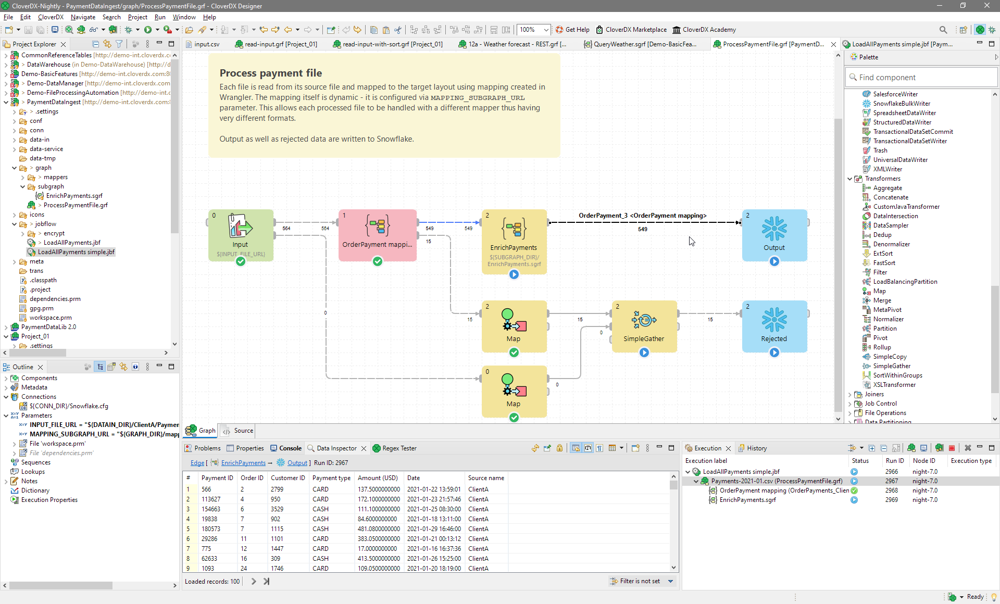

<!-- Development > Designer user interface -->

# Designer user interface

This section provides a detailed overview of the CloverDX Designer environment, introducing key elements that help users create and manage data transformation jobs effectively. This chapter explains the various components of the user interface, starting with the [Designer default layout](designer-layout.md), which includes the [Graph editor and Palette](designer-layout.md#graph-editor-with-palette-of-components) for building and editing transformation graphs. It also covers fundamental tasks like placing components, using edges, saving graphs, and working with utilities like rulers, the grid, and auto-layout features to organize graph elements efficiently.

You’ll also explore panes such as the [Project Explorer](designer-layout.md#project-explorer-pane), which helps navigate projects, and the [Outline pane](designer-layout.md#outline-pane), which allows you to add and manage [job elements](part5.md) like [metadata](metadata.md), [connections](connections.md), or [parameters](parameters.md). The [Tabs pane](designer-layout.md#tabs-pane) is another essential area where users can access various tabs like [Properties](designer-layout.md#properties-tab), [Console](designer-layout.md#console-tab), [Problems](designer-layout.md#problems-tab), and [Regex Tester](designer-layout.md#regex-tester-tab), each offering different functionalities for building and debugging graphs.

Additionally, the [Execution tab](designer-layout.md#execution-tab) displays real-time information on job execution, including labels, statuses, run IDs, node IDs, and execution types. For users looking to improve their productivity, the [Keyboard shortcuts](keyboard-shortcuts.md) and [Search functionality](search-functionality.md) sections offer quick ways to navigate and use the platform more efficiently.

The chapter also includes sections on [common dialogs](common-dialogs.md), such as the [URL file dialog](common-dialogs.md#url-file-dialog), which serves to navigate through the file system and select input or output files. Lastly, users will learn how to [import](import.md) CloverDX projects, graphs, or metadata, or how to [export](export.md) or convert job files.

*Figure 46. Designer user interface*
