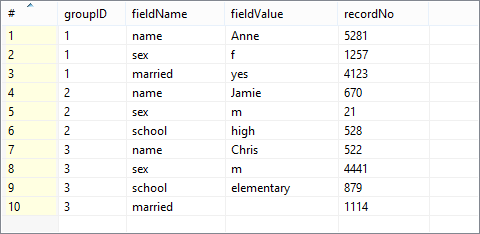
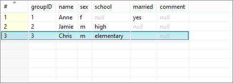

<!-- Development > Component reference > Transformers > Pivot -->

### Pivot


| [Short description](pivot.md#short-description) |
| --- |
| [Ports](pivot.md#ports) |
| [Metadata](pivot.md#metadata) |
| [Pivot attributes](pivot.md#pivot-attributes) |
| [Details](pivot.md#details) |
| [CTL interface](pivot.md#ctl-interface) |
| [Java interface](pivot.md#java-interface) |
| [Examples](pivot.md#examples) |
| [Best practices](pivot.md#best-practices) |
| [Compatibility](pivot.md#compatibility) |
| [See also](pivot.md#see-also) |

#### Short description

The component reads input records and treats them as groups. A group is defined either by a Group key or a number of records forming the group. **Pivot** then produces a single record from each group. In other words, the component creates a pivot table.

**Pivot** has two principal attributes which instruct it to treat some input values as output field names and other inputs as output values.

The component is a simple form of [Denormalizer](denormalizer.md).

| Same input metadata | Sorted inputs | Inputs | Outputs | Java | CTL | Auto-propagated metadata |
| --- | --- | --- | --- | --- | --- | --- |
| - | **⨯** | 1 | 1 | **✓** | **✓** | **⨯** |

Note: When using the Group key attribute, input records should be sorted. See [Details](pivot.md#details).

#### Ports

| Port type | Number | Required | Description | Metadata |
| --- | --- | --- | --- | --- |
| Input | 0 | **✓** | For input data records | Any1 |
| Output | 0 | **✓** | For summarization data records | Any2 |

#### Metadata

**Pivot** does not propagate metadata.

**Pivot** has no metadata template.

#### Pivot attributes

| Attribute | Req | Description | Possible values |
| --- | --- | --- | --- |
| Basic |  |  |  |
| Group key | [[1]](pivot.md#pivot-attributes-fn01) | The Group key is a set of fields used to identify groups of input records (more than one field can form a Group key). A group is formed by a sequence of records with identical Group key values. Group key fields are passed to the output (if a field with the same name exists). | any input field |
| Group size | [[1]](pivot.md#pivot-attributes-fn01) | The number of input records forming one group. When using Group size, the input data does not have to be sorted. **Pivot** then reads a number of records and transforms them to one group. The number is just the value of Group size. | <1; n> |
| Field defining output field name | [[2]](pivot.md#pivot-attributes-fn02) | The input field whose value "maps" to a field name on the output. |  |
| Field defining output field value | [[2]](pivot.md#pivot-attributes-fn02) | The input field whose value "maps" to a field value on the output. |  |
| Sort order |  | Groups of input records are expected to be sorted in the order defined here. The meaning is the same as in **Denormalizer**, see [Sort order](denormalizer.md#sort-order). Note that in Pivot, setting this to `Ignore` can produce unexpected results if input is not sorted. | Auto (default) \| Ascending \| Descending \| Ignore |
| Equal NULL |  | Determines whether two fields containing null values are considered equal. | true (default) \| false |
| Advanced |  |  |  |
| Pivot transformation | [[3]](pivot.md#pivot-attributes-fn03) | Using CTL or Java, you can write your own records transformation here. |  |
| Pivot transformation URL | [[3]](pivot.md#pivot-attributes-fn03) | The path to an external file which defines how to transform records. The transformation can be written in CTL or Java. |  |
| Pivot transformation class | [[3]](pivot.md#pivot-attributes-fn03) | The name of a class that is used for data transformation. It can be written in Java. |  |
| Pivot transformation source charset |  | The encoding of an external file defining the data transformation.  The default encoding depends on `DEFAULT_SOURCE_CODE_CHARSET` in defaultProperties. | UTF-8 \| any |
| Deprecated |  |  |  |
| Error actions |  | Defines actions that should be performed when the specified transformation returns an **Error code**. See [Return values of transformations](transformations.md#return-values-of-transformations). |  |
| Error log |  | The URL of the file which error messages should be written to. These messages are generated during **Error actions**, see above. If the attribute is not set, messages are written to **Console**. |  |

| 1 |  One of the **Group key** or **Group size** attributes has to be always set. |
| --- | --- |

| 2 |  These two values can either be given as an attribute or in your own transformation. |
| --- | --- |

| 3 |  One of these attributes has to be set if you do not control the transformation by means of **Field defining output field name** and **Field defining output field value**. |
| --- | --- |

#### Details

You can define the data transformation in two ways:

1) Set the **Group key** or **Group size** attributes. See [Group data by setting attributes](pivot.md#group-data-by-setting-attributes).

2) Write the transformation yourself in CTL/Java or provide it in an external file/Java class. See [Define your own transformation - Java/CTL](pivot.md#define-your-own-transformation-javactl).

##### Group data by setting attributes

###### Group data using Group key

If you group data using the **Group key** attribute, your input should be sorted according to **Group key** values. To tell the component how your input is sorted, specify **Sort order**. If the **Group key** fields appear in the output metadata as well, **Group key** values are copied automatically.

###### Group data using Group size

When you are grouping using the **Group size** attribute, the component ignores the data itself, takes e.g. 3 records (for Group size = 3) and treats them as one group. Naturally, you have to have an adequate number of input records otherwise errors on reading will occur. The number has to be a multiple of **Group size**, e.g. 3, 6, 9 etc. for Group size = 3.

###### Mapping

There are the two major attributes which describe the "mapping". They say:

- which input field’s value will designate the output field - **Field defining output field name**
- which input field’s value will be used as a value for that field **Field defining output field value**

As for the output metadata, it is arbitrary but fixed to field names. If your input data has extra fields, they are simply ignored (only fields defined as a value/name matter). Likewise, output fields without any corresponding input records will be null.

If a value of **Field defining output field name** does not correspond to any of names of output metadata fields, the component fails.

##### Define your own transformation - Java/CTL

In **Pivot**, you can write the transformation function yourself. That can be done either in CTL or Java, see Advanced attributes in [Pivot attributes](pivot.md#pivot-attributes)

Before writing the transformation, you might want to refer to some of the sections touching the subject:

- [Defining transformations](transformations.md#defining-transformations)
- writing transformations in **Denormalizer**, the component **Pivot** is derived from: [CTL interface](denormalizer.md#ctl-interface) and [Java interface](denormalizer.md#java-interface)

#### CTL interface

You can implement methods `getOutputFieldIndex` and `getOutputFieldValue` or you can set one of the attributes and implement the other one with a method.

So you can, for example, set `valueField` and implement `getOutputFieldIndex`. Or you can set `nameField` and implement `getOutputFieldValue`.

For a better understanding, examine the methods' documentation directly in the **Transform editor**.

#### Java interface

Compared to **Denormalizer**, the **Pivot** component has new significant attributes: `nameField` and `valueField`. These can be defined either as attributes (see above) or by methods. If the transformation is not defined, the component uses `com.opensys.cloveretl.component.pivot.DataRecordPivotTransform` which copies values from `valueField` to `nameField`.

In Java, you can implement your own `PivotTransform` that overrides `DataRecordPivotTransform`. However, you can override only one method, e.g. `getOutputFieldValue`, `getOutputFieldIndex` or others from `PivotTransform` (that extends `RecordDenormalize`).

#### Examples

| [Data transformation with Pivot - using key](pivot.md#data-transformation-with-pivot-using-key) |
| --- |
| [Converting fixed number of records to single record](pivot.md#converting-fixed-number-of-records-to-single-record) |
| [Converting fixed number of records to single record using CTL](pivot.md#converting-fixed-number-of-records-to-single-record-using-ctl) |
| [Passing trough fields to output](pivot.md#passing-trough-fields-to-output) |

##### Data transformation with Pivot - using key

Let us have the following input values:



Because we are going to group the data according to the `groupID` field, the input has to be sorted (mind the ascending order of groupIDs). In the **Pivot** component, we will make the following settings:

**Group key** = `groupID` (to group all input records with the same groupID)

**Field defining output field name** = `fieldName` (to say we want to take output fields' names from this input field)

**Field defining output field value** = `fieldValue` (to say we want to take output fields' values from this input field)

Processing that data with **Pivot** produces the following output:



Notice the input `recordNo` field has been ignored. Similarly, the output `comment` had no corresponding fields on the input, that is why it remains null. `groupID` makes part in the output metadata and thus was copied automatically.
> [!NOTE]
> If the input is not sorted (not like in the example), grouping records according to their count is especially handy. Omit **Group key** and set **Group size** instead to read sequences of records that have exactly the number of records you need.

##### Converting fixed number of records to single record

Input metadata have fields **filedName** and **fieldValue**. The records contain a timestamp, IP address and username.

```
timestamp|2014-10-30 13:51:12
address  |192.168.10.15
username |Alice
timestamp|2014-10-30 13:52:14
address  |192.168.3.151
username |Bob
timestamp|2014-10-30 13:52:40
address  |192.168.102.105
username |Eve
```

Convert the data to a one line structure having a timestamp, IP address and username.

###### Solution

Use attributes **Group size**, **Field defining output field name** and **Field defining output field value**.

| Attribute | Value |
| --- | --- |
| Group size | 3 |
| Field defining output field name | fieldName |
| Field defining output field value | fieldValue |

Output metadata has to have fields **timestamp**, **address** and **user**.

##### Converting fixed number of records to single record using CTL

This example is similar to the previous one: input records contain a timestamp, IP address and username, but there is no field indicating which one is a timestamp, IP address or username. The order of the input records within the group is always the same: timestamp is before IP address and IP address is before username.

```
2014-10-30 13:51:12
192.168.10.15
Alice
2014-10-30 13:52:14
192.168.3.151
Bob
2014-10-30 13:52:40
192.168.102.105
Eve
```

###### Solution

One output record correspond to three input records, so we use the **Group size** attribute. Mapping to the output record is defined in **Pivot transformation**.

| Attribute | Value |
| --- | --- |
| Group size | 3 |
| Pivot transformation | See the code below |

```ctl
//#CTL2

function integer getOutputFieldIndex(integer idx) {
    return idx % 3;
}

function string getOutputFieldValue(integer idx) {
    return $in.0.value;
}
```

The order of input records corresponds to the order of output metadata fields. If you need a different order, rearrange the output metadata or change the content of the `getOutputFieldIndex()` function.

##### Passing trough fields to output

The input records have `customerId`, `batchId`, `fieldName` and `value` metadata fields:

```
C0001|B001|firstName|John
C0001|B001|lastName |Doe
C0001|B001|accountNo|A0001
```

Convert data to following the format:

```
C0001|B001|John|Doe|A0001
```

###### Solution

| Attribute | Value |
| --- | --- |
| Group key | customerId;batchId |
| Field defining output field name | fieldName |
| Field defining output field value | value |

Note that **Group key** fields have been passed to the corresponding output fields.

#### Best practices

If the transformation is specified in an external file (**Pivot transformation URL**), we recommend users to explicitly specify **Pivot transformation source charset**.

#### Compatibility

| Version | Compatibility Notice |
| --- | --- |
| 4.0 | Originally, a transformation executed in the compiled CTL mode, when **Field defining output field name** or **Field defining output field value** was not set, finished successfully, but did not produce any output.  Such transformation should now fail in init(), just like in interpreted mode.  Additionally, `getOutputFieldValue()` can be overridden also in the compiled CTL mode - the implementation is no longer ignored. If the function raises an error, the transformation fails. |

#### See also

| [Denormalizer](denormalizer.md) |
| --- |
| [MetaPivot](metapivot.md) |
| [Normalizer](normalizer.md) |
| [Common properties of components](components.md#common-properties-of-components) |
| [Specific attribute types](components.md#specific-attribute-types) |
| [Common properties of Transformers](common-of-transformers.md) |
| [Transformers comparison](common-of-transformers.md#transformers-comparison) |
