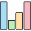
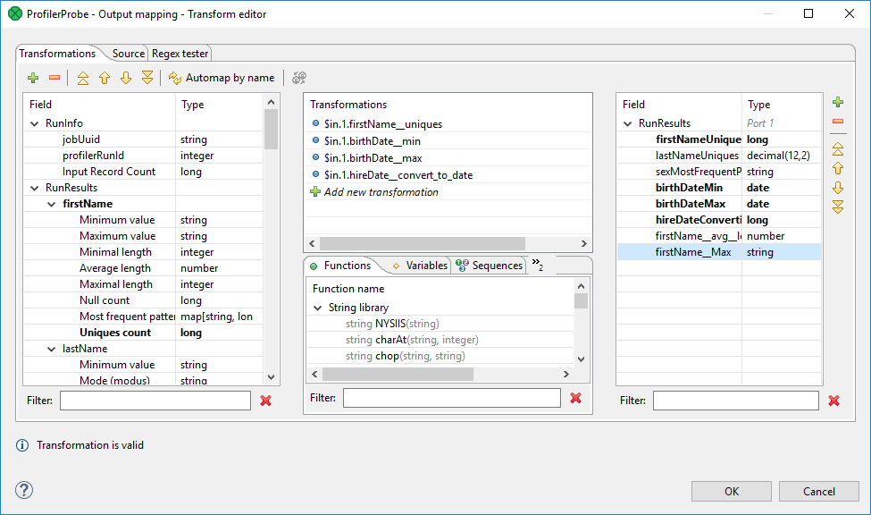
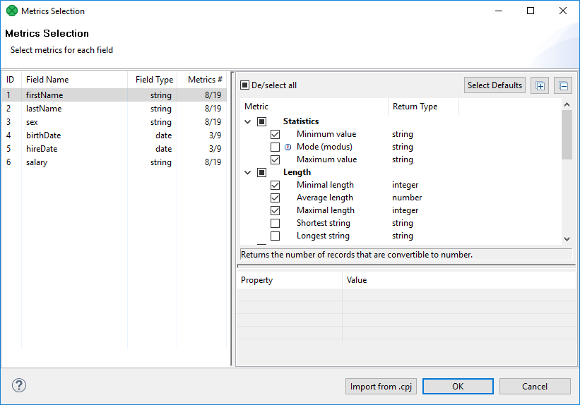
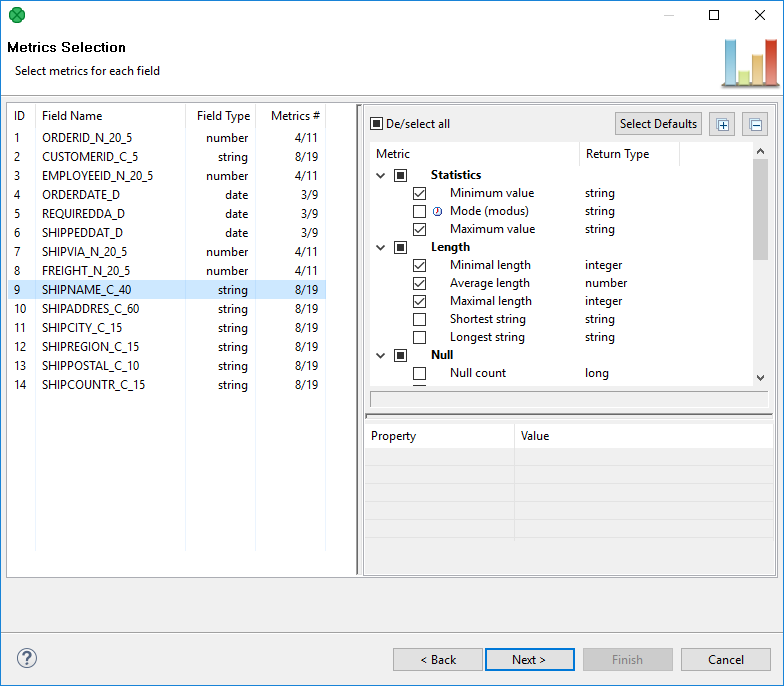
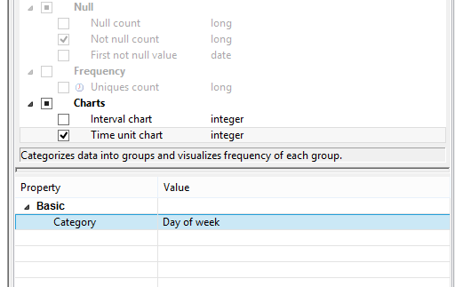

<!-- Development > Component reference > Data Quality > ProfilerProbe -->

### ProfilerProbe

Licensed under **CloverDX** Data Quality package.



| [Short description](profilerprobe.md#short-description) |
| --- |
| [Ports](profilerprobe.md#ports) |
| [ProfilerProbe attributes](profilerprobe.md#profilerprobe-attributes) |
| [Details](profilerprobe.md#details) |
| [Compatibility](profilerprobe.md#compatibility) |
| [Troubleshooting](profilerprobe.md#troubleshooting) |
| [See also](profilerprobe.md#see-also) |
| [Metrics](profilerprobe.md#metrics) |
| [List of all metrics](profilerprobe.md#list-of-metrics) |

#### Short description

**ProfilerProbe** analyses (*profiles*) input data. The big advantage of the component is the combined power of **CloverDX** solutions with data profiling features. So it makes profiling accessible in very complex workflows such as data integration, data cleansing and other processing tasks.

**ProfilerProbe** is not limited to only profiling isolated data sources; instead, it can be used for profiling data from various sources (including popular DBs, flat files, spreadsheets etc.). ProfilerProbe is capable of handling all data sources supported by **CloverDX**'s *[Readers](readers.md)*.
> [!NOTE]
> To be able to use this component, you need a separate **Data Quality license**.

| Same input metadata | Sorted inputs | Inputs | Outputs | Each to all outputs | Java | CTL | Auto-propagated metadata |
| --- | --- | --- | --- | --- | --- | --- | --- |
| - | **⨯** | 1 | 1-n | **✓** | **⨯** | **⨯** | **✓** |

#### Ports

| Port type | Number | Required | Description | Metadata |
| --- | --- | --- | --- | --- |
| Input | 0 | **✓** | Input data records to be analyzed by metrics. | Any |
| Output | 0 | **⨯** | A copy of input data records. | Input port 0 |
| 1-n | **⨯** | Results of data profiling per individual field. | Any |  |

#### Metadata

**ProfilerProbe** propagates metadata from the first input port to the first output port and from the first output port to the first input port.

**ProfilerProbe** does not change the priority of propagated metadata.

If any metric is set up in the component, the component has a template **ProfilerProbe_RunResults** on its second output port. The field names and data types depend on used metrics.

#### ProfilerProbe attributes

| Attribute | Req | Description | Possible values |
| --- | --- | --- | --- |
| Basic |  |  |  |
| Metrics | **✓** | Statistics you want to be calculated on metadata fields. Learn more about metrics in [Metrics](profilerprobe.md#metrics) section. | See [List of Metrics](profilerprobe.md#list-of-metrics). |
| Output mapping | [[1]](profilerprobe.md#profilerprobe-attributes-fn01) | Maps profiling results to output ports, starting from port number 1. See [Details](profilerprobe.md#details). |  |
| Advanced |  |  |  |
| Output mapping URL | [[1]](profilerprobe.md#profilerprobe-attributes-fn01) | External XML file containing the **Output mapping** definition. |  |
| Processing mode |  | `Always active (default)` - default mode to execute the **ProfilerProbe** component locally and remotely (if executed on the server).  `Debug mode only` - select this mode to capture execution data for debugging purpose, similar to debug mode on component edges. Note that when executing a graph with this mode selected for **ProfilerProbe**:  - runs as expected when server `debug_mode = true` (see [Execution properties](../developer/jobconfig.md)). - when server `debug_mode = false`, the input data would continue through the first output port, but it does not send profiling of data to subsequent output ports. | Always active (default) \| Debug mode only |

| 1 |  Specify only one of these attributes. (If both are set, **Output mapping URL** has a higher priority.) |
| --- | --- |

#### Details

**ProfilerProbe** calculates metrics of the data that is coming through its first input port. You can choose which metrics you want to apply on each field of the input metadata. You can use this component as a 'probe on an edge' to get a more detailed (statistical) view of data that is flowing in your graph.

The component sends an exact copy of the input data to output port 0 (behaves as **SimpleCopy**). That means you can use **ProfilerProbe** in your graphs to examine data flowing in it, without affecting the graph’s business logic itself.

The remaining output ports contain results of profiling, i.e. metric values for individual fields.

##### Output mapping

Editing the **Output mapping** attribute opens the [*Transform Editor*](transformations.md#transform-editor) where you can decide which metrics to send to output ports.


*Figure 429. Transform Editor in ProfilerProbe*

The dialog provides you with all the power and features known from Transform Editor and [*CTL*](part6.md). In addition, notice metadata on the left hand side has a special format. It is a tree of input fields AND metrics you assigned to them via the **Metrics** attribute. Fields and metrics are grouped under the `RunResults` record. Each field in `RunResults` record has a special name: `fieldNamemetric_name`*(note the underscore is doubled as a separator), e.g. `firstName`*`avg_length`.

Additionally there is another special record containing three fields - `JobUid`, `inputRecordCount` and `profilerRunId`. After you run your graph, the field will store the total number of records which were profiled by the component. You can right-click a field/metric and **Expand All**, or **Collapse All** metrics.

To do the mapping in a few basic steps, follow these instructions:

1. Provided you already have some output metadata, just left-click a metric in the left-hand pane and drag it onto an output field. This will send profiling results of that particular metric to the output.
2. If you do not have any output metadata:
   1. Drag a **Field** from the left hand side pane and drop it into the right hand pane (an empty space).
   2. This produces a new field in the output metadata. Its format is: `fieldNamemetric_name`*(note the underscore is doubled as a separator), e.g. `firstName`*`avg_length`.
   3. You can map metrics to fields of any output port, except for port 0. That port is reserved for input data (which just flows through the component without being affected in the process).
> [!NOTE]
> The output mapping uses CTL (you can switch to the **Source** tab). All kinds of functions are available to help you learn even more about your data, for example:
>
>
> ```ctl
> double uniques = $out.0.firstName__uniques; // conversion from integer
> double uniqInAll = (uniques / $in.0.recordCount) * 100;
> ```
>
>
> calculates the per cent of unique first names in all records.

If you do not define the output mapping, the default output mapping is used:

```ctl
$out.0.* = $in.0.*;
```

The default output mapping is available since version 4.1.0.

##### Importing metrics

In the **Metrics** dialog, you can import your settings of fields and their metrics from a *.cpj file using the **Import from .cpj** button at the bottom of the dialog.

The purpose of the import is for easier transition from previous versions, it is no longer possible to externalize metrics to a *.cpj file.


*Figure 430. Import metrics button*

##### ProfilerProbe notes & limitations

- If you want to use sampling of the input data, connect the **DataSampler** (or other filter) component to your graph. There is no built-in sampling in **ProfilerProbe**.
- In Cluster environment, the component will profile data from each node where it is running. Therefore, the results are only applicable to the portions of data processed on given node. If you need to compute metrics for data from all nodes, first gather the data to single node where this component will run (e.g. by using [ParallelSimpleGather](clustersimplegather.md)).

#### Compatibility

| Version | Compatibility Notice |
| --- | --- |
| 4.1.0 | Default mapping is now available. |

#### Troubleshooting

The ProfilerProbe component can report an error similar to:
CTL code compilation finished with 1 errors Error: Line 5 column 23 - Line 5 column 39: Field 'field1__avg_length' does not exist in record 'RunResults'!
This means that you’re accessing a disabled metric in output mapping - in this example the **Average length** is not enabled on the field `field1`.

#### See also

| [Common properties of components](components.md#common-properties-of-components) |
| --- |
| [Specific attribute types](components.md#specific-attribute-types) |
| [Data Quality comparison](common-of-data-quality.md#data-quality-comparison) |

#### Metrics

The major goal when setting up ProfilerProbe component is to select metrics that will be calculated for each metadata field.

First select a field on the left hand side and second check metrics on the right hand side. Some metrics are selected by default.

The range of available metrics differs for each field and depends on **Field Type**. Thus, you can analyze e.g. the average value or median for integers while in strings, you can measure the shortest string, non-ASCII records and so forth.

In addition, you can work with more fields at a time by selecting them (Ctrl+click, Shift+click) and assigning metrics to the whole group.


*Figure 431. Selecting and configuring metrics*

Some metrics just need to be checked while some others require additional settings.

If a metric is checked and can actually be configured, you will notice the **Property | Value** area in the bottom right hand corner becomes active. An example of one such metric is **Time unit chart**, see the following picture.

Some metrics return map or list data types. Such metrics have their return type marked with an icon, see **Most frequent patterns** and **Non printable ASCII** in the picture above.


*Figure 432. Metric configuration. Note the metric has to be checked.*

#### List of Metrics

| Metric | Return type | Description | Note |
| --- | --- | --- | --- |
| Statistics |  |  |  |
| Minimum value | number / string | Returns the lowest value of all numbers. The metric works with strings, too. Example: let us have two strings, "zoo" and "city-zoo". The second one is **Minimum value**, because alphabetically, it would be the first item of the two. |  |
| Average value | number | Calculates the average value of all numbers. |  |
| Median | number | Calculates the median of your data. Be advised that profiling huge data sets with this metric works slower (the reason is necessary values are continually stored in the database until the median is finally calculated). |  |
| Mode (modus) | string | Returns the value which is most frequently repeated in the data set. Be advised that profiling huge data sets with this metric works slower (the reason is necessary values are continually stored in the memory until modus is finally calculated). |  |
| Maximum value | number / string | Returns the highest value of all numbers. The metric works with strings, too. Example: let us have two strings, "zoo" and "city-zoo". The first one is **Maximum value**, because alphabetically, it would be the last item of the two. |  |
| Length |  |  |  |
| Minimal length | integer | Examines the data set and returns the length of the string consisting of the lowest number of characters. |  |
| Average length | number | Calculates the average length of all field values. |  |
| Maximal length | integer | Examines the data set and returns the length of the string consisting of the highest number of characters. |  |
| Shortest string | string | Returns the shortest found string of the data set. If there are more of them, the first one alphabetically is returned. |  |
| Longest string | string | Returns the longest found string of the data set. If there are more of them, the last one alphabetically is returned. |  |
| Null Handling |  |  |  |
| Null count | integer | Returns the count of values that are `null`, i.e. they carry no data at all. |  |
| Not null count | integer | Counts all fields that carry some data, i.e. they are not `null`. |  |
| First not null value | string | Returns the first value found which is not null. |  |
| String format |  |  |  |
| Most frequent patterns | string | The metric examines all strings and returns a mask that describes how those strings **most** commonly look like. You can configure the number of returned patterns via **Patterns count**. Example result: "27,1%: A99 9AA 9,2%: AA9 5,8%: 999" - it tells you that 27,1% of strings looked like "A99 9AA", 9,2% were "AA9" and 5,8% were "999" where A stands for an arbitrary character and 9 is a digit. One such "A99 9AA" string could be e.g. "M64 1se". Profiling huge data sets with this metric may work slower if they contain "ugly" strings consisting of brackets, quotes, commas and other non-alphanumeric characters. | This metric returns a map with keys containing patterns and values containing their occurrences. |
| Least frequent patterns | string | The metric examines all strings and returns a mask that describes how those strings **least** commonly look like. You can configure the number of returned patterns via **Patterns count**. Example result: "5,8%: 999 9,2%: AA9 27,1%: A99 9AA " - it tells you that 5,8% of strings looked like "999", 9,2% were "AA9" and 27,1% were "A99 9AA" where A stands for an arbitrary character and 9 is a digit. One such "A99 9AA" string could be e.g. "M64 1se". Profiling huge data sets with this metric may work slower if they contain "ugly" strings consisting of brackets, quotes, commas and other non-alphanumeric characters. | This metric returns a map with keys containing patterns and values containing their occurrences. |
| Convertible to date | integer | The metric finds out how many records can be converted to a date format. The format you are looking for has to be specified in **Mask**. Setting the appropriate **Locale** allows the metric to e.g. recognize month names written as strings. |  |
| Convertible to number | integer | The metric finds out how many records can be converted to a number. Optionally, type in the **Format** pattern you are looking for. The pattern uses the same syntax as **CloverDX Designer** (e.g. '0' for digit, '.' for decimal separator) - please refer to [Numeric format](../developer/metadata-records-and-fields.md#numeric-format) documentation. |  |
| Non-ASCII records | integer | Returns the number of records containing non-ASCII characters. |  |
| Non printable ASCII | string | Gets all ASCII characters that cannot be printed (e.g. Delete or Escape). | This metric returns a list of the non printable ASCII characters. |
| Frequency |  |  |  |
| Uniques count | integer | Returns the amount of values that are unique within the data set. Thus, you can e.g. easily pick a field which could serve as the primary key. Profiling huge data sets with this metric works slower as unique values are gradually stored in the memory. |  |
| Interval chart | chart | A histogram chart showing values divided into interval bins with a number of occurrences per each value. It can be used for numerical (integer, long, double, decimal) and date fields. This metric can either work in an automatic mode (no configuration) or you can set its properties yourself. The automatic mode always sets the histogram so that all your data could be displayed. The number of buckets is chosen adequately. Thus, the automatic mode gets you a good overview of how your data is spread. Afterwards, you may want to focus on a certain part of the data. In that case, set histogram properties. Be advised you have to set all of them, otherwise the job will fail on running. The aforementioned properties differ for integer fields and date fields. As for integer fields, you set:  - **Minimum value** and **Maximum value** - specifying bounds of the histogram. Values which do not fit into the bounds will be shown at both the right and left hand edge of the histogram. - **Buckets count** - determines the number of interval bins. It must never be higher than 100. - **Show outer values** - when enabled (default), the chart will also contain two additional bins, before and after the manually specified bounds. These bins show how many values there are outside of the bounds. In case there are too many values in these two bins, you may want to disable them, so that your chart is not deformed by two large columns.  While for date fields, you set:  - **Start date** and **End date** - click the **…​** button to open a calendar and choose the demanded bounds of the histogram. - **Interval** - specify the size of the interval in units such as second, hour, day, etc. - **Show outer values** - same as for other types of fields (see above). |  |
| Frequency chart | chart | A simple chart showing the number of occurrences per each value. It can be used for strings and numerical fields (integer, long). Use it to analyze long listings, e.g. (postal) codes. You define the maximum number of unique values the metric will work with - **Maximum unique values**. If this threshold is exceeded during the computation, the histogram will not be shown. In case you are profiling a file with many unique values, the histogram will allow you to switch between the **Most common** and **Least common** ones. |  |
| Time unit chart | chart | A special chart for `date` fields. Dates are classified into buckets according to what you set in **Category** (e.g. second, day of month, week of year). That is, choosing month, you will have 12 buckets while for minute, there will be 60 buckets etc. For instance, let us have two dates:  1900-01-02 12:34:56  2011-06-22 22:34:11  These would fit into the same bucket only if you chose **Minute** as **Category**. For all other categories, they would fall in different buckets. |  |
