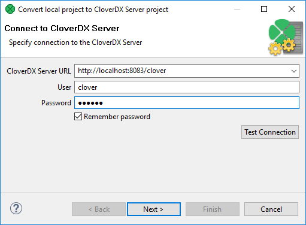
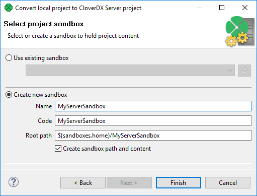

<!-- Development > Projects > Converting CloverDX projects -->

## 11. Converting CloverDX projects

You can convert local project to **Server project** and you can convert **Server project** to local project.

### Converting local project to server project

To convert local project to server project, right click the project in **Project Explorer** and choose **Convert to Server project** from the context menu.

A **Convert local project to CloverDX Server project** wizard opens. In the first step of wizard, enter **CloverDX Server URL**, **User** name, and **Password**.

*Figure 111. Convert local project to CloverDX server project wizard*

Choose **Create new Sandbox**. Enter the sandbox **Name**. If you need a specific configuration, you can change sandbox **Code** and sandbox **Root path**.

*Figure 112. Convert local project to CloverDX server project wizard II*

### Converting server projects to local project

You can convert a Server project to local project, even if the **CloverDX Server** is unavailable. The conversion to local project is available only to Server projects that have local copy (Synchronized Server projects, the default type).

In the **Project Explorer**, right click the project name and choose **Convert to Local project**.

If the **Server project** contains placeholder files, the content of the placeholder files is downloaded. The files excluded from synchronization are not downloaded.

#### Remote-only Server projects

If you have a Server project with remote files only, create a Server project that has a local copy (Synchronized Server project) using the same Server sandbox. Then convert the Server project to local project.

#### Converting when connection to CloverDX Server is down

You can convert the Server project to local project even if the **CloverDX Server** is not available. If this project contains placeholder files, the placeholder files are deleted.
