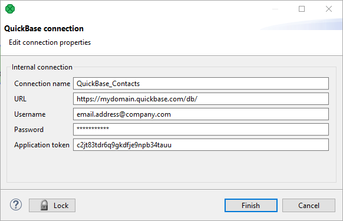
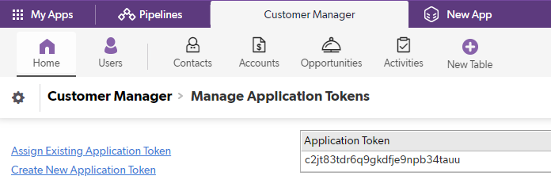

<!-- Development > Job elements > Connections > QuickBase connections -->

### QuickBase connections

To work with a QuickBase database, use the QuickBase connection wizard to define connection parameters first.

*Figure 257. QuickBase connection Dialog*

Give a name to the connection (**Connection name**) and select the proper URL. By default, your QuickBase database allows only SSL access via API.

The **URL** should have the following format, note the trailing slash: `https://mydomain.quickbase.com/db/`

The **Username** can be an *email*`"email.address@company.com"`. The required **Password** relates to the user account.

**Application token** is a string of characters that can be created and assigned to the database. Tokens make it all but impossible for an unauthorized person to connect to your database. See *[https://help.quickbase.com/user-assistance/app_tokens.html#createtoken](https://help.quickbase.com/user-assistance/app_tokens.html#createtoken)* to find out how to obtain an application token.

*Figure 258. Obtaining Application Token*
