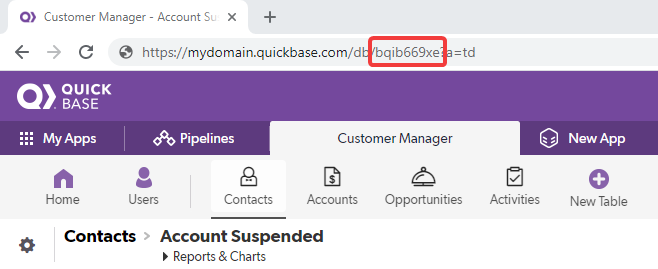

<!-- Development > Component reference > Writers > QuickBaseRecordWriter -->

### QuickBaseRecordWriter

| [Short description](quickbaserecordwriter.md#short-description) |
| --- |
| [Ports](quickbaserecordwriter.md#ports) |
| [Metadata](quickbaserecordwriter.md#metadata) |
| [QuickBaseRecordWriter attributes](quickbaserecordwriter.md#quickbaserecordwriter-attributes) |
| [Details](quickbaserecordwriter.md#details) |
| [See also](quickbaserecordwriter.md#see-also) |

#### Short description

**QuickBaseRecordWriter** writes data into a **QuickBase** online database.

| Data output | Input ports | Output ports | Transformation | Transf. required | Java | CTL | Auto-propagated metadata |
| --- | --- | --- | --- | --- | --- | --- | --- |
| QuickBase | 1 | 0-1 | **⨯** | **⨯** | **⨯** | **⨯** | **⨯** |

#### Ports

| Port type | Number | Required | Description | Metadata |
| --- | --- | --- | --- | --- |
| Input | 0 | **✓** | for input data records | any |
| Output | 0 | **⨯** | for rejected data records | Input metadata enriched by up to two [Error fields for QuickBaseRecordWriter](quickbaserecordwriter.md#quickbaserecordwriter-error-fields) |

#### Metadata

**QuickBaseRecordWriter** does not propagate metadata.

| Field number | Field name | Data type | Description |
| --- | --- | --- | --- |
| optional[[1]](quickbaserecordwriter.md#opt) | Specified in the **error code output field**. | integer \| long | Error code |
| optional[[1]](quickbaserecordwriter.md#opt) | Specified in the **error message output field**. | string | Error message |

| 1 | The error fields must be placed behind the input fields. |
| --- | --- |

#### QuickBaseRecordWriter attributes

| Attribute | Req | Description | Possible values |
| --- | --- | --- | --- |
| Basic |  |  |  |
| QuickBase connection | **✓** | ID of the connection to the QuickBase online database, see [QuickBase connections](quickbase-connections.md). |  |
| Table ID | **✓** | The ID of the table in the QuickBase application data records are to be written into. Select a table in the QuickBase UI and copy the table ID from the browser URL: `https://mydomain.quickbase.com/db/TABLE_ID`. | e.g. `bqib669xe` |
| Mapping | **✓** | A list of database table *field_id*s separated by a semicolon the metadata field values are to be written to. |  |
| Error code output field |  | The name of the field the error code will be stored in, see [Error fields for QuickBaseRecordWriter](quickbaserecordwriter.md#quickbaserecordwriter-error-fields). |  |
| Error message output field |  | The name of the field the error message will be stored in, see [Error fields for QuickBaseRecordWriter](quickbaserecordwriter.md#quickbaserecordwriter-error-fields). |  |

*Figure 382. Obtaining Table ID*

#### Details

**QuickBaseRecordWriter** receives data records through the input port and writes them to a **QuickBase** online database.

This component wraps the `API_AddRecord` HTTP interaction (*[http://www.quickbase.com/api-guide/add_record.html](http://www.quickbase.com/api-guide/add_record.html)*).

If the optional output port is connected, rejected records along with the information about the error are sent out through it.

#### See also

| [QuickBaseRecordReader](quickbaserecordreader.md) |
| --- |
| [Common properties of components](components.md#common-properties-of-components) |
| [Specific attribute types](components.md#specific-attribute-types) |
| [Common properties of Writers](common-of-writers.md) |
| [Writers comparison](common-of-writers.md#writers-comparison) |
