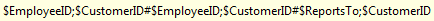
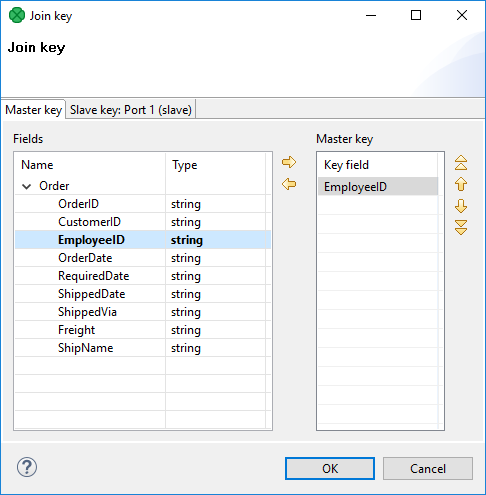
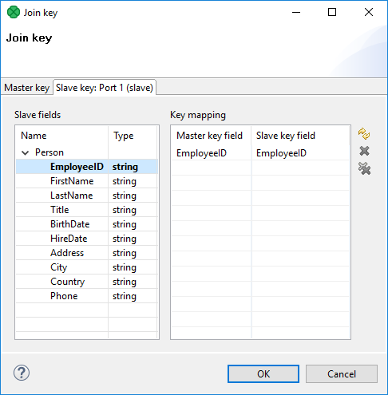

<!-- Development > Component reference > Joiners > RelationalJoin -->

### RelationalJoin


| [Short description](relationaljoin.md#short-description) |
| --- |
| [Ports](relationaljoin.md#ports) |
| [Metadata](relationaljoin.md#metadata) |
| [RelationalJoin attributes](relationaljoin.md#relationaljoin-attributes) |
| [Details](relationaljoin.md#details) |
| [Best practices](relationaljoin.md#best-practices) |
| [See also](relationaljoin.md#see-also) |

#### Short description

Joiner that merges sorted data from two or more data sources on a common key whose values must differ in these data sources.

| Same input metadata | Sorted inputs | Slave inputs | Outputs | Output for drivers without slave | Output for slaves without driver | Joining based on equality | Auto-propagated metadata |
| --- | --- | --- | --- | --- | --- | --- | --- |
| **⨯** | **✓** | 1 | 1 | **⨯** | **⨯** | **⨯** | **⨯** |

#### Metadata

**RelationalJoin** does not propagate metadata.

**RelationalJoin** has no metadata template.

#### Ports

**RelationalJoin** receives data through two input ports, each of which may have a distinct metadata structure.

The joined data is then sent to the single output port.

| Port type | Number | Required | Description | Metadata |
| --- | --- | --- | --- | --- |
| Input | 0 | **✓** | Master input port | Any |
| 1 | **✓** | Slave input port | Any |  |
| Output | 0 | **✓** | Output port for the joined data | Any |

#### RelationalJoin attributes

| Attribute | Req | Description | Possible values |
| --- | --- | --- | --- |
| Basic |  |  |  |
| Join key | yes | Key according to which the incoming data flows are joined. See [Join key](relationaljoin.md#join-key). |  |
| Join relation | yes | Defines the way of joining driver (master) and slave records. See [Join relation](relationaljoin.md#join-relation). | `master != slave` \| `master(D) < slave(D)` \| `master(D) <= slave(D)` \| `master(A) > slave(A)` \| `master(A) >= slave(A)` |
| Join type |  | The type of a join. See [Join types](join-types.md). | Inner (default) \| Left outer \| Full outer |
| Transform | [[1]](relationaljoin.md#relationaljoin-attributes-fn01) | A transformation in CTL or Java defined in the graph. |  |
| Transform URL | [[1]](relationaljoin.md#relationaljoin-attributes-fn01) | An external file defining the transformation in CTL or Java. |  |
| Transform class | [[1]](relationaljoin.md#relationaljoin-attributes-fn01) | External transformation class. |  |
| Transform source charset |  | Encoding of the external file defining the transformation.  The default encoding depends on DEFAULT_SOURCE_CODE_CHARSET in defaultProperties. | E.g. UTF-8 |

| 1 |  One of these must be set. These transformation attributes must be specified. Any of these transformation attributes must use a common CTL template for **Joiners** or implement a `RecordTransform` interface. |
| --- | --- |

For more information, see [CTL scripting specifics](relationaljoin.md#ctl-scripting-specifics) or [Java interfaces](relationaljoin.md#java-interfaces).

For detailed information about transformations, see also [Defining transformations](transformations.md#defining-transformations).

#### Details

This is a joiner usable in situations when data records with different field values should be joined. It requires the input to be sorted and is very fast as it is processed in memory.

The data attached to the first input port is called the **master** as it is also in the other **Joiners**. The other connected input port is called **slave**. Each master record is matched to all slave records on one or more fields known as a join key. The slave records whose values of this join key do not equal to their slave counterparts are joined together with such slaves. The output is produced by applying a transformation that maps joined inputs to the output.

All slave input data is stored in memory; however, the master data is not. Therefore you only need to consider the size of your slave data for memory requirements.

##### Join key

You must define the key that should be used to join the records (**Join key**). The records on the input ports must be sorted according to the corresponding parts of the **Join key** attribute. You can define the **Join key** in the **Join key** wizard.

The **Join key** attribute is a sequence of individual key expressions for the master and all of the slaves separated from each other by a hash. Order of these expressions must correspond to the order of the input ports starting with a master and continuing with slaves. Driver (master) key is a sequence of driver (master) field names (each of them should be preceded by a dollar sign) separated by a colon, semicolon or pipe. Each slave key is a sequence of slave field names (each of them should be preceded by a dollar sign) separated by a colon, semicolon, or pipe.


*Figure 421. An example of the Join Key attribute in the RelationalJoin component*

You can use this **Join key** wizard. When you click the **Join key** attribute row, a button appears there. By clicking this button you can open the mentioned wizard.

In it, you can see the tab for the driver (**Master key** tab) and the tabs for all of the slave input ports (**Slave key** tabs).


*Figure 422. Join Key Wizard (Master Key tab)*

In the driver tab, there are two panes. The **Fields** pane on the left and the **Master key** pane on the right. You need to select the driver expression by selecting the fields in the **Fields** pane on the left and moving them to the **Master key** pane on the right with the help of the **Right arrow** button. To the selected **Master key** fields, the same number of fields should be mapped within each slave. Thus, the number of key fields is the same for all input ports (both the master and each slave). In addition, driver (Master) key must be common for all slaves.


*Figure 423. Join key wizard (Slave Key tab)*

In each of the slave tab(s) there are two panes. The **Fields** pane on the left and the **Key mapping** pane on the right. In the left pane you can see the list of the slave field names. In the right pane you can see two columns: **Master key field** and **Slave key field**. The left column contains the selected field names of the driver input port. If you want to map a driver field to slave field, select the slave field in the left pane by clicking its item, push the left mouse button, drag to the **Slave key field** column in the right pane and release the button. The same must be done for each slave. Note that you can also use the **Auto mapping** button or other buttons in each tab.
Example 398. Join key for RelationalJoin

```ctl
$first_name;$last_name#$fname;$lname#$f_name;$l_name
```

Following is a part of **Join key** for the master data source (input port 0):

`$first_name=$fname;$last_name=$lname`.

- Thus, these fields are joined with the two fields from the first slave data source (input port 1):
  `$fname` and `$lname`, respectively.
- And these fields are also joined with the two fields from the second slave data source (input port 2):
  `$f_name` and `$l_name`, respectively.

##### Join relation

- If both input ports receive data records that are sorted in descending order, slave data records that are greater than or equal to the driver (master) data records are the only ones that are joined with driver data records and sent out through the output port. Corresponding **Join relation** is one of the following two: `master(D) < slave (D)` (slaves are greater than master) or `master(D) <= slave(D)` (slaves are greater than or equal to master).
- If both input ports receive data records that are sorted in ascending order, slave data records that are less than or equal to the driver (master) data records are the only ones that are joined with driver data records and sent out through the output port. Corresponding **Join relation** is one of the following two: `master(A) > slave (A)` (slaves are less than driver) or `master(A) >= slave(A)` (slaves are less than or equal to driver).
- If both input ports receive data records that are unsorted, slave data records that differ from the driver (master) data records are the only ones that are joined with driver data records and sent out through the output port. Corresponding **Join relation** is the following: `master != slave` (slaves are different from driver).
- Any other combination of sorted order and **Join relation** causes the graph fail.

#### CTL scripting specifics

When you define your join attributes, you must specify a transformation that maps fields from input data sources to the output. This can be done using the **Transformations** tab of the **Transform Editor**. However, you may find that you are unable to specify more advanced transformations using this easiest approach. In such a case, you need to use CTL scripting.

For detailed information about **CloverDX** Transformation Language, see [CTL2 - CloverDX Transformation Language](part6.md). (CTL is a full-fledged, yet simple language that allows you to perform almost any imaginable transformation.)

CTL scripting allows you to specify a custom field mapping using the simple CTL scripting language.

All **Joiners** share the same transformation template which can be found in [CTL templates for Joiners](ctl-templates-for-joiners.md).

#### Java interfaces

If you define your transformation in Java, it must implement the following interface that is common for all **Joiners**:

[Java interfaces for Joiners](java-interfaces-for-joiners.md)

See [Public CloverDX API](genericcomponent.md#public-cloverdx-api).

#### Best practices

If the transformation is specified in an external file (with **Transform URL**), we recommend users to explicitly specify **Transform source charset**.

#### See also

| [Common properties of components](components.md#common-properties-of-components) |
| --- |
| [Specific attribute types](components.md#specific-attribute-types) |
| [Common properties of Joiners](common-of-joiners.md) |
| [Joiners comparison](common-of-joiners.md#joiners-comparison) |
