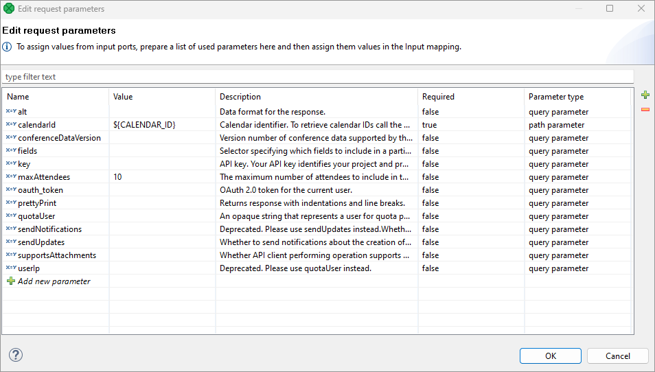
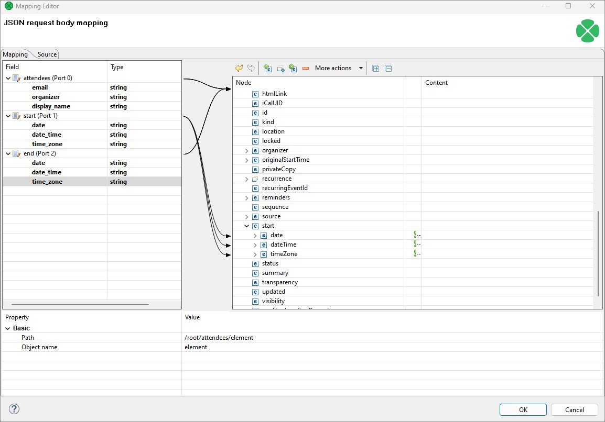
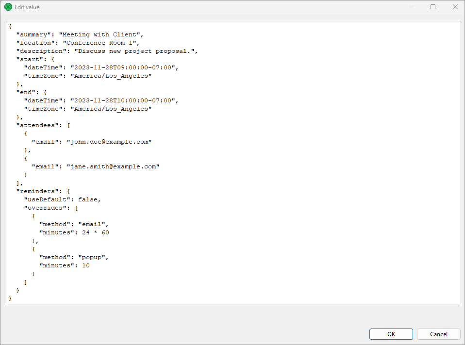
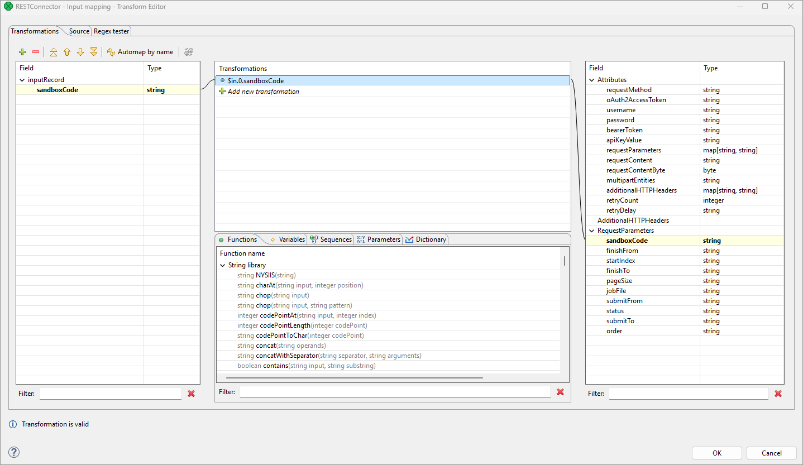
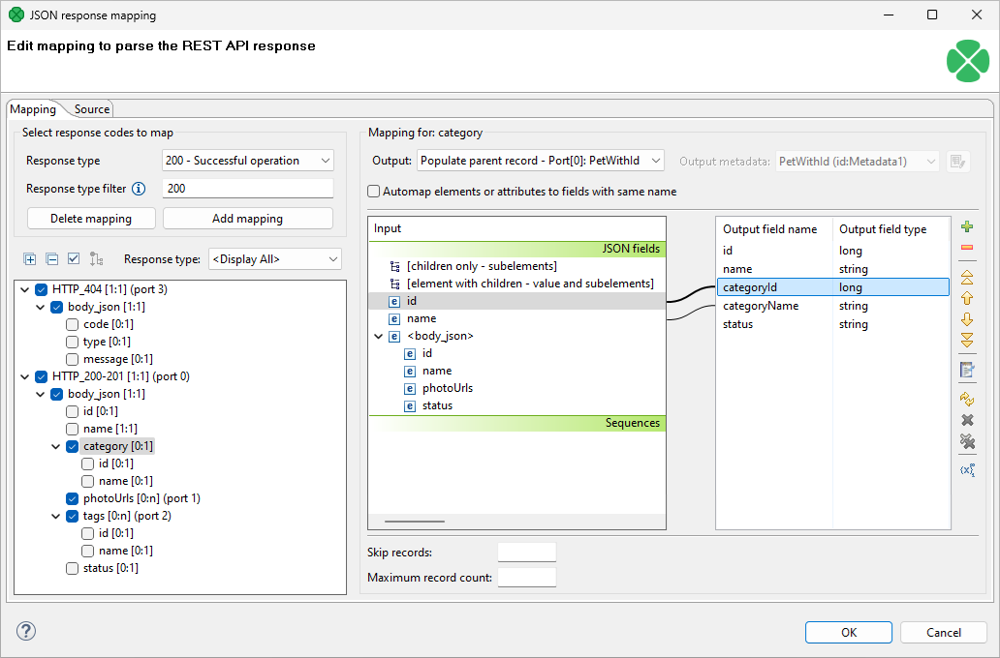
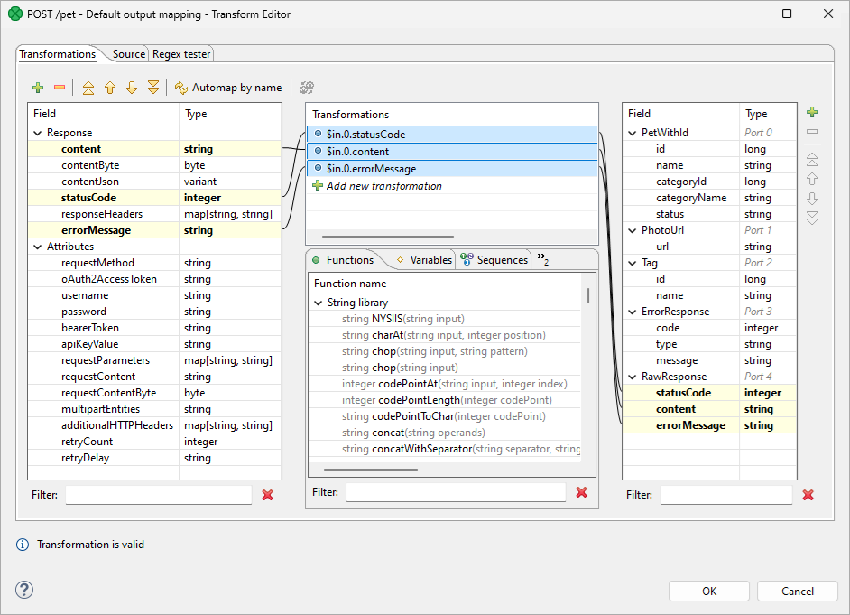

<!-- Development > Component reference > Others > RESTConnector -->

### RESTConnector


| [Short description](restconnector.md#short-description) |
| --- |
| [Ports](restconnector.md#ports) |
| [Metadata](restconnector.md#metadata) |
| [RESTConnector attributes](restconnector.md#restconnector-attributes) |
| [Details](restconnector.md#details) |
| [Best practices](restconnector.md#best-practices) |
| [Compatibility](restconnector.md#compatibility) |
| [See also](restconnector.md#see-also) |

#### Short description

The **RESTConnector** component is designed to streamline the integration of REST APIs into CloverDX workflows. By leveraging OpenAPI specifications (OpenAPI documentation versions 2.x and 3.x.x in both JSON and YAML formats), this component pre-loads as many settings as possible directly from the API specification, reducing the amount of setup required. With its user-friendly interface and flexible configuration options, the RESTConnector enhances workflow efficiency and simplifies interactions with complex APIs, empowering users to work more effectively. For an example graph demonstrating the usage of the RESTConnector, please refer to our [Tech Blog](https://www.cloverdx.com/tech-blog/tag/RESTConnector).

The **RESTConnector** can be used without an OpenAPI specification, but this then requires manual configuration of all settings. This approach may reduce efficiency and hinder the overall user experience of the component.

| Same input metadata | Sorted inputs | Inputs | Outputs | Each to all outputs | Java | CTL | Auto-propagated metadata |
| --- | --- | --- | --- | --- | --- | --- | --- |
| - | **⨯** | 0-n | 0-n | - | **⨯** | **⨯** | **x** |

#### Ports

| Port type | Number | Required | Description | Metadata |
| --- | --- | --- | --- | --- |
| Input | 0-n | **⨯** | Data to build request content and set component attributes | Any |
| Output | 0-n | **⨯** | Parsed response content, status code, component attributes, …​ | Any |

#### Metadata

**RESTConnector** does not propagate metadata.

#### RESTConnector attributes

| Attribute | Req | Description | Possible values |
| --- | --- | --- | --- |
| **Connection** |  |  |  |
| OpenAPI URL |  | URL to the OpenAPI specification. The URL can point to a remote file (e.g., via HTTP or HTTPS protocols) as well as a local file (e.g., a file in sandbox). OpenAPI documentation version 3.x.x in both JSON and YAML formats is supported. |  |
| API root URL |  | Provide the root address of the target API - the address that will be called for each API invocation. |  |
| Endpoint |  | Select an endpoint from the pre-defined list. |  |
| Request method |  | Method of request. The method is populated based on the selected endpoint. | GET (default) \| POST \| PUT \| PATCH \| DELETE \| HEAD \| OPTIONS \| TRACE |
| Request/response charset |  | Character encoding of the input/output records. The default encoding depends on `DEFAULT_CHARSET_DECODER` in `defaultProperties`. | UTF-8 \| other encoding |
| **Authentication** |  |  |  |
| OAuth2 connection |  | Create and authorize a new OAuth2 connection or link an existing authorized connection. |  |
| Username (HTTP Basic) |  | The username for accessing the REST API via HTTP Basic authentication. Only configure this when using HTTP Basic authentication. |  |
| Password (HTTP Basic) |  | The password to use when HTTP Basic authentication is needed. Only configure this when using HTTP Basic authentication. |  |
| Bearer token |  | You can specify a bearer token by:  - Creating or linking a **parameter**: use the three dots button at the end of the field to access the Parameters editor. It is recommended to use a secure parameter for this purpose. - Creating a **constant** by manually typing it in. - Using the [Input mapping](restconnector.md#restconn-input-mapping) to map it to the related attribute. |  |
| API key value |  | You can specify an API key value by:  - Creating or linking a **parameter**: use the three dots button at the end of the field to access the Parameters editor. It is recommended to use a secure parameter for this purpose. - Creating a **constant** by manually typing it in. - Using the [Input mapping](restconnector.md#restconn-input-mapping) to map it to the related attribute. |  |
| API key location |  | Select the location where the API key should be sent during each call: `header` or `query`. | header \| query |
| API key parameter name |  | Specify the name of the header or query parameter to be used for the API key. |  |
| **Request** |  |  |  |
| Request parameters |  | Request parameters are automatically loaded when the selected endpoint provides them. You can assign parameter values in the *Edit request parameters* editor (accessed via the three dots) by creating a parameter reference or setting a static value. You can also map incoming records using [Input mapping](restconnector.md#restconn-input-mapping). |  |
| JSON request body mapping |  | When your endpoint requires a JSON object or array in the request body, you can map input records to the corresponding structure within the *Mapping Editor* (accessed via the three dots). The editor displays the expected JSON structure on the right side and the available input fields on the left side. You can drag and drop input fields onto the appropriate nodes within the JSON structure to define the mapping. Depending on the type of JSON request body (object or array), additional configuration might be necessary:  - **For JSON object bodies**: When working with multiple input ports, you’ll typically also need to set the [Max records per request](restconnector.md#restconn-max-records) value to '1'. This ensures that all input data is combined into a single JSON object, aligning with the expected structure. - **For JSON array bodies**: You can generally set the [Max records per request](restconnector.md#restconn-max-records) to any value, as the mapping will handle the creation of an array of JSON objects based on the input data. |  |
| Static request body |  | To set a static request body, enter the full body contents in the format your API endpoint expects. You can reference parameters within the body to dynamically populate values. |  |
| Input file URL |  | A URL of a file from which a single HTTP request body is read. See [URL File Dialog](common-dialogs.md#url-file-dialog). |  |
| Max records per request |  | The maximum number of records sent per one request. See [JSON request body mapping](restconnector.md#restconn-json-req-mapping) above for more information. |  |
| Multipart entities |  | Fields that should be added as multipart entities to a POST request. The field name is used as the entity name. A semicolon-separated list of input fields is expected. |  |
| Input mapping |  | Use *Input mapping* to dynamically set request parameters or other attributes to values from incoming records, parameters, or dictionary entries. You can also use CTL functions to modify these values. Fields from input ports are only available when:  - [*JSON request body mapping*](restconnector.md#restconn-json-req-mapping) is left blank. - [*JSON request body mapping*](restconnector.md#restconn-json-req-mapping) is filled in and the [Max records per request value](restconnector.md#restconn-max-records) is set to 1.  Note that this mapping only allows you to access data from a single input port - the "driver" port that maps to the highest level of your request or port 0 if this cannot be determined by the component. |  |
| HTTP headers |  | HTTP header parameters are automatically loaded when the selected endpoint provides their specification. You can add any additional headers manually as needed. |  |
| Input record sorting |  | Used for [JSON request body mapping](restconnector.md#restconn-json-resp-map) to optimize efficiency and avoid caching by leveraging input record ordering. Configure the sort keys for each input port on separate tabs and ensure that the incoming data is pre-sorted based on these keys. For more details, see [Sort key](components.md#sort-key). |  |
| **Response** |  |  |  |
| JSON response mapping |  | Allows you to visually configure parsing logic for the response provided by the API. The mapping allows you to parse even complex responses into multiple ports and also allows you to work with input ports and headers. The mapping can be defined for each HTTP status code or for groups of status code. This allows you to define separate mappings for different success responses as well as failure responses.  This mapping can be used in conjunction with **Default output and error mapping**.  The mapping lookup logic works as follows:  - If the returned HTTP code matches an entry in the *JSON response mapping*, use the mapping to parse the response and route it appropriately. - If the returned HTTP code does not match an entry in the *JSON response mapping*:   - If *Default output and error mapping* is defined, use it to process the response.   - If *Default output and error mapping* is not defined:     - If a HTTP 2xx response is returned, the call is treated as a success.     - If a HTTP ≥300 response is returned, the component fails. |  |
| Default output and error mapping |  | A general-purpose mapping that is applied when no specific [JSON response mapping](restconnector.md#restconn-json-resp-map) is defined or when the response code doesn’t match any defined mapping. It can be used in conjunction with JSON response mapping to provide flexibility in handling various API responses. |  |
| Output file URL |  | A URL of a file to which an HTTP response is written. See [URL File Dialog](common-dialogs.md#url-file-dialog). If an exception occurs during the execution of the component, it is also written to the file. The output files are not deleted automatically and must be removed manually or as a part of the transformation. |  |
| Pagination |  | Allows you to retrieve and process long list of results page by page. Pagination must be supported by the server. See [Pagination](restconnector.md#pagination) for more information. | No pagination (default), Offset and limit pagination, Page-based pagination, Token-based pagination |
| **Error handling** |  |  |  |
| Retry count |  | How many times should the component retry a request in the case of a failure. The retry count specifies the number of times the component will attempt to re-send a failed request. A failure is considered to occur when the component encounters an error processing the request or response, such as an IOException. This does not include cases where the API returns an error status code (e.g., 500). | 0 (default) |
| Retry delay |  | Specifies the time intervals between retry attempts. It is a comma-separated list of integers, where each integer represents the delay time in seconds for the corresponding retry. For example, a delay of `2, 5, 10` means the component will wait 2 seconds for the first retry, 5 seconds for the second, and 10 seconds for subsequent retries. If the number of retries exceeds the number of specified delays, the last delay in the list will be used for all subsequent retries. | 0 (default) |
| Rate limit: time interval |  | Limits the number of allowed requests defined by the **Rate limit: max results** property per time period (*seconds, minutes, hours, days*). When a limit is set and reached, the component waits until the defined time interval passes to continue sending requests. | 1s (default), 1m, 1h, 1d |
| Rate limit: max requests |  | Limits the total number of requests per time period defined by the **Rate limit: time interval** property. By default, the number of requests is unlimited. When a limit is set and reached, the component waits until the defined time interval passes to continue sending requests. |  |
| Debug print |  | When enabled, API calls and their corresponding responses will be logged to the execution log file. Use this feature with caution, as logging large amounts of data can significantly increase the size of the log file. | false (default) \| true |

#### Details

##### Request parameters

Request parameters can be mapped using a parameter reference or a constant value.


*Figure 443. Request parameters example*

##### JSON request body mapping

JSON request body mapping is used to map incoming records into body parameters. It must be populated when using multiple input ports.


*Figure 444. JSON request body mapping example*

##### Static request body

Example of a static request body - you can use parameter references instead of static values. Note that Static request body cannot be combined with JSON request body mapping.


*Figure 445. Static request body example*

##### Input mapping

You can use Input mapping to map input records to request parameters or other attributes. Note that fields from input ports are only accessible in the editor under specific conditions:

- When the [JSON request body mapping](restconnector.md#restconn-json-req-mapping) is left entirely blank.
- When the [JSON request body mapping](restconnector.md#restconn-json-req-mapping) is defined, but the 'Max records per request' value is set to 1.

It’s also important to note that this mapping operates linearly, meaning it can only utilize fields from a single input port. This port is determined as follows: If a JSON request body mapping is defined at the highest level, the input port associated with that mapping will be used. Otherwise, the first mapped input port (port 0) will be utilized.


*Figure 446. Example input mapping*

##### JSON response mapping

This is the primary way of parsing data from API responses. This mapping allows you to visually map and process complex API responses based on the response schemas provided in the OpenAPI specification. The mapping allows you to parse each response type with its own mapping ensuring that the data you need is sent to correct output ports.

The response types are distinguished based on their HTTP response code - i.e., you can map success response 200 in a different way than failure (HTTP 400) etc.

To specify the mappings, start in the *Select response codes to map* panel in the upper-left corner of the *Mapping* tab. This panel allows you to add mappings for different response codes as defined in the OpenAPI specification for the API you are calling. Start with the *Response type* and work your way down to fill in additional details to create the mapping.

- **Response type** is the type of the response that is associated with specific status code (e.g., 200 for success, 404 for "not found" etc.). This corresponds to part of the OpenAPI schema located at `… / responses / <response type> / content / "application/json" / schema`. The dropdown will list all response types provided by the API specification. Usually, you will see a success response here (e.g., "200" or even notation like "2XX") as well as error responses (e.g., "404", "4XX", etc.)
- **Response type filter** allows you to specify a more detailed *filter* for the HTTP status codes. The mapping will then apply only to responses matching this filter. The filter can list specific codes one by one as a comma-separated list (e.g., "200,201,202") as well as ranges with a dash (e.g., "200-203"). These can be combined to allow you to easily list as many status codes in a single filter as needed.
  By default, the filter corresponds to the *Response type* (e.g. *Response type* "4xx" corresponds to filter "400-499"). You can modify the filter to exclude status codes or include additional ones as needed.
  This can be useful even in cases where the OpenAPI is not exact - for example, OpenAPI provides response code as 200 but the actual response is 201. In such case, you can change the filter to be "200,201".
  Similarly, for error handling it is common to use one schema for many errors, so you can write the filter as e.g., "400-499" to cover all statuses in the 4XX range.

When the API response is parsed, the more specific codes are preferred instead of the ranges. For example, consider two mappings one of which is for "400-499", and the other one is for "404". This will effectively behave as if you wrote the mappings as "400-403,405-499" and "404". This approach allows you to easily cover many status codes while specifically cherry-picking the interesting ones that need to be handled differently.

Each mapping can extract data from the response (both response body and headers, if OpenAPI specifies some) to multiple output ports. This works just like the mapping in the [JSONExtract component](jsonextract.md#mapping-input-fields-to-the-output-fields). As an example, the following screenshot shows mapping of [Petstore API](https://petstore3.swagger.io/?filter=pet) and maps responses to four different ports. Ports are shown in the mapping tree just after the filter - so "HTTP_404 [1:1] (port 3)" means that response with status code 404 will be mapped to port 3 (and it is a 1:1 mapping of a single entity). The mapping maps the response like this:

1. Valid pets (status codes 200 or 201) are mapped to port 0.
2. Their photo URLs are sent to port 1.
3. Their tags are sent to port 2.
4. The 404 responses are mapped to port 3.


*Figure 447. Example JSON response mapping*

In this example, status codes different from 200, 201, or 404 will not be matched and therefore the [Default output and error mapping](restconnector.md#default-output-and-error-mapping) will be used instead.

##### Default output and error mapping

The *Default output and error mapping* is used whenever the response type (as defined by its status code) is not covered by any filters in the [JSON response mapping](restconnector.md#json-response-mapping). This allows you to map the complex and interesting responses in a simple, visual way via the *JSON response mapping* and handle all the other cases (even unknown responses and errors) with the *Default output and error mapping*.

*Default output and error mapping* is specified as a transformation that allows you to use CTL and provides access to the response, its HTTP status code and even **headers** or component attributes. This gives you the ability to process all parts of the response as needed.

The *Default output and error mapping* will also apply in cases where the API call failed on the network level or due to other runtime error - e.g., target server was not found, the call timed out and so on. In such cases, the `errorMessage` field will provide additional information about the failure. This is similar to the approach used in [HTTPConnector’s output mapping](httpconnector.html#id_httpcon_outputmapping_desc).

The following example sends all responses (not covered by the *JSON response mapping*, see its example) to port 4:


*Figure 448. Example default output and error mapping*

If the *Default output and error mapping* is not defined and a response has status code ≥ 300 or if an error is encountered when calling the API, the component will fail and the error message will be written to the graph log.

##### Pagination

When the list of results is potentially long (such as a list of payments), the API usually does not return all items at once but splits them into pages instead. The **RESTConnector can load paginated results automatically, provided the responses are JSON-encoded.**

Pagination methods vary by API. **Consult your specific API documentation to determine its pagination type.** Once you have identified the type, select the corresponding option from the list and populate the required configuration fields with the appropriate values from your API documentation.

The RESTConnector component supports 3 pagination types:

- [**Offset and limit pagination**](restconnector.md#offset-and-limit-pagination) - For example, *“Return 50 results, starting from result number 150.”*
- [**Page-based pagination**](restconnector.md#page-based-pagination) - For example, *“Split the results into pages of 50 records and return the 4th page.”*
- [**Token-based pagination**](restconnector.md#token-based-pagination) - *“Return the next page of results based on the token supplied in the previous response.”*

###### Offset and limit pagination

This pagination type uses a **numeric page offset** to navigate through paginated results. The offset specifies the starting point for the next page of data. The RESTConnector keeps loading pages until it either receives an empty page or reaches the defined maximum number of requests.
Example pagination configuration in RESTConnector
To demonstrate how to configure this pagination type, we’ll use our **[CloverDX Server REST API v1](https://doc.cloverdx.com/latest/operations/rest-api.html)**. The configuration below starts at the very beginning (`Initial page offset`) and loads up to 100 pages (`Maximum number of requests`), each containing 50 items (`Page size (limit)`). In total, this retrieves up to 5,000 items.

| Parameter | Value |
| --- | --- |
| Page size parameter | `pageSize` |
| Page size (limit) | `50` |
| Page offset parameter | `startIndex` |
| Initial page offset | `0` |
| Response data path[[1]](restconnector.md#pagination-fn-01) | `members` |
| Maximum number of requests | `100` |

| 1 | A dot-delimited path to the JSON node that represents the actual data in the response body. This is used to detect whether the response page is empty. |
| --- | --- |
Example API calls
The RESTConnector will sequentially perform the following API calls:

*https://localhost:8083/clover/api/rest/v1/executions?**pageSize**=**50**&**startIndex**=**0***
*https://localhost:8083/clover/api/rest/v1/executions?**pageSize**=**50**&**startIndex**=**50***
*https://localhost:8083/clover/api/rest/v1/executions?**pageSize**=**50**&**startIndex**=**100***
*https://localhost:8083/clover/api/rest/v1/executions?**pageSize**=**50**&**startIndex**=**150***
*...*
Example API response (first page)

```
{
    "@self": "http://localhost:8081/clover/api/rest/v1/executions",
    "@type": "ExecutionCollection",
    "@totalItems": 1984,
    "@startIndex": 0,
    "@pageItems": 50,
    "members": [
        {
            "@self": "http://localhost:8081/clover/api/rest/v1/executions/117228",
            "@type": "Execution",
            "sandboxCode": "testsandbox",
            "jobFile": "graph/simpleGraph.grf",
            ...
        },
        ... 49 other items ...
    ]
}
```

###### Page-based pagination

This pagination type is similar to the offset-based pagination. It uses a **page number** to navigate through paginated results. The page number identifies the specific page of data to be retrieved. The RESTConnector keeps loading pages until it either obtains an empty page or reaches the maximum number of requests.
Example pagination configuration in RESTConnector
To demonstrate how to configure this pagination type, we’ll use [**GitHub API**](https://docs.github.com/en/rest/using-the-rest-api/using-pagination-in-the-rest-api?apiVersion=2022-11-28). The configuration below starts at the very beginning (`Initial page number`) and loads up to 100 pages (`Maximum number of requests`), each containing 50 items. In total, this retrieves up to 5,000 items.

| Parameter | Value |
| --- | --- |
| Page size parameter | `per_page` |
| Page size (limit) | `50` |
| Page number parameter | `page` |
| Initial page number | `1` |
| Response data path[[2]](restconnector.md#pagination-fn-02) | *empty* – the data array is not wrapped in any object |
| Maximum number of requests | `100` |

| 2 | A dot-delimited path to the JSON node that represents the actual data in the response body. This is used to detect whether the response page is empty. |
| --- | --- |
Example API calls
The RESTConnector will sequentially perform the following API calls:

*https://api.github.com/repositories/1300192/issues?**per_page=50**&**page**=**1***
*https://api.github.com/repositories/1300192/issues?**per_page=50**&**page**=**2***
*https://api.github.com/repositories/1300192/issues?**per_page=50**&**page**=**3***
*...*
Example API response

```
[
    {
        "url": "https://api.github.com/repos/octocat/Spoon-Knife/issues/36613",
        "repository_url": "https://api.github.com/repos/octocat/Spoon-Knife",
        "labels_url": "https://api.github.com/repos/octocat/Spoon-Knife/issues/36613/labels{/name}",
        "comments_url": "https://api.github.com/repos/octocat/Spoon-Knife/issues/36613/comments",
        "events_url": "https://api.github.com/repos/octocat/Spoon-Knife/issues/36613/events",
        "html_url": "https://github.com/octocat/Spoon-Knife/pull/36613",
        "id": 3090835481,
        "node_id": "PR_kwDOABPW4M6XnoP4",
        "number": 36613,
        "title": "Add feature.txt in feature branch",
        ... other fields ...
    },
    ... 49 other items ...
]
```

###### Token-based pagination

This pagination type uses a unique token provided by the server to navigate through paginated results. The token identifies the next page of data; the last page contains no token.
Example pagination configuration in RESTConnector
To demonstrate how to configure this pagination type, we’ll use [**X API v2**](https://developer.x.com/en/docs/x-api/pagination). The configuration below loads 50 items per page (`Page size (limit)`) and does not limit the total number of requests.

| Parameter | Value |
| --- | --- |
| Page size parameter | `max_results` |
| Page size (limit) | `50` |
| Page token parameter | `pagination_token` |
| Next page token path | `meta.next_token` |
| Maximum number of requests |  |
Example API calls
The RESTConnector will sequentially perform the following API calls:

*https://api.x.com/2/users/2244994945/tweets?tweet.fields=created_at&**max_results**=**50***
*https://api.x.com/2/users/2244994945/tweets?tweet.fields=created_at&**max_results**=**50**&**pagination_token**=**7140w***
*https://api.x.com/2/users/2244994945/tweets?tweet.fields=created_at&**max_results**=**50**&**pagination_token**=**7140k9***
 ...
Example API response

```
{
    "data": [
        {
            "created_at": "2020-12-11T20:44:52.000Z",
            "id": "1337498609819021312",
            "text": "Thanks to everyone who tuned in today..."
        },
        ... 49 other items ...
    ],
    "meta": {
        "oldest_id": "1258085245091368960",
        "newest_id": "1337498609819021312",
        "result_count": 50,
        "next_token": "7140w"
    }
}
```

#### Best practices

When configuring the RESTConnector, populate attributes from top to bottom. This sequential order ensures proper utilization of default values and streamlines the configuration process. By providing the OpenAPI URL first, the connector automatically loads available endpoints from the specification. Selecting an endpoint then triggers the automatic population of related parameters, data types, and other relevant information. This significantly simplifies subsequent steps like parameter mapping, request/response handling, and error handling, as many configuration options are pre-populated based on the selected endpoint. This approach promotes consistency, minimizes errors, and reduces debugging time, ultimately leading to more efficient and reliable integration flows.

#### Compatibility

| Version | Compatibility notice |
| --- | --- |
| 6.7.0 | RESTConnector is available since CloverDX version 6.7. |

#### See also

| [HTTPConnector](httpconnector.html) |
| --- |
| [WebServiceClient](webserviceclient.md) |
| [Others comparison](common-of-others.md#others-comparison) |
| [Common properties of components](components.md#common-properties-of-components) |
| [Specific attribute types](components.md#specific-attribute-types) |
