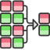
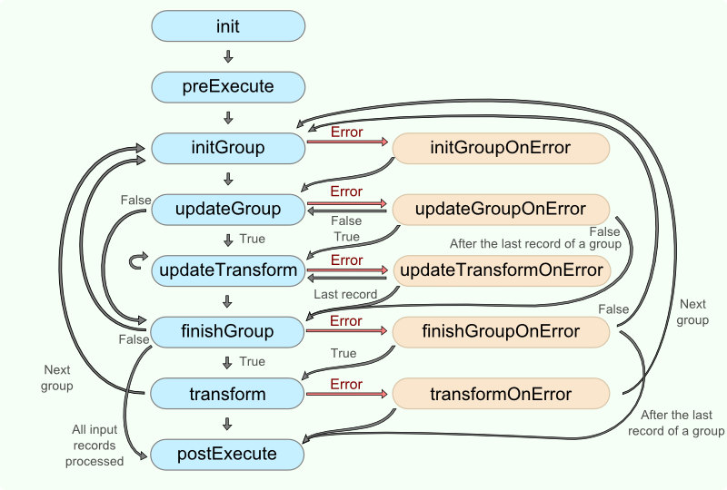
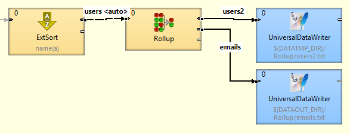

<!-- Development > Component reference > Transformers > Rollup -->

### Rollup



| [Short description](rollup.md#short-description) |
| --- |
| [Ports](rollup.md#ports) |
| [Metadata](rollup.md#metadata) |
| [Rollup attributes](rollup.md#rollup-attributes) |
| [Details](rollup.md#details) |
| [CTL interface](rollup.md#ctl-interface) |
| [Java interface](rollup.md#java-interface) |
| [Examples](rollup.md#examples) |
| [Best practices](rollup.md#best-practices) |
| [See also](rollup.md#see-also) |

#### Short description

**Rollup** creates one or more output records from one or more input records.

**Rollup** receives potentially unsorted data through the single input port, transforms it and creates one or more output records from one or more input records.

The component can send different records to different output ports as specified by the user.

| Same input metadata | Sorted inputs | Inputs | Outputs | Java | CTL | Auto-propagated metadata |
| --- | --- | --- | --- | --- | --- | --- |
| - | **⨯** | 1 | 1-n | **✓** | **✓** | **⨯** |

#### Ports

| Port type | Number | Required | Description | Metadata |
| --- | --- | --- | --- | --- |
| Input | 0 | **✓** | For input data records | Any(In0) |
| Output | 0 | **✓** | For output data records | Any(Out0) |
| 1-N | **⨯** | For output data records | Any(Out1-N) |  |

#### Metadata

**Rollup** does not propagate metadata.

**Rollup** has no metadata template.

Input and output metadata fields can have any data types.

Metadata on output ports can differ.

You may need a metadata for the accumulator record in rollup transformation.

#### Rollup attributes

| Attribute | Req | Description | Possible values |
| --- | --- | --- | --- |
| Basic |  |  |  |
| Group key |  | Key according to which the records are considered to be included into one group. Expressed as a sequence of individual input field names separated from each other by a semicolon. For more information, see [Group key](components.md#group-key).  If not specified, all records are considered to be members of a single group. | e.g. `first_name;last_name;salary` |
| Group accumulator |  | The ID of metadata that serves to create group accumulators. Metadata serves to store values used for transformation of individual groups of data records. | no metadata (default) \| any metadata |
| Transform | [[1]](rollup.md#rollup-attributes-fn01) | Definition of the transformation written in the graph in CTL or Java. |  |
| Transform URL | [[1]](rollup.md#rollup-attributes-fn01) | The name of an external file, including the path, containing the definition of the transformation written in CTL or Java. |  |
| Transform class | [[1]](rollup.md#rollup-attributes-fn01) | The name of an external class defining the transformation. |  |
| Transform source charset |  | Encoding of external file defining the transformation.  The default encoding depends on DEFAULT_SOURCE_CODE_CHARSET in defaultProperties. | E.g. UTF-8 |
| Sorted input |  | By default, records are considered to be sorted. Either in ascending or descending order. Different fields may even have different sort order. If your records are not sorted, switch this attribute to `false`. | true (default) \| false |
| Equal NULL |  | By default, records with null values of key fields are considered to be equal. If set to `false`, they are considered to be different from each other. | true (default) \| false |

| 1 |  One of these must specified. |
| --- | --- |

#### Details

**Rollup** requires transformation. You can define the transformation using CTL (see [CTL interface](rollup.md#ctl-interface)) or Java (see [Java interface](rollup.md#java-interface)).

The flow of function calls in a rollup transformation is depicted below. If any optional function (except functions for error handling) is not used, the position of unimplemented function from diagram is skipped.


*Figure 411. Rollup code workflow*

If you do not define **Group accumulator** metadata, **VoidMetadata** is used in transformation functions.

#### CTL interface

| [CTL templates for Rollup](rollup.md#ctl-templates-for-rollup) |
| --- |
| [Access to input and output fields](rollup.md#access-to-input-and-output-fields) |

The transformation uses a CTL template for **Rollup**, implement a `RecordRollup` interface or inherit from a `DataRecordRollup` superclass. Below is a list of `RecordRollup` interface methods. For detailed information about this interface, see [Java interface](rollup.md#java-interface).

Once you have written your transformation, you can also convert it to Java language code by clicking a corresponding button at the upper right corner of the tab.

You can open the transformation definition as another tab of the graph (in addition to the **Graph** and **Source** tabs of **Graph Editor**) by clicking a corresponding button at the upper right corner of the tab.

##### CTL templates for Rollup

| CTL Template Functions |  |
| --- | --- |
| **void init()** |  |
| Required | No |
| Description | Initialize the component, setup the environment, global variables. |
| Invocation | Called before processing the first record. |
| Returns | `void` |
| **void initGroup(<metadata name> groupAccumulator)** |  |
| Required | yes |
| Input Parameters | `<metadata name> groupAccumulator` (metadata specified by the user)  If `groupAccumulator` is not defined, `VoidMetadata Accumulator` is used in the function signature. |
| Returns | void |
| Invocation | Called repeatedly, once for the first input record of each group.  Called before `updateGroup(groupAccumulator)`. |
| Description | Initializes information for specific group. |
| Example | ```ctl function void initGroup(       companyCustomers groupAccumulator) {    groupAccumulator.count = 0;    groupAccumulator.totalFreight = 0; } ``` |
| **boolean updateGroup(<metadata name> groupAccumulator)** |  |
| Required | yes |
| Input Parameters | `<metadata name> groupAccumulator` (metadata specified by user)  If `groupAccumulator` is not defined, `VoidMetadata Accumulator` is used in the function signature. |
| Returns | `false` (`updateTransform(counter,groupAccumulator)` is not called)  `true` (`updateTransform(counter,groupAccumulator)` is called) |
| Invocation | Called repeatedly (once for each input record of the group, including the first and the last record).  Called after the `initGroup(groupAccumulator)` function has already been called for the whole group. |
| Description | Updates information for specific group.  If `updateGroup()` fails and user has not defined any `updateGroupOnError()`, the whole graph will fail.  If any of the input records causes a failure of the `updateGroup()` function and if user has defined another function (`updateGroupOnError()`), processing continues in this `updateGroupOnError()` at the place where `updateGroup()` failed. The `updateGroup()` passes to the `updateGroupOnError()` error message and stack trace as arguments. |
| Example | ```ctl function boolean updateGroup(companyCustomers groupAccumulator) {    groupAccumulator.count++;    groupAccumulator.totalFreight = groupAccumulator.totalFreight + $in.0.Freight;    return true; } ``` |
| **boolean finishGroup(<metadata name> groupAccumulator)** |  |
| Required | yes |
| Input Parameters | `<metadata name> groupAccumulator` (metadata specified by user)  If `groupAccumulator` is not defined, `VoidMetadata Accumulator` is used in the function signature. |
| Returns | `true` (`transform(counter,groupAccumulator)` is called)  `false` (`transform(counter,groupAccumulator)` is not called) |
| Invocation | Called repeatedly, once for the last input record of each group.  Called after `updateGroup(groupAccumulator)` has already been called for all input records of the group. |
| Description | Finalizes the group information.  If `finishGroup()` fails and no `finishGroupOnError()` is defined, the whole graph will fail.  If any of the input records causes fail of the `finishGroup()` function, and the `finishGroupOnError()` function is defined, processing continues in the `finishGroupOnError()` at the place where `finishGroup()` failed.  The `finishGroup()` passes to the `finishGroupOnError()` error message and stack trace as arguments. |
| Example | ```ctl function boolean finishGroup(companyCustomers groupAccumulator) {    groupAccumulator.avgFreight = groupAccumulator.totalFreight / groupAccumulator.count;    return true; } ``` |
| **integer updateTransform(integer counter, <metadata name> groupAccumulator)** |  |
| Required | yes |
| Input Parameters | `integer counter` (starts from 0, specifies the number of created records. should be terminated as shown in the example below. Function calls end when `SKIP` is returned.) |
| `<metadata name> groupAccumulator` (metadata specified by the user)  If `groupAccumulator` is not defined, `VoidMetadata Accumulator` is used in the function signature. |  |
| Returns | Integer numbers. For more information, see [Return values of transformations](transformations.md#return-values-of-transformations). |
| Invocation | Called repeatedly as specified by user.  Called after `updateGroup(groupAccumulator)` returns `true`.  The function is called until `SKIP` is returned. |
| Description | It creates output records based on individual record information.  If `updateTransform()` fails and no `updateTransformOnError()` is defined, the whole graph will fail.  If any part of the `transform()` function for some output record causes fail of the `updateTransform()` function, and if another (`updateTransformOnError()`) is defined, processing continues in this `updateTransformOnError()` at the place where `updateTransform()` failed.  The `updateTransformOnError()` function gets the information gathered by `updateTransform()` that was get from previously successfully processed code. The error message and stack trace are passed to `updateTransformOnError()`, as well. |
| Example | ```ctl function integer updateTransform(integer counter, companyCustomers groupAccumulator) {    if (counter >= Length) {       clear(customers);       return SKIP;    }    $out.0.customers = customers[counter];    $out.0.EmployeeID = $in.0.EmployeeID;    return ALL; } ``` |
| **integer transform(integer counter, <metadata name> groupAccumulator)** |  |
| Required | yes |
| Input Parameters | `integer counter` (starts from 0, specifies the number of created records. should be terminated as shown in example below. Function calls end when `SKIP` is returned.) |
| `<metadata name> groupAccumulator` (metadata specified by the user)  If `groupAccumulator` is not defined, `VoidMetadata Accumulator` is used in the function signature. |  |
| Returns | Integer numbers. For more information, see [Return values of transformations](transformations.md#return-values-of-transformations). |
| Invocation | Called repeatedly as specified by the user.  Called after `finishGroup(groupAccumulator)` returns `true`.  The function is called until `SKIP` is returned. |
| Description | It creates output records based on all of the records of the whole group.  If `transform()` fails and no `transformOnError()` is defined, the whole graph will fail.  If any part of the `transform()` function for some output record causes fail of the `transform()` function, and if the `transformOnError()` function is defined, processing continues in the `transformOnError()` at the place where `transform()` failed.  The `transformOnError()` function gets the information gathered by `transform()` that was get from previously successfully processed code. Also the error message and stack trace are passed to `transformOnError()`. |
| Example | ```ctl function integer transform(integer counter, companyCustomers groupAccumulator) {    if (counter > 0) return SKIP;    $out.0.ShipCountry = $in.0.ShipCountry;    $out.0.Count = groupAccumulator.count;    $out.0.AvgFreight = groupAccumulator.avgFreight;    return ALL } ``` |
| **void initGroupOnError(string errorMessage, string stackTrace, <metadata name> groupAccumulator)** |  |
| Required | no |
| Input Parameters | `string errorMessage` |
| `string stackTrace` |  |
| `<metadata name> groupAccumulator` (metadata specified by user)  If `groupAccumulator` is not defined, `VoidMetadata Accumulator` is used in the function signature. |  |
| Returns | void |
| Invocation | Called if `initGroup()` throws an exception. |
| Description | Initializes information for specific group. |
| Example | ```ctl function void initGroupOnError(         string errorMessage,         string stackTrace,         companyCustomers groupAccumulator)    printErr(errorMessage); } ``` |
| **boolean updateGroupOnError(string errorMessage, string stackTrace, <metadata name> groupAccumulator)** |  |
| Required | no |
| Input Parameters | `string errorMessage` |
| `string stackTrace` |  |
| `<metadata name> groupAccumulator` (metadata specified by user)  If `groupAccumulator` is not defined, `VoidMetadata Accumulator` is used in the function signature. |  |
| Returns | `false` (`updateTransform(counter,groupAccumulator)` is not called)  `true` (`updateTransform(counter,groupAccumulator)` is called) |
| Invocation | Called if `updateGroup()` throws an exception for a record of the group. |
| Description | Updates information for specific group. |
| Example | ```ctl function boolean updateGroupOnError(string errorMessage, string stackTrace, companyCustomers groupAccumulator) {    printErr(errorMessage);    return true; } ``` |
| **boolean finishGroupOnError(string errorMessage, string stackTrace, <metadata name> groupAccumulator)** |  |
| Required | no |
| Input Parameters | `string errorMessage` |
| `string stackTrace` |  |
| `<metadata name> groupAccumulator` (metadata specified by user)  If `groupAccumulator` is not defined, `VoidMetadata Accumulator` is used in the function signature. |  |
| Returns | `true` (`transform(counter,groupAccumulator)` is called)  `false` (`transform(counter,groupAccumulator)` is not called) |
| Invocation | Called if `finishGroup()` throws an exception. |
| Description | Finalizes the group information. |
| Example | ```ctl function boolean finishGroupOnError(string errorMessage, string stackTrace, <metadata name> groupAccumulator) {    printErr(errorMessage);    return true; } ``` |
| **integer updateTransformOnError(string errorMessage, string stackTrace, integer counter, <metadata name> groupAccumulator)** |  |
| Required | yes |
| Input Parameters | `string errorMessage` |
| `string stackTrace` |  |
| `integer counter` (starts from 0, specifies the number of created records. should be terminated as shown in the example below. The function calls end when `SKIP` is returned.) |  |
| `<metadata name> groupAccumulator` (metadata specified by the user)  If `groupAccumulator` is not defined, `VoidMetadata Accumulator` is used in the function signature. |  |
| Returns | Integer numbers. For detailed information, see [Return values of transformations](transformations.md#return-values-of-transformations). |
| Invocation | Called if `updateTransform()` throws an exception. |
| Description | It creates output records based on individual record information. |
| Example | ```ctl function integer updateTransformOnError(string errorMessage, string stackTrace, integer counter, companyCustomers groupAccumulator) {    if (counter >= 0) {       return SKIP;    }    printErr(errorMessage);    return ALL; } ``` |
| **integer transformOnError(string errorMessage, string stackTrace, integer counter, <metadata name> groupAccumulator)** |  |
| Required | no |
| Input Parameters | `string errorMessage` |
| `string stackTrace` |  |
| `integer counter` (starts from 0, specifies the number of created records. should be terminated as shown in the example below. The function calls end when `SKIP` is returned.) |  |
| `<metadata name> groupAccumulator` (metadata specified by user)  If `groupAccumulator` is not defined, `VoidMetadata Accumulator` is used in the function signature. |  |
| Returns | Integer numbers. For detailed information, see [Return values of transformations](transformations.md#return-values-of-transformations). |
| Invocation | Called if `transform()` throws an exception. |
| Description | It creates output records based on all of the records of the whole group. |
| Example | ```ctl function integer transformOnError(string errorMessage, string stackTrace, integer counter, companyCustomers groupAccumulator) {    if (counter >= 0) {       return SKIP;    }    printErr(errorMessage);    return ALL; } ``` |
| **string getMessage()** |  |
| Required | No |
| Description | Prints an error message specified and invoked by the user. |
| Invocation | Called in any time specified by the user (called only when either `updateTransform()`, `transform()`, `updateTransformOnError()` or `transformOnError()` returns value less than or equal to -2). |
| Returns | `string` |
| **void preExecute()** |  |
| Required | No |
| Input parameters | None |
| Returns | `void` |
| Description | May be used to allocate and initialize resources required by the transform.  All resources allocated within this function should be released by the `postExecute()` function. |
| Invocation | Called during each graph run before the transform is executed. |
| **void postExecute()** |  |
| Required | No |
| Input parameters | None |
| Returns | `void` |
| Description | Should be used to free any resources allocated within the `preExecute()` function. |
| Invocation | Called during each graph run after the entire transform was executed. |

##### Access to input and output fields

All of the other CTL template functions allow to access neither inputs nor outputs or `groupAccumulator`.

###### Input records or fields

Input records or fields are accessible within the `initGroup()`, `updateGroup()`, `finishGroup()`, `initGroupOnError()`, `updateGroupOnError()` and `finishGroupOnError()` functions.

They are also accessible within the `updateTransform()`, `transform()`, `updateTansformOnError()` and `transformOnError()` functions.

###### Output records or fields

Output records or fields are accessible within the `updateTransform()`, `transform()`, `updateTansformOnError()` and `transformOnError()` functions.

###### Group accumulator

Group accumulator is accessible within the `initGroup()`, `updateGroup()`, `finishGroup()`, `initGroupOnError()`, `updateGroupOnError()` and `finishGroupOnError()` functions.

It is also accessible within the `updateTransform()`, `transform()`, `updateTansformOnError()` and `transformOnError()` functions.
> [!WARNING]
> Remember that if you do not hold these rules, NPE will be thrown.

#### Java interface

The transformation implements methods of the `RecordRollup` interface and inherits other common methods from the `Transform` interface. See [Common Java interfaces](transformations.md#common-java-interfaces) and [Public CloverDX API](genericcomponent.md#public-cloverdx-api).

Following is the list of the `RecordRollup` interface methods:

- `void init(Properties parameters, DataRecordMetadata inputMetadata, DataRecordMetadata accumulatorMetadata, DataRecordMetadata[] outputMetadata)`
  Initializes the rollup transform. This method is called only once at the beginning of the life-cycle of the rollup transform. Any internal allocation/initialization code should be placed here.
- `void initGroup(DataRecord inputRecord, DataRecord groupAccumulator)`
  This method is called for the first data record in a group. Any initialization of the group accumulator should be placed here.
- `void initGroupOnError(Exception exception, DataRecord inputRecord, DataRecord groupAccumulator)`
  This method is called for the first data record in a group. Any initialization of the group "accumulator" should be placed here. Called only if `initGroup(DataRecord, DataRecord)` throws an exception.
- `boolean updateGroup(DataRecord inputRecord, DataRecord groupAccumulator)`
  This method is called for each data record (including the first one as well as the last one) in a group in order to update the group accumulator.
- `boolean updateGroupOnError(Exception exception, DataRecord inputRecord, DataRecord groupAccumulator)`
  This method is called for each data record (including the first one as well as the last one) in a group in order to update the group accumulator. Called only if `updateGroup(DataRecord, DataRecord)` throws an exception.
- `boolean finishGroup(DataRecord inputRecord, DataRecord groupAccumulator)`
  This method is called for the last data record in a group in order to finish the group processing.
- `boolean finishGroupOnError(Exception exception, DataRecord inputRecord, DataRecord groupAccumulator)`
  This method is called for the last data record in a group in order to finish the group processing. Called only if `finishGroup(DataRecord, DataRecord)` throws an exception.
- `int updateTransform(int counter, DataRecord inputRecord, DataRecord groupAccumulator, DataRecord[] outputRecords)`
  This method is used to generate output data records based on the input data record and the contents of the group accumulator (if it was requested). The output data record will be sent to the output when this method finishes. This method is called whenever the `boolean updateGroup(DataRecord, DataRecord)` method returns `true`. The `counter` argument is the number of previous calls to this method for the current group update. See [Return values of transformations](transformations.md#return-values-of-transformations) for detailed information about return values and their meaning.
- `int updateTransformOnError(Exception exception, int counter, DataRecord inputRecord, DataRecord groupAccumulator, DataRecord[] outputRecords)`
  This method is used to generate output data records based on the input data record and the contents of the group accumulator (if it was requested). Called only if `updateTransform(int, DataRecord, DataRecord)` throws an exception.
- `int transform(int counter, DataRecord inputRecord, DataRecord groupAccumulator, DataRecord[] outputRecords)`
  This method is used to generate output data records based on the input data record and the contents of the group accumulator (if it was requested). The output data record will be sent to the output when this method finishes. This method is called whenever the `boolean finishGroup(DataRecord, DataRecord)` method returns `true`. The `counter` argument is the number of previous calls to this method for the current group. See [Return values of transformations](transformations.md#return-values-of-transformations) for detailed information about return values and their meaning.
- `int transformOnError(Exception exception, int counter, DataRecord inputRecord, DataRecord groupAccumulator, DataRecord[] outputRecords)`
  This method is used to generate output data records based on the input data record and the contents of the group accumulator (if it was requested). Called only if `transform(int, DataRecord, DataRecord)` throws an exception.

#### Examples

| [Merging and updating incomplete records](rollup.md#merging-and-updating-incomplete-records) |
| --- |
| [Transforming multivalue fields to multiple records](rollup.md#transforming-multivalue-fields-to-multiple-records) |

##### Merging and updating incomplete records

You have a list of records containing **name**, **email address** and **phone number**. Records do not have all fields filled in. Records are sorted according to the field **name**.

Merge together data of records with the same **name**. If more records with the same name have the same field filled in, use the last one.

```
Alice|alice@example.com|
Alice|                 |+420123456789
Alice|alice@example.org|
Bob  |                 |+421212345678
Bob  |bob@example.info |
Eve  |eve@example.com  |+420720123456
Eve  |                 |+420720123457
```

###### Solution

Input and output metadata (**updateRecord**) have fields **name**, **email** and **phoneNumber**.

Use the attributes **Group key**, **Group accumulator** and **Transform** of **Rollup**.

| Attribute | Value |
| --- | --- |
| Group key | name |
| Group accumulator | updateRecord |
| Transform | See the code below |

```ctl
//#CTL2

function void initGroup(updateRecord groupAccumulator) {
 	groupAccumulator.* = $in.0.*;
 	return;
}

function boolean updateGroup(updateRecord groupAccumulator) {
 	if (!isnull($in.0.email))
 	{
 	 	groupAccumulator.email = $in.0.email;
 	}

 	if (!isnull($in.0.phoneNumber))
 	{
 	 	groupAccumulator.phoneNumber = $in.0.phoneNumber;
 	}

 	return false;
}

function boolean finishGroup(updateRecord groupAccumulator) {
 	return true;
}

function integer updateTransform(integer counter, updateRecord groupAccumulator) {
 	raiseError("Function not implemented!");
}

function integer transform(integer counter, updateRecord groupAccumulator) {
 	if ( counter > 0 )
 	{
 	 	return SKIP;
 	}

 	$out.0.* = groupAccumulator.*;
 	return ALL;
}
```

Result records contains merged field values:

```
Alice|alice@example.org|+420123456789
Bob  |bob@example.info |+421212345678
Eve  |eve@example.com  |+420720123457
```

##### Transforming multivalue fields to multiple records

Input records containing **name**, **group** and **email** have a multivalue field **email**. Split input stream to two data streams: one with **name** and **group**, the other one with **name** and **email**. The output records will be loaded into a database without support of multivalue fields.

```
Jane Green |users |[jane.green@example.org, greenj@example.org, jane.brown@example.org]
John Smith |users |[john.smith@example.com, jsmith@example.com]
Peter Green|users |[peter.green@example.com]
```

The field **name** of an input record is unique

###### Solution

Input metadata **users** has fields **name**, **group** and **email**. Output metadata **users2** has fields **name** and **group**, output metadata **emails** has fields **name** and **email**.



Use the **Rollup** attributes **Group key**, **Group accumulator** and **Transform**.

| Attribute | Value |
| --- | --- |
| Group key | name |
| Group accumulator | users |
| Transform | See the code below |

```ctl
//#CTL2

function void initGroup(users groupAccumulator) {
 	return;
}

function boolean updateGroup(users groupAccumulator) {
 	groupAccumulator.* = $in.0.*;
 	return true;
}

function boolean finishGroup(users groupAccumulator) {
 	return true;
}

function integer updateTransform(integer counter, users groupAccumulator) {
 	if(counter >= length(groupAccumulator.email )) {
 	 	return SKIP;
 	}
 	$out.1.name = $in.0.name;
 	$out.1.email = groupAccumulator.email[counter];
 	return 1;
}

function integer transform(integer counter, users groupAccumulator) {
 	if(counter > 0 )
 	{
 	 	return SKIP;
 	}
 	$out.0.name = $in.0.name;
 	$out.0.group = $in.0.group;
 	return 0;
}
```

The transformation above requires the field **user** to be unique.

You receive 3 records on the first output port:

```
Jane Green |users
John Smith |users
Peter Green|users
```

Six records will be send to second output port:

```
Jane Green |jane.green@example.org
Jane Green |greenj@example.org
Jane Green |jane.brown@example.org
John Smith |john.smith@example.com
John Smith |jsmith@example.com
Peter Green|peter.green@example.com
```

#### Best practices

To process a large number of records, sort records first and than use **Rollup** instead of using **Rollup** with the **Sorted input** attribute set to `false`.

If the transformation is specified in an external file (with **Transform URL**), we recommend users to explicitly specify **Transform source charset**.

#### See also

| [Denormalizer](denormalizer.md) |
| --- |
| [Normalizer](normalizer.md) |
| [Common properties of components](components.md#common-properties-of-components) |
| [Specific attribute types](components.md#specific-attribute-types) |
| [Common properties of Transformers](common-of-transformers.md) |
| [Transformers comparison](common-of-transformers.md#transformers-comparison) |
