<!-- Development > Job types > Execution -->

## 21. Execution

When you have already created or imported graphs into your projects, you can run them in various ways:

- You can select **Run** ****Run as** ****CloverDX graph** from the main menu.
- Or you can right-click in the **Graph editor**, then select **Run CloverDX Graph**.
- Or you can click the green circle with white triangle in the tool bar located in the upper part of the window.
- You can use the Ctrl+R shortcut.
> [!TIP]
> To execute a [Jobflow](job-control.md), follow the same instructions and choose **CloverDX Jobflow** as the final step.

### Successful graph execution

After running a graph, the process of the graph execution can be seen in the **Console** and other tabs in the [tabs Pane](designer-layout.md#tabs-pane).

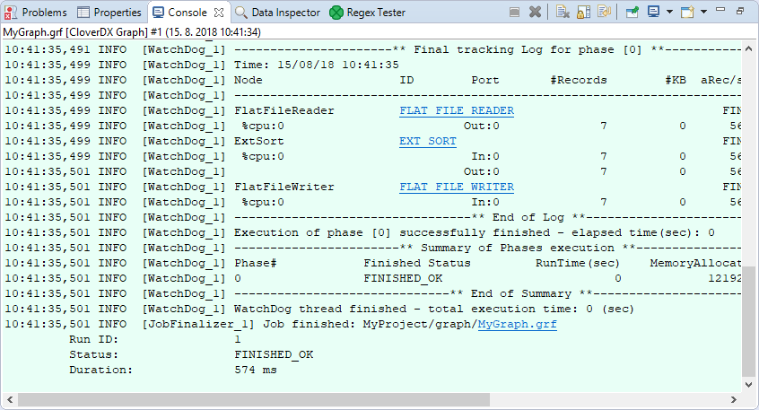
*Figure 199. Console tab with an overview of the graph execution*

Below the edges, numbers indicating counts of processed data should appear:

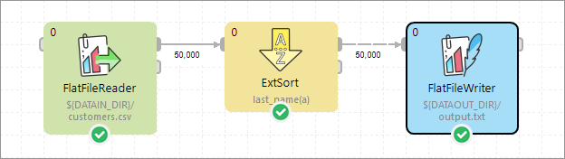
*Figure 200. Counting parsed data*

### Run configuration

**Run Configuration** is per graph configuration of an execution of a particular graph. Each graph can have one or more Run Configuration(s).

**Run configuration** is accessible from the main menu **Run** ****Run Configurations**.

#### Run configuration vs CloverDX runtime

Run configuration is per graph configuration. It can override graph parameters, change the debug level, etc. It cannot change JVM settings or define external libraries to be used.

**CloverDX Runtime** configuration is per workspace configuration. It can change JVM settings (e.g. heap size) or specify external libraries to be used.

Since introduction of **CloverDX Runtime**, the majority of graph configuration is done per workspace using Runtime Configuration. See [Runtime configuration](../admin/designer-configuration.md#runtime-configuration).

#### Main tab

Select **Run Configurations** from the context menu and set up the options in the **Main** tab.

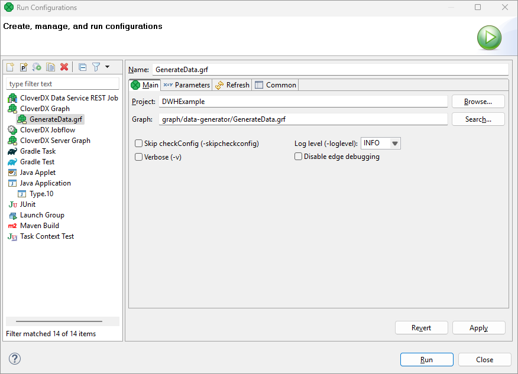
*Figure 201. Run configuration - Main tab*

You can check some checkboxes that define the following **Program arguments**:

- ###### Log level (-loglevel <option>)
  Defines one of the following: `ALL | TRACE | DEBUG | INFO | WARN | ERROR | FATAL | OFF`.
  Default **Log level** is `INFO` for **CloverDX Designer**, but `DEBUG` for **CloverDX Engine**.
- ###### Skip checkConfig (-skipcheckconfig)
  Skips checking the graph configuration before running the graph.

#### Parameters tab

On the **Parameters** tab, you can override graph parameter values. This lets you run the graph with different parameter values, e.g. for testing purposes.

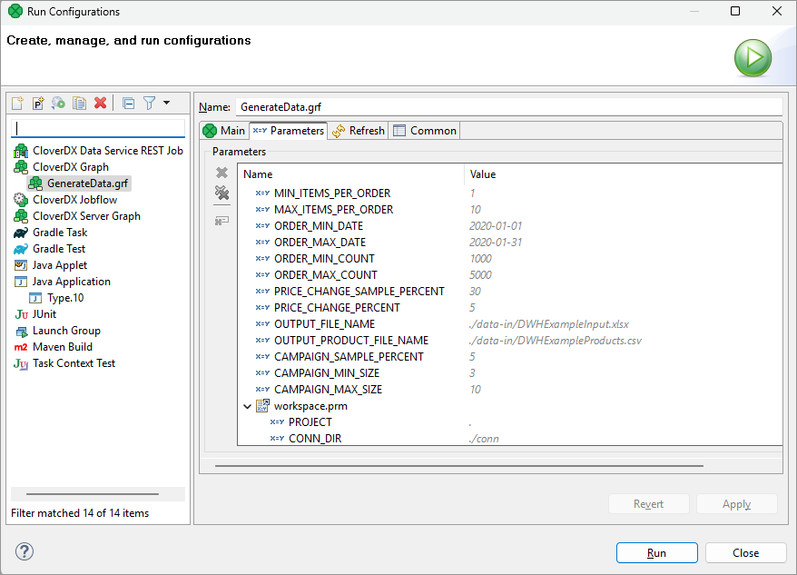
*Figure 202. Run configuration - Parameters tab*

#### Refresh tab

On the **Refresh** tab, you can specify resources to be refreshed after the execution of the graph. This configuration is per graph. If you need configuration of refresh per project, see [Refresh operation](../admin/designer-configuration.md#refresh-operation).

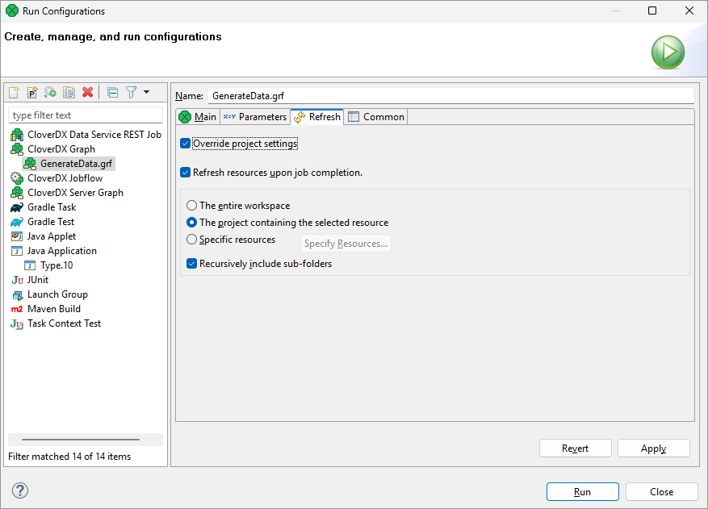
*Figure 203. Run configuration - Refresh tab*

### Connecting to a running job

It is possible to connect to currently running or finished execution of a job. The **Connect to Job** action will open the running graph with current tracking information and log console, and show the job hierarchy in **Execution view**.

The **Connect to Job** dialog is accessible from the main toolbar and **Execution view** toolbar under the icon 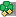. It requires **Project** and **Run ID** to be filled:

- **Project** - a project from which the job was executed
- **Run ID** - run ID of the job. It can be obtained from a **CloverDX Server Console** (in the case of a server job).

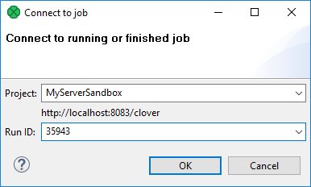
*Figure 204. Connect to job dialog*

Details of the view on executed graphs are described in [Execution tab](designer-layout.md#execution-tab).

### Graph states

An executed graph can be in one of the following states:

| Icon | Status | Description |
| --- | --- | --- |
|  | NOT AVAILABLE | Initial job state before changing to *Ready, Enqueued, or Error*. |
|  | READY | Job initialization process is almost done. |
| 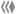 | ENQUEUED | Job execution command has been received. Job waits in [Job queue](../operations/job-queue.md) for later execution (server projects only). |
|  | RUNNING | Job is running. |
|  | FINISHED_OK | Job completed successfully. |
|  | ERROR | A failure occurred during data processing or during initialization process. |
|  | ABORTED | Job has been aborted or killed. |
|  | UNKNOWN | Job was interrupted, likely due to a CloverDX Server restart (server projects) or runtime restart (local projects). |

### Graph tracking

| [Changing record count font size](running-graphs.md#changing-record-count-font-size) |
| --- |

The **CloverDX** engine provides various tracking information about running graphs. The most important information is used to populate the **Tracking view**, located on bottom of the **CloverDX** perspective (see the [designer’s tabs](designer-layout.md#tabs-pane)).

The same source of data is used for displaying decorations on graph elements. The number of transferred records appears along the edges of a running graph. The phase edges have two numbers, the left end of the edge shows the number of data records sent to the edge, and the right end of the edge shows the number of data records already read from the phase edge.

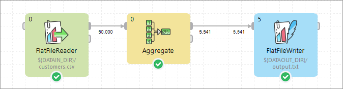
*Figure 205. Edge tracking example*

If the graph is running in the **CloverDX Cluster** environment with a multi-worker allocation, the in-graph tracking information can go into even more detail. Each component displays the number of instances of the component, i.e. parallel executions. Tracking information on edges is available in three levels of detail - low, medium and high. The level can be changed in **Window** ****Preference** ****CloverDX** ****Tracking page**. Or press 'D' to iterate over all levels of tracking details directly in the graph editor.

- The **low** level of tracking detail shows the total number of transferred records over all workers/partitions.
- The **medium** level shows the total number of transferred records as well as additional drill down information - the number of passed records and skew for each processing partition.
  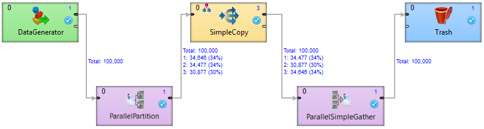
  *Figure 206. An example of a medium level of tracking information*
  The example above shows a simple Clustered graph with a medium level of tracking information. The **DataGenerator** and **ParallelPartition** components are executed on a single worker, so the interconnecting edge is decorated only by the total number of transferred records. On the output side of **ParallelPartition** component, there is a partitioned edge, since the **SimpleCopy** component is executed three times. The label above this edge shows that 30% of the data records are sent to one instance of **SimpleCopy** and 34% to the other two instances.
- The **high** level shows the most detailed information - the number of transferred records and Cluster node names where the partition is running (for example 'node1: 250 123'). Partitions where the edge is remote, the source Cluster node and target Cluster node are shown (for example 'node1~node2: 250 123').
  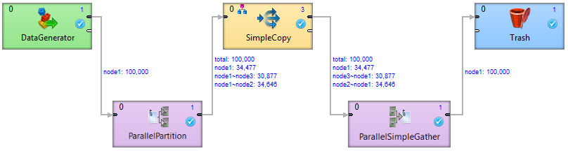
  *Figure 207. An example of a high level tracking information*
  The example above shows a simple Clustered graph with a high level of tracking information. The **ParallelPartition** component sends data to three different instances of the **SimpleCopy** component. The first instance runs on the same worker as the **ParallelPartition** component, so no [remote edges](../admin/cluster-setup-index.md#remote-edges) are necessary (34,477 records have been transferred locally). The second and third instance run on different workers (and even different Cluster nodes). So 34,646 records have been moved from node1 to node2 and 30,877 records have been transferred to node3.

#### Changing record count font size

The font size of the numbers appearing along edges can be changed:

1. Open the Preferences using **Window** ****Preferences…​**
2. Expand the **CloverDX** item and select **Tracking**
3. Choose the desired font size in the **Record count font size** area. By default, it is set to `7`.
