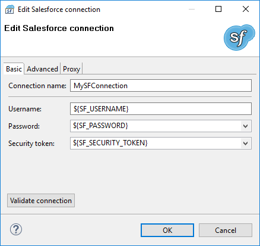
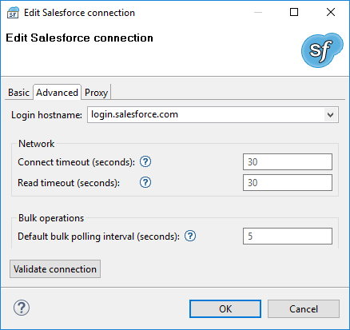
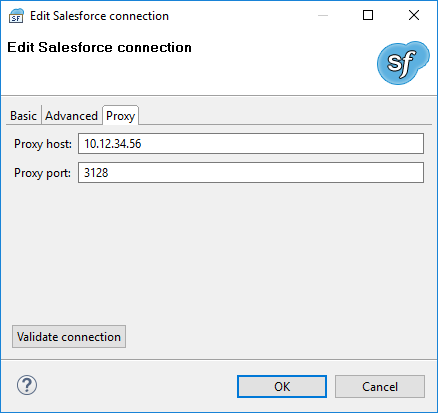

<!-- Development > Job elements > Connections > Salesforce connections -->

### Salesforce connections

**Salesforce connection** allows you to connect to **Salesforce**. The connection is required by components reading from and writing to Salesforce.

#### Creating Salesforce connection

To create a Salesforce connection, right click **Connections** in **Outline** and choose **Connections** ****Create Salesforce Connection**.

In **Salesforce Connection Dialog**, fill in **Username**, **Password**, and **Security token**.

*Figure 270. Salesforce connection dialog*

**Username** is your Salesforce username.

**Password** is password to your Salesforce account.

**Security token** is a security token for an external application. You can acquire a new security token in Salesforce web GUI: menu:[Username][My Settings > Personal > Reset My Security Token].

To specify password and security token, use [Secure Graph Parameters](parameters.md#secure-graph-parameters).

*Figure 271. Salesforce connection dialog II*

**Login hostname** is a URL of Salesforce service. The default value is `login.salesforce.com`.

**Connect timeout (seconds)** is timeout for creating the Salesforce connection. The default value is 30.

**Read timeout (seconds)** is timeout for subsequent network operations. The default value is 30.

**Default bulk polling interval (seconds)** is the time between requests for results of asynchronous calls. This configuration can be overridden in configuration of Salesforce components. Lower value means faster response but more API calls.

If you need to use a proxy, it can be configured on **Proxy** tab. In Salesforce connection, only an anonymous proxy is supported.

*Figure 272. Salesforce connection dialog III*

Use **Validate connection** to validate the connection.

Use **OK** to save the configuration.

#### Important details

##### Salesforce edition

Using Salesforce connections requires the **Integration via web service API** Salesforce feature. Make sure your Salesforce edition supports the API integration.

##### Limits on connections

If you design a graph, you should know that there is a limit on **number of requests** and on **number of concurrent requests**. These limits depend on the Salesforce edition you use. See the Salesforce documentation for details on these limits.

###### See also:

| [SalesforceReader](salesforcereader.md) |
| --- |
| [SalesforceBulkReader](salesforcebulkreader.md) |
| [SalesforceWriter](salesforcewriter.md) |
| [SalesforceBulkWriter](salesforcebulkwriter.md) |
| [SalesforceEinsteinWriter](salesforcewavewriter.md) |
| [Extracting metadata from Salesforce](creating-metadata.md#extracting-metadata-from-salesforce) |
