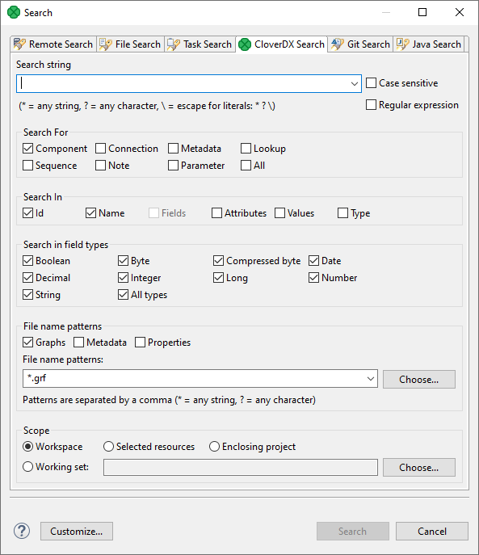
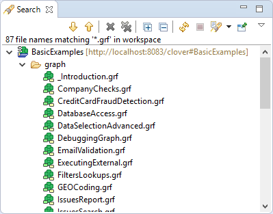

<!-- Development > Designer user interface > Search functionality -->

## 6. Search functionality

To search in **CloverDX Designer**, select **Search** ****Search…​** ****CloverDX Search** from the main menu.

*Figure 81. CloverDX Search tab*

In the **CloverDX search** tab, you need to specify the query.

First, you can specify whether searching should be case sensitive or not. And whether the string typed in the **Search string** text area should be considered as [*regular expression*](language-reference-ctl2.md#regular-expressions), or not.

Second, you need to specify what should be searched: **Components**, **Connections**, **Lookups**, **Metadata**, **Sequences**, **Notes**, **Parameters** or **All**.

Third, you should decide in which characteristics of objects mentioned above searching should be done: **Id**, **Names**, **Fields**, **Attributes**, **Values** or **Type**. (If you check the **Type** checkbox, you will be able to select from all available data types.)

Fourth, decide in which files searching should be done: **Graphs** (`*.grf`), **Metadata** (`*.fmt`) or **Properties** (files defining parameters: `*.prm`). You can even choose your own files by typing or by clicking the button and choosing from the list of file extensions.

Remember that, for example, if you search metadata in graphs, both internal and external metadata are searched, including fields, attributes and values. The same is valid for internal and external connections and parameters.

As the last step, you need to decide whether searching should regard whole **workspace**, only **selected resources** (selection should be done using Ctrl+Click), or the projects enclosing the selected resources (**enclosing projects**). You can also define your **working set** and **customize** your searching options.

When you click the **Search** button, a new tab containing the results of search appears in the **Tabs** pane. If you expand the categories and double-click any inner item, it opens in text editor, metadata wizard, etc.

If you expand the **Search** tab, you can see the search results:

*Figure 82. Search results*
