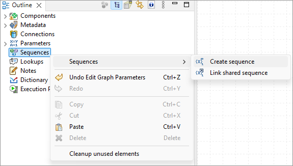
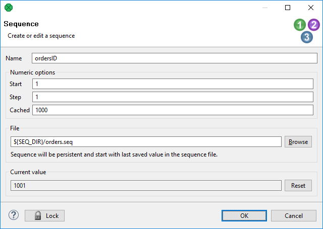
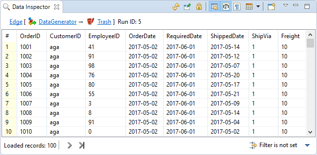

<!-- Development > Job elements > Sequences -->

## 27. Sequences

**Sequence** is an object designed to create a sequence of numbers.

Sequence can be used, for example, for numbering records or generating a unique identifier for records being stored in a database.

The generated numbers can be unique within a single graph run (**non-persistent sequence**) or across multiple graph runs (**persistent sequence**).

- [Persistent sequences](sequences.md#persistent-sequences)
- [Non-Persistent sequences](sequences.md#non-persistent-sequences)

The sequence can be created as **internal** (accessible from single graph) or **external** (shared among graphs). A conversion between internal and external sequences is possible.

- **Internal**: See [Internal sequences](sequences.md#internal-sequences).
- **External (shared)**: See [External (shared) sequences](sequences.md#external-shared-sequences).

Editing a sequence in **Sequence Dialog** is described in [Editing a sequence](sequences.md#editing-a-sequence).

Sequences can be accessed from CTL, see [Sequence functions](sequence-functions-ctl2.md).
> [!WARNING]
> Remember that you should not use sequences in the `init()`, `preExecute()` or `postExecute()` functions of CTL template and the same methods of Java interfaces.

If you plan to use sequences on cluster, see [Sequences in cluster environment](sequences.md#sequences-in-cluster-environment).

### Persistent sequences

**Persistent sequence** generates unique numbers across the graph runs. If you run the graph more times, you will get a different sequence numbers in each graph run.

The persistent sequences use a **sequence file**. The sequence file contains data necessary to transfer sequence state across the graph runs.

Multiple graphs using the same sequence file can run in parallel.

Multiple different sequences can use the same sequence file, it has the same effect as if the same sequence is used.

You can even use sequences from a different sandbox. But make sure that the path to the sequence file is specified as absolute in the sequence configuration. `(e.g. sandbox://MyProject/mySequenceFile)`

The sequence is not safe across multiple cluster nodes.

### Non-persistent sequences

**Non-Persistent sequence** generates a unique sequence within a single graph run.

The non-persistent sequences don’t use **sequence file**.

### Internal sequences

| [Creating internal sequences](sequences.md#creating-internal-sequences) |
| --- |
| [Externalizing internal sequences](sequences.md#externalizing-internal-sequences) |
| [Exporting internal sequences](sequences.md#exporting-internal-sequences) |

The definition of internal sequence is stored in the graph. If you use the **persistent internal sequence**, its value is stored in an external file.

If you want to give someone your graph, it is better to have internal sequences.

If you want to use one sequence for multiple graphs, it is better to use an external (shared) sequence.

#### Creating internal sequences

If you want to create an internal sequence, right-click the **Sequence** item in the **Outline** pane and choose **Sequence** ****Create sequence** from the context menu. After that, a **Sequence dialog** appears.

Continue with [Editing a sequence](sequences.md#editing-a-sequence).

*Figure 317. Creating a sequence*

#### Externalizing internal sequences

Internal sequence can be converted to external (shared) sequence. As a result you would be able to use the same sequence for more graphs.

##### Externalizing internal sequence Step by Step

1. Right-click an internal sequence item in the **Outline** pane and select **Externalize sequence**.
2. A **Sequence dialog** opens.
3. Set up the `seq` filename and directory of workspace to place it. Generally you do not have to change the suggested values.
4. The internal sequence in **Outline** view is replaced by a link to the exported sequence and new file appears in **Project Explorer**.

##### Externalizing multiple sequences at once

You can even externalize multiple internal sequence items at once.

1. Select sequences in the **Outline** pane.
2. Right-click the selected items and select **Externalize sequence** from the context menu.
3. A new dialog opens in which a `seq` folder of the corresponding projects of your workspace can be seen. The directory is offered as the location for this new external (shared) sequence file. If you want (a file with the same name may already exist), you can change the suggested name of the sequence file.
4. Close the dialog using **OK**.
5. The selected internal sequence items from the **Outline** pane’s **Sequences** group change to external (shared) sequences and the sequence files appear in the selected project and can be seen in the **Project Explorer** pane.

You can choose adjacent sequence items when you press the Shift and **Down Cursor** or **Up Cursor** key. If you want to choose non-adjacent items, use Ctrl+Click at each of the desired sequence items instead.

#### Exporting internal sequences

The export of a sequence creates a new sequence file outside the graph in the same way as externalization. The graph with an internal sequence is untouched: the newly created file is not linked to the graph and the internal sequence is still present.

##### Exporting internal sequence Step by Step

1. Right-click the sequence in **Outline** and select **Export sequence** from the context menu.
2. New dialog will open.
3. Set up the `seq` file name and directory to place it. Generally you can use the suggested values.

You can even export multiple selected internal sequences in a similar way to how it is described in the previous section about externalizing.

### External (shared) sequences

| [Creating external (shared) sequences](sequences.md#creating-external-shared-sequences) |
| --- |
| [Linking external (shared) sequences](sequences.md#linking-external-shared-sequences) |
| [Internalizing external (shared) sequences](sequences.md#internalizing-external-shared-sequences) |

**External sequences** (**shared sequences**) are stored in a separate file outside a graph. The file with a shared sequence is stored in the `seq` directory within the project folder.

External sequence is better for sharing among graphs. So it is sometimes called a shared sequence.

But, if you want to give someone your graph, it is better to have internal sequence. It is the same as with metadata, connections, lookup tables and parameters.

#### Creating external (shared) sequences

If you want to create an external (shared) sequences, select **File** ****New** ****Other** from the main menu.

Expand the **CloverDX** ****Other** category and use the **Sequence** item.

A **sequence** wizard will open. See [Editing a sequence](sequences.md#editing-a-sequence).

You will create the external (shared) sequence and save the created sequence definition file to the selected project.

#### Linking external (shared) sequences

Linking an external sequence to the graph allows you to use the external sequence there. Linking does not change the original graph and it does not copy the content of the external sequence into the graph.

1. Right-click either the **Sequences** group or any of its items and select **Sequences** ****Link shared sequence** from the context menu.
2. A **File selection** dialog displaying the project content will open.
3. Locate the desired sequence file from all the files contained in the project (sequence files have the `.cfg` extension).

##### Linking Multiple sequence Files at Once

You can even link multiple external (shared) sequence files at once.

1. Right-click either the **Sequences** group or any of its items and select **Sequences** ****Link shared sequence** from the context menu.
2. A **File selection** dialog displaying the project content will open.
3. Locate the desired sequence files from all the files contained in the project.

You can select adjacent file items when you press the Shift and **Down Cursor** or **Up Cursor** keys. If you want to select non-adjacent items, use Ctrl+Click at each of the desired file items instead.

#### Internalizing external (shared) sequences

Internalizing converts a linked sequence to an internal sequence whereas the original linked sequence is left untouched.

If the original external sequence is persistent, both sequences will share the sequence file.

If you want to internalize an external (shared) sequence, link it to the graph first.

You can internalize any linked external (shared) sequence file into internal sequence by right-clicking some of the external (shared) sequence items in the **Outline** pane and selecting **Internalize sequence** from the context menu.

You can even internalize multiple linked external (shared) sequence files at once. To do this, select the desired linked external (shared) sequence items in the **Outline** pane.

You can select adjacent items when you press the Shift and **Down Cursor** or **Up Cursor** keys. If you want to select non-adjacent items, use Ctrl+Click at each of the desired items instead.

After that, the linked external (shared) sequence items disappear from the **Outline** pane **Sequences** group, but, at the same location, the newly created internal sequence items appear.

However, the original external (shared) sequence files still remain in the `seq` folder of the corresponding project which can be seen in the **Project Explorer** pane (sequence files have the `.cfg` extensions).

### Editing a sequence

In **Sequence dialog**, you can define the name of the sequence, select the value of its first number, the incrementing step (in other words, the difference between every pair of adjacent numbers), the number of precomputed values that you want to be cached and, optionally, the name of the sequence file where the numbers should be stored.

If no sequence file is specified, the sequence will not be persistent and the value will be reset with every run of the graph. The file name can be, for example, `${SEQ_DIR}/sequencefile.seq` or `${SEQ_DIR}/anyothername`. Note that we are using here the `SEQ_DIR` parameter defined in the `workspace.prm` file, whose value is `${PROJECT}/seq`. And `PROJECT` is another parameter defining the path to your project located in the workspace.

To edit some of the existing sequences, double-click the sequence in the **Outline** pane. A **Sequence** dialog appears. (You can also open this wizard when selecting a sequence item in the **Outline** pane and pressing Enter.)

The **Edit sequence** dialog of persistent sequence displays the current value of the sequence number. The value has been taken from a file. You can reset the current value to its original value by clicking the button.

*Figure 318. Editing a sequence*

And when the graph has been run once again, the same sequence started from 1001:

*Figure 319. A New run of the graph with the previous start value of the sequence*

You can also see how the sequence numbers fill one of the record fields.

### Sequences in cluster environment

The sequence is not shared between cluster nodes. The generated numbers are unique within a single cluster node.
