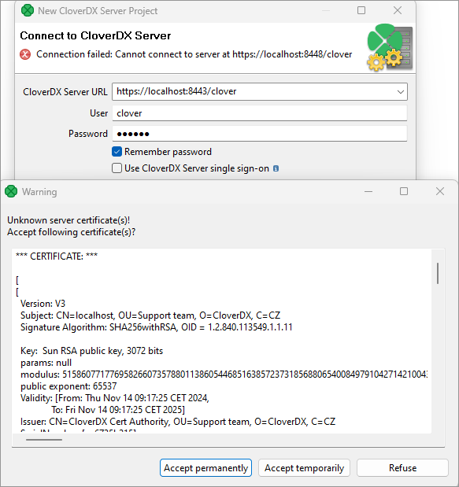
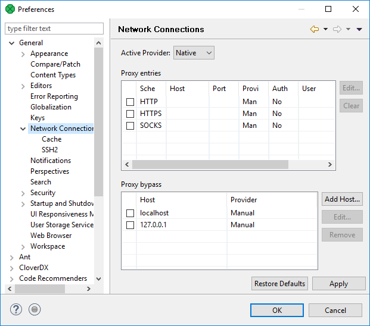
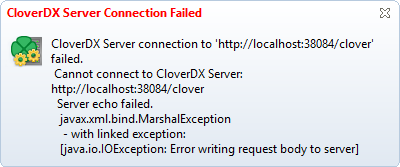
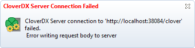
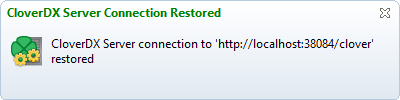
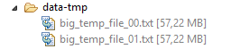
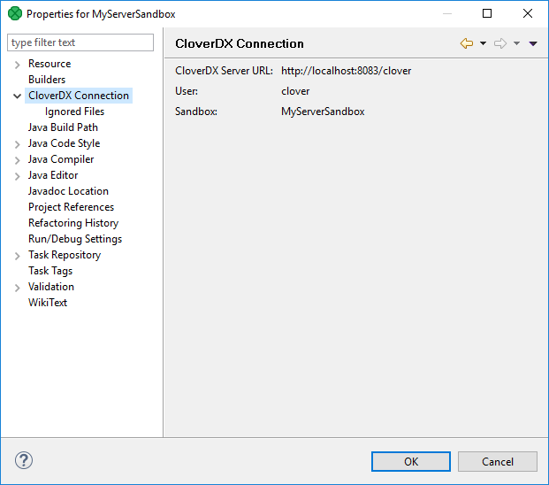
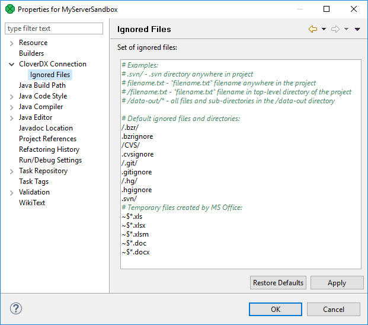

<!-- Development > Projects > Working with CloverDX Server projects -->

## 14. Working with CloverDX Server projects

| [CloverDX Server project basic principles](server-projects-usage.md#cloverdx-server-project-basic-principles) |
| --- |
| [Connecting via HTTP](server-projects-usage.md#connecting-via-http) |
| [Connecting via HTTPS](server-projects-usage.md#connecting-via-https) |
| [Connecting via proxy server](server-projects-usage.md#connecting-via-proxy-server) |
| [Working offline](server-projects-usage.md#working-offline) |
| [Handling conflicts](server-projects-usage.md#handling-conflicts) |
| [Placeholder files](server-projects-usage.md#placeholder-files) |
| [Project configuration](server-projects-usage.md#project-configuration) |
| [CloverDX connection information](server-projects-usage.md#cloverdx-connection-information) |
| [Ignored files](server-projects-usage.md#ignored-files) |

With **CloverDX Designer** and **CloverDX Server** fully integrated, you can access **Server** sandboxes directly from the **Designer** without having to copy them back and forth manually.

**Designer** takes care of all the data transfers for you - you can directly edit graphs, run them on the **Server**, edit data files, metadata, etc. You can even view live tracking of a graph execution as it runs on the **Server**.
> [!IMPORTANT]
> Remember that the version of **CloverDX Designer** and **CloverDX Server** must match.

You can connect to your **CloverDX Server** by creating a **CloverDX Server Project** in **CloverDX Designer**. For detailed information, see [CloverDX Server Project](first-cloverdx-project.md#cloverdx-server-project).

To learn how you can interchange graphs, metadata, etc. between a **CloverDX Server** sandbox and a standard **CloverDX** project, see the following links:

- [Import from CloverDX Server sandbox](import.md#import-from-cloverdx-server-sandbox)
- [Export to CloverDX Server sandbox](export.md#export-to-cloverdx-server-sandbox)

### CloverDX server project basic principles

1. A sandbox must exist on **CloverDX Server**. If a sandbox does not exist, you can create it from **CloverDX Designer**. See [CloverDX Server Project](first-cloverdx-project.md#cloverdx-server-project).
2. For each **CloverDX Server** sandbox, only one **CloverDX Server** project can be created within the same workspace. If you want to create more than one **CloverDX Server** projects for a single **CloverDX Server** sandbox, each of these projects must be in different workspace.
3. In one workspace, you can have more **CloverDX Server projects** created using your **Designer**.
   Each of these **CloverDX Server projects** can even be linked to different **CloverDX Server**.
4. **CloverDX Designer** uses HTTP/HTTPS protocols to connect to **CloverDX Server**. These protocols work well with complex network setups and firewalls. Remember that each connection to any **CloverDX Server** is saved in your workspace. For this reason, you can use only one protocol in one workspace. You have your login name, password and some specified user rights and/or keys.
   In case the Server login credentials were changed while connected to a Server project, Designer throws an exception. In such a case, convert the project to local and then to Server again and provide correct login credentials.
5. Remember that if multiple users are accessing the same sandbox (via **Designer**), they must cooperate to not overwrite their changes made to the same resources (e.g. graphs). If anyone changes the graph or any other resource on **CloverDX Server**, the other users may overwrite such resources on **Server**. However, a warning is displayed and each user must decide whether they really want to overwrite such resource on **CloverDX Server**. The remote resources are not locked and the user must decide what should be done in the case of such a conflict.

### Connecting via HTTP

With the HTTP connection, you do not need to configure **CloverDX Designer**. Simply start the **CloverDX Designer** and you can create your **CloverDX Server projects** using the default connection to **Server**: [http://localhost:8080/clover](http://localhost:8080/clover) where both **login name and password** are **clover** (note that the URL depends on the chosen application server).

### Connecting via HTTPS

When connecting to a server URL over HTTPS, you will be prompted to choose how to proceed: accept the server certificate permanently, accept it temporarily, or reject it.

If you choose to accept the certificate permanently, a truststore (`permanentTrustStore.jks`) is created within the `.eclipse` directory. The location of this directory depends on the operating system:

- Windows: `C:\Users\<username>\.eclipse`
- Linux and macOS: `~/.eclipse`

The exact location of the truststore file within the `.eclipse` directory may vary depending on the Eclipse version. Use the search feature to locate the `permanentTrustStore.jks` file within the directory.

### Connecting via proxy server

You can make use of your proxy server to connect to **CloverDX Server**, too.
> [!IMPORTANT]
> The proxy server has to support HTTP 1.1. Otherwise all connection attempts will fail.

To manage the connection, navigate to **Window** ****Preferences** ****General** ****Network Connections**

*Figure 129. Network connections window*

For more information on handling proxy settings, go to the [Eclipse website](http://help.eclipse.org/kepler/index.jsp?topic=/org.eclipse.platform.doc.user/reference/ref-net-preferences.htm).

### Working offline

**CloverDX Server** handles short network outage. You can work with graphs or move files even if you temporarily cannot connect. When **Designer** reconnects to the **Server**, the changes are synchronized.

When you are working offline, you cannot run graphs, view new debug data in **Data Inspector** or extract metadata from databases.

When connection fails, the **Server** notifies you with a message. The message appears in the right bottom corner. Furthermore, the project name color changes to red.

*Figure 130. Connection failed*

*Figure 131. Connection failed*

When **Designer** reconnects to the **server**, you are informed with a message again. The project name color changes back to black.

*Figure 132. Connection reestablished*

### Handling conflicts

If more users edit the same file, a **conflict** occurs. In such a case, the **Designer** informs the user and the user should resolve it.

Conflicts are rare and you can avoid them with a suitable workflow: it is not a good idea for more users to work within the same sandbox at the same time, unless they communicate well with each other to avoid conflicts and unintentional overwriting of files.

When a conflict is detected new files appear. The file names are derived from the conflicted file name, timestamp and conflict-denoting suffix. For example, a conflict in `MyFile.grf` creates `MyFile_2016-02-25_13_45_56_conflict_local.grf` and `MyFile_2016-02-25_13_45_56_conflict_remote.grf`.

You should resolve conflict yourself. You are asked to choose one of the options: **Open in compare editor****Resolve the conflict using the local file**, or **Resolve the conflict using remote file**.

### Placeholder files

*Placeholder file* is a dummy file in **Designer**. A file exceeding a user-defined size limit becomes a *placeholder file*. The *placeholder file* can be viewed in **Project Explorer**, but it cannot be modified within Eclipse. The file content only exists on **CloverDX Server**. When you open the placeholder file, you can view the several lines from the file in a special editor.

*Placeholder file* saves disk space - you download files up to specified size. The files exceeding the limit are displayed in **Project Explorer** as *placeholder files*: you see that the file exists, but its content is only on the Server. You can download the content of *placeholder file* from **CloverDX Server** explicitly. The file size limit can be changed in [CloverDX Server integration](../admin/designer-configuration.md#cloverdx-server-integration).

As you copy, move, rename, or delete the *placeholder file*, the corresponding file on **CloverDX Server** is copied, moved, renamed, or deleted.

*Figure 133. Placeholder file*
> [!NOTE]
> Placeholder vs. placeholder file
> We use two similar terms in our documentation: *placeholders* and *placeholder files*.
>
> *Placeholder* is a replaceable part of a text - variable. It is used within configuration, mostly in the **CloverDX Server** documentation.
>
> *Placeholder file* is a mock-up of a data file. You can view the *placeholder file* in **Project Explorer** in **Designer**, but the file content is only on the Server.

### Project configuration

*Project configuration* allows you to configure properties on per-project basis: connection to **CloverDX Server** and files that should not be synchronized.

The per project configuration can be changed from the main menu under **Project** ****Properties** item.

### CloverDX connection information

This window displays the configuration of connection of the current **CloverDX** project: you can view the **CloverDX Server** URL, user, and sandbox.

This window serves to inform you about the project configuration.

*Figure 134. CloverDX connection*

### Ignored files

*Ignored files* allows you to avoid synchronization of particular files.

This is a per-project configuration of *ignored files*. See [Ignored files](../admin/designer-configuration.md#ignored-files) in workspace configuration.

*Figure 135. CloverDX Connection*
