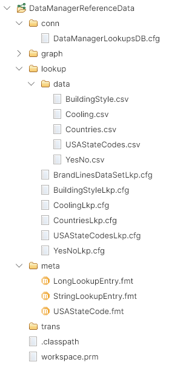
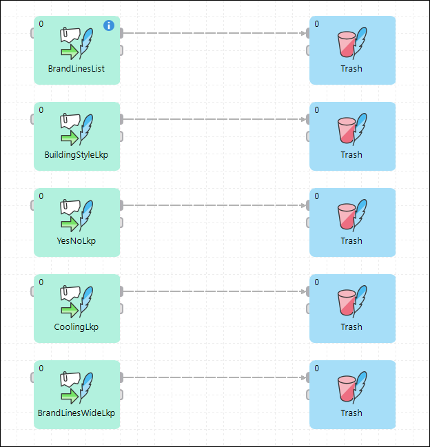
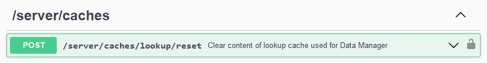
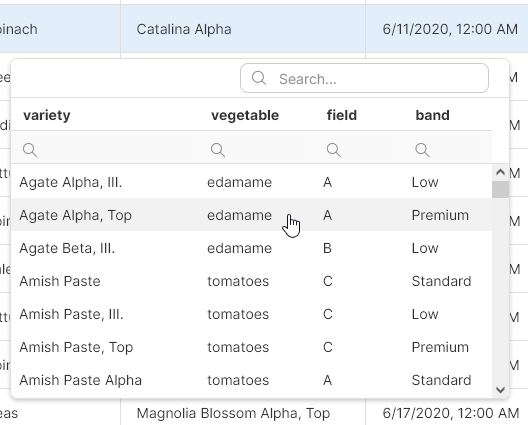
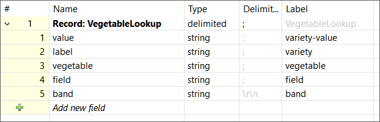
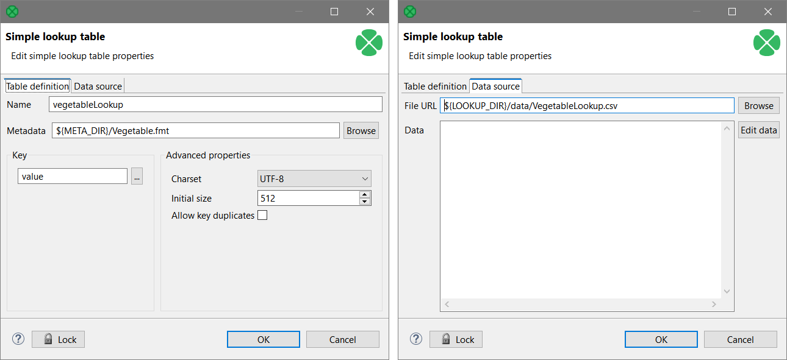
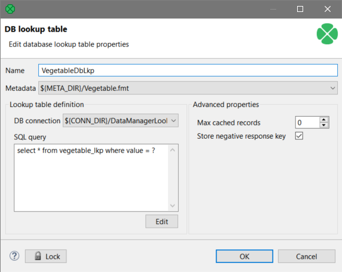

<!-- Development > Advanced > Shared lookup tables in CloverDX Server -->

## 50. Shared lookup tables in CloverDX Server

Since CloverDX 6.5 it is possible to define **shared lookup tables** that are managed by the Server and are accessible to the Data Manager. These lookups work like [Simple lookup](lookup-tables.md#simple-lookup-table) or [Database lookup](lookup-tables.md#database-lookup-table), but their data is stored and cached by the Server rather than by each job that works with the lookup.

### Overview

Shared lookups are a way for the Data Manager and CloverDX jobs to share lookup data. This means that the shared lookups are defined in the Server rather than on a per-project (or per sandbox) basis and are common to every sandbox on the Server.

As of CloverDX 6.6, there are no special permissions attached to the shared lookups, so by default every user can read their data.

Data and configuration for all shared lookups *must* be stored in a special sandbox on the server. The default name of this sandbox is **DataManagerReferenceData**. If you’d like to change this name, you can do so via `datamanager.lookup.home` property in the Server’s configuration file.
> [!NOTE]
> Note that this sandbox is *not* created automatically. You must create the sandbox by yourself before you can create any shared lookups.

Each shared lookup requires the following:

- **Lookup definition**: externalized lookup configuration (in the cfg format). Lookup definition must be stored in DataManagerReferenceData sandbox in the lookup directory. If not, the lookup manager process in the Server may not be able to find it.
- **Lookup metadata**: externalized metadata (an fmt file).
- **Lookup data**: if the lookup is a file-based lookup (equivalent to Simple lookup) a csv file with the data. If the lookup is a database lookup, it will require externalized database connection.

The best way to organize the **DataManagerReferenceData** sandbox is to use the following structure:


*Figure 504. Recommended layout of the DataManagerReferenceData sandbox.*

The important folders in the sandbox are laid out like this:

- `lookup` folder: contains the externalized lookup configuration files.
- `lookup/data`: stores the data for the lookups that are backed by files.
- `meta`: stores externalized metadata for the lookups (note that one metadata file can be used by multiple lookups – like the `StringLookupEntry` on the screenshot above).
- `conn`: stores exported database configuration files for any lookups that use the database to store their data. One database connection can be used by multiple lookups.

A good way to manage, create and test the lookups is to connect this sandbox in the Designer as a project. You can then easily manage files, create new lookups, and export their configuration files.

Additionally, a good practice is to also include a **test job** (or jobs) that try to read data from these lookups. This is especially important if you use database lookups as it will allow you to test whether the query and database connections work as expected. A simple job that tests the lookups in this way may look like this:


*Figure 505. A simple job that tests several lookups by reading all data from them.*

The example graph shows a simple approach to how to test lookups. Each lookup is included in the job and is read using **LookupTableReaderWriter** component. If there are any issues with the lookup definition, the job will fail, and the error message will allow you to discover and fix the issue.

### Lookup cache and memory requirements

CloverDX Server automatically scans the **DataManagerReferenceData** sandbox and loads every lookup table it can find. All data in each lookup table is read and cached by the Server. This cache is then accessed by the Data Manager via an API whenever the Data Manager needs to show the lookup content (for example when editing the data).

Since all records in the lookup are loaded into memory, you must make sure that there is enough memory to hold your data. This cache and memory associated with it is managed by the CloverDX Core process, so make sure you provide enough heap space for the Core.

### Refreshing lookup cache

When you change your lookup data, you may want to refresh the cache since the Server will not be able to automatically pick up changes in a database or lookup source files.

To refresh the cache, you just need to purge it. Lookups will be automatically reloaded when needed. To purge the cache, use CloverDX REST API endpoint `/server/caches/lookup/reset`:


*Figure 506. CloverDX Server REST API to reset lookup caches.*

The endpoint will purge all lookup tables from the cache and subsequently when Data Manager requests the lookup data, all lookups will be reloaded.

### Creating shared lookups

#### Shared lookup requirements

Shared lookups must provide at least two columns - one must be called `value` and the other one must be called `label`.

The `value` column is the key of the lookup – its values must be unique. As of CloverDX 6.6, it is not possible to create a shared lookup that has compound key composed of multiple columns. At the same time, the `value` can only be `long`, `string`, `date`, or `boolean`. Other types are not supported since the types used must match the types known in the Data Manager.

The `label` field provides a name (or description) for the lookup entry. The `label` must be a string. Note that the `label` is displayed in the user interface in Data Manager, so even though there is no limitation on the `label` length, you should use reasonable labels to ensure that they can be displayed in the Data Manager in a nice way.

Additional fields can be added to the lookup to provide more information to the Data Manager user. All columns will be shown as a searchable table in the Data Manager’s editor.


*Figure 507. A lookup shown in the Data Manager.*

#### Shared lookups with file storage

The simplest way of creating a shared lookup is to provide the lookup data as a csv file. This is the same approach that you can use when creating **Simple lookups** in your Designer projects.

When creating such lookups, you can use the following approach:

1. Create internal **Simple lookup** – configure the metadata, key and a source file for the lookup. Make sure the file can be read and is stored in the **DataManagerReferenceData** sandbox. Also make sure that the lookup metadata contains `value` and `label` fields. The `value` field must be set as the lookup key in the lookup.
2. Externalize the lookup table. This will create the `cfg` file – place this file in the lookup folder in your **DataManagerReferenceData** sandbox.
3. If the lookup metadata is not externalized, the Designer will externalize the metadata as well. You should place the metadata into `meta` folder to keep the project structure according to the best practices.
4. (Optional) Create a job that tests the lookup. The simplest way to test the lookup is to link it to a job and read data from it via **LookupTableReaderWriter** component.

As an example, following it the metadata definition of a lookup with multiple columns:


*Figure 508. Metadata configuration for a lookup with five columns.*

The lookup configuration should then look like this:


*Figure 509. Lookup configuration to create a Simple shared lookup with file-based data storage.*

And finally, the file with lookup data looks like this (this is just first few rows):

```
value;label;vegetable;field;band
Romaine, III.;Romaine, III.;lettuce;C;Low
Garden Party Mix Alpha, III.;Garden Party Mix Alpha, III.;radish;A;Low
Romaine Beta;Romaine Beta;lettuce;B;Standard
Romaine Alpha, Top;Romaine Alpha, Top;lettuce;A;Premium
Garden Party Mix Alpha, Top;Garden Party Mix Alpha, Top;radish;A;Premium
Farmer's Market Blend Beta, Top;Farmer's Market Blend Beta, Top;lettuce;B;Premium
```

Note that the file must match the metadata definition – the field and row delimiters, quoting settings etc. Otherwise, the lookup will fail to initialize and will not work in the Data Manager.

#### Shared lookups with database storage

The lookups that use database storage work in a very similar way like the file-based lookups. The biggest difference is that you must provide database connection and query instead of a csv file when creating the lookup.

The steps to create the database lookup are very similar to file-based lookup:

1. Create internal **Database lookup** – configure the metadata, database connection and database query. Note that you must provide the metadata explicitly – generic Database lookups can use dynamic metadata, but this functionality is not available for the Data Manager lookups. Also make sure that the lookup metadata contains value and label fields.
    When writing the query in the lookup, make sure that you query only a single field and that is queries the value column. I.e., your query will need to have `where value = ?` or similar clause.
2. Externalize the lookup table. This will create the `cfg` file – place this file in the lookup folder.
3. If the lookup metadata is not externalized, the Designer will externalize the metadata as well. You should place the metadata into meta folder to keep the project structure according to the best practices.
4. If the connection is not externalized, the Designer will externalize it too. Place the connection into the conn folder to follow our best practices.
5. Populate the database table if not already done. This can be done in any way – even using CloverDX.
6. (Optional) Create a job that tests the lookup. The simplest way to test the lookup is to link it to a job and read data from it via **LookupTableReaderWriter** component. For example, to configure the same vegetable lookup like in the previous example, you can use the following configuration:


*Figure 510. Configuration of a Database lookup that can be used as a shared lookup.*

The lookup will work in the same way in the Data Manager as it does when it is based on file.
