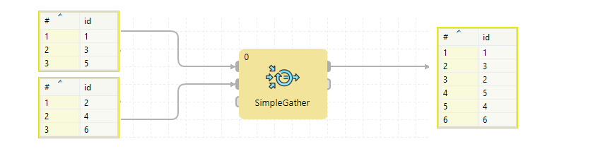

<!-- Development > Component reference > Transformers > SimpleGather -->

### SimpleGather

| [Short description](simplegather.md#short-description) |
| --- |
| [Ports](simplegather.md#ports) |
| [Metadata](simplegather.md#metadata) |
| [Details](simplegather.md#details) |
| [Compatibility](simplegather.md#compatibility) |
| [See also](simplegather.md#see-also) |

#### Short description

**SimpleGather** gathers data records from multiple inputs. The order of output records is unpredictable.

| Same input metadata | Sorted inputs | Inputs | Outputs | Java | CTL | Auto-propagated metadata |
| --- | --- | --- | --- | --- | --- | --- |
| **✓** | **⨯** | 1-n | 1-n | **⨯** | **⨯** | **✓** |

#### Ports

| Port type | Number | Required | Description | Metadata |
| --- | --- | --- | --- | --- |
| Input | 0 | **✓** | For input data records. | Any |
| 1-n | **⨯** | For input data records. | Input 0 |  |
| Output | 0 | **✓** | For gathered data records. | Input 0 |
| 1-n | **⨯** | For gathered data records. | Input 0 |  |

At least one connected input port and at least one connected output port are required.

#### Metadata

**SimpleGather** propagates metadata in both directions. SimpleGather does not change metadata priorities.

SimpleGather has no metadata template.

Input ports must have the same metadata. Metadata name and field names may differ but the field datatypes must correspond to each other.

Output ports must have the same metadata. Metadata name and field names may differ but the field datatypes must correspond to each other.

#### Details

The order of output records is unpredictable. Only the order of records coming from the single port is preserved.

**SimpleGather** receives data records through one or more input ports. **SimpleGather** gathers (demultiplexes) all records as fast as possible and sends them all to all output ports.

*Figure 430. SimpleGather*

If you need a component merging input records and preserving the order, use [Concatenate](concatenate.md) or [Merge](merge.md).

#### Compatibility

| Version | Compatibility Notice |
| --- | --- |
| 4.1.0-M1 | Until **4.0.x**, you could disable only the last input or output port(s) of **SimpleGather**; e.g. you could disable the third and fourth input port, but not the first one.  Since **4.1.0-M1**, you can disable any input port or any output port provided there is at least one input port and at least one output port. |

#### See also

| [Concatenate](concatenate.md) |
| --- |
| [Merge](merge.md) |
| [SimpleCopy](simplecopy.md) |
| [ParallelSimpleGather](clustersimplegather.md) |
| [Common properties of components](components.md#common-properties-of-components) |
| [Specific attribute types](components.md#specific-attribute-types) |
| [Common properties of Transformers](common-of-transformers.md) |
| [Transformers comparison](common-of-transformers.md#transformers-comparison) |
