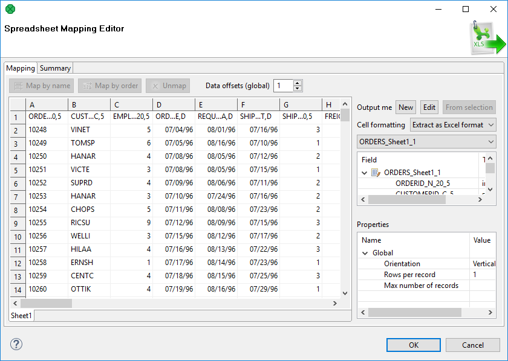
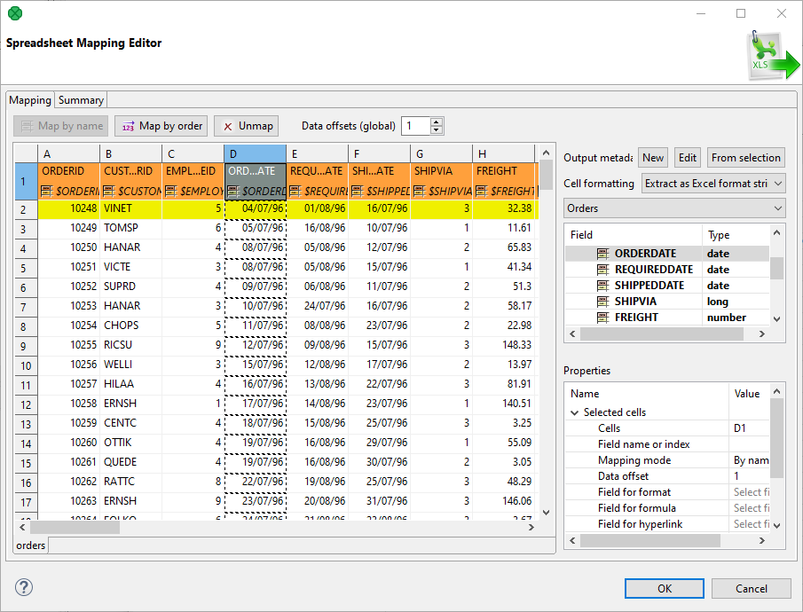
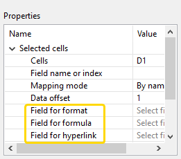
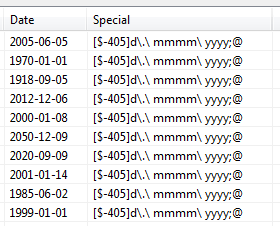
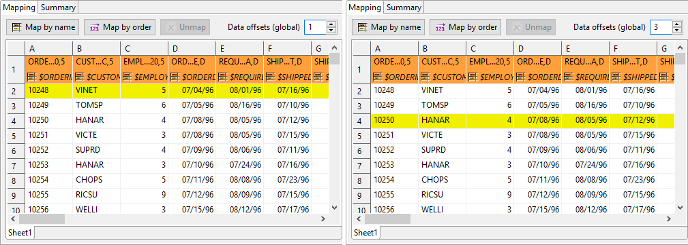
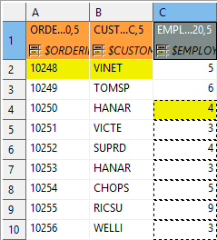
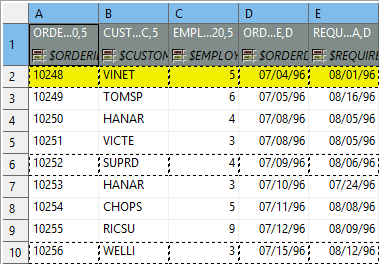
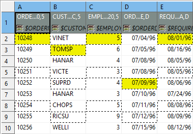
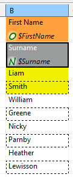

<!-- Development > Component reference > Readers > SpreadsheetDataReader -->

### SpreadsheetDataReader


| [Short description](spreadsheetreader.md#short-description) |
| --- |
| [Ports](spreadsheetreader.md#ports) |
| [Metadata](spreadsheetreader.md#metadata) |
| [SpreadsheetDataReader attributes](spreadsheetreader.md#spreadsheetdatareader-attributes) |
| [Details](spreadsheetreader.md#details) |
| [Notes and limitations](spreadsheetreader.md#notes-and-limitations) |
| [Examples](spreadsheetreader.md#examples) |
| [Compatibility](spreadsheetreader.md#compatibility) |
| [See also](spreadsheetreader.md#see-also) |

#### Short description

**SpreadsheetDataReader** reads data from Excel spreadsheets (XLS or XLSX files).

| Data source | Input ports | Output ports | Each to all outputs | Different to different outputs | Transformation | Transf. req. | Java | CTL | Auto-propagated metadata |
| --- | --- | --- | --- | --- | --- | --- | --- | --- | --- |
| XLS(X) file | 0–1 | 1–2 | **⨯** | **✓** | **⨯** | **⨯** | **⨯** | **⨯** | **✓** |

#### Ports

| Port type | Number | Required | Description | Metadata |
| --- | --- | --- | --- | --- |
| Input | 0 | **⨯** | For optional port reading. See [Reading from input port](examples-of-file-url-in-readers.md#reading-from-input-port). | One field (`byte`, `cbyte`). |
| Output | 0 | **✓** | Successfully read records | Any |
| 1 | **⨯** | Error records | Fixed default fields + optional fields from port 0 [[1]](spreadsheetreader.md#spreadsheetreader-footnote1) |  |

| 1 |  Records which could not be read correctly are sent to output port 1 if the port has an edge connected. There is a fixed set of fields describing the reason and position of the error which caused the record to fail. Additionally, you can map any field from port 0 as well. **Please note: for each error in the input there is one error record generated. That is: for multiple errors in one record you get multiple error records – you can group them, e.g. by the very first `integer` field**. |
| --- | --- |

Processing (parsing) of incorrect or incomplete records depends on error port connection, see [Error handling](spreadsheetreader.md#error-handling).

This component has [metadata templates](components.md#metadata-templates) available.

#### Metadata

##### Propagation

SpreadsheetDataReader does not propagate metadata.

##### Templates

SpreadsheetDataReader has metadata template on error port.

| Field number | Field name | Data type | Description |
| --- | --- | --- | --- |
| 1 | recordID | `integer` | The index of the incorrectly read record (record numbering starts at 1). |
| 2 | file | `string` | The name of the file (if available) the error occurred in. |
| 3 | sheet | `string` | The name of the sheet the error occurred in. |
| 4 | fieldIndex | `integer` | The index (zero-based) of the field data could not be read into. |
| 5 | fieldName | `string` | The name of the field data could not be read into; example: "CustomerID". |
| 6 | cellCoords | `string` | Coordinates of the cell in the source spreadsheet which caused errors on reading; example: "D7". |
| 7 | cellValue | `string` | The value of the cell which caused errors on reading, example: "-5.12". |
| 8 | cellType | `string` | An Excel type of the cell which caused reading errors, example: "String". |
| 9 | cellFormat | `string` | An Excel format string of the cell which caused reading errors, example: "#,##0". |
| 10 | message | `string` | An error message in a human readable format, example: `Cannot get Date value from cell of type String in C1`. |

##### Autofilling functions

Metadata can use [Autofilling functions](metadata-records-and-fields.md#autofilling-functions).

Note: the `source_timestamp` and `source_size` functions work only when reading from a file directly. If the file is an archive or it is stored in a remote location, timestamp will be empty and size will be 0.

#### SpreadsheetDataReader attributes

| Attribute | Req | Description | Possible values |
| --- | --- | --- | --- |
| Basic |  |  |  |
| File URL | yes | Specifies the data source(s) that will be read, see [Supported file URL formats for Readers](examples-of-file-url-in-readers.md). |  |
| Sheet |  | The name or number (zero-based) of the sheet to be read. You can specify multiple sheets separated by commas ",". You can also use the `?` and `*` wildcards to specify multiple sheets. Sheets are then read sequentially one after another using the same mapping. | 0 (read the first sheet) |
| Mapping | [[1]](spreadsheetreader.md#spreadsheetreader-attributes-fn01) | Maps spreadsheet cells to Clover fields in a visual mapping editor. See [Details](spreadsheetreader.md#details). |  |
| Mapping URL | [[1]](spreadsheetreader.md#spreadsheetreader-attributes-fn01) | Path to an XML file containing your **Mapping** definition. Put your mapping to an external file if you want to share a single mapping among multiple graphs. |  |
| Advanced |  |  |  |
| Read mode |  | Determines how data is read from the input file.  In-memory mode stores the whole input file in memory allowing for faster reading. Suitable for smaller files.  In "streaming" mode, the file is being read directly without storing in memory. Streaming should thus allow you to read bigger files without running out of memory. Streaming supports both XLS and XLSX. | In memory (default) \| Stream |
| Number of skipped records |  | The total number of records throughout all source files that will be skipped. See [Selecting input records](selecting-input-records.md). | 0–N |
| Max number of records |  | The total number of records throughout all source files that will be read. See [Selecting input records](selecting-input-records.md). | 0–N |
| Number of skipped records per source |  | The number of records to be skipped in each source file. See [Selecting input records](selecting-input-records.md). | Same as in Metadata (default) \| 0–N |
| Max number of records per source |  | The maximum number of records to be read from each source file. See [Selecting input records](selecting-input-records.md). | 0–N |
| Number of skipped records per spreadsheet |  | The number of records to be skipped in each Excel sheet. |  |
| Max number of records per spreadsheet |  | The maximum number of records to be read from each Excel sheet. |  |
| Max error count |  | The maximum number of allowed errors before the graph fails. Applies for the `Controlled` value of **Data policy**. | 0 (default) \| 1–N |
| Incremental file | [[2]](spreadsheetreader.md#spreadsheetreader-attributes-fn02) | Name of a file storing the incremental key (including the path). See [Incremental reading](incremental-reading.md). |  |
| Incremental key | [[2]](spreadsheetreader.md#spreadsheetreader-attributes-fn02) | Stores the position of the last record read. See [Incremental reading](incremental-reading.md). |  |
| Encryption password |  | If data is encrypted in the source spreadsheet, type the password in here. Mind typing all characters precisely, including the letter case, special characters, accented letters, etc. |  |
| Deprecated |  |  |  |
| Data policy |  | Determines what is done when an error occurs. For more information, see [Data policy](data-policy.md).  If the attribute is not set and the error port is not connected, the option **Strict** is applied.  If the attribute is not set and the error port is connected, the option **Controlled** is applied. | Strict \| Controlled \| Lenient |

| 1 |  One of these two has to be specified to define the mapping. |
| --- | --- |

| 2 |  Either both or none of these attributes have to be specified. |
| --- | --- |

#### Details

| [Error handling](spreadsheetreader.md#error-handling) |
| --- |
| [Introduction to spreadsheet mapping](spreadsheetreader.md#introduction-to-spreadsheet-mapping) |
| [Mapping Editor](spreadsheetreader.md#mapping-editor) |
| [Metadata](spreadsheetreader.md#metadata) |
| [Basic mapping example](spreadsheetreader.md#basic-mapping-example) |
| [Advanced mapping options](spreadsheetreader.md#advanced-mapping-options) |

**SpreadsheetDataReader** reads data from a specified sheet(s) of XLS or XLSX files. It lets you create complex data mapping: forms, tables, multi-row records, etc.

##### Supported file formats

- XLS: only Excel 97/2003 XLS files are supported (BIFF8)
- XLSX: Open Document Format, Microsoft Excel 2007 and newer

In XLSX, even files with more than 1,048,576 rows can be read although the XLSX format does not officially support it. (Excel will show no more than 2^20 rows.)

##### Error handling

Processing (parsing) of incorrect or incomplete records depends on error port connection.

- If the error port is not connected, the data parsing stops and next processing is aborted.
- If the error port is connected, record field with an incorrect value or format is sent to error port and data parsing continues.

##### Introduction to spreadsheet mapping

Mapping is a universal pattern guiding the component how to read an Excel spreadsheet. The mapping editor always previews spreadsheets of one file, but mapping can be applied to a whole group of similar files.

Each cell can be mapped to a Clover field in one of the following modes:

- **Map by order**
  Spreadsheet cells are mapped one by one to output fields in the same order as on the input. If you select another metadata, the cells will be remapped automatically to the new fields.
- **Map by name**
  Content is mapped to the record field with the same name or label. For each mapped leading cell, the component reads its contents (string) and tries to find a matching field with the same name or label (see [Field name vs. label vs. description](metadata-editor.md#field-name-vs-label-vs-description)).
  Fields that could not be mapped to the current file are marked as **unresolved**. You can either map these explicitly, unmap them or modify output metadata.
  Note that unresolved cells are not a bad thing – for example, you might read a group of similar input files, each containing just a subset of possible columns. Mappings with unresolved cells do not result in your graph failing on execution.
  > [!NOTE]
  > Both **Map by order** and **Map by name** modes try to automatically map the contents of the input file to the output metadata. Thus these modes are useful in cases when you read multiple source files and you want to design a single "one-fits-all" generic mapping.
- **Explicit**
  In **Explicit** mapping, you explicitly decide which cells are mapped to which record fields.
  This way, you can have, for example, a whole sheet mapped by order with only one cell, which does not fit the mapping, mapped explicitly to a correct field.
  To use explicit mapping, go to **Selected cells** and fill in **Cell value** with the target field.
  If a cell is not mapped yet, you might need to switch **Mapping mode** to **Explicit**, first. You can also explicitly map a cell to a field by dragging the field from metadata viewer onto the cell. Opposite direction also works (dragging a cell to a field), but you have to first click the cell to select it, because only selected cell can be dragged. Note that you can drag-and-drop more fields/cells at once.
- **Auto**
  In **auto** mapping, the first spreadsheet row is whole mapped by name with data offset equal to 1.
  The **auto** mapping is used, if you leave all the **Mapping** component property completely blank.
  Another type of auto mapping is created when you map no cell in the mapping editor, but confirm the mapping by clicking the **OK** button. Then only basic mapping properties will be stored in the **Mapping** attribute. This way, you can change default **Rows per record** or **Data offset** used by the basic implicit mapping mentioned above (if default offset is set to 0, mapping by name is used instead of mapping by name).
  Alternatively, by switching the reading **Orientation** property, the first column gets implicitly mapped instead of the first row.

###### Colors in Spreadsheet Mapping Editor

- Orange cells are called **leading cells** and they form the header. They are a place where a number of mapping settings can be made, see [Advanced mapping options](spreadsheetreader.md#advanced-mapping-options).
- Yellow cells indicate the beginning of the first record.
- Cells in dashed border, which appear after a leading cell is selected, indicate the area data is taken from.

##### Mapping Editor

The **Mapping Editor** lets you map spreadsheet rows or columns to metadata fields.

Fill in the **File URL** and **Sheet** attributes before opening the **Mapping editor**. After that, edit **Mapping** to open a visual mapping editor. It will preview the sheet you have selected:


*Figure 363. SpreadsheetDataReader Mapping Editor*

The **Mapping editor** consists of these elements:

- Toolbar – buttons controlling how you **Map** your Excel data (either **by order**, or **by name**) and global **data offset** control (For an explanation of data offsets, see [Advanced mapping options](spreadsheetreader.md#advanced-mapping-options)).
- Sheet preview area – this is where you will do and see all the mapping of the source file.
- Output metadata – Clover fields you will map Excel cells to.
- Properties – either for the whole source file (**Global**) or just the ones concerning **Selected cells**
- **Summary** tab – a place where you can neatly review the whole spreadsheet-to-**CloverDX** mapping you have made.

##### Metadata

Before you start reading a spreadsheet, you might need to extract its metadata as Clover fields (see [Extracting metadata from an XLS(X) file](creating-metadata.md#extracting-metadata-from-an-xlsx-file)). Note that the extracting wizard resembles the spreadsheet **Mapping** editor introduced here and it uses the same principle.
> [!NOTE]
> You can use the mapping editor to extract metadata right in place without needing to jump to the metadata extract wizard (which is suitable if you need to get just the spreadsheet metadata).

Metadata assigned to the outgoing edge can be edited in the **Output metadata** area. You can create and manipulate metadata right from the mapping editor, even if you have not connected an output edge (it is created automatically once you create some fields). Available operations include:

- Select existing metadata in the graph using the Output metadata combo.
- Create new metadata using the <new metadata> option in the Output metadata combo.
- Double click a **Field** to rename it.
- Change data **Type** via combo-boxes.
- For more operations on the output metadata use the **Edit** button.
- To create metadata, drag cells from the spreadsheet preview area and drop them between output metadata fields.

##### Basic mapping example

Typically, your Excel data contains headers in the first row and so can be easily mapped. This section describes how to do that.

- First, make sure you have set the **Vertical** mode in **Properties** ****Global** ****Orientation**. This makes SpreadsheetDataReader process the input by rows (opposite to **Horizontal** orientation, where reading advances by columns).
- Optional (in case you have not extracted metadata as in [Extracting metadata from an XLS(X) File](creating-metadata.md#extracting-metadata-from-an-xlsx-file)): select the first row and drag its fields to the **Output metadata** pane. This will create fields for all cells in the selection. Types will be guessed automatically, but it is worth checking them yourself afterwards.
- Select the whole first row (by clicking the "1" row header) and click either **Map by order** or **Map by name** (for explanation, see [Introduction to spreadsheet mapping](spreadsheetreader.md#introduction-to-spreadsheet-mapping)).
  
  *Figure 364. Basic Mapping – notice leading cells and dashed borders marking the area data will be taken from*
- In addition to cell values, it is possible to read other attributes of the input cell: format, formula and hyperlink. See [Advanced mapping options](spreadsheetreader.md#advanced-mapping-options) below.

##### Advanced mapping options

This section provides an explanation of some more concepts extending the [Basic mapping example](spreadsheetreader.md#basic-mapping-example).

The first group of options allows reading additional attributes of the selected cell: format, formula and hyperlink.


*Figure 365. Advanced Mapping Properties - format, formula and hyperlink*

- **Field for format**
  Target output field for Excel format pattern (as in Excel’s right-click menu – Format Cells).
  Select a leading cell and set the **Field for format** property (see [Mapping properties](spreadsheetreader.md#spreadsheetreader-mapping-properties) figure) to the target field of type `string`. You can use this approach even if read data cells have various formats (e.g. different currencies).
  > [!NOTE]
  > If an Excel cell has the `General` format, the format cannot be transferred to **CloverDX** due to internal Excel formatting. Instead, the target field will bear a string "General".
  
  *Figure 366. Retrieving format from a date field. Field for format was set to the "Special" field as target.*
  Formats can also be extracted during the one-time metadata extraction process. In metadata, format is taken from a single cell which you supply as a sample value to the metadata extraction wizard. See [Extracting metadata from an XLS(X) File](creating-metadata.md#extracting-metadata-from-an-xlsx-file).
  If a cell has its format specified by the Excel format string (`excel:`), **SpreadsheetDataReader** can read it back. Other readers would ignore it. For further reading on format strings, see [Formatting cells (Field with format)](spreadsheetwriter.md#formatting-cells-field-with-format).
- **Field for formula**
  Target output field for Excel formulas.
  Select a leading cell and set the **Field for formula** property (see [Mapping properties](spreadsheetreader.md#spreadsheetreader-mapping-properties) figure) to the target field of type `string`.
  > [!IMPORTANT]
  > Reading formulas is only supported in the in-memory mode.
- **Field for hyperlink**
  Target output field for hyperlink address.
  Select a leading cell and set the **Field for hyperlink** property (see [Mapping properties](spreadsheetreader.md#spreadsheetreader-mapping-properties) figure) to the target field of type `string`.
  Hyperlinks may generally span over multiple cells, but hyperlink reading is only supported for single-cell hyperlinks.

The second group are options that allow more fine-grained control over which cells are mapped to the output record. It is possible to combine multiple source rows into a single output record, specify row offsets or limit the number of output records.

- **Data offsets (global)**
  **Data offsets (global)** determines where data is taken from. Basically, its value represents 'a number of rows (in vertical mode) or columns (in horizontal mode) to be omitted - relative to the leading cell (orange)'.
  Click the arrow buttons in the top right corner to adjust data offsets for the whole spreadsheet. Additionally, you can click the spinner  in the **Selected cells** area of each leading cell (the orange one) to adjust data offset locally, i.e. for a particular column only.
  Notice how modifying data offset is visualized in the sheet preview – the 'omitted' rows change color. By following dashed cells, which appear when you click a leading cell, you can quickly state where your record will start at.
> [!TIP]
> The arrow buttons in **Data offsets (global)** only *shift* the data offset property of each cell either up or down. So mixed offsets are retained, just shifted as desired. To *set* all data offsets to a single value, enter the value into the number field of Data offsets (global). Note that if there are some mixed offsets, the value is displayed in gray.


*Figure 367. The difference between global data offsets set to 1 (default) and 3.In the right hand figure, reading would start at row 4 (ignoring data in rows 2 and 3).*


*Figure 368. Global data offset is set to 1 to all columns.In the third column, it is locally changed to 3.*

- **Rows per record**
  **Rows per record** is a **Global** property specifying how many rows form one record. Best imagined if you look at the figure below:
  
  *Figure 369. Rows per record is set to 4.This makes SpreadsheetDataReader take 4 Excel rowsand create one record out of their cells.Cells actually becoming fields of a record are marked by a dashed border;therefore, the record is not populated by all data.Which cells populate a record is also determined by the data offsets setting, see the following bullet point.*
- **Combination of Data offsets and Rows per record**
  Combination of **Data offsets** (global and local) and **Rows per record** – you can put the settings described in preceding bullet points together. See example:


*Figure 370. Rows per record is set to 3.The first and third columns contribute to the record by their first row(because of the global data offset being 1).The second and fourth columns have (local) data offsets 2 and 4, respectively.Thus the first record will be formed by 'zig-zagged' cells (the yellow ones –follow them to make sure you understand this concept clearly).*

- **Max number of records**
  **Max number of records** is a **Global** property which you can specify via component attributes, too (see [SpreadsheetDataReader attributes](spreadsheetreader.md#spreadsheetdatareader-attributes)). If you reduce it, you will notice the number of dashed cells in the spreadsheet preview reduces as well (highlighting only the cells which will be mapped to records in fact).
- **Multiple leading cells per column**
  In some spreadsheets, data in one column gets mixed, but you still need to process it all into one record. For example, imagine a column containing first names in odd rows and surnames in even rows one after another. In that case, you will create two leading cells above each other to be able to read both first names and surnames. Remember to set **Rows per record** to an appropriate value (2 in this example) not to read same data in all leading cells. Also, mind raising **Data offset** in the upper leading cell to start reading data where it truly begins. Look at the figure below:
  
  *Figure 371. Reading mixed data using two leading cells per column.Rows per record is 2, Data offset needed to be raised to 2 –looking at the first leading cell which has to start reading on the third row.*

#### Notes and limitations

- **Invalid mapping**
  It is possible to create *invalid mapping* using the mapping editor. Invalid mapping causes **SpreadsheetDataReader** to fail. Such a mapping arises when, for example, one metadata field is mapped to more than one cell, or an autofilled field is mapped (see [Autofilling functions](metadata-records-and-fields.md#autofilling-functions)). Another invalid mapping would be caused by an attempt to read a cell (at least one) into more than one metadata field.
  When you change mapping in any way, the validation process is automatically run and you see the warning icon with cell(s) and/or metadata field(s) which cause the mapping to be invalid. When you mouse over such a cell or field, a tooltip with information about the validation problem will be displayed. Also, one of the warning validation messages is displayed at the top of the editor (the white header area).
  Note that warnings caused by cells mapped by name/order will not necessarily lead to the component’s failure (as mentioned earlier).
- **Reading formulas**
  Reading formulas is only supported in the in-memory mode.
- **Reading hyperlinks**
  Hyperlinks may generally span over multiple cells, but hyperlink reading is only supported for single-cell hyperlinks. Also, there may be multiple hyperlinks on a particular cell. In such case, one of the hyperlinks will be returned, the order is not specified.
- **Reading date as string**
  **SpreadsheetDataReader** cannot guarantee that dates read into `string` fields will be displayed identically to how they appear in MS Excel. The reason is **CloverDX** interprets the format string stored in a cell otherwise than Excel - it depends on your locale.
  > [!IMPORTANT]
  > It is recommended you read dates into `date` fields and convert them to `string` using a [CTL](part5.md) transformation.
  **Built-in** Excel formats are interpreted according to the following table:
  | Format index stored in Excel cell | Format string |
  | --- | --- |
  | 0 | "General" |
  | 1 | "0" |
  | 2 | "0.00" |
  | 3 | "#,##0" |
  | 4 | "#,##0.00" |
  | 5 | "$#,##0_);($#,##0)" |
  | 6 | "$#,##0_);[Red]($#,##0)" |
  | 7 | "$#,##0.00);($#,##0.00)" |
  | 8 | "$#,##0.00_);[Red]($#,##0.00)" |
  | 9 | "0%" |
  | 0xa | "0.00%" |
  | 0xb | "0.00E+00" |
  | 0xc | "# ?/?" |
  | 0xd | "# ??/??" |
  | 0xe | "m/d/yy" |
  | 0xf | "d-mmm-yy" |
  | 0x10 | "d-mmm" |
  | 0x11 | "mmm-yy" |
  | 0x12 | "h:mm AM/PM" |
  | 0x13 | "h:mm:ss AM/PM" |
  | 0x14 | "h:mm" |
  | 0x15 | "h:mm:ss" |
  | 0x16 | "m/d/yy h:mm" |
  | 0x25 | "#,##0_);(#,##0)" |
  | 0x26 | "#,##0_);[Red](#,##0)" |
  | 0x27 | "#,##0.00_);(#,##0.00)" |
  | 0x28 | "#,##0.00_);[Red](#,##0.00)" |
  | 0x29 | "*(*#,##0*);_(*(#,##0);_(* \"-\"*);*(@_)" |
  | 0x2a | "*($*#,##0*);_($*(#,##0);_($* \"-\"*);*(@_)" |
  | 0x2b | "*(*#,##0.00*);_(*(#,##0.00);_(*\"-\"??*);*(@_)" |
  | 0x2c | "*($*#,##0.00*);_($*(#,##0.00);_($*\"-\"??*);*(@_)" |
  | 0x2d | "mm:ss" |
  | 0x2e | "[h]:mm:ss" |
  | 0x2f | "mm:ss.0" |
  | 0x30 | "##0.0E+0" |
  | 0x31 | "@" (this is text format) |
  **Custom** format strings are read as they are defined in Excel. Decimal point is modified according to your locale. Special characters such as double quotes are not interpreted at all.
  In both cases (built-in and custom formats), the result may vary from how Excel displays it.
- **Reading raw values**
  To read numbers from `.xls(x)` files with full precision available, set the format of the metadata string field to **excel:raw**. See [String format](metadata-records-and-fields.md#string-format).
  When **SpreadsheetDataReader** reads a value from workbook to a string field with the **excel:raw** format, it tries to extract the raw value from workbook. This has, for example, the following consequences:
  - Full precision of numbers is accessible workbook for both: XLS and XLSX.
  - Raw representation of dates is available; they are extracted as they are in the workbook - i.e. numbers (both XLS and XLSX)
  - Boolean cell values can be retrieved as their xlsx representation - i.e. `0` and `1`.
  The only exception are shared strings. The referenced string is returned even with the **excel:raw** format instead of the raw value (the index of the string in the shared strings table).
  SpreadsheetDataWriter ignores the **excel:raw** format. When it is set, the component acts as if the format property is empty.

#### Examples

##### Mapping Fields by Order

Read tables with numbers of sold tiles in the first quarter. The tables has the same structure: product name, January, February, March. The company is international. Each affiliate may use a different language, therefore you cannot map fields by name.

```
Product |January|February|March
T1      |    620|     600|  700
T2      |    150|     150|  100
```

```
Producto|Enero  |Febrero |Marzo
T1      |    500|     400|  600
T2      |    300|     400|  500
```

###### Solution

Specify the attributes: **File URL**, **Sheet** and **Mapping**.

In **Spreadsheet Mapping Editor**, map the columns to output metadata fields: select **leading cells** (the first four cells in the first row) and click **Map by order**.

#### Compatibility

| Version | Compatibility Notice |
| --- | --- |
| 4.1.2 | You can now read strings to **excel:raw** format. |
| 4.4.0-M2 | **SpreadsheetDataReader** can now read from the input port just from the `byte` or `cbyte` field. |

#### See also

| [SpreadsheetDataWriter](spreadsheetwriter.md) |
| --- |
| [Common properties of components](components.md#common-properties-of-components) |
| [Specific attribute types](components.md#specific-attribute-types) |
| [Common properties of Readers](common-of-readers.md) |
| [Readers comparison](common-of-readers.md#readers-comparison) |
