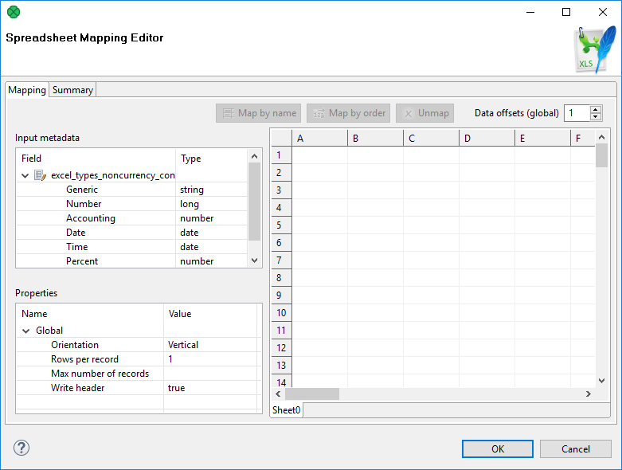
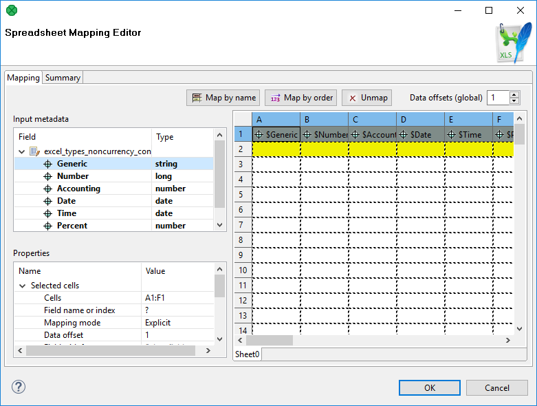
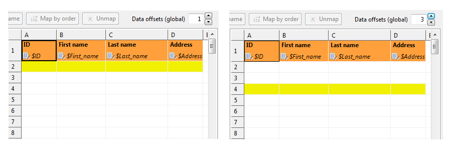
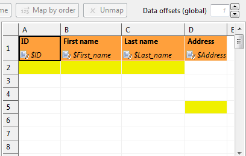
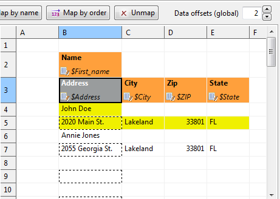
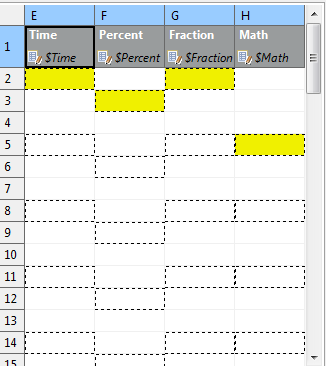
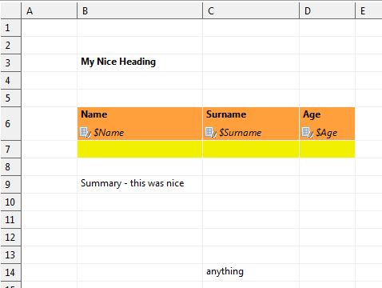
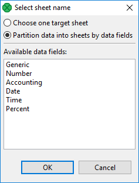
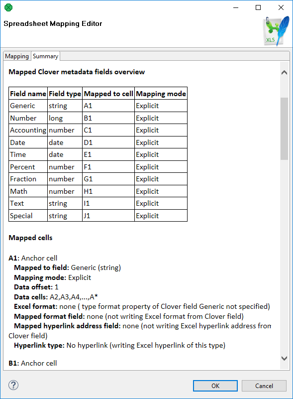

<!-- Development > Component reference > Writers > SpreadsheetDataWriter -->

### SpreadsheetDataWriter

| [Short description](spreadsheetwriter.md#short-description) |
| --- |
| [Ports](spreadsheetwriter.md#ports) |
| [Metadata](spreadsheetwriter.md#metadata) |
| [SpreadsheetDataWriter attributes](spreadsheetwriter.md#spreadsheetdatawriter-attributes) |
| [Details](spreadsheetwriter.md#details) |
| [Examples](spreadsheetwriter.md#examples) |
| [Best practices](spreadsheetwriter.md#best-practices) |
| [Notes and limitations](spreadsheetwriter.md#notes-and-limitations) |
| [Compatibility](spreadsheetwriter.md#compatibility) |
| [Troubleshooting](spreadsheetwriter.md#troubleshooting) |
| [See also](spreadsheetwriter.md#see-also) |

#### Short description

**SpreadsheetDataWriter** writes data to spreadsheets – XLS or XLSX files.

The component can insert, overwrite or append data, it allows you to work with multiline records, it supports formatting and writing data vertically or horizontally. It can be used for filling in forms.

| Data output | Input ports | Output ports | Transformation | Transf. required | Java | CTL | Auto-propagated metadata |
| --- | --- | --- | --- | --- | --- | --- | --- |
| XLS(X) file | 1 | 0-1 | **⨯** | **⨯** | **⨯** | **⨯** | **⨯** |

#### Ports

| Port type | Number | Required | Description | Metadata |
| --- | --- | --- | --- | --- |
| Input | 0 | **✓** | Incoming records to be written out to a spreadsheet. | Any |
| Output | 0 | **⨯** | For port writing. See [Writing to output port](examples-of-file-url-in-writers.md#writing-to-output-port). | One field (`byte`, `cbyte`). |

#### Metadata

**SpreadsheetDataWriter** does not propagate metadata.

**SpreadsheetDataWriter** has no metadata template.

Input metadata of **SpreadsheetDataWriter** can have arbitrary field data types; writing lists and maps is not supported as there are no list and byte fields in `.xls` files.

#### SpreadsheetDataWriter attributes

| Attribute | Req | Description | Possible values |
| --- | --- | --- | --- |
| Basic |  |  |  |
| File URL | yes | Specifies where data will be written to: an XLS or XLSX file, an output port, or a dictionary. See [Supported file URL formats for Writers](examples-of-file-url-in-writers.md). In the case of writing to an output port, **Type of formatter** must be set up to **XLS** or **XLSX**. |  |
| Sheet |  | A name or number (zero-based) of the sheet to write into. Unless set, a sheet with a default name is created and inserted after all existing sheets. If the property is just a number, it is treated as the index of the sheet, not the name (e.g. entering `2` creates a file with 3 sheets: Sheet0, Sheet1, and Sheet2 which contains the required data). You can specify multiple sheets separated by a semicolon (;). Note that Excel sheet name length has a limit of 31 characters, see [sheet name length limit](spreadsheetwriter.md#spreadsheetdatawriter-sheet-name-length). For details on partitioning, see [Writing techniques & tips for specific use cases](spreadsheetwriter.md#writing-techniques-tips-for-specific-use-cases). | 0-N |
| Mapping | [[1]](spreadsheetwriter.md#spreadsheetwriter-attributes-fn01) | A visual editor in which you define how input data is mapped to the output spreadsheet(s). For more information, see [Details](spreadsheetwriter.md#details). |  |
| Mapping URL | [[1]](spreadsheetwriter.md#spreadsheetwriter-attributes-fn01) | An external file containing the mapping definition. |  |
| Write mode |  | Determines how data is written to the output spreadsheet. Possible values:  - **Overwrite in sheet (in-memory)** – overwrites existing cells if present; - **Overwrite sheet (streaming - XLSX only)** - overwrites the whole specified sheet with new data; - **Insert into sheet (in-memory)** – inserts new data to the mapped area, shifting existing cells down if present; - **Append to sheet (in-memory)** – appends data at the end of an existing data column/row; - **Create new file (in-memory)** – replaces existing file and work in the in-memory mode; - **Create new file (streaming - XLSX only)** – replaces an existing file with a newly created one making streaming mode possible; significantly faster than other write modes.  In-memory writing modes store all values in memory allowing for faster reading. Suitable for smaller files. In streaming mode (available for XLSX only), the file is written out directly without storing anything in memory. Streaming should thus allow you to write bigger files without running out of memory. | see Description |
| Actions on existing sheets |  | Defines what action is performed if the specified **Sheet** already exists in the target spreadsheet. The attribute works in accordance with **Write mode**. Available options:  - **Do nothing, keep existing sheets and data** – default option; no operation is performed prior to writing; insert/overwrite/append modes apply; - **Clear target sheet(s)** – specified **Sheet**(s) are cleared prior to writing; **Write mode** setting is ignored; - **Replace all existing sheets** – all sheets are removed prior to writing to the file; equivalent to `Create new file` option in **Write mode**. | See Description. |
| Advanced |  |  |  |
| Template File URL |  | A template spreadsheet file which is duplicated into the output file and populated with data according to the defined mapping. The template can be any spreadsheet, typically containing the header, footer and data sections (one empty line to be replicated during writing).  For more tips, see [Writing techniques & tips for specific use cases](spreadsheetwriter.md#writing-techniques-tips-for-specific-use-cases). Formats of the output file and the template file must match. Usage of XLTX files is limited (see [Notes and limitations](spreadsheetwriter.md#notes-and-limitations)), rather than XLTX, use XLSX files as templates. |  |
| Create directories |  | If set to `true`, non existing directories included in the **File URL** path will be automatically created. | false (default) \| true |
| Records per file |  | A maximum number of records that are written to a single file. See [Partitioning output into different output files](partitioning-output-into-different-output-files.md) | 1-N |
| Number of skipped records |  | A total number of records throughout all output files that will be skipped. See [Selecting input records](selecting-input-records.md). | 0-N |
| Max number of records |  | A total number of records throughout all output files that will be written out. See [Selecting input records](selecting-input-records.md). | 0-N |
| Partition key |  | A key whose values control the distribution of records among multiple output files. For more information, see [Partitioning output into different output files](partitioning-output-into-different-output-files.md). |  |
| Partition lookup table | [[2]](spreadsheetwriter.md#spreadsheetwriter-attributes-fn02) | The ID of a lookup table. The table serves for selecting records which should be written to the output file(s). For more information, see [Partitioning output into different output files](partitioning-output-into-different-output-files.md). |  |
| Partition file tag |  | By default, output files are numbered. If this attribute is set to `Key file tag`, output files are named according to values of **Partition key** or **Partition output fields**. For more information, see [Partitioning output into different output files](partitioning-output-into-different-output-files.md). | Number file tag (default) \| Key file tag |
| Partition output fields | [[2]](spreadsheetwriter.md#spreadsheetwriter-attributes-fn02) | Fields of **Partition lookup table** whose values serve for naming output file(s). For more information, see [Partitioning output into different output files](partitioning-output-into-different-output-files.md). |  |
| Partition unassigned file name |  | The name of a file unassigned records should be written into (if there are any). Unless specified, data records whose key values are not contained in **Partition lookup table** are discarded. For more information, see [Partitioning output into different output files](partitioning-output-into-different-output-files.md). |  |
| Sorted input |  | In case partitioning into multiple output files is enabled, all output files are open at once. This could lead to an undesirable memory footprint for many output files (thousands). Moreover, for example unix-based OS usually have very strict limitation of number of simultaneously open files (1024) per process. In case you run into one of these limitations, consider sorting the data according to partition key using one of our standard sorting components and set this attribute to true. The partitioning algorithm does not need to keep open all output files, just the last one is open at one time. For more information, see [Partitioning output into different output files](partitioning-output-into-different-output-files.md). | false (default) \| true |
| Type of formatter |  | Specifies the formatter to be used. By default, the component guesses according to the output file extension – `XLS` or `XLSX`. | Auto (default) \| XLS \| XLSX |
| Create empty files |  | If set to `false`, prevents the component from creating an empty output file when there are no input records. | true (default) \| false |
| Streaming window size |  | The number of last written rows available for formula evaluation in streaming mode. | 10 (default) \| 1-N |
| Cache size |  | Number of records / size of component cache. Can greatly influence performance when using **Insert into sheet (in-memory)** write mode. | 1000 (default) |
| Evaluate formula cell | [[3]](spreadsheetwriter.md#spreadsheetwriter-attributes-fn03) | Evaluate formula of a cell when writing. Can significantly reduce performance. | true (default) |

| 1 |  The two mapping attributes are mutually exclusive. You either specify the mapping yourself in **Mapping**, or supply it in an external file via **Mapping URL**. The third option is to leave all mapping blank. |
| --- | --- |

| 2 |  Either both, or neither of these attributes have to be specified. |
| --- | --- |

| 3 | When set to 'false' the result of the cell formula is not calculated. Subsequent read from the file is then unable to obtain a result value of the cell. |
| --- | --- |

#### Details

| [Introduction to spreadsheet mapping](spreadsheetwriter.md#introduction-to-spreadsheet-mapping) |
| --- |
| [Spreadsheet Mapping Editor](spreadsheetwriter.md#spreadsheet-mapping-editor) |

**SpreadsheetDataWriter** writes data to XLS or XLSX files.

It offers advanced features for creating spreadsheets:

- insert/overwrite/append modes;
- powerful visual mapping for complex spreadsheets;
  - explicitly defined mapping or dynamic auto-mapping;
  - form writing;
  - multi-line records;
- vertical/horizontal writing
- cell formatting support
- writing formulas
- streaming mode for performance and huge data loads
- dynamic file/sheet partitioning
- template support

Supported file formats:

- XLS: only Excel 97/2003 XLS files (BIFF8);
- XLSX: Open Document Format, Microsoft Excel 2007 and newer.

Supported outputs:

- local or remote (FTP, HTTP, **CloverDX Server** sandbox, etc. – see **File URL** in [SpreadsheetDataWriter attributes](spreadsheetwriter.md#spreadsheetdatawriter-attributes))
- output port
- dictionary

##### Introduction to spreadsheet mapping

A mapping tells the component how to write **CloverDX** records to a spreadsheet. The mapping defines where to put metadata information, data, format, writing orientation, etc.

In the mapping, you define a binding between a Clover field and so called *leading cell*. Data for that field is written into the spreadsheet beginning at the leading cell position; either downwards (vertical orientation; default) or to the right (horizontal).

Each leading cell-field binding is independent of each other. This can be used to create complex mappings (e.g. one record can be mapped to multiple rows; see **Rows per record** global mapping property).

Each Clover field can be mapped to a spreadsheet cell in one of the following *Mapping modes*:

- **Explicit** – statically maps a field to a fixed leading cell of your preference. Typically the most used mapping mode for the writer (see [Basic mapping example](spreadsheetwriter.md#basic-mapping-example)). Explicit mode can be combined with other mapping modes.
> [!TIP]
> To map a field (or a whole record) explicitly, simply drag the field (record) to the spreadsheet preview area and drop it onto desired location. You can select multiple fields.

- **Map by order** - dynamic mapping mode; cells in **by order** mode are filled in left-right-top-down direction with input record fields by the order in which the fields appear in the input metadata. Only fields which are not mapped explicitly and not mapped by name are taken into account.
- **Map by name** - this mode applies only to writing to an already existing sheet(s). Cells mapped **by name** are bound to input fields using 'late binding' on runtime according to their actual content, which presumably is a 'header'. The component tries to match the cell’s content with a field name or label (see [Field name vs. label vs. description](metadata-editor.md#field-name-vs-label-vs-description)) from input metadata. If such a match is found the mapped cell is bound to the corresponding input field. If there is no match for the cell (i.e. cell’s content is not a field name/label) then the cell is **unresolved** – no input field could be assigned.
  Note that unresolved cells are not a bad thing – you might be writing into say a group of similar templates, each containing just a subset of fields in the input metadata. Mappings with unresolved cells do not result in the graph failing on execution.
  This mode comes in handy when you are writing using pre-defined templates (the **Template file URL** attribute). See [Writing techniques & tips for specific use cases](spreadsheetwriter.md#writing-techniques-tips-for-specific-use-cases).
  > [!NOTE]
  > Both **Map by order** and **Map by name** modes try to automatically map the contents of the output file to the input metadata. Thus these modes are useful in cases when you write into multiple files and you want to design a single 'one-fits-all' generic mapping, typically for multiple templates. Replacing input metadata with another does not require any change in the mapping – it is recomputed accordingly to the mapping logic.
- **Implicit** – default case when the mapping is blank. The component will assume **Write header** to `true` and map all input fields by order, starting in top left hand corner.

##### Spreadsheet Mapping Editor

Spreadsheet mapping editor is the place where you define your mapping and its properties. The mapping editor previews sheets of the output file (if any; otherwise shows a blank spreadsheet). However, the same mapping is applied to a whole group of output files/sheets (e.g. when partitioning into multiple sheets or files).

To start mapping, fill in the **File URL** and (optionally) **Sheet** attributes with the file (and sheet name) to write into, respectively. After that, edit **Mapping** to open the spreadsheet mapping editor. When you write into a new (empty) spreadsheet, the mapping editor will appear blank like this:

*Figure 401. Spreadsheet Mapping Editor*

In the editor, you map the input fields on the left hand to the spreadsheet on the right hand. Either use mouse drag’n’drop or the **Map by name**, **Map by order** buttons to create leading cells in the spreadsheet.

You can see the following parts of the editor:

- Toolbar – buttons controlling how you **Map** Clover fields to spreadsheet data (either **by order**, or **by name**) and global **Data offsets** control (see [Advanced mapping options](spreadsheetwriter.md#advanced-mapping-options) for an explanation of data offsets);
- Sheet preview area – this is where you create and modify all the mapping of the output file;
- **Input metadata** – Clover fields you can map to spreadsheet cells. This is the metadata assigned to the input edge (you **cannot** edit it);
- **Properties** – controls properties of mapped cells and **Global** mapping attributes; can be applied to a single or a group of cells at a time;
- **Summary** tab – a place where you can review the Clover-to-spreadsheet mapping you have made.

###### Colors in Spreadsheet Mapping Editor

Cells in the preview area highlighted in various colors to identify whether and how they are mapped.

- Orange are the **leading cells** forming the header. Properties can be adjusted on each orange cell to create complex mappings, see [Advanced mapping options](spreadsheetwriter.md#advanced-mapping-options).
- Cells in dashed border, which appear only when a leading cell is selected, indicate the data area.
- Yellow cells demonstrate the first record which will be written.

#### Examples

| [Basic mapping example](spreadsheetwriter.md#basic-mapping-example) |
| --- |
| [Advanced mapping options](spreadsheetwriter.md#advanced-mapping-options) |

##### Basic mapping example

A typical example of what you will want to do in **SpreadsheetDataWriter** is writing into an empty spreadsheet. This section describes how to do that in a few easy steps.

1. Open **Spreadsheet Mapping Editor** by editing the **Mapping** attribute;
2. Click the whole record in **Input metadata** (`excel_types_nocurrency` in the example below) and drag it to the spreadsheet preview area to cell A1 and drop.
   You will see that for each field of the input record a leading cell is created, producing a default explicit mapping (explained in [Introduction to Spreadsheet mapping](spreadsheetwriter.md#introduction-to-spreadsheet-mapping)). See [Explicit mapping of the whole record](spreadsheetwriter.md#ssdw-fig-basic-map);
3. In **Properties** (bottom left hand corner), make sure **Write header** is set to `true`. This writes field names (labels actually) to leading cells first, followed by actual data; use this whenever you want to output a header;
4. Furthermore in **Properties**, notice that **Orientation** is **Vertical**. This makes the component produce output by rows (opposite to **Horizontal** orientation, where writing advances by columns).
5. Notice that **Data offsets (global)** is set to 1. That means that data will be written 1 row below the leading cell, making room for the header cell.
   > [!NOTE]
   > Actually, you will achieve the same result if you leave the mapping blank (implicit mapping). In that case, the first row is mapped by order.
   
   *Figure 402. Explicit mapping of the whole record*

##### Advanced mapping options

This section provides an explanation of some more advanced concepts building on top of the [Basic mapping example](spreadsheetwriter.md#basic-mapping-example).

| [Data offsets](spreadsheetwriter.md#data-offsets) |
| --- |
| [Rows per record](spreadsheetwriter.md#rows-per-record) |
| [Combination of data offsets and rows per record](spreadsheetwriter.md#combination-of-data-offsets-and-rows-per-record) |
| [Max number of records](spreadsheetwriter.md#max-number-of-records) |
| [Formatting cells (field with format)](spreadsheetwriter.md#formatting-cells-field-with-format) |
| [Writing formulas](spreadsheetwriter.md#writing-formulas) |
| [Cells with hyperlink](spreadsheetwriter.md#cells-with-hyperlink) |

###### Data offsets

**Data offsets** determines the position where data is written relative to the leading cell position.

Basically, its value represents a number of rows (in vertical mode) or columns (in horizontal mode) to be skipped before the first record is written (relative to the leading cell).

Data offset 0 does not skip anything and data is written right at the leading cell position (**Write header** option does not work for this setting).

Data offset 1 is typically used when header is to be written at the leading cell position – so you need to shift the actual data by one row down (or column to the right).

Click the **arrow** buttons in the **Data offsets (global)** control to adjust data offsets for the whole spreadsheet.

Additionally, you can use the spinner  in menu:Properties [Selected cells > Data offset] of each leading cell (orange) to adjust data offset locally, i.e. for a particular column only. Notice how modifying data offset is visualized in the sheet preview – the 'omitted' rows change color. By following dashed cells, which appear when you click a leading cell, you can quickly check where your record will be written.
> [!TIP]
> The **arrow** buttons in **Data offsets (global)** only *shift* the data offset property of each cell either up or down. So mixed offsets are retained, just shifted as desired. To *set* all data offsets to a single value, enter the value into the number field of Data offsets (global). Note that if there are some mixed offsets, the value is displayed in gray.

*Figure 403. The difference between global data offsets set to 1 (default) and 3.In the right hand figure, writing would start at row 4 with no data written to rows 2 and 3.*

*Figure 404. Global data offsets is set to 1.In the last column, it is locally changed to 4.In the output file, the initial rows of this column would be blank, data would start at D5.*

###### Rows per record

**Rows per record** is a **Global** property specifying a gap between rows. The default value is 1 (i.e. there is no gap). Useful when mapping multiple cells above each other (for a single record) or when you need to print blank rows in between your data. Best imagined if you look at the figure below:

*Figure 405. With Rows per record set to 2 in leading cellsName and Address, the component always writes one data row, skips one and then writes again.This way, various data does not get mixed (overwritten by the other one).For a successful output, make sure Data offsets is set to 2.*

###### Combination of data offsets and rows per record

Combination of **Data offsets** (global and local) and **Rows per record** – you can put the settings described in preceding bullet points together. See example:

*Figure 406. Rows per record is set to 3.Data in the first and third column will start in their first row (because of their data offsets being 1).The second and fourth columns have data offsets 2 and 4, respectively.The output will, thus, be formed by 'zig-zagged' cells(the dashed ones – follow them to make sure you understand this concept clearly).*

###### Max number of records

**Max number of records** is a **Global** property which you can specify via component attributes, too (see [SpreadsheetDataWriter attributes](spreadsheetwriter.md#spreadsheetdatawriter-attributes)). If you reduce it, you will notice the number of dashed cells in the spreadsheet preview reduces, as well (highlighting only the cells which will be written out in fact).

###### Formatting cells (field with format)

In a spreadsheet, every single cell can have its own format (in Excel, right-click on a cell → Format cells; Number tab). This format is represented by a *format string* (not **CloverDX** format string, but Excel-specific format string). Since format in **CloverDX** is defined globally for a field in metadata, not per record, writing formats to Excel can be tricky. **SpreadsheetDataWriter** offers two ways of writing Excel-specific format to cells:

- Case 1:
  You can specify the format for a metadata field (its **Format** property in metadata). That means all values of the field written to the sheet will have the specified format. You need to prefix the **Format** in metadata with `excel:` (e.g. `excel:0.000%` for percents with three decimals) because the component ignores standard format strings (as the Clover-to-Excel format conversion is not possible).
- Case 2:
  You provide two input fields for a single cell: one specifying the cell value and the other defining its format.
> [!NOTE]
> - This utilizes the full power of Excel where formats are set per-cell rather than per-column.
> - You pass the format in the data as an extra 'string' value.
> - Remember, the format is specified in Excel terms, not Clover.
> - Use **Field with format** in menu:Properties [Selected cells] of the leading (orange) cell to specify the input field containing the format (string).

Which format is used if both are set?

- Do you have the format mapped by the **Field with format** property? Yes – the component uses it.
- Is **Field with format** not specified or a value of that particular field is empty (null or empty string)? Yes – use **Format** from the metadata field (if set with the `excel:` prefix). See also [Field details](metadata-editor.md#field-details).

You can use the `excel:General` format – either in **Field with format** or in metadata **Format** – the output will be set to general format (Excel terms).
Example 383. Writing Excel format
Let us have two fields: `fieldValue (integer)` and `fieldFormat (string)` mapped onto cell A1 (one as value, the other as **Field with format**). Imagine these incoming records:

- (100, `"#00,0"`)
  - writes value `100` and format `"#00,0"` into cell A1
- (100, “General”)
  - writes value `100` into cell A1 and sets its format to `General`
- (100, `""`) or (100, null)
  - writes value `100` into cell A1 and since `fieldFormat` is empty, it looks into the **Format** metadata attribute of `fieldValue` (NOT `fieldFormat`!):
    1. if there is no format, uses `General`;
    2. if there is the “excel:XYZ” format string, applies format XYZ to the cell;
    3. if there is another format (anything not prefixed by `excel:`), uses General (Clover-to-Excel format conversion is not performed).
> [!NOTE]
> When Excel format is specified in **Metadata** ****Format** it MUST be prefixed by `excel:` so that **CloverDX** can know that the format string is specific to Excel-only use. `Example: "excel:0.000%"`
>
> When Excel format is passed *in data*, as the aforementioned `fieldFormat`, it MUST NOT be prefixed in any way. `Example: "0.000%"`
>
> Note that the `excel:` format string matters when reading the output back with spreadsheet readers - **SpreadsheetDataReader**. Common readers (such as **FlatFileReader**) completely ignore `excel:`. They consider it an empty format string.

###### Writing formulas

SpreadsheetDataWriter lets you write formulas into particular cells. Formula is set in the Properties pane. Map the field with a formula and change **Is Formula** (in Properties) to **Yes**.
> [!IMPORTANT]
> There are some limitations when writing formulas in streaming mode. Spreadsheets usually contain pre-computed values of formulas to speed up opening the file. In streaming write mode, CloverDX evaluates the formula and saves the pre-computed value only if all the referenced cells are available in the [streaming window](spreadsheetwriter.md#streaming-window-size) (last 10 rows by default). Otherwise, it writes a placeholder value (e.g. 0 or empty string) and the actual values are calculated when the file is opened in Excel for the first time.

###### Cells with hyperlink

**SpreadsheetDataWriter** lets you write hyperlinks into particular cells. Each hyperlink is defined using two input fields. One input field defines the text of the link, other field defines the target of the link.

Links can be of several types: **Document**, **Email**, **File** or **URL**.

Link is created in the **Properties** pane. Map the field with a link text to desired cell, change **Hyperlink type** (in **Properties**) to desired type and select field with target in **Field with hyperlink address**.

Hyperlinks are persisted to a file along with font and style (blue and underline).
Example 384. Writing hyperlinks
Following are examples of proper addresses for all hyperlink types:

- **Document**
  - `K2` for a link to cell K2 in the same sheet.
  - `'my sheet'!K2` for a link to cell K2 in a sheet with name `my sheet`.
- **Email**
  - `mailto:johndoe@company.com`
- **File**
  - `report_details.txt` for a relative link to a file in the same directory as the spreadsheet file.
  - `C:/path/to/file/report_details.txt` for an absolute link to a file.
- **URL**
  - `http://www.cloverdx.com`

#### Best practices

##### Writing techniques & tips for specific use cases

| [Writing using template](spreadsheetwriter.md#writing-using-template) |
| --- |
| [Filling forms](spreadsheetwriter.md#filling-forms) |
| [Charts and formulas](spreadsheetwriter.md#charts-and-formulas) |
| [Multiple write passes into one sheet](spreadsheetwriter.md#multiple-write-passes-into-one-sheet) |
| [Partitioning](spreadsheetwriter.md#partitioning) |
| [Writing huge files](spreadsheetwriter.md#writing-huge-files) |
| [Reviewing your mapping](spreadsheetwriter.md#reviewing-your-mapping) |

###### Writing using template

You may want to prepare in advance a nicely formatted template in Excel, (including some static headers, footer, etc.) and use **CloverDX** to just fill in the data for you. And it might be that you will want to reuse the template without overwriting it.

This is where **SpreadsheetDataWriter** template feature comes in handy. The component can take a previously designed template Excel file (see **Template File URL** in [SpreadsheetDataWriter attributes](spreadsheetwriter.md#spreadsheetdatawriter-attributes)), make a copy of it into the designated output file (see **File URL**) and write data to it, retaining the rest of the template.

A template can be any Excel file, usually containing three sections: the header, one template row for data and the rest as the footer.

*Figure 407. Writing into a template. Its original content will not be affected,your data will be written into Name, Surname and Age fields.*

Notice the template row. It is a row like any other but in the mapping editor, it is designated as the first row of mapped data. The component duplicates that row each time it writes a new data. This way you can assign arbitrary formatting, colors, etc. on this data row and it is applied to all written rows.

The template file is not changed or affected in any other way.
> [!IMPORTANT]
> There is only one reasonable setting when using templates, although all other modes work as expected (they do not, however, produce results that you would want). The settings are:
>
> - **Sheet** – select the sheet from the template (by number or name, do not create new sheet);
> - **Mapping** – this is one of the cases where `Map by name` makes sense. Use the header of the template where applicable. Of course, you can map fields as usual.
> - **Write mode** – `Insert`
> - **Actions on existing sheets** – `Do nothing, keep existing sheets and data`

###### Filling forms

You can use the component to write into forms without affecting its original boxes. Use these settings:

Send just one input record to the component’s input containing all the form values. Set **File URL** to the form file to be filled. Then map the input fields explicitly one by one into corresponding form cells using the preview sheet.

Next, use these settings:

- **Write header** – `false`;
- **Data offsets (global)** – 0 (this ensures data will be written right into the leading cells you have mapped – the orange ones).

###### Charts and formulas

If you use Insert, Append or Overwrite modes, formulas and charts that work with the data areas written in **CloverDX** will be properly updated when viewed in Excel.
> [!NOTE]
> Generating charts or other Excel objects is not currently supported.

###### Multiple write passes into one sheet

You can use multiple sequential writes into a single sheet to produce complex patterns. To do so, set up multiple **SpreadsheetDataWriter** components writing the same file/sheet and feed them various inputs.
> [!IMPORTANT]
> Do not forget to put multiple components writing to the same file into different phases. Otherwise the graph will fail on write conflict.

Typically, you will use the `Overwrite in sheet (in-memory)` write mode for all components in the sequence.

###### Partitioning

A useful technique is partitioning into individual sheets according to values of a specified key field (or more fields). Thus you can write, for example, data for different countries into different sheets. Simply choose `Country` as the partitioning key. This is done by editing the **Sheet** attribute; switch to **Partition data into sheets by data fields** and select a field (or more fields using Ctrl+click or Shift+click).

*Figure 408. Partitioning by one data field*

You can partition according to more than one field. In that case, output sheet names will be a compound of field names you have selected. **Example:** You have customer orders stored in one CSV file. You would like to separate them into sheets, for example, according to a name of the shop and a city. Use **SpreadsheetDataWriter** in create new file mode while partitioning according to the two fields. It will produce sheets like:

`Pete’s Grocery,New York`

`Hoboken Deli,New Jersey`

`Al’s Hardware,New York`

etc., each of them containing data just for one shop.

See also [Partitioning output into different output files](partitioning-output-into-different-output-files.md).

###### Writing huge files

Although Excel format is not primarily designed for big data loads, its processing can easily grow to enormous memory requirements.

The format itself has some limitations:

- **Excel 97/2003 – XLS**
  - Maximum of 65,535 rows and 256 columns per sheet
  - Maximum number of sheets – 255
- **Excel 2007 and newer – XLSX**
  - Maximum number of rows: unlimited (but be aware that Excel itself works only with first 1,048,576 rows the file contains). All the data can be read back by **SpreadsheetDataReader** or other tools that support large files.
  - Maximum number of columns: 16,384
  - Maximum number of sheets: unlimited (as long as you have memory)
> [!TIP]
> Working with larger spreadsheets is memory consuming and although the component does its best to optimize its memory footprint, keep these few tips in mind:
>
> - When mapping in the Spreadsheet mapping editor, memory consumption for the **Designer** might temporarily rise to over a gigabyte of memory – so be sure to set enough heap space for the **Designer** itself (see [Main tab](running-graphs.md#main-tab) in [Run configuration](running-graphs.md#run-configuration)).
> - Memory consumption is affected by how Excel organizes the file internally so two files with the same amount of data in it can have significantly different memory requirements.
> - Use **streaming mode** whenever possible. It is several times *faster* than other *write modes*. Switch to `DEBUG` mode in graph’s **Run configurations** to detect whether the streaming mode is on or off. To learn how to do that, see [Main tab](running-graphs.md#main-tab) in [Run configuration](running-graphs.md#run-configuration).
> - When using the `Overwrite sheet (streaming - XLSX only)` write mode, the entire spreadsheet file still needs to be loaded before writing which can cause major memory requirements. Make sure to set enough heap space for **CloverDX runtime** if you are working with larger spreadsheet files (see [Runtime configuration](../admin/designer-configuration.md#runtime-configuration)).

Usually you would use the `Create new file (streaming – XLSX only)` and `Overwrite sheet (streaming - XLSX only)` write modes. Other write modes do not support streaming.

###### Reviewing your mapping

In complex mappings with many metadata fields, you might want to check if everything has been mapped properly. Whenever during your work in **Spreadsheet Mapping Editor**, switch to the **Summary** tab and observe an overview of leading cells and mappings like this one:

*Figure 409. Mapping summary*

#### Notes and limitations

- **Encryption**
  Writing of encrypted XLS or XLSX files is not supported (unlike [SpreadsheetDataReader](spreadsheetreader.md) which can read encrypted files)
- **XLTX vs. XLSX templates**
  For technical reasons, it is currently not possible to use an XLTX template for XLSX output. Nevertheless, the difference between XLTX and XLSX files is minimal. Therefore, we recommend you use XLSX as the format for both the template and output files. For XLS and XLT files, there is no such limitation.
- **Mapping editor on server files**
  A spreadsheet mapping editor on server files can operate as usual, except in a case when **File URL** contains wildcard characters. In that case, **CloverDX Designer** is not able to find matching server files and the mapping editor shows no data in the spreadsheet preview. This is going to be fixed in next releases.
- **Error reporting**
  There is no error port on the component. By design, either the component configuration is valid and will then succeed in writing records to a file, or it will fail with a fatal error (invalid configuration, no space left on device, etc.). No errors per input record are generated.
- **Sheet name length**
  Excel has a limit of 31 characters for sheet name length; therefore, the POI library silently truncates sheet names to 31 characters. This can lead to a following error when the library truncates the unique part of the sheet name:
  Component [SpreadsheetDataWriter:SPREADSHEET_DATA_WRITER] finished with status ERROR. The workbook already contains a sheet of this name
- **Width of columns**
  If the **SpreadsheetDataWriter** writes to newly created sheet, or to existing sheet which is cleaned first (i.e. **Actions on existing sheets** is set to **Clear target sheet(s)**), the component automatically adjusts width of columns so that it matches width of the most widest cell content in each particular column. Column widths *is not* adjusted if a template is used or when writing into existing sheet (which is not cleaned first). This means that column widths from template are preserved. Also column widths of already existing sheets are kept when appending/inserting/overwriting data of that sheet.
- **Lists and Maps**
  **SpreadsheetDataWriter** cannot write lists and maps. Lists of `string`s, `byte`s and `cbyte`s are converted to string.
- SpreadsheetDataWriter ignores excel:raw format. When it’s set, the component acts as if the format property is empty.
- **Writing formulas in streaming mode**
  Spreadsheets usually contain pre-computed values of formulas to speed up opening the file. In streaming write mode, CloverDX evaluates the formula and saves the pre-computed value only if all the referenced cells are available in the streaming window (last 10 rows by default). Otherwise, it writes a placeholder value (e.g. 0 or empty string) and the actual values are calculated when the file is opened in Excel for the first time.

#### Compatibility

| Version | Compatibility Notice |
| --- | --- |
| 4.0.7 | You can now write hyperlinks into spreadsheets. |
| 4.4.0-M2 | **SpreadsheetDataWriter** can now write to output port just to `byte` or `cbyte` field. |

#### Troubleshooting

##### SpreadsheetDataWriter Fails on Linux systems

If the component fails on Linux systems with the following error:
java.lang.NullPointerException at sun.awt.FontConfiguration.getVersion()
install the [fontconfig](https://www.freedesktop.org/wiki/Software/fontconfig/) library. Some distributions may also require *dejavu-sans-fonts* and *urw-fonts* library packages.
yum install -y dejavu-sans-fonts fontconfig urw-fonts
If the issue persists even after performing the steps above, add the following argument to [worker properties](../admin/setup.md#worker): `-Djava.awt.headless=true`.

##### Writing to dictionary fails

If you write spreadsheet to a dictionary, the attribute **Type of formatter** must be set to **XLS** or **XLSX**. It cannot be **Auto** (default value).

#### See also

| [SpreadsheetDataReader](spreadsheetreader.md) |
| --- |
| [Common properties of components](components.md#common-properties-of-components) |
| [Specific attribute types](components.md#specific-attribute-types) |
| [Common properties of Writers](common-of-writers.md) |
| [Writers comparison](common-of-writers.md#writers-comparison) |
