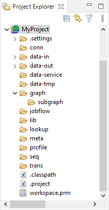
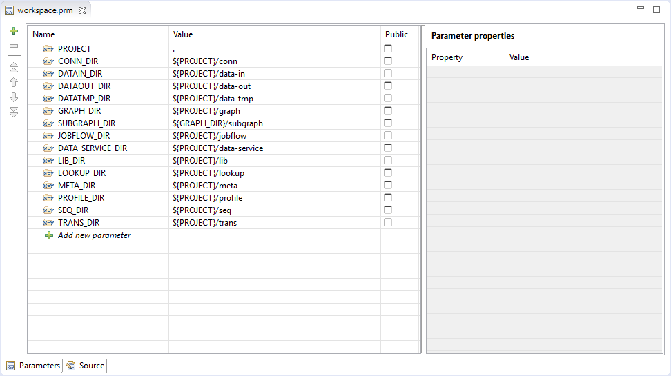

<!-- Development > Projects > Structure of CloverDX projects -->

## 9. Structure of CloverDX projects

In this chapter, we present only a brief overview of what happens when you are creating any **CloverDX** project.

This applies not only to local [CloverDX project](first-cloverdx-project.md#cloverdx-project) and [CloverDX Examples project](first-cloverdx-project.md#cloverdx-examples-project), but also to [CloverDX Server project](first-cloverdx-project.md#cloverdx-server-project).

1. [Standard structure of all CloverDX projects](structure-of-projects.md#standard-structure-of-all-cloverdx-projects)
   Each of your **CloverDX projects** has the standard project structure (unless you have changed it while creating the project).
2. [The .classpath file](structure-of-projects.md#the-classpath-file)
   This file defines the paths to `.class` and `.jar` files that can be loaded and used by transformation graphs.
3. [Workspace.prm file](structure-of-projects.md#workspaceprm-file)
   Each of your local or remote (Server) **CloverDX** projects contains the `workspace.prm` file (in the project folder) with basic information about the project.

### Standard structure of all CloverDX projects

In the **CloverDX** perspective, there is a **Project Explorer** pane on the left side of the window. In this pane, you can expand the project folder. After that, you will be presented with the folder structure. There are subfolders for:

| Purpose | Standard folder | Standard parameter | Parameter usage[[1]](structure-of-projects.md#projects-footnote1) |
| --- | --- | --- | --- |
| all connections | `conn` | `CONN_DIR` | `${CONN_DIR}` |
| input data | `data-in` | `DATAIN_DIR` | `${DATAIN_DIR}` |
| output data | `data-out` | `DATAOUT_DIR` | `${DATAOUT_DIR}` |
| temporary data | `data-tmp` | `DATATMP_DIR` | `${DATATMP_DIR}` |
| graphs | `graph` | `GRAPH_DIR` | `${GRAPH_DIR}` |
| subgraphs | `graph/subgraph` | `SUBGRAPH_DIR` | `${SUBGRAPH_DIR}` |
| jobflows (*.jbf) | `jobflow` | `JOBFLOW_DIR` | `${JOBFLOW_DIR}` |
| libraries | `lib` | `LIB_DIR` | `${LIB_DIR}` |
| lookup tables | `lookup` | `LOOKUP_DIR` | `${LOOKUP_DIR}` |
| metadata | `meta` | `META_DIR` | `${META_DIR}` |
| sequences | `seq` | `SEQ_DIR` | `${SEQ_DIR}` |
| transformation definitions (both source files and classes) | `trans` | `TRANS_DIR` | `${TRANS_DIR}` |

| 1 |  For more information about parameters, see [Parameters](parameters.md), and about their usage, see [Using parameters](parameters.md#using-parameters). |
| --- | --- |
> [!IMPORTANT]
> Remember that using parameters in **CloverDX** ensures that such a graph, metadata or any other graph element can be used in any place without necessity of its renaming.

*Figure 103. Project folder structure inside Project Explorer pane*

### The .classpath file

The `.classpath` file defines the paths to `.class` and `.jar` files that can be loaded and used by transformation graphs.

The following configuration is reported as warning.

- References to nearby projects (configured in **project** ****Properties** under **Java Build Path**).
- Usage of non-standard classpath containers (**project** ****Java build path** under **Libraries** ****Add Library**).
- Usage of classpath variables (**project** ****Java build path** under **Libraries** ****Add Variable**)
- Usage of non-standard output folder. The `trans` is only accepted value.

If a classpath in a remote project contains reference to other sandbox, a warning on project level is displayed.

### Workspace.prm file

You can look at the `workspace.prm` file by clicking this item in the **Project Explorer** pane and right-clicking and choosing **Open With** ****CloverDX Parameters Editor** from the context menu.

You can see the parameters of your new project.
> [!NOTE]
> The parameters of imported projects may differ from the default parameters of a new project.

*Figure 104. Workspace.prm file*
