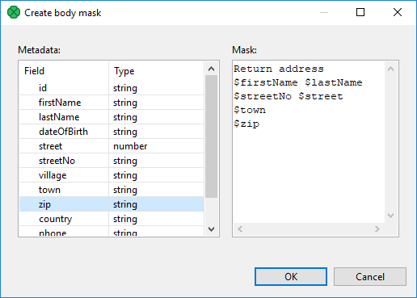

<!-- Development > Component reference > Writers > StructuredDataWriter -->

### StructuredDataWriter


| [Short description](structurewriter.md#short-description) |
| --- |
| [Ports](structurewriter.md#ports) |
| [Metadata](structurewriter.md#metadata) |
| [StructuredDataWriter attributes](structurewriter.md#structureddatawriter-attributes) |
| [Details](structurewriter.md#details) |
| [Examples](structurewriter.md#examples) |
| [Best practices](structurewriter.md#best-practices) |
| [Troubleshooting](structurewriter.md#troubleshooting) |
| [See also](structurewriter.md#see-also) |

#### Short description

**StructuredDataWriter** writes data to files (local or remote, delimited, fixed-length, or mixed) with a user-defined structure. It can also compress output files and write to an output port, or dictionary.

| Data output | Input ports | Output ports | Transformation | Transf. required | Java | CTL | Auto-propagated metadata |
| --- | --- | --- | --- | --- | --- | --- | --- |
| structured flat file | 1-3 | 0-1 | **⨯** | **⨯** | **⨯** | **⨯** | **⨯** |

#### Ports

| Port type | Number | Required | Description | Metadata |
| --- | --- | --- | --- | --- |
| Input | 0 | **✓** | Records for body | Any |
| 1 | **⨯** | Records for header | Any |  |
| 2 | **⨯** | Records for footer | Any |  |
| Output | 0 | **⨯** | For port writing. See [Writing to output port](examples-of-file-url-in-writers.md#writing-to-output-port). | One field (`byte`, `cbyte`, `string`). |

#### Metadata

StructuredDataWriter does not propagate metadata.

StructuredDataWriter has no metadata templates.

Metadata on an output port has one field (`byte`, `cbyte` or `string`).

#### StructuredDataWriter attributes

| Attribute | Req | Description | Possible values |
| --- | --- | --- | --- |
| Basic |  |  |  |
| File URL | yes | An attribute specifying where received data will be written (flat file, output port, dictionary). See [Supported file URL formats for Writers](examples-of-file-url-in-writers.md). |  |
| Charset |  | Encoding of records written to the output. | UTF-8 (default) \| <other encodings> |
| Append |  | By default, new records overwrite the older ones. If set to `true`, new records are appended to the older records stored in the output file(s). | false (default) \| true |
| Body mask |  | A mask used to write the body of output file(s). It can be based on the records received through the first input port. For more information about the definition of **Body mask** and resulting output structure, see [Masks and output file structure](structurewriter.md#masks-and-output-file-structure). | [Default body structure](structurewriter.md#default-body-structure) (default) \| user-defined |
| Header mask | [[1]](structurewriter.md#structurewriter-attributes-fn01) | A mask used to write the header of output file(s). It can be based on the records received through the second input port. For more information about the definition of **Header mask** and resulting output structure, see [Masks and output file structure](structurewriter.md#masks-and-output-file-structure). | empty (default) \| user-defined |
| Footer mask | [[2]](structurewriter.md#structurewrite-attributes-fn02) | A mask used to write the footer of output file(s). It can be based on the records received through the third input port. For more information about the definition of **Footer mask** and resulting output structure, see [Masks and output file structure](structurewriter.md#masks-and-output-file-structure). | empty (default) \| user-defined |
| Advanced |  |  |  |
| Create directories |  | By default, non-existing directories are not created. If set to `true`, they are created. | false (default) \| true |
| Records per file |  | The maximum number of records to be written to one output file. | 1-N |
| Bytes per file |  | The maximum size of one output file in bytes. | 1-N |
| Number of skipped records |  | The number of records to be skipped, see [Selecting output records](selecting-output-records.md). | 0-N |
| Max number of records |  | The maximum number of records to be written to all output files. See [Selecting output records](selecting-output-records.md). | 0-N |
| Partition key |  | Key whose values define the distribution of records among multiple output files. For more information, see [Partitioning output into different output files](partitioning-output-into-different-output-files.md). |  |
| Partition lookup table | [[1]](structurewriter.md#structurewriter-attributes-fn01) | An ID of a lookup table serving for selecting records that should be written to output file(s). For more information, see [Partitioning output into different output files](partitioning-output-into-different-output-files.md). |  |
| Partition file tag |  | By default, output files are numbered. If it is set to `Key file tag`, output files are named according to the values of **Partition key** or **Partition output fields**. For more information, see [Partitioning output into different output files](partitioning-output-into-different-output-files.md). | Number file tag (default) \| Key file tag |
| Partition output fields | [[1]](structurewriter.md#structurewriter-attributes-fn01) | Fields of **Partition lookup table** whose values serve to name output file(s). For more information, see [Partitioning output into different output files](partitioning-output-into-different-output-files.md). |  |
| Partition unassigned file name |  | The name of a file into which unassigned records should be written if there are any. If not specified, data records whose key values are not contained in **Partition lookup table** are discarded. For more information, see [Partitioning output into different output files](partitioning-output-into-different-output-files.md). |  |
| Sorted input |  | If the partitioning into multiple output files is turned on, all output files are open at once. This could lead to an undesirable memory footprint for many output files (thousands). Moreover, for example unix-based OS usually have very strict limitation of number of simultaneously open files (1,024) per process. If you run into one of these limitations, consider sorting the data according to a partition key using one of our standard sorting components and set this attribute to true. The partitioning algorithm does not need to keep open all output files, just the last one is open at one time. For more information, see [Partitioning output into different output files](partitioning-output-into-different-output-files.md). | false (default) \| true |
| Create empty files |  | If set to `false`, prevents the component from creating an empty output file when there are no input records. | true (default) \| false |

| 1 |  Must be specified if the second input port is connected. However, it does not need to be based on input data records. |
| --- | --- |

| 2 |  Must be specified if third input port is connected. However, does not need to be based on input data records. |
| --- | --- |

#### Details

**StructuredDataWriter** can write a header, data and a footer (exactly in this order) without need to handle graph phases.

##### Masks and output file structure

###### Output file structure

- An output file consists of a header, body, and footer, in this order.
- Each of them is defined by specifying corresponding mask.
- Having defined the mask, the mask content is written repeatedly, one mask is written for each incoming record.
- If the **Records per file** attribute is defined, the output structure is distributed among various output files, but this attribute applies to **Body mask** only. The header and footer are the same for all output files.

###### Defining a mask

**Body mask**, **Header mask** and **Footer mask** can be defined in the **Mask** dialog. This dialog opens after clicking a corresponding attribute row. In its window, you can see the **Metadata** and **Mask** panes.

You can define the mask either without field values or with field values.

Field values are referred using field names preceded by a dollar sign.


*Figure 392. Create mask dialog*

You do not have to map all input metadata fields.

Output can contain additional text not coming from input metadata. E.g. `Return address` on figure above.

You can use **StructuredDataWriter** to generate XML files or to fill in the template.
Default masks
1. Default **Header mask** is empty. But it must be defined if the second input port is connected.
2. Default **Footer mask** is empty. But it must be defined if the third input port is connected.
3. Default **Body mask** is empty. However, the resulting default body structure looks like the following:
   ```xml
   <recordName>
       <field1name>field1value</field1name>
       <field2name>field2value</field2name>
       ...
       <fieldNname>fieldNvalue</fieldNname>
   </recordName>
   ```
   This structure is written to output file(s) for all records.
   If **Records per file** is set, only the specified number of records are used for body in each output file at most.

###### Notes and limitatinos

**StructuredDataWriter** cannot write lists and maps.

#### Examples

##### Writing page with header and footer

Legacy application requires data in the following file structure: header, up to five data records and blank line. Convert data to format accepted by the legacy application:

```
F0512#4d6f6465726e20616e642070756e6368206361726420636f6d70617469626c65
Francis   Smith     77
Jonathan  Brown     5
Kate      Wood      75
John      Black     3
Elisabeth Doe       87
```

###### Solution

Connect an edge providing particular records to the first input port of **StructuredDataWriter** (metadata field **body**) and edge providing a header to the second input port (metadata field **header**).

Edit the attributes:

| Attribute | Value |
| --- | --- |
| File URL | ${DATOUT_DIR}/file_$$.txt |
| Body mask | $body |
| Header mask | $header |
| Footer mask |  |
| Records per file | 5 |

Adjust the line break in the **Body mask**, **Header mask** and **Footer mask** attributes according to the input records. If input records have a line break, do not add a line break after the string `$body` and `$header`. If input records do not have a line break, add a line break after `$body` and `$header`; fill in the line break to the attribute **Footer mask** too.

#### Best practices

To write record with fixed-length metadata, use [FlatFileWriter](flatfilewriter.md) to convert several fixed-length metadata fields into one field. Subsequently write the output from **FlatFileWriter** using **StructuredDataWriter**.

We recommend users to explicitly specify **Charset**.

#### Troubleshooting

If you partition unsorted data into many output files, you may reach the limit of simultaneously opened files. This can be avoided by sorting the input and using the attribute **sorted input**.

#### See also

| [ComplexDataReader](complexdatareader.md) |
| --- |
| [MultiLevelReader](multilevelreader.md) |
| [FlatFileWriter](flatfilewriter.md) |
| [XMLWriter](extxmlwriter.md) |
| [Common properties of components](components.md#common-properties-of-components) |
| [Specific attribute types](components.md#specific-attribute-types) |
| [Common properties of Writers](common-of-writers.md) |
| [Writers comparison](common-of-writers.md#writers-comparison) |
