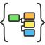

<!-- Development > Component reference > Job Control > Subgraph -->

### Subgraph

| [Short description](subgraph.md#short-description) |
| --- |
| [Ports](subgraph.md#ports) |
| [Subgraph attributes](subgraph.md#subgraph-attributes) |
| [Details](subgraph.md#details) |
| [See also](subgraph.md#see-also) |

#### Short description

The **Subgraph** component represents a whole subgraph in parent graph.

| Same input metadata | Sorted inputs | Inputs | Outputs | Each to all outputs | Java | CTL | Auto-propagated metadata |
| --- | --- | --- | --- | --- | --- | --- | --- |
| – | **⨯** | 0-n | 0–n | **⨯** | – | – | [[1]](subgraph.md#subgraph-footnote1) |

| 1 |  The component **Subgraph** can propagate metadata through itself or auto-propagate metadata on its ports. The metadata auto-propagation depends on metadata assigned on edges in the subgraph. |
| --- | --- |

#### Ports

| Port type | Number | Required | Description | Metadata |
| --- | --- | --- | --- | --- |
| Input | 0-n | [[1]](subgraph.md#subgraph-footnote2) | Input of **Subgraph** | Depends on **Subgraph** |
| Output | 0-n | [[2]](subgraph.md#subgraph-footnote3) | Output of **Subgraph** | Depends on **Subgraph** |

| 1 |  All input ports defined by the **SubgraphInput** component in corresponding subgraph are required. |
| --- | --- |

| 2 |  All output ports defined by the **SubgraphOutput** component in corresponding subgraph are required. |
| --- | --- |

#### Metadata

The component **Subgraph** can propagate metadata through itself or auto-propagate metadata on its ports.

The metadata auto-propagation depends on metadata assigned on edges in the subgraph.

#### Subgraph attributes

| Attribute | Req | Description | Possible values |
| --- | --- | --- | --- |
| Subgraph |  |  |  |
| Input mapping | no | Enables to set up input parameters and dictionaries of subgraph. |  |
| Output mapping | no | Enables to set up mapping from dictionaries in a subgraph to dictionaries in a parent graph. |  |
| Skip checkConfig | no | Enable to skip checkConfig of subgraph. | Inherited from parent job (default) \| true \| false |
| Subgraph URL | yes | URL of file with subgraph definition. | E.g. ${SUBGRAPH_DIR}/my-subgraph.sgrf |

#### Details

**Subgraph** serves for launching subgraphs from a graph. The subgraph functionality is user defined and depends on particular subgraph being used.

For more details about the subgraphs see [Subgraphs](subgraphs.md).
> [!TIP]
> Use the Ctrl+double-click shortcut to instantly open the subgraph.

#### See also

| [Common properties of components](components.md#common-properties-of-components) |
| --- |
| [Specific attribute types](components.md#specific-attribute-types) |
| [Common properties of Job Control](common-of-job-control.md) |
