<!-- Development > Job types > Subgraphs -->

## 19. Subgraphs

### Subgraphs overview

#### Subgraphs introduction

##### What is a subgraph

**Subgraph** is a user-defined reusable component with logic implemented as graph instead of Java code.

Subgraph definition is a regular graph and may use any graph elements (components, connections, lookups, sequences or parameters).

Subgraphs can be nested; a subgraph definition may use other subgraphs.

Subgraph definition is stored in a separate file with `*.sgrf` extension. In default **CloverDX** project layout, a directory `${PROJECT}/graph/subgraph` is created for storing subgraph files. You can reference this directory via the `${SUBGRAPH_DIR}` parameter.

Use the **Subgraph** component to reference a subgraph in a regular graph. Once configured with a subgraph file, the **Subgraph** component automatically updates its ports according to ports from subgraph definition.

##### What are subgraphs good for?

###### Simplifying complex transformation logic

Use subgraphs to visually reduce the number of component in complex graphs and highlight important processing logic.

###### Creating reusable blocks of logic

Subgraphs allow developing prefabricated blocks of logic that can be used by other members of development team. This approach to transformation development promotes reusability and standardization.

###### Creating connectors

Subgraphs provide an easy way to create new connectors from webservices or databases. Webservices communicate over HTTP protocol and provide data in JSON or XML format that needs to be preprocessed before use in transformation logic. Subgraphs can hide the parsing logic and provide data in easy-to-consume format.

Similarly for databases with complex relational structure, the DBAs can develop tuned-up queries for accessing data via optimized views and indices then publish the queries in the form of subgraphs as easy-to-use connectors to common data entities.

#### Design & execution

- Create a body of subgraph in the same way as an ordinary graph. You can use the same components, structure and overall approach.
- Use connections, lookup tables, dictionary, etc. All these features are available in the subgraphs as well as in the graph.
- Define an input and output interface. The interface - input and output ports of the **Subgraph** component - is defined by components **SubgraphInput** and **SubgraphOutput**.
- Launch as a single unit or from the graph. **Subgraph** can be launched as a standalone graph or as a component from a parent graph.

##### Anatomy of subgraphs

Graph defining a subgraph contains the following sections:

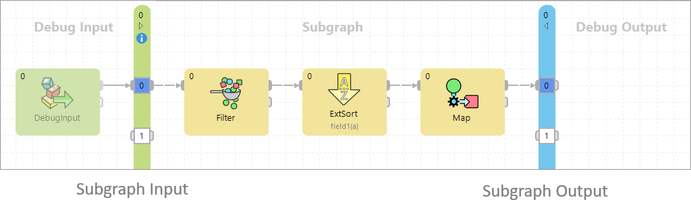
*Figure 159. Subgraph layout*

- ###### SubgraphInput
  - Represents inputs of **Subgraph**.
  - Each **Subgraph** contains exactly one instance of **SubgraphInput** component.
  - The number of its output ports define the number of subgraph’s inputs.
- ###### SubgraphOutput
  - Represents outputs of **Subgraph**.
  - **Subgraph** contains exactly one instance of the **SubgraphOutput** component.
  - Number of its input ports define the number of subgraph’s outputs.
- ###### Body of a subgraph
  - Contains implementation of subgraph logic.
  - **Subgraph** body can contain components (e.g. Reader) not connected to **SubgraphInput** or **SubgraphOutput** to access external data sources or static data sets.
  - Body of a subgraph may contain multiple phases and define component allocation for execution control. Phases and allocation are applied separately from a parent graph. For phases, this means that as a subgraph is started in a phase of its parent graph, then the subgraph’s first phase runs, then second, third, etc. After all phases of the subgraph finish, it’s considered finished by the parent graph and the next phase of the parent graph can start.
  - Components in a subgraph body can use own connections, lookups, metadata and parameters.
- ###### Debug Inputs
  - Any components connected to input ports of the **SubgraphInput** component.
  - Can be used to generate test data when developing and testing subgraph logic.
  - Components in debug input section will be automatically disabled when a subgraph is executed from a parent graph, this is visualized by graying out these components.
- ###### Debug Outputs
  - Any components connected to an output port of the **SubgraphOutput** component, or with higher phase than **SubgraphOutput**.
  - Can be used to inspect and store test data when developing and testing a subgraph.
  - Components in the debug output section will be automatically disabled when subgraph is executed from a parent graph, this is visualized by graying out these components.

#### Subgraphs vs. jobflow

While both subgraphs and jobflow provide a way of creating reusable processing logic, they serve different purposes.

Subgraphs behave the same as other built-in components; they **stream data** to a parent graph. When used in a graph, they execute **in parallel** with other components running in the graph.

Use subgraph when you need to create a new component that should be used in ETL processing and **exchange large amounts** of data with other components.

Jobflow in its nature provides step-by-step **sequential processing**. Individual steps in jobflow do not exchange large amounts of data, instead they pass status and configuration parameters to each other.

If you need to create logic that should be executed as one of several **processing steps** or you want to react to a job status after its execution, create a graph and call it from a jobflow via **ExecuteGraph**.
> [!NOTE]
> Unlike jobflow, graphs and subgraphs cannot contain cycles; thus, subgraphs cannot be called recursively.

### Using subgraphs

You need to place and configure a **Subgraph** component in order to use a subgraph as a component in a regular graph. There are three ways to do this:

- Drag and drop a subgraph `*.sgrf` file from the **Project Explorer** view into the **Graph editor**. This will automatically create a **Subgraph** component and configure it to use the selected subgraph.
- Insert subgraph using the **Add Component** dialog (activated via Shift+Space shortcut). Subgraphs can be selected as ordinary components, you can search for available subgraphs by entering the keyword “subgraph” into the search filter. The dialog displays subgraphs from a project where your graph resides.
- Drag and drop the **Subgraph** component from the **Palette** ****Job Control** section to the graph editor and configure the **Subgraph URL** attribute to point to subgraph definition.

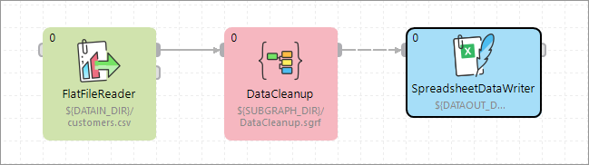
*Figure 160. Subgraph component*

#### Configuring subgraphs

**Subgraph** is configured in the same way as any other component - using attributes.

Graph parameters and dictionary passed into the graph can be changed or set up in the **Input mapping** attribute of the **Subgraph** Component.

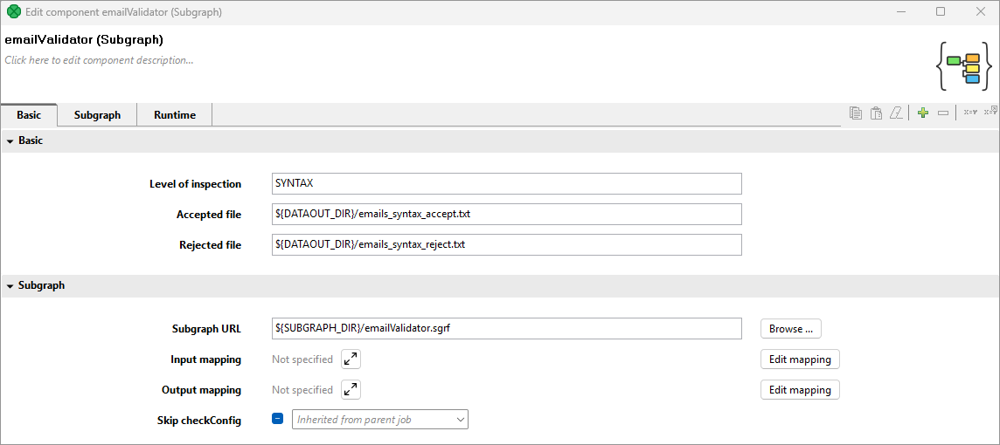
*Figure 161. Example of user-defined component*

The subgraph on figure above has three user-defined attributes: **Level of inspection,****Accepted file**, and **Rejected file**.

##### User defined component attributes - public parameters

The **Subgraph** component does not have a fixed number of attributes. The subgraph can expose any attribute of a component being used in the subgraph using **public parameters**, the values are set up as attributes of the **Subgraph** component. This way you can, for example, set up filter expression used in a subgraph using the attribute of the **Subgraph** component.

Meaning and type of user-defined attributes depend on particular subgraph.

### Developing subgraphs

There are two ways how to create a subgraph.

- [Wrapping](subgraphs.md#wrapping)
- [Creating from scratch](subgraphs.md#creating-from-scratch)

#### Wrapping

**Subgraph wrapping** is a way to convert a section of existing graph into a subgraph. Wizard will let you copy additional graph elements (metadata, connections, lookups) from a parental graph to subgraph.

##### Wrapping in steps

1. Select components you would like to move into a new subgraph, right-click on one of the selected components and choose **Wrap As Subgraph**.

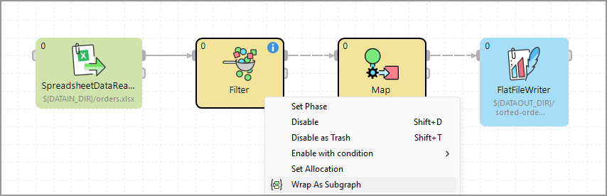
*Figure 162. Wrapping components into a subgraph*

1. Enter the name of the subgraph file (`*.sgrf`) and order of its input and output ports.

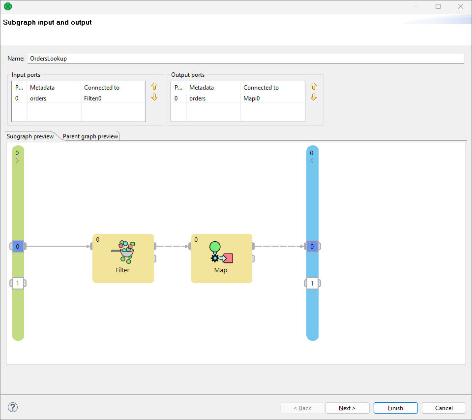
*Figure 163. Wrapping subgraph wizard*

1. A new **Subgraph** component replaced the wrapped components in the parent graph.

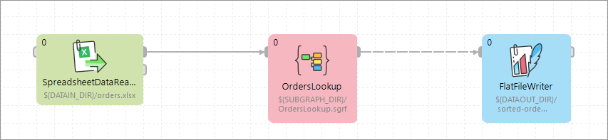
*Figure 164. CloverDX Graph with the Subgraph Component*

Continue with [Making Subgraph Configurable](subgraphs.md#making-subgraph-configurable).

#### Creating from scratch

A new subgraph can be created from scratch. It has an initial structure - it contains a debug input component, **SubgraphInput** and **SubgraphOutput** components and a sample of the subgraph body. The initial structure is a template to help you design the subgraph.

1. Choose in the main menu **File** ****New** ****Subgraph**.

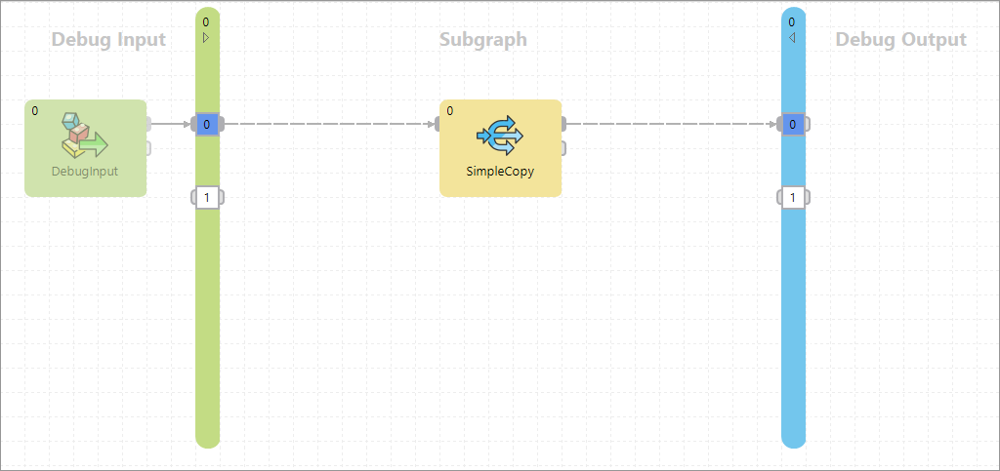
*Figure 165. A new subgraph*

1. Design the subgraph body - implement the subgraph’s logic in the central body section of the subgraph, using components, other subgraphs, etc.
2. Connect the subgraph body with the **SubgraphInput** and **SubgraphOutput** components.

Continue with [Making Subgraph Configurable](subgraphs.md#making-subgraph-configurable).

#### Making subgraph configurable

| [Optional Ports](subgraphs.md#optional-ports) |
| --- |
| [Color of Subgraph](subgraphs.md#color-of-subgraph) |
| [Icon of Subgraph](subgraphs.md#icon-of-subgraph) |

Each attribute of a component in a subgraph can be exposed as an attribute of corresponding subgraph component using public parameter. It allows you to develop more generic subgraphs.
Example 2. Using public parameter You have a subgraph filtering and aggregating records. You need to use the subgraph on several places but with different filter expression. Export the filter expression as a public parameter and let the user of the subgraph to set it up per subgraph component.
##### Exporting an attribute as subgraph parameter

To export an attribute of a component as a parameter of subgraph, choose the attribute of a component of subgraph and use the **Export as subgraph parameter** button.

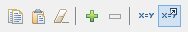
*Figure 166. Export as subgraph parameter button*

The following window opens, where you can set the parameter properties.

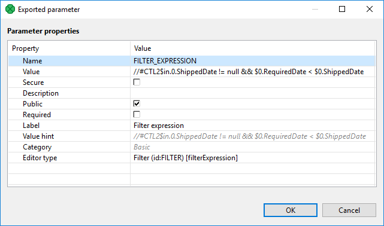
*Figure 167. Public parameter appeared as a subgraph component attribute*

The **public parameter** then appears as a subgraph component attribute under its respective group of properties.

One **public parameter** can be used in more components of the same subgraph. For example two **Filter** components can share the filter expression exported from a subgraph component as a public parameter.

##### Using existing public graph parameter

Any existing public graph parameter can be used as an attribute value of components in a subgraph.

To use an existing public parameter as a value of an attribute of a component choose the attribute and use the **Use parameter as value** button.

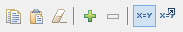
*Figure 168. Use parameter as value button*

##### Optional ports

Input and output ports of a subgraph can be marked as optional. It lets you create a component with ports that do not require a connected edge.

It can be set up in **Outline** within a subgraph. Right click the port in **Outline** and choose the corresponding option.

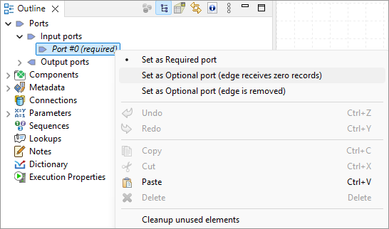
*Figure 169. Setting up an optional port*

You can set up optional ports from **Context menu** in the subgraph editor too. Move the mouse cursor on the optional port and right click to open the **Context menu**.

This way is available only if there is an edge connected to the port.

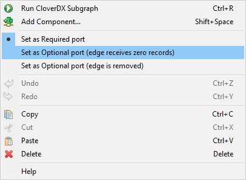
*Figure 170. Setting up an optional port in Graph editor*

There are three options:

- required
- optional - edge receives zero records
- optional - edge is removed

You can use **Optional ports** to conditionally enable or disable a component within subgraph. See [Enable/disable component](components.md#enabledisable-component).

###### Required

If a port of a subgraph is marked as **required**, an edge has to be connected to the port of a subgraph component.

For example, the first output port of **Filter** is required and the port of a subgraph will work in the same way.

###### Optional - edge receives zero records

An edge does not have to be connected to a port of the subgraph component. If an edge is not connected to a port of the subgraph component, the subgraph itself assumes the port to be connected and zero records to be received through the port.

This is similar to any input port of **SimpleGather**.

This is useful, for example, in the case of merging input data streams within a subgraph.

###### Optional - edge is removed

An edge does not have to be connected to a port of the subgraph component. If an edge is not connected to a port of the subgraph component, it works like there is no edge connected to the port within the subgraph.

This is similar to optional input ports of readers as it changes behavior of the component.

This case is useful, for example, in the case of wrapping reader with an optional port in a subgraph.

###### Optional - edge discards all records

An edge does not have to be connected to an output port of the subgraph component. If an edge is connected to an output port of the subgraph component, records are sent out to the port from of the subgraph component. If an edge is not connected to an output port of the subgraph component, records to be sent out to the port are silently discarded within the subgraph.

It is similar to the second output port of **Filter**.

This is useful, if you convert records to several output formats using a subgraph and let the user of the subgraph to choose one or more output format to use.

##### Color of subgraph

You can set up color for the subgraph component arising from the subgraph. The subgraph can be assigned to the category of components (Readers, Writers, etc.). The subgraph component will have the color of the assigned category.

To set up the category, right click on the subgraph component, select **Open subgraph**, and in the [Properties Tab](designer-layout.md#properties-tab) select **Subgraph** ****Category**.

##### Icon of subgraph

**Subgraph** can have own icon assigned. Three sizes of icons can be defined:

- Small (16x16)
- Medium (48x48)
- Large (64x64)

To define the path to the icon, right click on the subgraph component, select **Open Subgraph** and go to **Subgraph** section on the **Properties**.

Suggested place for subgraph icons is in `${PROJECT}/icons`.

As an icon,`.png` and`.gif` files can be used.

Continue with [Developing and Testing Subgraphs](subgraphs.md#developing-and-testing-subgraphs).

#### Developing and testing subgraphs

Subgraph can be launched and tested as standalone, without being run from a parent graph. You can run and debug it the same as an ordinary graph.

##### Useful tips:

- You can run the subgraph as an ordinary graph via the **Run As** item in toolbar or right-click the context menu.
- Debugging tools such as **View Data** can be used as in an ordinary graph.
- You can use all the ordinary graph elements in the subgraph - connections, metadata, lookup tables, phases, etc.
- Prepare test data in the **Debug Input section** of the subgraph - components that produce data to input ports of **SubgraphInput** are executed only when running the subgraph as standalone, not when it’s used from a parent graph. These components are used to generate testing and development data for the subgraph for easy development and testing without the need to use it in the parent graph.
- Parameterize subgraph components using **public parameters** if necessary.

Note, that subgraph elements, like graph parameters, connections, etc., are independent of graph elements of parent graph. There is no connection between them like inheritance. If you need some elements of parent subgraph, map it using the **Input mapping** or **Output mapping** attributes.

##### Filling required parameters

If a subgraph contains required parameters, you are asked to fill them in using **Dialog for Filling Required Parameters** before a graph run. This way, you can easily test the subgraph with various values of required parameters.

- Dialog opens just before a graph (subgraph) is run from **Designer** if the graph has any required parameters.
- It shows only required parameters.
- Values of parameters are shown in the dialog. If no value is defined for the parameter, it is prefilled with a value that was used last time the graph was run.

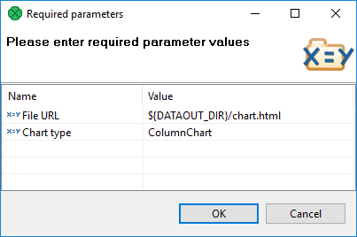
*Figure 171. Dialog for filling required parameters*

#### Metadata propagation

You can use [Auto-propagated metadata](auto-detected-metadata.md) in the same way as in the graphs. Metadata can be propagated between a parent graph and subgraph.

##### Subgraph providing metadata

A subgraph can define explicit metadata in its definition and propagate them to the **SubgraphOutput** component. When the subgraph is used in a parent graph, these metadata will be propagated via subgraph’s output edge to the parent graph.

Typical use-case is a reader subgraph that not only reads a data source, but also provides metadata of the data source (e.g. orders). In the example below, we define explicit metadata on the output of **SpreadsheetDataReader** component for records containing `orders`. Metadata on the output of the **Filter** component are set to be auto-propagated, which propagates the `orders` metadata to the output of the subgraph (as defined by **SubgraphOutput**). When using such a subgraph in a parent graph, the `orders` metadata are auto-propagated on the output of the subgraph.

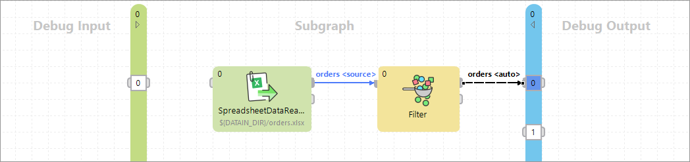
*Figure 172. Subgraph providing metadata*

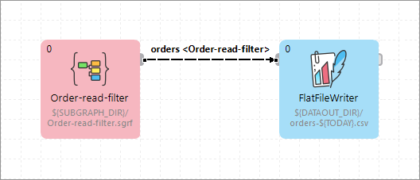
*Figure 173. Metadata propagated from Subgraph component*

##### Subgraph requiring metadata

Subgraph can require specific metadata when used in a parent graph by defining explicit metadata on the outputs of **SubgraphInput**. When the subgraph is used, its input metadata in the parent graph must match the metadata defined inside the subgraph.

Typical use-case is a writer subgraph that requires some specific metadata (e.g. customers) to store records in a service. In the example below, we explicitly define `customers` metadata on the output of the **SubgraphInput**. When the subgraph is used, its input metadata in the parent graph must match the customers metadata.

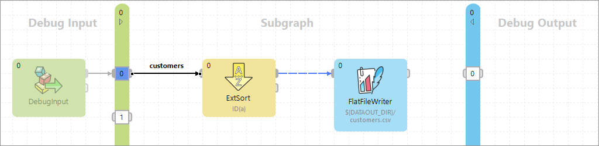
*Figure 174. Subgraph explicitly defines input metadata for customers*

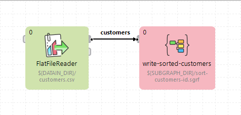
*Figure 175. Using subgraph with matching metadata*

##### Metadata acquired from parent

Subgraph can be quite generic and not specify any explicit metadata, only use auto-propagated metadata. The subgraph will acquire metadata from its parent graph.

To develop and test such a subgraph, we recommend that you define explicit metadata in the **Debug Input** (or **Debug Output**) section of the subgraph. These metadata will make the subgraph valid for testing it.

Typical use-case is a generic filter graph that performs filtering on specific (or user defined) fields, and copies all other fields. In the example below, all edges of the subgraph body are set to be auto-propagated. When the subgraph is used in a parent graph, the customers metadata are propagated through the subgraph.

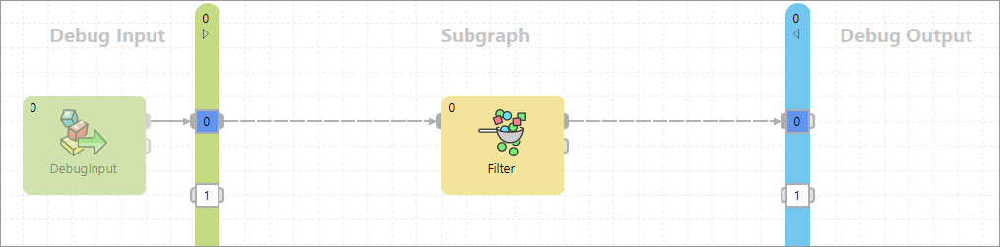
*Figure 176. Generic subgraph not defining explicit metadata in its body*

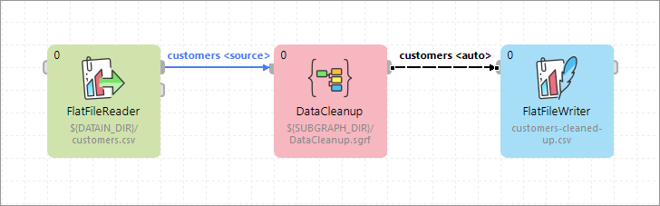
*Figure 177. Metadata propagate through the Subgraph component*

For details on metadata propagation, see also [Auto-propagated metadata](auto-detected-metadata.md).

### Design patterns

#### Readers

Subgraphs with no edge connected to the *SubgraphInput* component do not declare any input ports, therefore cannot receive input data so will likely be used as *Readers*.

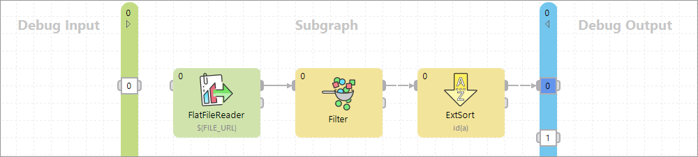
*Figure 178. Subgraph - Reader*

#### Writers

Subgraphs with no edge connected to the *SubgraphOutput* component provide no output ports, therefore cannot produce any data so will likely be used as *Writers*.

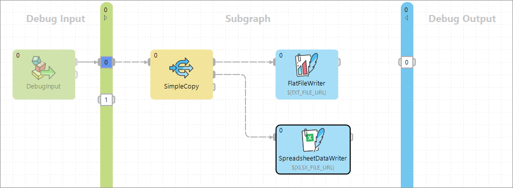
*Figure 179. Subgraph - Writer*

#### Transformers

Subgraph having connected both components (**SubgraphInput** and **SubgraphOutput**) is essentially a *Transformer*.

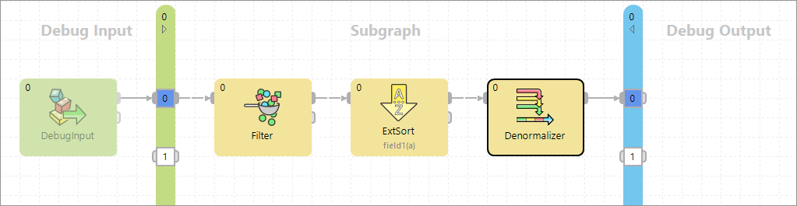
*Figure 180. Subgraph - Transformer*

#### Executors

Subgraphs with no edge connected to the **SubgraphInput** or **SubgraphOutput** components can be used as utility *Executors*. As they cannot be connected to other components in a parent graph, the execution of subgraphs without ports is controlled via [Phases](components.md#phases).

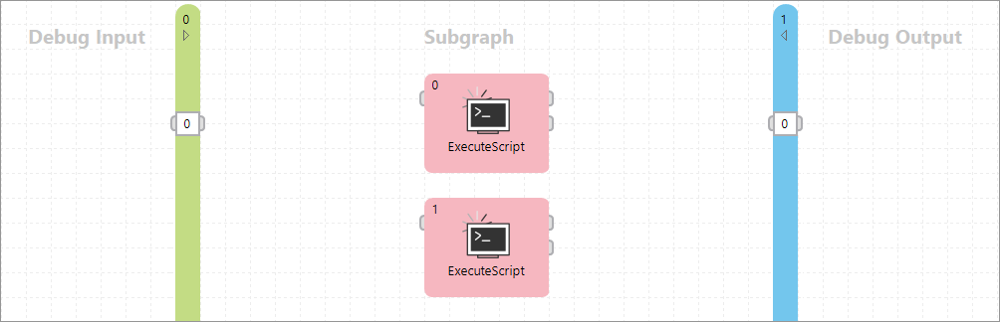
*Figure 181. Subgraph - Executor*
