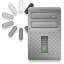

<!-- Development > Component reference > Deprecated > SystemExecute -->

### SystemExecute

> [!NOTE]
> The SystemExecute component was removed in CloverDX 7.0. Please use [**ExecuteScript**](executescript.md) component instead.
