<!-- Development > Job types > Graphs & development basics > Transformations -->

### Transformations

Transformation is a piece of code that defines how data on the input is transformed into that on the output on its way through a component.

Each transformation graph consists of components. All components process data during a graph run. Some of the components process data using so called transformation.
> [!NOTE]
> Remember that a transformation graph and a transformation itself are different notions. A transformation graph consists of components, edges, metadata, connections, lookup tables, sequences, parameters, and notes whereas a transformation is defined as an attribute of a component and is used by the component. Unlike transformation graph, a transformation is a piece of code that is executed during graph execution.

Any transformation can be defined by defining one of the following three attributes:

- **Transform**, **Denormalize**, **Normalize**, etc.
- **Transform URL**, **Denormalize URL**, **Normalize URL**, etc.
  - When any of these attributes is defined, you can also specify its encoding: **Transform source charset**, **Denormalize source charset**, **Normalize source charset**, etc.
- **Transform class**, **Denormalize class**, **Normalize class**, etc.

In some transforming components, transformation is required, in others, it is only optional.

Each transformation can always be written in Java, majority of transformation can also be written in **CloverDX** Transformation Language.

For a table overview of components that allow or require a transformation, see [Transformations overview](transformations.md#transformations-overview).

For details about **CloverDX** Transformation Language, see [CTL2 - CloverDX Transformation Language](part5.md).

For more detailed information about transformations, see [Defining transformations](transformations.md#defining-transformations).

#### Defining transformations

For basic information about transformations, see [Transformations](transformations.md).

Here we will explain how you should create transformations that change the data flowing through components.

For brief table overview of transformations, see [Transformations overview](transformations.md#transformations-overview).

Below we can learn the following:

1. What components allow transformations.
   [Components allowing transformation](transformations.md#components-allowing-transformation)
2. What language can be used to write transformations.
   [Java or CTL](transformations.md#java-or-ctl)
3. Whether definition can be internal or external.
   [Internal or external definition](transformations.md#internal-or-external-definition)
4. What the return values of transformations are.
   [Return values of transformations](transformations.md#return-values-of-transformations)
5. What can be done when error occurs.
   [Error actions and error log (deprecated since 3.0)](transformations.md#error-actions-and-error-log-deprecated-since-30)
6. The **Transform editor** and how to work with it.
   [Transform editor](transformations.md#transform-editor)
7. What interfaces are common for many of the transformation-allowing components.
   [Common Java interfaces](transformations.md#common-java-interfaces)

##### Components allowing transformation

The transformations can be defined in the following components:

- **DataGenerator**, **Map**, and **Rollup**
  These components require a transformation.
  You can define the transformation in Java or **CloverDX** transformation language.
  In these components, different data records can be sent out through different output ports using return values of the transformation.
  In order to send different records to different output ports, you must both create some mapping of the record to the corresponding output port and return the corresponding integer value.
- **Partition**, or **ParallelPartition**
  In the **Partition** or **ParallelPartition** components, a transformation is optional. It is required only if neither the **Ranges** nor the **Partition key** attributes are defined.
  You can define the transformation in Java or **CloverDX** transformation language.
  In **Partition**, different data records can be sent out through different output ports using return values of the transformation.
  In **ParallelPartition**, different data records can also be sent out to different Cluster nodes (through virtual output ports) using return values of the transformation.
  In order to send different records to different output ports or Cluster nodes, you must return corresponding integer value. But no mapping needs to be written in this component since all of the records are sent out automatically.
- **DataIntersection**, **Denormalizer**, **Normalizer**, **ApproximativeJoin**, **ExtHashJoin**, **ExtMergeJoin**, **LookupJoin**, **DBJoin** and **RelationalJoin**
  These components require a transformation.
  You can define the transformation in Java or **CloverDX** transformation language.
- **CustomJavaReader**, **CustomJavaWriter** and **CustomJavaTransformer**.
  These components require a transformation.
  You can only write it in Java.
- **JMSReader** and **JMSWriter**
  In these components, transformation is optional.
  If any is defined, it must be written in Java.

##### Java or CTL

Transformations can be written in Java or **CloverDX** transformation language (CTL):

- Java can be used in all components.
  Transformations executed in Java are faster than those written in CTL. Transformation can always be written in Java.
- CTL cannot be used in **JMSReader**, and **JMSWriter**.
  Nevertheless, CTL is a very simple scripting language that can be used in most of the transforming components. CTL can be used even without any prior knowledge of Java.

##### Internal or external definition

Each transformation can be defined as internal or external:

- **Internal transformation:**
  An attribute like **Transform**, **Denormalize**, etc. must be defined.
  In such a case, the piece of code is written directly in the graph and can be seen in it.
- **External transformation:**
  One of the following two kinds of attributes may be defined:
  - **Transform URL**, **Denormalize URL**, etc., for both Java and CTL
    The code is written in an external file. Also charset of such external file can be specified (**Transform source charset**, **Denormalize source charset**, etc.).
    For transformations written in Java, a folder with transformation source code needs to be specified as source for Java compiler so that the transformation may be executed successfully.
  - **Transform class**, **Denormalize class**, etc.
    It is a compiled Java class.
    The class must be in classpath so that the transformation may be executed successfully.

Here we provide a brief overview:

- **Transform, Denormalize, etc.**
  To define a transformation in a graph itself, you must use the **Transform editor** (or the **Edit value** dialog in the case of **JMSReader**, and **JMSWriter** components). In them, you can define a transformation located and visible in a graph itself. Transformation can be written in Java or CTL, as mentioned above.
  For more detailed information about the editor or the dialog, see [Transform editor](transformations.md#transform-editor) or [Edit value dialog](common-dialogs.md#edit-value-dialog).
- **Transform URL, Denormalize URL, etc.**
  You can also use a transformation defined in some source file outside a graph. To locate the transformation source file, use the [URL file dialog](common-dialogs.md#url-file-dialog). Each of the mentioned components can use this transformation definition. This file must contain the definition of the transformation written in either Java or CTL. In this case, transformation is located outside a graph.
  For more detailed information see [URL file dialog](common-dialogs.md#url-file-dialog).
- **Transform class, Denormalize class, etc.**
  In all transforming components, you can use some compiled transformation class. To do that, use the **Open Type** wizard. In this case, the transformation is located outside the graph.
  For more detailed information, see [Open Type dialog](common-dialogs.md#open-type-dialog).

More details about defining transformations can be found in the sections concerning corresponding components. Both transformation functions (required and optional) of CTL templates and Java interfaces are described there.

Here we present a brief table with an overview of transformation-allowing components:

| Component | Transformation required | Java | CTL | Each to all outputs[[1]](transformations.md#transformations-footnote1) | Different to different outputs[[2]](transformations.md#transformations-footnote2) | CTL template | Java interface |
| --- | --- | --- | --- | --- | --- | --- | --- |
| **Readers** |  |  |  |  |  |  |  |
| [DataGenerator](datagenerator.md) | **✓** | **✓** | **✓** | **⨯** | **✓** | [CTL templates for DataGenerator](datagenerator.md#ctl-templates-for-datagenerator) | [Java interface](datagenerator.md#java-interface) |
| [JMSReader](jmsreader.md) | **⨯** | **✓** | **⨯** | **✓** | **⨯** | - | [Java interfaces for JMSReader](jmsreader.md#java-interfaces-for-jmsreader) |
| [MultiLevelReader](multilevelreader.md) | **✓** | **✓** | **⨯** | **⨯** | **✓** | - | [Java interfaces for MultiLevelReader](multilevelreader.md#java-interfaces-for-multilevelreader) |
| **Writers** |  |  |  |  |  |  |  |
| [JMSWriter](jmswriter.md) | **⨯** | **✓** | **⨯** | - | - | - | [Java interfaces for JMSWriter](jmswriter.md#java-interfaces-for-jmswriter) |
| **Transformers** |  |  |  |  |  |  |  |
| [Partition](partition.md) | **⨯** | **✓** | **✓** | **⨯** | **✓** | [CTL templates for Partition (or ParallelPartition)](partition.md#ctl-templates-for-partition-or-parallelpartition) | [Java interface](partition.md#java-interface) |
| [DataIntersection](dataintersection.md) | **✓** | **✓** | **✓** | - | - | [CTL templates for DataIntersection](dataintersection.md#ctl-templates-for-dataintersection) | [Java interfaces for DataIntersection](dataintersection.md#java-interfaces-for-dataintersection) |
| [Map](reformat.md) | **✓** | **✓** | **✓** | **⨯** | **✓** | [CTL templates for Map](reformat.md#ctl-templates-for-map) | [Java interfaces for Map](reformat.md#java-interfaces-for-map) |
| [Denormalizer](denormalizer.md) | **✓** | **✓** | **✓** | - | - | [CTL templates](denormalizer.md#ctl-templates) | [Java interface](denormalizer.md#java-interface) |
| [Normalizer](normalizer.md) | **✓** | **✓** | **✓** | - | - | [CTL templates for Normalizer](normalizer.md#ctl-templates-for-normalizer) | [Java interface](normalizer.md#java-interface) |
| [Rollup](rollup.md) | **✓** | **✓** | **✓** | **⨯** | **✓** | [CTL templates for Rollup](rollup.md#ctl-templates-for-rollup) | [Java interface](rollup.md#java-interface) |
| [DataSampler](datasampler.md) | **✓** | **⨯** | **⨯** | - | - | - | - |
| **Joiners** |  |  |  |  |  |  |  |
| [ExtHashJoin](exthashjoin.md) | **✓** | **✓** | **✓** | - | - | [CTL templates for Joiners](ctl-templates-for-joiners.md) | [Java interfaces for Joiners](java-interfaces-for-joiners.md) |
| [ExtMergeJoin](extmergejoin.md) | **✓** | **✓** | **✓** | - | - | [CTL templates for Joiners](ctl-templates-for-joiners.md) | [Java interfaces for Joiners](java-interfaces-for-joiners.md) |
| [LookupJoin](lookupjoin.md) | **✓** | **✓** | **✓** | - | - | [CTL templates for Joiners](ctl-templates-for-joiners.md) | [Java interfaces for Joiners](java-interfaces-for-joiners.md) |
| [DBJoin](dbjoin.md) | **✓** | **✓** | **✓** | - | - | [CTL templates for Joiners](ctl-templates-for-joiners.md) | [Java interfaces for Joiners](java-interfaces-for-joiners.md) |
| [RelationalJoin](relationaljoin.md) | **✓** | **✓** | **✓** | - | - | [CTL templates for Joiners](ctl-templates-for-joiners.md) | [Java interfaces for Joiners](java-interfaces-for-joiners.md) |
| **Cluster components** |  |  |  |  |  |  |  |
| [ParallelPartition](clusterpartition.md) | **⨯** | **✓** | **✓** | **⨯** | **✓** | - | - |

| 1 |  If this is `yes`, each data record is always sent out through all connected output ports. |
| --- | --- |

| 2 |  If this is `yes`, each data record can be sent out through the connected output port whose number is returned by the transformation. For more information, see [Return values of transformations](transformations.md#return-values-of-transformations). |
| --- | --- |

##### Return values of transformations

In those components in which transformations are defined, some return values can also be defined. They are integer numbers greater than, equal to or less than 0.
> [!NOTE]
> Remember that **DBExecute** can also return integer values less than 0 in form of SQLExceptions.

- **Positive or zero return values**
  - **ALL = Integer.MAX_VALUE**
    In this case, the record is sent out through all output ports. Remember that this variable does not need to be declared before it is used. In CTL, `ALL` equals to `2147483647`, in other words, it is `Integer.MAX_VALUE`. Both `ALL` and `2147483647` can be used.
  - **OK = 0**
    In this case, the record is sent out through the single output port or output port 0 (if component have multiple output ports, e.g. **Map**, **Rollup**, etc. Remember that this variable does not need to be declared before it is used.
  - **Any other integer number greater than or equal to 0**
    In this case, the record is sent out through the output port whose number equals to this return value. These values can be called **Mapping codes**.
- **Negative return values**
  - **SKIP = - 1**
    This value serves to define that error has occurred but the incorrect record would be skipped and process would continue. Remember that this variable does not need to be declared before it is used. Both `SKIP` and `-1` can be used.
    This return value has the same meaning as setting of `CONTINUE` in the **Error actions** attribute (which is deprecated since **CloverETL 3.0**).
  - **STOP = - 2**
    This value serves to define that error has occurred but the processing should be stopped. Remember that this variable does not need to be declared before it is used. Both `STOP` and `-2` can be used.
    This return value has the same meaning as setting of `STOP` in the **Error actions** attribute (which is deprecated since **CloverETL 3.0**).
    > [!IMPORTANT]
    > The same return value is `ERROR` in CTL1. `STOP` can be used in CTL2.
  - **Any integer number less than or equal to -1**
    These values should be defined by user as described below. Their meaning is fatal error. These values can be called **Error codes**. They can be used for defining [Error actions](transformations.md#error-actions) in some components (This attribute along with **Error log** is deprecated since **CloverDX 3.0**).
    > [!IMPORTANT]
    > 1. **Values greater than or equal to 0**
    >    Remember that all return values that are greater than or equal to 0 allow to send the same data record to the specified output ports only in the case of **DataGenerator**, **Partition**, **Map** and **Rollup**. Do not forget to define the mapping for each such connected output port in **DataGenerator**, **Map**, and **Rollup**. In **Partition** (and **clusterpartition**), mapping is performed automatically. In the other components, this has no meaning. They have either a unique output port or their output ports are strictly defined for explicit outputs. On the other hand, **CloverDataReader** and **DBFDataReader** always send each data record to all of the connected output ports.
    > 2. **Values less than -1**
    >    Remember that you do not call corresponding optional `OnError()` function of CTL template using these return values. To call any optional `<required function>OnError()`, you may use, for example, the following function:
    >    `raiseError(string Arg)`
    >    It throws an exception which is able to call such `<required function>OnError()`, e.g. `transformOnError()`, etc. Any other exception thrown by any `<required function>()` function calls corresponding `<required function>OnError()`, if this is defined.
    > 3. **Values less than or equal to -2**
    >    Remember that if any of the functions that return `integer` values returns any value less than or equal to -2 (including `STOP`), the `getMessage()` function is called (if it is defined).
    >    Thus, to allow calling this function, you must add `return` statement(s) with values less than or equal to -2 to the functions that return `integer`. For example, if any of the functions like `transform()`, `append()` or `count()`, etc. returns -2, `getMessage()` is called and the message is written to Console.
> [!IMPORTANT]
> Remember that if graph fails with an exception or with returning any negative value *less then* -1, no record will be written to the output file.
>
> If you want previously processed records to be written to the output, you need to return SKIP (-1). This way, such records will be skipped, the graph will not fail and at least some records will be written to the output.

##### Error actions and error log (deprecated since 3.0)
> [!IMPORTANT]
> Since **CloverETL 3.0**, these attributes are deprecated. They should be replaced with either `SKIP`, or `STOP` return values, if processing should either continue, or stop, respectively.

The **Error codes** can be used in some components to define the following two attributes:

###### Error actions

Any of these values means that a fatal error occurred and the user decides if the process should stop or continue.

To define what should be done with the record, click the **Error actions** attribute row, click the button that appears and specify the actions in the following dialog. By clicking the **Plus sign** button, you add rows to this dialog pane. Select STOP or CONTINUE in the **Error action** column. Type an integer number to the **Error code** column. Leaving `MIN_INT` value in the left column means that the action will be applied to all other integer values that have not been specified explicitly in this dialog.

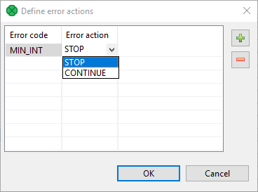
*Figure 145. Define Error actions dialog*

The **Error actions** attribute has a form of a sequence of assignments (`errorCode=someAction`) each separated by a semicolon.

- The left side can be `MIN_INT` or any integer number less than 0 specified as some return value in the transformation definition.
  If `errorCode` is `MIN_INT`, this means that the specified action will be performed for all values that have not been specified in the sequence.
- The right side of assignments can be `STOP` and/or `CONTINUE`.
  If `someAction` is `STOP`, when its corresponding `errorCode` is returned, `TransformExceptions` is thrown and the graph stops.
  If `someAction` is `CONTINUE`, when its corresponding `errorCode` is returned, error message is written to **Console** or to the file specified by the **Error log** attribute and graph continues with the next record.
Example 1. Example of the error actions attribute`-1=CONTINUE;-3=CONTINUE;MIN_INT=STOP`. In this case, if the transformation returns `-1` or `-3`, the process continues, if it returns any other negative value (including `-2`), the process stops.
###### Error log

In this attribute, you can specify whether the error messages should be written on **Console** or in a specified file. The file should be defined using [URL File dialog](common-dialogs.md#url-file-dialog).

#### Transform editor

| [Transformations tab](transformations.md#transformations-tab) |
| --- |
| [Source tab](transformations.md#source-tab) |
| [Regex Tester](transformations.md#regex-tester) |

**Transform editor** is an editor in which you can define a transformation. The Transform Editor is accessible from Component Editor of components having transformation.

When you open the **Transform editor**, you can see the following tabs: **Transformations**, **Source** and **Regex tester**.

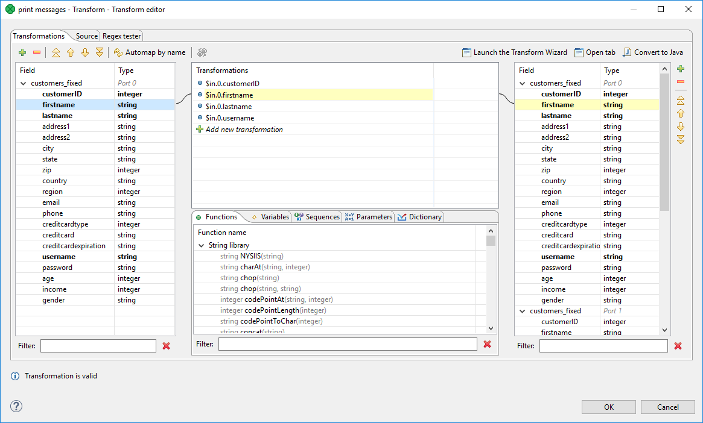
*Figure 146. Transformations tab of the transform editor*

To use the transform editor you should have both input and output metadata defined and assigned. Only with metadata you define the desired mapping in comfortable way.

##### Transformations tab

| [Defining the transformation](transformations.md#defining-the-transformation) |
| --- |
| [Creating mapping vs. adding field](transformations.md#creating-mapping-vs-adding-field) |
| [Mapping visualization](transformations.md#mapping-visualization) |
| [Expression editor](transformations.md#expression-editor) |
| [Wildcard mapping](transformations.md#wildcard-mapping) |

Transformation tab consists of four parts:

Left pane contains input fields of all input ports and their data types.

Right pane displays output fields of all output ports and their data types.

The middle part of dialog serves for construction of the right side of transformation assignment. Each line of the dialog corresponds to one field of the output record.

There are five tabs in the middle bottom area: **Functions****,Variables**, **Sequences**, **Parameters** and **Dictionary**. They let you use available build-in functions, sequences, parameters or dictionary in the transformation. **Variable tab** lets you define a variable and its value and subsequently use it in a transformation.

There are filters in the bottom of the panes. You can use the filters to find field or function to use.

###### Defining the transformation

In the **Transformations** tab, you can define a transformation by simple drag and drop.

You can map fields between multiple input and output ports. In all components both input and output ports are numbered starting from 0.

You can easily recognize which fields are mapped. The mapped fields become bold.

To design a simple one-to-one mapping, drag fields from the left hand pane to the right hand pane. If you drop the field onto an output field, you create a mapping. The middle part of the dialog is filled in automatically to the expression like: `$in.portnumber.fieldname`.

If you need to map input record fields to output record fields with a same name, drag and drop the whole record. The middle part of the dialog will contain:`$in.portnumber.*`.

To map more input fields to one output field or to apply a CTL function on the field value you need the middle pane. Drag and drop input field(s) to a field in the middle pane, use function(s), sequences or dictionary values and drag and drop the middle pane field onto right pane field.

For example, if you want to concatenate values of various fields you drag and drop all fields to be concatenated the same row in the **Transformations** pane. Expression similar to `$in.portnumber1.fieldnameA+$in.portnumber1.fieldnameB` appears. The input fields can come from different input ports (in the case of **Joiners** and the **DataIntersection** component).

Whenever the mapping is correct, the corresponding circle is filled in with blue.

###### Creating mapping vs. adding field

If you drop input field into a blank space of the right hand pane (between two fields), you will just copy input metadata to the output. Metadata copying is a feature which works only within a single port.

You can also copy any input field to the output by right-clicking the input field item in the left pane and selecting **Copy fields to…​** and the name of the output metadata:

Remember that if you have not defined the output metadata before defining the transformation, you can define them even here by copying and renaming the output fields using right-click. However, it is much simpler to define new metadata prior to defining the transformation.

If you defined the output metadata using this **Transform editor**, you would be informed that output records are not known and you would have to confirm the transformation with this error and (after that) specify the delimiters in metadata editor.
> [!NOTE]
> Fields of output metadata can be rearranged by a simple drag and drop with the left mouse button.

###### Mapping visualization

If you select any item in the left, middle or right pane, corresponding items will be connected by lines. See example below:

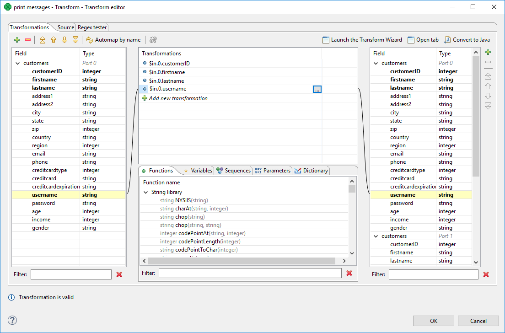
*Figure 147. Mapping of inputs to outputs (connecting lines)*

###### Expression editor

You can write the desired transformation:

- Into individual rows of the **Transformations** pane - optionally, drag any function you need from the bottom **Functions** tab (the same counts for **Variables**, **Sequences** or **Parameters**) and drop them into the pane. Use **Filter** to quickly jump to the function you are looking for.
- By clicking the '…​' button which appears after selecting a row inside the **Transformations** pane. This opens an editor for defining the transformation. It contains a list of fields, functions and operators and also provides hints. See below:

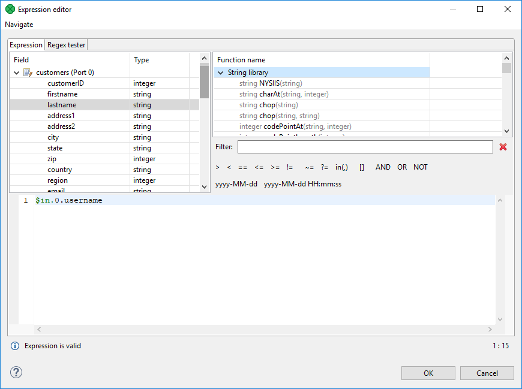
*Figure 148. Editor with fields and functions*

###### Wildcard mapping

Transform editor supports wildcards in mapping. If you right click a record or one of its fields, click **Map record to** and select a record, you will produce a transformation like this (as observed in the **Source** tab): `$out.0.* = $in.1.*;`, meaning "all output fields of record number 0 are mapped to all input fields of record number 1". In **Transformations**, wildcard mapping looks like this:

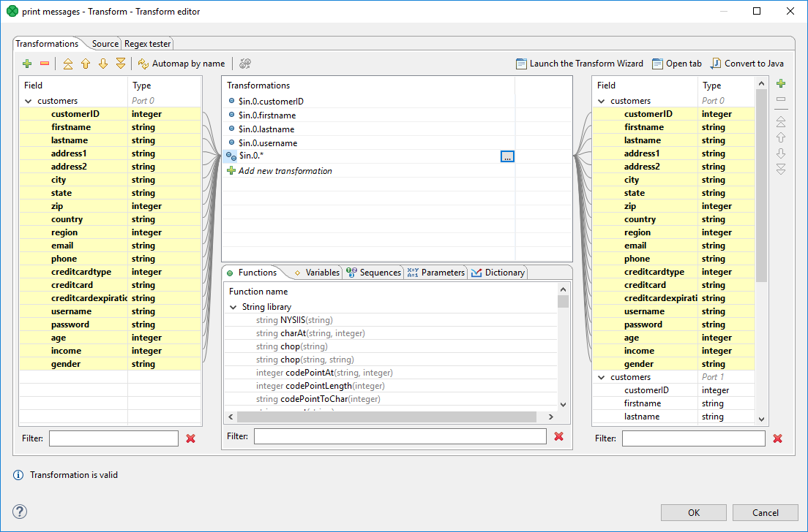
*Figure 149. Input record mapped to output record using wildcards*

##### Source tab

| [Java Transform wizard](transformations.md#java-transformation-wizard) |
| --- |
| [Open tab](transformations.md#open-tab) |
| [Content assist](transformations.md#content-assist) |
| [Convert to Java](transformations.md#convert-to-java) |

Some of your transformations may be too complex to be defined in the **Transformations** tab. You can use the **Source** tab instead. The transformation is written in **CloverDX** Transformation Language ([*CTL2*](part5.md)).

Next figure displays **Source** tab with the transformation defined in text above.

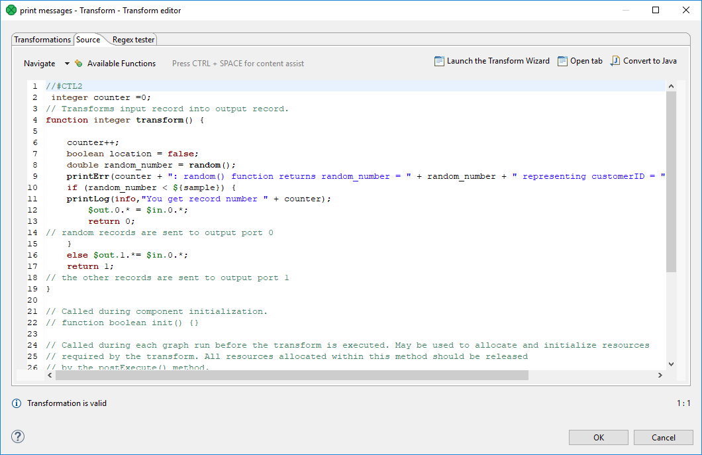
*Figure 150. Transformation definition in CTL (Source tab)*

There are some useful keyboard shortcuts available while editing transformation in **Source** tab:

- Ctrl+/ - toggle comment on selected text.
- Tab - indent selected text.
- Shift+Tab - unindent selected text.
- Ctrl+D - delete line.

In the upper right corner of either tab, there are three buttons: for launching a wizard to create a new Java transform class (**Java Transform Wizard** button), for creating a new tab in **Graph Editor** (**Open tab** button), and for converting the defined transformation to Java (**Convert to Java** button).

###### Java Transformation Wizard

If you want to create a new Java transform class, press the **Java Transform Wizard** button. The following dialog will open:

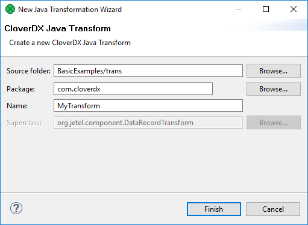
*Figure 151. Java Transform Wizard dialog*

After you click the **Finish** button, information about the transform result appears.

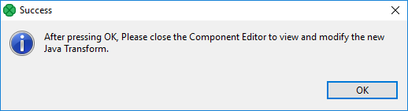
*Figure 152. Info after Java Transform Wizard dialog*

The **Source folder** field will be mapped to the project `${TRANS_DIR}`, for example `SimpleExamples/trans`. A new transform class can be created by entering the **Name** of the class and, optionally, the containing **Package** and pressing the **Finish** button. The newly created class will be located in the **Source folder**.

###### Open tab

If you click the **Open tab**, the second button in the upper right corner of the **Transform editor**, a new tab with the CTL source code of the transformation will be opened in the **Graph Editor** with a notification as shown below:

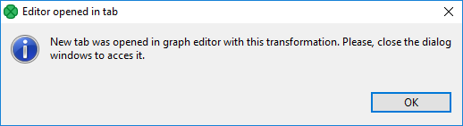
*Figure 153. Confirmation message*

The new tab is opened at the same level as Graph and Source.

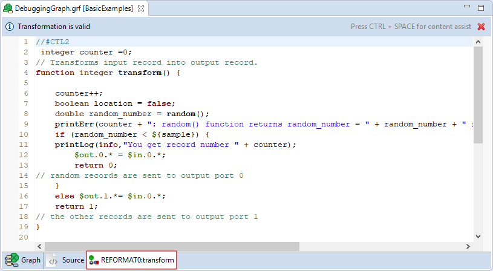
*Figure 154. Transformation definition in CTL (Transform tab of the Graph editor)*

If you switch to this tab, you can view the declared variables and functions in the **Outline** pane.

Functions and variables are displayed in the **Outline**.

The tab can be closed by clicking the red cross in the upper right corner of the tab.

###### Content assist

**Content Assist** helps you choosing the proper field, variable or function.

Content assist is made active by pressing Ctrl+Space.

If you press these two keys inside any of the expressions, the help advises what should be written to define the transformation.

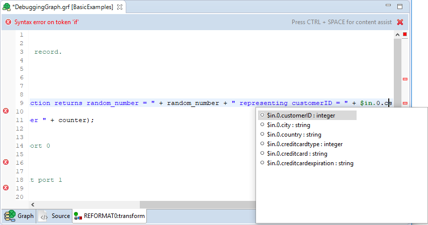
*Figure 155. Content assist (Record and field names)*

If you press these two keys outside any of the expressions, the help offers a list of functions that can be used to define the transformation.

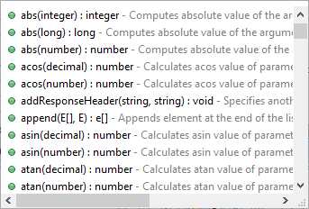
*Figure 156. Content assist (List of CTL functions)*

If you have an error in your definition, a red circle with a white cross appears on the corresponding line followed by a more detailed information at the lower left corner.

###### Convert to Java

If you want to convert the transformation code into the Java language, click the **Convert to Java** button.

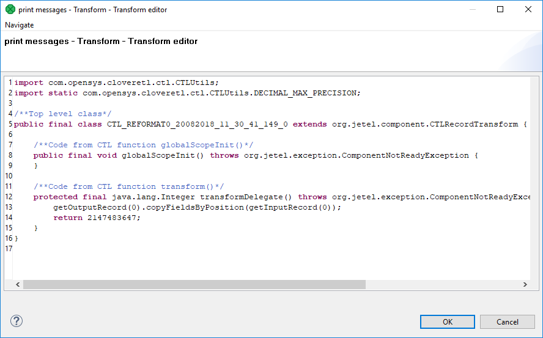
*Figure 157. Transformation definition in Java*

Remember also that you can define your own error messages by defining the last function: `getMessage()`. It returns strings that are written to console. More details about transformations in each component can be found in the sections in which these components are described.
> [!IMPORTANT]
> Remember that the `getMessage()` function is only called from within functions that return `integer` data type.
>
> To allow calling this function, you must add `return` statement(s) with values less than or equal to -2 to the functions that return `integer`. For example, if any of the functions like `transform()`, `append()` or `count()`, etc. returns -2, `getMessage()` is called and the message is written to Console.

##### Regex Tester

This is the last tab of the Transform Editor and it is described here: [Tabs pane](designer-layout.md#tabs-pane).

#### Common Java interfaces

Following are the methods of the common `Transform` interface:

- `void setNode(Node node)`
  Associates a graph `Node` with this transformation.
- `Node getNode()`
  Returns a graph `Node` associated with this transformation, or `null` if no graph node is associated.
- `TransformationGraph getGraph()`
  Returns a `TransformationGraph` associated with this transformation, or `null` if no graph is associated.
- `void preExecute()`
  Called during each graph run before the transformation is executed. May be used to allocate and initialize resources required by the transformation. All resources allocated within this method should be released by the `postExecute()` method.
- `void postExecute(TransactionMethod transactionMethod)`
  Called during each graph run after the entire transformation is executed. Should be used to free any resources allocated within the `preExecute()` method.
- `String getMessage()`
  Called to report any user-defined error message if an error occurs during the transformation and the transformation returned value less than or equal to -2. It is called when either `append()`, `count()`, `generate()`, `getOutputPort()`, `transform()` or `updateTansform()` or any of their `OnError()` counterparts returns value less than or equal to -2.
- `void finished()` (deprecated)
  Called at the end of the transformation after all input data records are processed.
- `void reset()` (deprecated)
  Resets the transformation to the initial state (for another execution). This method may be called only if the transformation was successfully initialized before.

#### Debugging Java transformations

This chapter describes a way to debug an existing Java transformation.

Imagine having a simple transformation graph with three components: Reader, Writer and CustomJavaTransformer. **CustomJavaTransformer** contains a transformation written in Java and you need to debug it. The debugging is possible in Local and Server projects. Only the way to enable it differs.

##### Debugging Java transformations in local projects

Open the file with `.java` source code to place breakpoints.

Open **Window** > **Preferences**.

In **CloverDX** > **CloverDX Runtime**, tick **Enable Java debug on port**

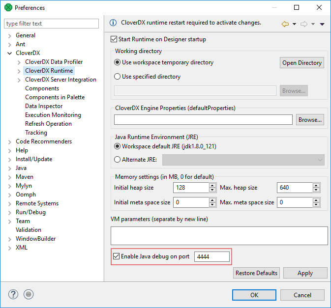
*Figure 158. Enabling Java transformation debugging*

Click **OK**. You will be asked to restart CloverDX Runtime. Select **Yes** to restart it.

Switch back to the graph.

From the main menu, select **Run** > **Debug**.

When a breakpoint is reached, you are asked to switch to the **Debug** perspective.

When the graph debugging finished, you can switch back to the **CloverDX** perspective.

##### Debugging Java transformation in server projects

Add `-agentlib:jdwp=transport=dt_socket,server=y,suspend=n,address=8085` to Worker’s **JVM arguments** in **Configuration** > **Setup** > **Worker**. Make sure that the specified TCP port is not used by any other program.

Restart Worker.

In **Designer**, open the debug configuration: **Run** > **Debug Configurations…​**. In the left pane, right click the **Remote Java Application** item and select **New**.

Enter **host** and **port** (8085).

Click **Apply**, then click **Debug**.

Now you can start debugging by running the graph with **Run** > **Debug**.

The graph will run and stop on a breakpoint in the same way as in a Local project.
