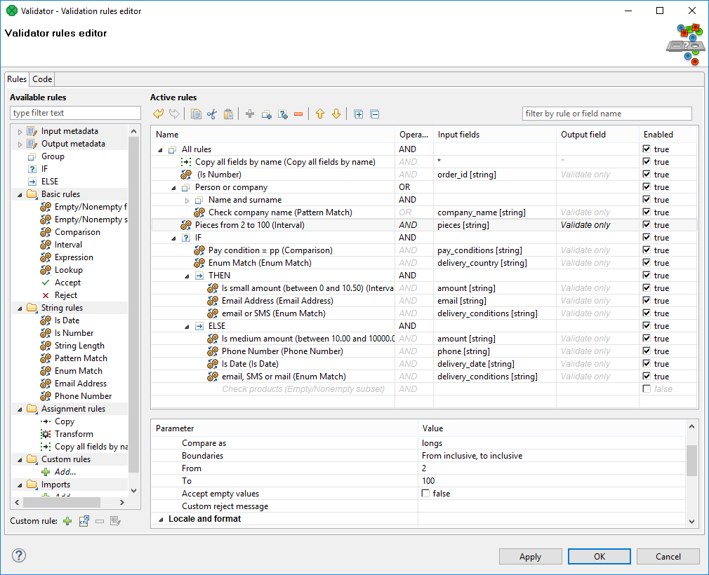
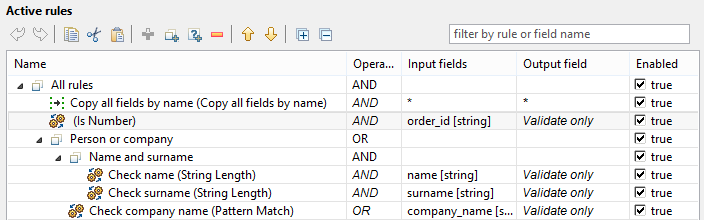
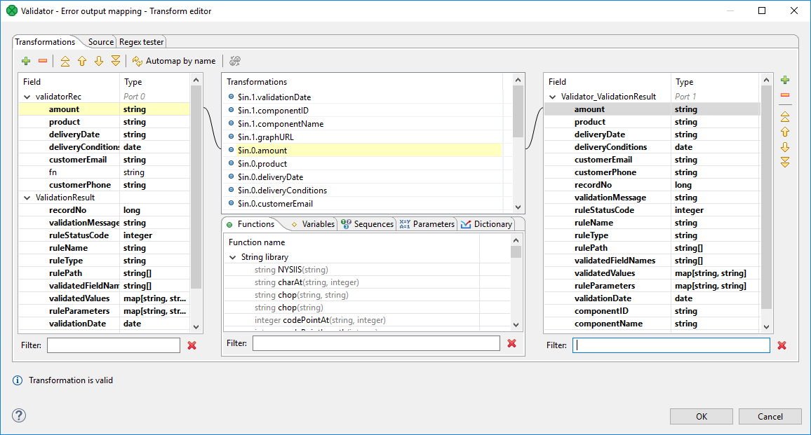
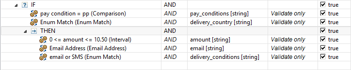

<!-- Development > Component reference > Data Quality > Validator -->

### Validator

Licensed under CloverDX Data Quality package.

| [Short description](validator.md#short-description) |
| --- |
| [Ports](validator.md#ports) |
| [Input and output metadata](validator.md#input-and-output-metadata) |
| [Validator attributes](validator.md#validator-attributes) |
| [Details](validator.md#details) |
| [Validator rules editor](validator.md#validator-rules-editor) |
| [Validation rules](validator.md#validation-rules) |
| [Error output mapping](validator.md#error-output-mapping) |
| [Groups](validator.md#groups) |
| [If - then - else](validator.md#if-then-else) |
| [Compatibility](validator.md#compatibility) |
| [See also](validator.md#see-also) |

For detailed overview of rules, see [List of rules](validator-toc-2.md).

The component is located in **Palette** ****Data Quality**.

#### Short description

**Validator** validates data based on specified rules.
> [!NOTE]
> To be able to use this component, you need a separate **Data Quality license**.

| Same input metadata | Sorted inputs | Inputs | Outputs | Each to all outputs | Java | CTL | Auto-propagated metadata |
| --- | --- | --- | --- | --- | --- | --- | --- |
| - | **⨯** | 1 | 1-2 | **⨯** | **⨯** | **⨯** | **✓** |

#### Ports

| Port type | Number | Required | Description | Metadata |
| --- | --- | --- | --- | --- |
| Input | 0 | **✓** | Input data records to be validated. | Any |
| Output | 0 | **✓** | Data records that passed the validation. | Based on Input 0.[[1]](validator.md#validator-footnote1) |
| 1 | **⨯** | An optional output port with data that failed to validate.[[2]](validator.md#validator-footnote2) | Any |  |

| 1 |  Metadata of validated fields can contain more specific data type than input. For example, input metadata can contain a string field with date values and corresponding field on the first output port can have date as its field type. After validating that the string value is a date, Validator can convert the value to the date type. |
| --- | --- |

| 2 |  Metadata on the second output port can be enriched with fields containing details of validation failure. Available fields are listed in [Error output mapping](validator.md#error-output-mapping). |
| --- | --- |

#### Validator attributes

| Attribute | Req | Description | Possible values |
| --- | --- | --- | --- |
| Basic |  |  |  |
| Validation rules | [[1]](validator.md#validator-attributes-fn01) | Setup of rules used by validation. See [Validator rules editor](validator.md#validator-rules-editor) |  |
| Validation rules URL | [[1]](validator.md#validator-attributes-fn01) | An URL to external file describing validation rules. Use exclusively this field or previous one. | ${PROJECT}/validator |
| Error output mapping | **⨯** | Field mapping for error output port. See [Error output mapping](validator.md#error-output-mapping) |  |

| 1 |  Either *Validation rules* or *Validation rules URL* must be filled in. |
| --- | --- |

#### Details

**Validator** allows you to specify a set of rules and check the validity of incoming data based on these rules. Validation rules can check various criteria like date format, numeric value, interval match, phone number validity and format, etc.

The component sends validated data to the first output port. The first output port has the same metadata as the input port with the exception of validated fields that can have output metadata modified to a more specific data type.

Data that failed to validate are sent to the second output port. When metadata on the second output port are the same as the metadata on the input port, invalid records are automatically sent to this output port. The second output port can be enriched with details of validation failure.

##### Validator rules editor

**Validator rules editor** provides all the power and features needed to set up [validation rules](validator.md#validation-rules). There are two tabs enabling to set up validation rules using different approaches: Use the **Rules** tab providing graphical interface to setup validation rules or switch to the **Code** tab with text editor and type rules by hand in form of xml.

The **Rules** tab of the dialog is split up into three parts: [Available rules](validator.md#available-rules), [Active rules](validator.md#active-rules) and [Rule parameters](validator.md#rule-parameters).

Tab **Code** contains a text editor for editing validation rules in XML form, options to import and export of the validation rules, and an option to return to initial state of validation rules.

*Figure 451. Validator rules editor*

##### Validation rules

Validation rules are the cornerstone of Validator. A validation rule is an evaluable condition that needs to be fulfilled to ensure that the field being validated contains a valid value. The evaluation of the condition if affected by corresponding environment settings.
> [!NOTE]
> Example of validation rule
> Check field value to contain decimal number.
>
> The condition is for the input field value to be a decimal number. The evaluation of condition is affected by locale setting specifying number format.

For description of particular *available validation rules*, see [Available rules](validator.md#available-rules).

##### Active rules

The **Active rules** pane contains a tree of **active validation rules**. The rules can be added to the tree from list of [Available rules](validator.md#available-rules) on the left side.

A group named as **All rules** is the root of the tree of **active validation rules**. If any of active validation rules is chosen, the details of the rule settings are displayed in rule parameters below.

*Figure 452. Validator - Active rules*
> [!IMPORTANT]
> In the case of **more validation rules** having the same output field, the value acquired from the **last one** is used.
> [!TIP]
> The new **active validation rule** can also be added by pressing the **+** button above validation tree.

##### Select rule type

If you drag a field from metadata and drop it onto any of groups from **active rules** or between the rules of the group, the **Select rule type** dialog will appear. The dialog enables you to choose **available rule** to be added into group of rules. The added rule will be applied to preselected metadata field.
> [!TIP]
> Use filter to find the rule by name.

##### Rule parameters

Each validation rule is configurable by several parameters. The parameters are split up in to groups for better lucidity.

There are [Basic parameters](validator.md#basic-parameters), [Locale and format settings](validator.md#locale-and-format-settings) and [Common parameters](validator.md#common-parameters).

##### Basic parameters

Most of **basic parameters** are rule specific parameters. See [Available rules](validator.md#available-rules).

##### Locale and format settings

Validation rules can be affected by locale and format settings. These settings are inherited from the parent group, by default.

| Parameter name | Parameter description | Value example |
| --- | --- | --- |
| Trim input | Trims ASCII control characters (0-31) and [Unicode whitespace](http://en.wikipedia.org/wiki/Whitespace_character#Unicode) from beginning and end of the processed field. Note: this is different from CTL function trim ([trim](string-functions-ctl2.md#trim)) that only removes ASCII control characters (0-31). | True |
| Strict Validation | Enables a strict date format validation. The strict validation parses the date, formats the date and compares the result with input value. Validation with strict validation is 25% slower than non-strict. Available since **CloverDX 4.1**. | False |
| Number format mask | See [Numeric format](metadata-records-and-fields.md#numeric-format). | #.### |
| Date format mask | See [Date and time format](metadata-records-and-fields.md#date-and-time-format). | yyyy-MM-dd |
| Locale | See [Locale](metadata-records-and-fields.md#locale). | en.US |
| Timezone | See [Time zone](metadata-records-and-fields.md#timezone). | Europe/London |

##### Common parameters

Common parameters are present for all rules.

| Parameter name | Parameter description | Value example |
| --- | --- | --- |
| Rule type | Name of the rule from available rules list. | Interval |
| Rule name | User-defined rule name | My interval rule |
| Enabled | Rule can be disabled by unchecking of the button. The same functionality is provided by checkbox in column *Enabled* on a corresponding line in the list of active rules. | True |
| Description | User defined message. For example, it can contain the description of purpose of the rule. | Checks validity of a product code against the list of products available since January 2001. |

##### Error output mapping

Error output mapping provides a setup of mapping of fields to an optional second output port.

If the second output port has the same metadata as the input port, no additional *error output mapping* is needed and the fields not passing the validation will be redirected to the second output port. In this case, the *Validator* works in the same way as **Filter**. See [Filter](extfilter.md).

*Validator* provides much more functionality than Filter. Validator enables you to get detailed information, why validation of particular record fails and *error output mapping* provides graphical interface to map fields with validation failure details to corresponding metadata fields on the second output port.

Validation failure details from following fields can be used. The fields can be seen as an additional secondary input port and error output mapping enables you to set up output mapping for the fields like in the Map component. See [Map](reformat.md).

| Field name | Data type | Description |
| --- | --- | --- |
| recordNo | long | The number of a record in the incoming data. Records are being numbered from 1. |
| validationMessage | string | A message describing the reason of the validation failure. |
| ruleStatusCode | integer | A unique error code identifier. |
| ruleName | string | The name of the validation rule that failed. |
| ruleType | string | The general rule name (e.g. Date, Number, String Length) |
| rulePath | string[] | A rule path in the validation rules tree. |
| validatedFieldNames | string[] | The names of the fields being validated by the rule. |
| validatedValues | map[string,string] | Values of fields being validated. |
| ruleParameters | map[string,string] | Rule parameters |
| validationDate | date | Date of processing of data using the Validator component. |
| componentID | string | Identifier of the component in the graph. |
| componentName | string | The name of the component. |
| graphURL | string | A path to a graph. |

*Figure 453. Validator - Error output mapping*

##### Validator error codes

**Validator error codes** for particular **available validation rules** are listed in following table.

| Rule status code | Rule type | Description | Validation message |
| --- | --- | --- | --- |
| 101 | Empty/Nonempty field | Input field is empty, expected to be nonempty. | Input field is empty, expected to be nonempty. |
| 102 | Empty/Nonempty field | Input field is nonempty, expected to be empty. | Input field is nonempty, expected to be empty. |
| 201 | Empty/Nonempty subset | Reported when higher than allowed number of fields was empty | *value specific* |
| 202 | Empty/Nonempty subset | Reported when lower than allowed number of fields was empty | *value specific* |
| 302 | Is Date | Reported when the string cannot be parsed as date | *value specific* |
| 320 | Is Date | Reported when incoming value was null or empty string | Empty Value |
| 402 | Is Number | Reported when the value cannot be parsed as a number | *value specific* |
| 404 | Is Number | Reported when parsed value is out of decimal precision | *value specific* |
| 420 | Is Number | Reported when incoming value was null or empty string | Empty Value |
| 501 | String Length | Reported when input string is too short | String is too short |
| 502 | String Length | Reported when input string is too long | String is too long |
| 550 | String Length | Reported when incoming value was null or empty string | Empty Value |
| 602 | Pattern Match | Reported when the input value does not match the pattern | *value specific* |
| 620 | Pattern Match | Reported when incoming value was null or empty string | Empty Value |
| 703 | Enum Match | Input value couldn’t be converted to data type this rule works with | Conversion of record field value failed. |
| 704 | Enum Match | Input value did not match any of the enum values | No match. |
| 802 | Interval | Conversion of value from record failed. | Conversion of value from record failed. |
| 805 | Interval | Incoming value not in given interval. | Incoming value not in given interval. |
| 820 | Interval | Reported when incoming value was null or empty string | Empty Value |
| 902 | Comparison | Conversion failed. | Conversion failed. |
| 904 | Comparison | Incoming value did not meet the condition. | Incoming value did not meet the condition. |
| 920 | Comparison | Reported when incoming value was null or empty string | Empty Value |
| 1003 | Lookup | Record match found in lookup. | Record match found in lookup. |
| 1004 | Lookup | No matching record in lookup. | No matching record in lookup. |
| 1101 | Custom user rule | Rule function returned false | *value specific* |
| 1102 | Custom user rule | Error during execution of custom CTL2 code | *value specific* |
| 1301 | E-mail Address | Reported when email address couldn’t be successfully parsed | *value specific* |
| 1302 | E-mail Address | Reported when there’s a name part specified in the email address like <John Doe> | Email address is not plain |
| 1303 | E-mail Address | RFC 822 specifies a nowadays deprecated group format of the address, this detects that the address is in the deprecated format | Given Internet address is a group address |
| 1304 | E-mail Address | Empty string instead of e-mail address | Empty string instead of e-mail address |
| 1305 | E-mail Address | Reported when provided e-mail address does not have a top-level domain | E-mail address does not have top-level domain |
| 1320 | E-mail Address | Reported when incoming value was null or empty string | Empty Value |
| 1401 | Phone Number | Phone number starts with invalid country code and no region is specified | Phone number starts with invalid country code and no region is specified |
| 1402 | Phone Number | String cannot be a phone number | *value specific* |
| 1403 | Phone Number | String only appears to be a valid phone number | Invalid phone number |
| 1420 | Phone Number | Phone number doesn’t match the required pattern | Phone number doesn’t match the required pattern |
| 1430 | Phone Number | Empty string where phone number was expected | Empty string where phone number was expected |
| 1450 | Phone Number | Reported when incoming value was null or empty string | Empty Value |
| 1500 | Transform | Error occurred when executing rule code | *value specific* |
| 1700 | Expression | Error when evaluating the expression | *value specific* |
| 1710 | Expression | Expression evaluated to false | *value specific* |
| 1800 | Reject | Reported when the Reject validation rule is invoked | *value specific* |

##### Available rules

**Available rules** contain all **available validation rules**, [Filter](validator.md#filter) enabling fast access to particular items and list of [Input and output metadata](validator.md#input-and-output-metadata) for easy use.

The **available validation rules** are furthermore categorized to [Groups](validator.md#groups), [If - then - else](validator.md#if-then-else), [Basic rules](validator-toc-2.md#basic-rules), [String rules](validator-toc-2.md#string-rules), [Assignment rules](validator-toc-2.md#assignment-rules), [Custom rules](validator-toc-2.md#custom-rules) and [Imports](validator-toc-2.md#imports).
> [!TIP]
> The rule can be added into a list of active rules by double clicking on the rule in the list of available rules or by dragging and dropping from the list of available rules to desired place to tree of active rules.

##### Filter

To find desired **available validation rule** or **metadata field**, start typing its name into the **filter** input field. The rules and metadata fields are filtered on the fly.

##### Input and output metadata

**Input metadata** contains a list of input metadata fields. Data type of the field is shown in square brackets after the field name. Fields from metadata can be assigned to any **active rule** by dragging and dropping from the list of metadata onto the **active rule**.

##### Groups

The rules can be grouped together into rule groups. Each group of rules can have a user-defined name, the rule group including child rules can be enabled or disabled in the same way as a rule. The rule group can contain another rules or rule groups. Operator and Lazy evaluation settings can be set per rule group.

Validation result of a rule group will be computed from validation results of rules in this group and the selected **Operator** of the given group.

###### Operator: AND

All rules from a group need to be valid in order for the group of rules to be considered as valid.

###### Operator: OR

At least one rule from a group needs to be valid in order for the group of rules to be considered as valid.

###### Lazy evaluation: enabled

Lazy evaluation setting affects whether all rules will be evaluated in a given group or if evaluation should skip rules that cannot affect the validation result of the whole group.

Default value is enabled. Does not continue evaluating all rules in a given group once the result of the group is known. For example, as soon as a rule is evaluated as valid in an OR group, no more rules will be evaluated from this group because the result of the group is already known - group is valid.

###### Lazy evaluation: disabled

All rules in a given group will always be evaluated.

###### Error reporting

By default, multiple error records can possibly be produced for a single input record. Every rule evaluated as false will send one validation error record to the error output port. Every rule evaluated as false in an OR group will produce one validation error record. Every rule evaluated as false in an AND group with lazy evaluation disabled will produce one validation error record.

By changing the **Produce error message** settings from **by rules** to **by group**, each group will only produce one validation error record, even if more than one rule evaluated the validated record as invalid. Additionally, the **Error message** and **Status code** settings can be set to specify what values this record will contain.
> [!NOTE]
> **All groups** is a root of tree of all validation rules. All above mentioned setting regarding groups are valid for root group in the same way.

##### If - then - else

The **If - then - else** enables you to validate fields conditionally.

The validation rule consists of **condition** and two subtrees of validation rules to check. If the condition is met, then the first subtree of validation rules is applied (the **then** branch). If the condition in not fulfilled, the second subtree of validation rules is applied (the **else** branch).

The **condition** can be a single rule or group of rules. The condition needs to return boolean value. If the condition contains only assignment rule(s) not returning boolean value, the execution of graph fails. The condition itself works as a group - it can contain more rules as a child nodes.

The conditionally processed validation subtrees work as groups too - zero, one or more validation rules or groups can be assigned to the **then** or **else**.

The **Else** branch is optional, it can be empty or omitted. The user can delete the **Else** if the else branch is not needed.

*Figure 454. Validator - If - then - else without else branch*
> [!NOTE]
> Rule usage example
> Input data contains fields *type*, *weight* and *pieces*. *Type* is type of cargo: *bulk* for bulk goods and *piece* for piece goods, *weight* is weight of cargo and *pieces* stands for number of pieces.
>
> If *type* is *bulk*, check that the field *weight* contains a numeric value and field *pieces* is empty. If *type* is not *bulk* check that the field *pieces* is a natural number and field *weight* is empty.

#### Compatibility

| Version | Compatibility Notice |
| --- | --- |
| 3.5.0-M2 | **Validator** is available since **3.5.0-M2**. |
| 4.1.0 | You can now use **Strict validation** parameter of **Locale and format settings**. |

#### See also

| [Filter](extfilter.md) |
| --- |
| [Common properties of components](components.md#common-properties-of-components) |
| [Specific attribute types](components.md#specific-attribute-types) |
| [Data Quality comparison](common-of-data-quality.md#data-quality-comparison) |
