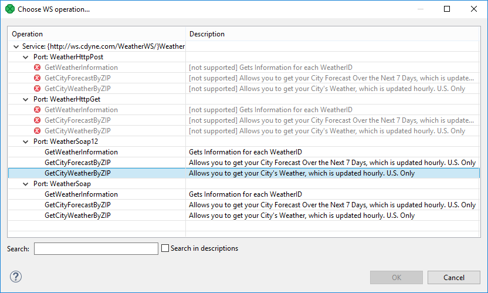

<!-- Development > Component reference > Others > WebServiceClient -->

### WebServiceClient


| [Short description](webserviceclient.md#short-description) |
| --- |
| [Ports](webserviceclient.md#ports) |
| [Metadata](webserviceclient.md#metadata) |
| [WebServiceClient attributes](webserviceclient.md#webserviceclient-attributes) |
| [Details](webserviceclient.md#details) |
| [Examples](webserviceclient.md#examples) |
| [See also](webserviceclient.md#see-also) |
> [!TIP]
> If you’re interested in learning more about this subject, we offer the [Connecting to APIs course](https://academy.cloverdx.com/courses/connecting-to-apis) in our CloverDX Academy.

#### Short description

**WebServiceClient** calls a web-service. It sends incoming data record to a web-service and passes the response to the output ports if they are connected.

**WebServiceClient** supports `document/literal` styles only.

**WebServiceClient** supports only SOAP (version 1.1 and 1.2) messaging protocol with document style binding and literal use (document/literal binding).

| Same input metadata | Sorted inputs | Inputs | Outputs | Each to all outputs | Java | CTL | Auto-propagated metadata |
| --- | --- | --- | --- | --- | --- | --- | --- |
| - | **⨯** | 0-1 | 0-n | **⨯** | **⨯** | **⨯** | **⨯** |

#### Ports

| Port type | Number | Required | Description | Metadata |
| --- | --- | --- | --- | --- |
| Input | 0 | **⨯** | For request | Any1(In0) |
| Output | 0-n | **⨯**[[1]](webserviceclient.md#webserviceclient-footnote1) | For response mapped to these ports | Any2(Out#) |

| 1 |  Response does not need to be sent to output if output ports are not connected. |
| --- | --- |

#### Metadata

**WebServiceClient** does not propagate metadata.

**WebServiceClient** has no metadata template.

#### WebServiceClient attributes

| Attribute | Req | Description | Possible values |
| --- | --- | --- | --- |
| Basic |  |  |  |
| WSDL URL | yes | A URL of the WSD server to which the component will connect. Connecting via a proxy server is available, too, e.g.: `http:(proxy://proxyHost:proxyPort)//www.domain.com`. | e.g. [http://wsf.cdyne.com/WeatherWS/Weather.asmx?wsdl](http://wsf.cdyne.com/WeatherWS/Weather.asmx?wsdl) |
| Operation name | yes | The name of the operation to be performed. See [Details](webserviceclient.md#details). |  |
| Request Body structure | yes | A structure of the request that is received from the input port or written directly to the graph. For more information about request generation, see [Details](webserviceclient.md#details). |  |
| Request Header structure |  | An optional attribute to **Request Body structure**. If not specified, automatic generation is disabled. For more information about request generation, see [Details](webserviceclient.md#details). |  |
| Response mapping |  | A mapping of a successful response to output ports. The same mapping as in **XMLExtract**. For more information, see [XMLExtract Mapping Definition](xmlextract.md#xmlextract-mapping-definition). |  |
| Fault mapping |  | A mapping of a fault response to output ports. The same mapping as in **XMLExtract**. For more information, see [XMLExtract Mapping Definition](xmlextract.md#xmlextract-mapping-definition). |  |
| Namespace bindings |  | A set of name-value assignments defining custom namespaces. The namespace binding attribute is used only for **Response Mapping** and **Fault Mapping**. | e.g. `weather = http://ws.cdyne.com/WeatherWS/` |
| Use nested nodes |  | When true, all elements with the same name are mapped, no matter their depth in the tree. See example in [Details](webserviceclient.md#details). | true (default) \| false |
| Security |  |  |  |
| Username | [[1]](webserviceclient.md#ws-authentication) | A username to be used when connecting to the server. |  |
| Password | [[1]](webserviceclient.md#ws-authentication) | A password to be used when connecting to the server. |  |
| Auth Domain | [[1]](webserviceclient.md#ws-authentication) | An authentication domain. If not set, the NTLM authentication scheme will be disabled. Does not affect Digest and Basic authentication methods. |  |
| Auth Realm | [[1]](webserviceclient.md#ws-authentication) | An authentication realm to which the specified credentials apply. If left empty, the credentials will be used for any realm. Does not affect NTLM authentication scheme. |  |
| Key store | [[2]](webserviceclient.md#webserviceclient-ssl-config) | Path to the key store which contains the key pair for client certificate authentication. Leave empty to use the JVM default key store. |  |
| Key store password | [[2]](webserviceclient.md#webserviceclient-ssl-config) | The password for the **Key store**. |  |
| Key alias | [[2]](webserviceclient.md#webserviceclient-ssl-config) | Selects a key from the **Key store**. If not set, the first key will be used. |  |
| Key password | [[2]](webserviceclient.md#webserviceclient-ssl-config) | The password for the selected client key. If not set, **Key store password** is used. |  |
| Trust store | [[2]](webserviceclient.md#webserviceclient-ssl-config) | Path to the trust store which contains certificates of trusted servers and certification authorities. Leave empty to use the JVM default trust store. |  |
| Trust store password | [[2]](webserviceclient.md#webserviceclient-ssl-config) | The password for the **Trust store**. |  |
| Disable SSL Certificate Validation |  | If true, the component ignores certificate validation problems for SSL connection. | true \| false (default) |
| Advanced |  |  |  |
| Request HTTP Headers |  | HTTP Header(s) and their values to be added to HTTP request headers. |  |
| Response HTTP Headers |  | HTTP header(s), that will be read from the HTTP response. You can map the headers in **Response mapping** to output metadata fields. |  |
| Timeout (ms) |  | Timeout for the request; by default in milliseconds, but other [time units](components.md#time-intervals) may be used. |  |
| Override Server URL |  | Specifies a URL that should be used for the requests instead of the one specified in WSDL definition. |  |
| Override Server URL from field |  | Specifies a field containing a URL that should be used for the requests instead of the one specified in WSDL definition. |  |

| 1 |  See [Authentication](webserviceclient.md#authentication) section for more details. |
| --- | --- |

| 2 |  Available since release 5.7. |
| --- | --- |

#### Details

After sending your request to the server, **WebServiceClient** waits up to 10 minutes for a response. If there is none, the component fails on error.

If you switch [log level](running-graphs.md#main-tab) to `DEBUG`, you can examine the full SOAP request and response in a log. This is useful for development and issue investigation purposes.

**Operation name** opens a dialog, depicted in the figure below, in which you can select a WS operation by double clicking on one of them. Operations not supporting the document style of the input message are displayed with a red error icon.


*Figure 449. Choosing WS operation name in WebServiceClient.*

**Request Body structure** and **Request Header structure** - open a dialog showing the request structure. The **Generate** button generates the request sample based on a schema defined for the chosen operation. The **Customized generation…​** option in the button’s drop-down menu opens a dialog which helps to customize the generated request sample by allowing to select only suitable elements or to choose a subtype for an element.
Example 400. Use nested nodes example
Mapping

```xml
<?xml version="1.0" encoding="UTF-8"?>
<Mappings>
    <Mapping element="request">
        <Mapping element="message" outPort="0" />
    </Mapping>
</Mappings>
```

applied to

```xml
<?xml version="1.0" encoding="UTF-8"?>
<request>
    <message>msg1</message>
    <operation>
        <message>msg2</message>
    </operation>
</request>
```

produces:

- `msg1` and `msg2` with **Use nested nodes** switched on (default behavior)
- `msg1` with **Use nested nodes** switched off. In order to extract `msg2`, you would need to create an explicit `<Mapping>` tag (one for every nested element).

##### Authentication

If authentication is required by the web service server, the **Username**, **Password** and, in the case of NTLM authentication, **Auth Domain** component properties need to be set.

There are currently three authentication schemes supported: NTLM, Digest and Basic. NTLM is the most secure while Basic is the least secure of these methods. The server advertises which authentication methods it supports and **WebServiceClient** automatically selects the most secure one.

**Auth Realm** can be used to restrict the specified credential only to a desired realm, in case Basic or Digest authentication schema is selected.
> [!NOTE]
> **Auth Domain** is required by the NTLM authentication. If it is not set, only Digest and Basic authentication schemes will be enabled.
>
> In case server requires NTLM authentication, but **Auth Domain** is left empty, you will get errors like these in graph execution log:
>
> - `ERROR [Axis2 Task] - Credentials cannot be used for NTLM authentication: org.apache.commons.httpclient.UsernamePasswordCredentials`
> - `ERROR [WatchDog] - Node WEB_SERVICE_CLIENT0 finished with status: ERROR caused by: org.apache.axis2.AxisFault: Transport error: 401 Error: Unauthorized`
>
> Also note that it is *not* possible to specify the domain as part of the **Username** in form of `domain\username` as is sometimes customary. The domain name has to be specified separately in the **Auth Domain** component property.

##### Special characters in Request Body

Special characters, e.g. < that appear in a request body should be typed as entities (>). Otherwise < would be interpreted as a beginning of a new xml element.

#### Examples

##### Getting echo from CloverDX Server

**CloverDX Server** provides a webservice API to get status or perform operations. Send echo request to CloverDX Server and get the response. The server listens on 127.0.0.1 on TCP port 38080.

###### Solution

Use the **WSDL URL**, **Operation name**, **Request Body structure** and **Response mapping** attributes.

Set **WSDL URL** to `http://127.0.0.1:38080/clover/webservice?wsdl`.

In **Operation name** choose the **echo** operation.

In **Request Body structure**, use **Generate** in the upper left corner and then fill in the string to be echoed.

In **Response mapping**, map the **out** element to any output metadata field. The output port has to be attached, otherwise the output cannot be mapped.

#### Compatibility

| Version | Compatibility Notice |
| --- | --- |
| 5.7.0 | You can now specify **Key store**, **Key store password**, **Key alias**, **Key password**, **Trust store** and **Trust store password**. |

#### See also

| [HTTPConnector](httpconnector.html) |
| --- |
| [Common properties of components](components.md#common-properties-of-components) |
| [Specific attribute types](components.md#specific-attribute-types) |
| [Others comparison](common-of-others.md#others-comparison) |
