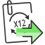
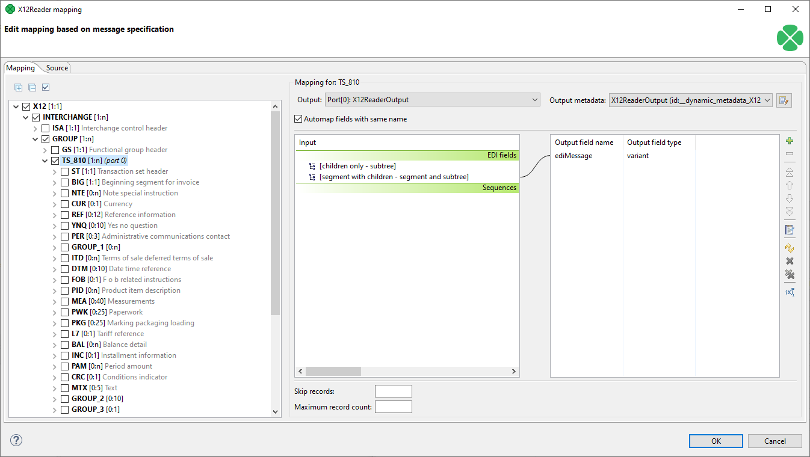
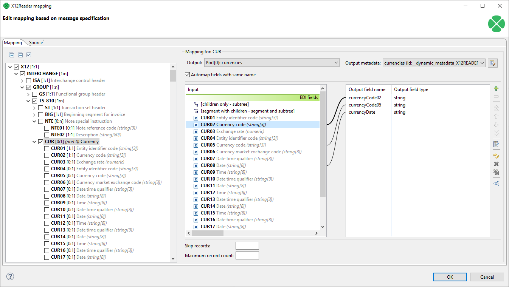

<!-- Development > Component reference > Readers > X12Reader -->

### X12Reader

| [Short description](x12reader.md#short-description) |
| --- |
| [Ports](x12reader.md#ports) |
| [Metadata](x12reader.md#metadata) |
| [X12Reader attributes](x12reader.md#x12reader-attributes) |
| [Details](x12reader.md#details) |
| [X12Reader Mapping Editor and transaction set schema](x12reader.md#x12reader-mapping-editor-and-transaction-set-schema) |
| [Examples](x12reader.md#examples) |
| [See also](x12reader.md#see-also) |

#### Short description

**X12Reader** reads data in X12 format. All X12 versions from `003030` to `007040` are supported.
> [!NOTE]
> Please note that **X12Reader** component is only available in certain CloverDX plans. To find out more about licensing requirements, please contact *[sales@cloverdx.com](mailto:sales@cloverdx.com)*.

| Data source | Input ports | Output ports | Each to all outputs | Different to different outputs | Transformation | Transf. req. | Java | CTL | Auto-propagated metadata |
| --- | --- | --- | --- | --- | --- | --- | --- | --- | --- |
| X12 file | 0-1 | 1-n | **⨯** | **✓** | **⨯** | **⨯** | **⨯** | **⨯** | **⨯** |

#### Ports

| Port type | Number | Required | Description | Metadata |
| --- | --- | --- | --- | --- |
| Input | 0 | **⨯** | For port reading. See [Reading from input port](examples-of-file-url-in-readers.md#reading-from-input-port). | One field (`byte`, `cbyte`, `string`) for specifying an input of the component. |
| Output | 0 | **✓** | For correct data records | Any[[1]](x12reader.md#x12reader-ports-note-1) |
| 1-n | [[2]](x12reader.md#x12reader-ports-note-2) | For correct data records | Any [[1]](x12reader.md#x12reader-ports-note-1) (each port can have different metadata). |  |

| 1 |  Metadata on each output port does not need to be the same. Each metadata can use [Autofilling functions](metadata-records-and-fields.md#autofilling-functions). |
| --- | --- |

| 2 |  Other output ports are required if the mapping requires it. |
| --- | --- |

#### Metadata

**X12Reader** does not propagate metadata.

**X12Reader** has a metadata template on its output port available.

Metadata on optional input port must contain `string`, `byte` or `cbyte` field.

Metadata on each output port does not need to be the same.

Each metadata can use [Autofilling functions](metadata-records-and-fields.md#autofilling-functions).

#### X12Reader attributes

| Attribute | Req | Description | Possible values |
| --- | --- | --- | --- |
| Basic |  |  |  |
| File URL | yes | Attribute specifying what data source(s) will be read (X12 file, input port, dictionary). See [Supported file URL formats for Readers](examples-of-file-url-in-readers.md). |  |
| X12 version |  | Attribute specifying version of X12 transaction set. |  |
| X12 transaction set |  | Attribute specifying type of X12 transaction set. Possible values depend on selected **X12 version**. |  |
| Mapping | [[1]](x12reader.md#x12reader-reference-1) | Mapping of the input X12 structure to output ports. For more information, see [XMLExtract mapping definition](xmlextract.md#xmlextract-mapping-definition). |  |
| Mapping URL | [[1]](x12reader.md#x12reader-reference-1) | Name of an external file, including its path which defines mapping of the input X12 structure to output ports. For more information, see [XMLExtract mapping definition](xmlextract.md#xmlextract-mapping-definition). |  |
| Advanced |  |  |  |
| Strict validation |  | Enables strict validation of the incoming values, their sizes and data types. Also checks that composite elements are not present in places where only simple elements are allowed. Produces error if any validation check finds a problem. | true (default) \| false |

| 1 |  One of these must be specified if **X12 version** and **X12 transaction set** are used. If both are specified, **Mapping URL** has higher priority. |
| --- | --- |

#### Details

**X12Reader** reads data from X12 files using SAX technology.

**X12Reader** can read individual values or entire subtrees of the X12 structure. Individual values can be converted to any field type. Subtrees can be converted to **variant** fields. When reading into **variant** fields, all data types in the field will be **string** type.

Using **X12Reader** is very similar to **XMLExtract**. attributes **X12 version** and **X12 transaction set** define the expected structure (schema) of the input data. The schema is generated automatically.

Specifying **X12 version** and **X12 transaction set** is optional. You can leave both attributes empty, in which case **X12Reader** will read entire input data into a single **variant** field on first output port. Defining a mapping is not possible in this case.

#### X12Reader Mapping Editor and Transaction Set Schema

**X12Reader Mapping Editor** serves to define mapping from X12 transaction set structure to one or more output ports by drag and drop.

To be able to use the editor you have to specify **X12 version** and **X12 transaction set**. The schema is created internally and cannot be modified.

Any other operations to set up mapping are described in above mentioned **XMLExtract**.

In **X12Reader**, you can map input fields to the output in the same way as you map transaction set fields. The input field mapping works in all three processing modes.

#### Examples

Mapping parts of X12 transaction set onto output metadata. It is possible to map a whole transaction set or its part onto **variant** field or to map individual values to fields of other data types.

*Figure 355. X12Reader - mapping part of a transaction set*

*Figure 356. X12Reader - mapping fields of a transaction set*

#### Compatibility

| Version | Compatibility Notice |
| --- | --- |
| 5.14 | **X12Reader** is available since **5.14.0**. |

#### See also

| [X12Writer](x12writer.md) |
| --- |
| [EDIFACTReader](edifactreader.md) |
| [Common properties of components](components.md#common-properties-of-components) |
| [Specific attribute types](components.md#specific-attribute-types) |
| [Common properties of Readers](common-of-readers.md) |
| [Readers comparison](common-of-readers.md#readers-comparison) |
