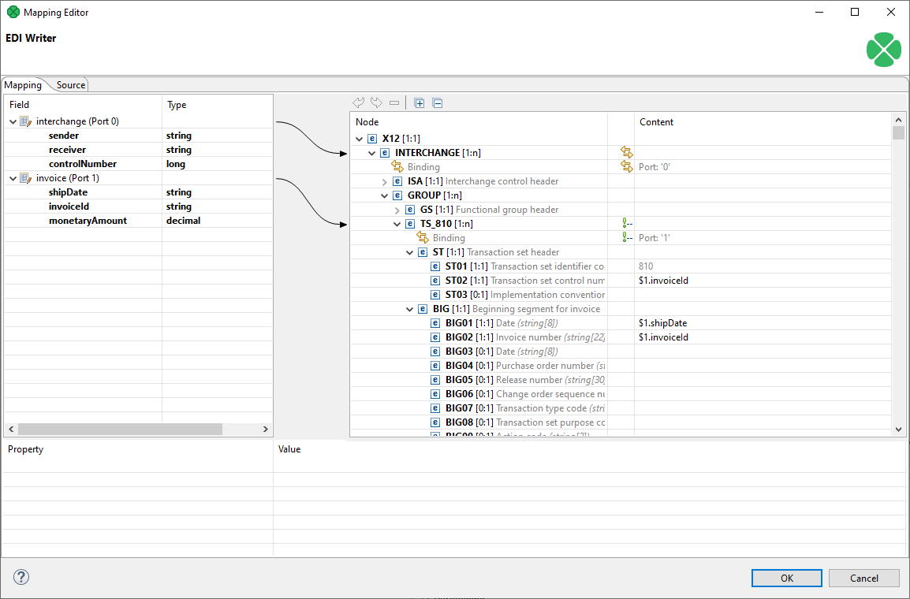

<!-- Development > Component reference > Writers > X12Writer -->

### X12Writer

| [Short description](x12writer.md#short-description) |
| --- |
| [Ports](x12writer.md#ports) |
| [Metadata](x12writer.md#metadata) |
| [X12Writer attributes](x12writer.md#x12writer-attributes) |
| [Details](x12writer.md#details) |
| [Autofilled segments](x12writer.md#autofilled-segments) |
| [Examples](x12writer.md#examples) |
| [See also](x12writer.md#see-also) |

#### Short description

**X12Writer** writes data in the X12 format. All X12 versions from `003030` to `007040` are supported.
> [!NOTE]
> Please note that **X12Writer** component is only available in certain CloverDX plans. To find out more about licensing requirements, please contact *[sales@cloverdx.com](mailto:sales@cloverdx.com)*.

| Data output | Input ports | Output ports | Transformation | Transf. req. | Java | Auto-propagated metadata |
| --- | --- | --- | --- | --- | --- | --- |
| X12 file | 1-n | 0-1 | **⨯** | **⨯** | **⨯** | **⨯** |

#### Ports

| Port type | Number | Required | Description | Metadata |
| --- | --- | --- | --- | --- |
| Input | 0-n | At least one | Input records to be mapped into the X12 transaction set structure. | Any (each port can have different metadata) |
| Output | 0 | **⨯** | For port writing. | Only one field (`byte`, `cbyte` or `string`) is used. The field name is used in **File URL** to govern how the output records are processed - see [Writing to output port](examples-of-file-url-in-writers.md#writing-to-output-port) |

#### Metadata

**X12Writer** does not propagate metadata.

**X12Writer** has no metadata template.

#### X12Writer attributes

| Attribute | Req | Description | Possible values |
| --- | --- | --- | --- |
| Basic |  |  |  |
| File URL | yes | The target file for the output X12 transaction set. See [Supported file URL formats for Writers](examples-of-file-url-in-writers.md). |  |
| X12 version |  | Attribute specifying version of X12 transaction set. |  |
| X12 transaction set |  | Attribute specifying type of X12 transaction set. Possible values depend on selected **X12 version**. |  |
| Interchange sender id |  | Attribute specifying default identification of X12 interchange sender. When specified, the value is used as default for `ISA` and `GS` segments. |  |
| Interchange receiver id |  | Attribute specifying default identification of X12 interchange receiver. When specified, the value is used as default for `ISA` and `GS` segments. |  |
| Interchange control number |  | Attribute specifying default control number of X12 interchange. When specified, the value is used as default for `ISA` segment. In X12 the interchange control number should be unique for every interchange exchanged between sender and recipient, therefore this attribute should not be used if multiple interchanges are written at the same time. |  |
| Group control number |  | Attribute specifying default control number of X12 functional group. When specified, the value is used as default for `GS` segment. In X12 the group control number should be unique for every group, therefore this attribute should not be used if multiple groups are written at the same time. |  |
| Transaction set control number |  | Attribute specifying default control number of X12 transaction set. When specified, the value is used as default for `ST` segment. In X12 the transaction set control number should be unique for every transaction set, therefore this attribute should not be used if multiple transaction sets are written at the same time. |  |
| Mapping | [[1]](x12writer.md#x12writer-attributes-fn01) | Defines how input data is mapped onto an output X12 transaction set. See [Details](x12writer.md#details). |  |
| Mapping URL | [[1]](x12writer.md#x12writer-attributes-fn01) | External text file containing the mapping definition. |  |
| Advanced |  |  |  |
| Segment terminator |  | Every X12 segment must end with a terminator character. This attribute defines which character to use as segment terminator. | 1 character |
| Element separator |  | Every X12 segment contains multiple elements separated by an element separator character. This attribute defines which character to use as element separator. | 1 character |
| Strict validation |  | Enables strict validation of the written values, their sizes and data types. Also checks that composite elements are not written in places where only simple elements are allowed. Produces error if any validation check finds a problem. | true (default) \| false |
| Cache size |  | The size of the database used when caching data from ports to elements (the data is first processed then written). The larger your data is, the larger cache is needed to maintain fast processing. | auto (default) \| e.g. 300MB, 1GB etc. |
| Cache in Memory |  | Cache data records in memory instead of the JDBM’s disk cache (default). Note that while it is possible to set the maximal size of the disk cache, this setting is ignored in case the in-memory cache is used. As a result, an `OutOfMemoryError` may occur when caching too many data records. | false (default) \| true |
| Sorted input |  | Tells **X12Writer** whether the input data is sorted. Setting the attribute to true declares you want to use the sort order defined in **Sort keys**, see below. | false (default) \| true |
| Sort keys |  | Tells **X12Writer** how the input data is sorted, thus enabling streaming. The sort order of fields can be given for each port in a separate tab. Working with **Sort keys** has been described in [Sort key](components.md#sort-key). |  |
| Max number of records |  | The maximum number of records written to all output files. See [Selecting output records](selecting-output-records.md). | 0-N |
| Partitioning |  |  |  |
| Records per file |  | The maximum number of records that are written to a single file. See [Partitioning output into different output files](partitioning-output-into-different-output-files.md) | 1-N |
| Partition key |  | The key whose values control the distribution of records among multiple output files. For more information, see [Partitioning output into different output files](partitioning-output-into-different-output-files.md). |  |
| Partition lookup table |  | The ID of a lookup table. The table serves for selecting records which should be written to the output file(s). For more information, see [Partitioning output into different output files](partitioning-output-into-different-output-files.md). |  |
| Partition file tag |  | By default, output files are numbered. If this attribute is set to `Key file tag`, output files are named according to the values of **Partition key** or **Partition output fields**. For more information, see [Partitioning output into different output files](partitioning-output-into-different-output-files.md). | Number file tag (default) \| Key file tag |
| Partition output fields |  | The fields of **Partition lookup table** whose values serve for naming output file(s). For more information, see [Partitioning output into different output files](partitioning-output-into-different-output-files.md). |  |
| Partition unassigned file name |  | The name of a file that the unassigned records should be written into (if there are any). If it is not given, the data records whose key values are not contained in **Partition lookup table** are discarded. For more information, see [Partitioning output into different output files](partitioning-output-into-different-output-files.md). |  |
| Partition key sorted |  | In case partitioning into multiple output files is turned on, all output files are open at once. This could lead to an undesirable memory footprint for many output files (thousands). Moreover, for example unix-based OS usually have a very strict limitation of number of simultaneously open files (1,024) per process.  In case you run into one of these limitations, consider sorting the data by a partition key using one of our standard sorting components and setting this attribute to true. The partitioning algorithm does not need to keep open all output files, just the last one is open at one time. For more information, see [Partitioning output into different output files](partitioning-output-into-different-output-files.md). | false (default) \| true |

| 1 |  One of these must be specified if **X12 version** and **X12 transaction set** are used. If both are specified, **Mapping URL** has a higher priority. |
| --- | --- |

#### Details

**X12Writer** receives data from all connected input ports and converts records to X12 transaction set structure based on the mapping you define. You map the input ports and fields in a manner similar to **XMLWriter** as described in [Creating the mapping - mapping ports and fields](extxmlwriter.md#creating-the-mapping-mapping-ports-and-fields). Finally, the component writes the resulting tree structure of elements to the output: an X12 file, port or dictionary.

Input data has to provide all mandatory data required by selected X12 transaction set format. When any mandatory element is missing the mapping editor produces a warning. Type of a transaction set can be specified by **X12 version** and **X12 transaction set** properties in the component.

Individual fields of X12 transaction set can be filled by input fields of primitive types such as **string** or **long**. Entire subtrees of the target transaction set can be filled by input **variant** fields. When using **variant** fields the structure of the input **variant** must match the schema of the target mapped element, otherwise the **X12Writer** will fail at runtime.

Specifying **X12 version** and **X12 transaction set** is optional. You can leave both attributes empty, in which case **X12Writer** expects a single **variant** field with entire interchange structure on first input port. The expected structure is the same as produced by **X12Reader**. Defining a mapping is not possible in this case.

#### Autofilled segments

**X12Writer** automatically fills values for some elements. X12 technical fields such as various segment counters, checksums and timestamps are computed automatically when writing.

These fields are filled automatically, it is not necessary to specify their values in input data:

- ISA01 (Interchange control header) - Authorization information qualifier (defaults to 00)
- ISA02 (Interchange control header) - Authorization information (defaults to 10 spaces)
- ISA03 (Interchange control header) - Security information qualifier (defaults to 00)
- ISA04 (Interchange control header) - Security information (defaults to 10 spaces)
- ISA05 (Interchange control header) - Interchange id qualifier (defaults to ZZ)
- ISA07 (Interchange control header) - Interchange id qualifier (defaults to ZZ)
- ISA09 (Interchange control header) - Interchange date
- ISA10 (Interchange control header) - Interchange time
- ISA11 (Interchange control header) - Repetition separator (defaults to ^) for version 004020 and later, Interchange control standards (defaults to U) for earlier versions
- ISA12 (Interchange control header) - Interchange control version number code (defaults to 00000)
- GS04 (Functional group header) - Date
- GS05 (Functional group header) - Time
- SE01 (Transaction set trailer) - Number of included segments
- SE02 (Transaction set trailer) - Transaction set control number
- GE01 (Functional group trailer) - Number of transaction sets included
- GE02 (Functional group trailer) - Group control number
- IEA01 (Interchange control trailer) - Number of included functional groups
- IEA02 (Interchange control trailer) - Interchange control number

When **Mapping** attribute is used, additional X12 fields are pre-generated with default values based on current configuration of the component. You can see the pre-generated defaults in the Mapping dialog.

#### Examples

Mapping different ports on parts of an X12 transaction set format allows to insert multiple repeating segments into one X12 file.

The example below creates one X12 interchange for each record obtained from port 0 and one Invoice (TS_810) transaction set for each record obtained from port 1.

*Figure 394. X12Writer - mapping input records on different parts of a transaction set*

#### Compatibility

| Version | Compatibility Notice |
| --- | --- |
| 5.14 | **X12Writer** is available since **5.14.0**. |

#### See also

| [X12Reader](x12reader.md) |
| --- |
| [EDIFACTWriter](edifactwriter.md) |
| [Common properties of components](components.md#common-properties-of-components) |
| [Specific attribute types](components.md#specific-attribute-types) |
| [Common properties of Writers](common-of-writers.md) |
| [Writers comparison](common-of-writers.md#writers-comparison) |
