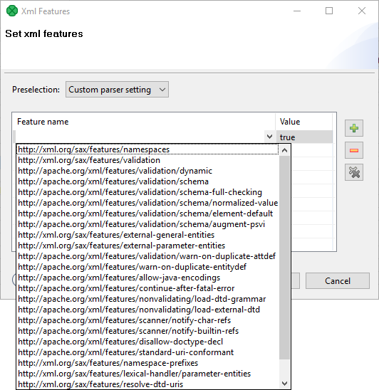

<!-- Development > Component reference > Readers > Common properties of Readers > XML features -->

#### XML features

In [XMLExtract](xmlextract.md),[XMLReader](xmlreader.md) and [XMLXPathReader](xmlxpathreader.md), you can configure the validation of your input XML files by specifying the **Xml features** attribute. The Xml features configure validation of the XML in more detail by enabling or disabling specific checks, see [Parser Features](http://xerces.apache.org/xerces2-j/features.html). It is expressed as a sequence of individual expressions of one of the following form: `nameM:=true` or `nameN:=false`, where each `nameM` is an XML feature that should be validated. These expressions are separated from each other by a semicolon.

The options for validation are the following:

- **Custom parser setting**
- **Default parser setting**
- **No validations**
- **All validations**

You can define this attribute using the following dialog:

*Figure 339. XML features dialog*

In this dialog, you can add features using the **Plus** button, select their `true` or `false` values, etc.
