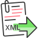
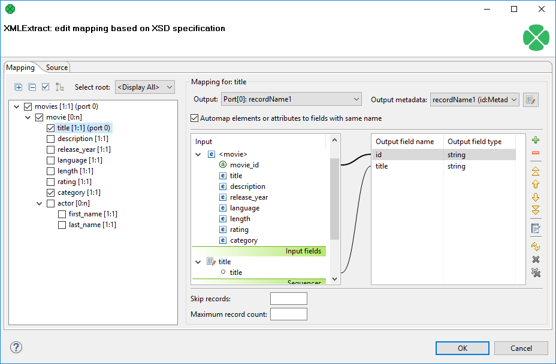
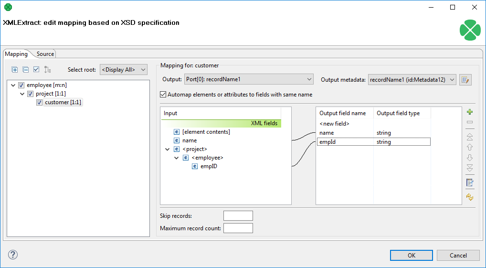
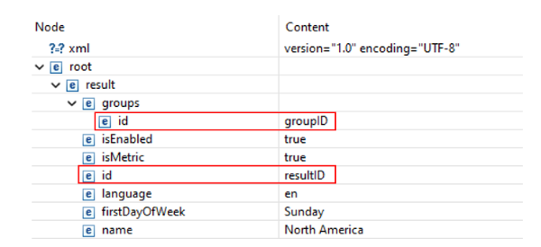
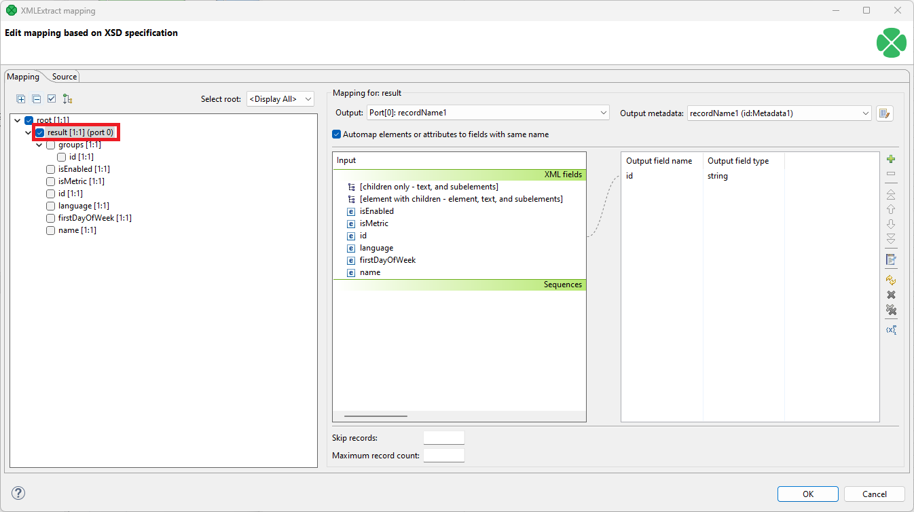
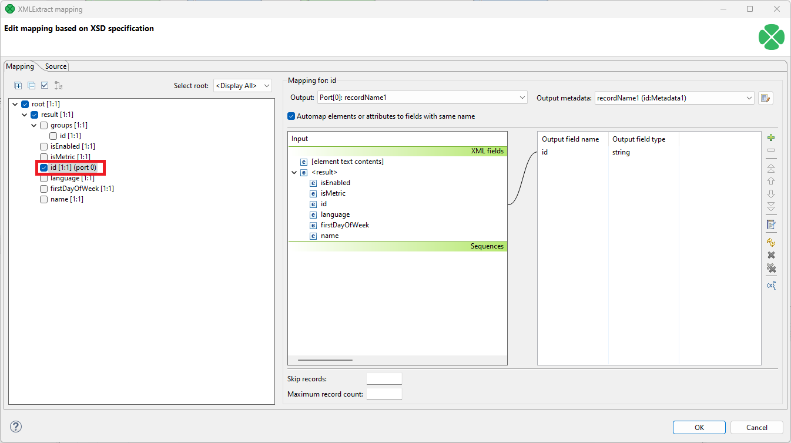
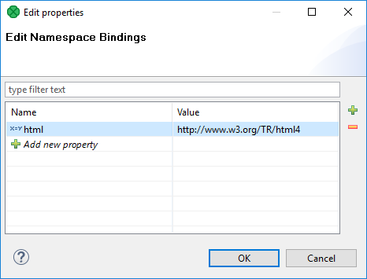
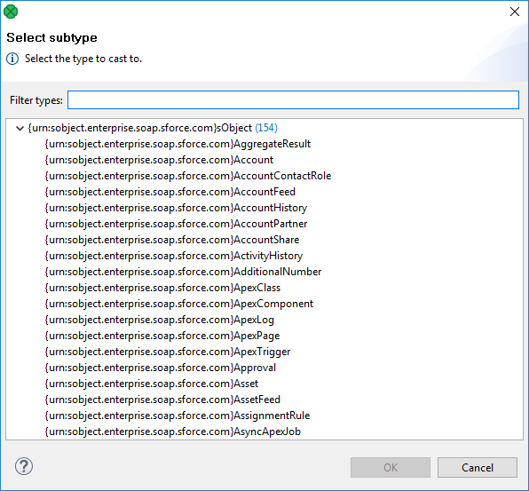

<!-- Development > Component reference > Readers > XMLExtract -->

### XMLExtract



| [Short description](xmlextract.md#short-description) |
| --- |
| [Ports](xmlextract.md#ports) |
| [Metadata](xmlextract.md#metadata) |
| [XMLExtract attributes](xmlextract.md#xmlextract-attributes) |
| [Details](xmlextract.md#details) |
| [Best practices](xmlextract.md#best-practices) |
| [Compatibility](xmlextract.md#compatibility) |
| [See also](xmlextract.md#see-also) |
> [!TIP]
> If you’re interested in learning more about this subject, we offer the [Work with JSON/XML course](https://academy.cloverdx.com/courses/json-xml) in our CloverDX Academy.

#### Short description

**XMLExtract** reads data from XML files using SAX technology. It can also read data from compressed files, input port, and dictionary.
> [!NOTE]
> Which XML Component?
> Generally, use **XMLExtract**. It is fast and has GUI to map elements to records. It is based on SAX.
>
> [XMLReader](xmlreader.md) can use more complex XPath expressions than **XMLExtract**, e.g. it allows you to reference siblings. On the other hand, this **XMLReader** is slower and needs more memory than **XMLExtract**. **XMLReader** is based on DOM.
>
> **XMLReader** supersedes the original [XMLXPathReader](xmlxpathreader.md). **XMLXPathReader** can use more complex XPath expressions than **XMLExtract**. **XMLXPathReader** uses DOM.

| Data source | Input ports | Output ports | Each to all outputs | Different to different outputs | Transformation | Transf. req. | Java | CTL | Auto-propagated metadata |
| --- | --- | --- | --- | --- | --- | --- | --- | --- | --- |
| XML file | 0-1 | 1-n | **⨯** | **✓** | **⨯** | **⨯** | **⨯** | **⨯** | **⨯** |

#### Ports

| Port type | Number | Required | Description | Metadata |
| --- | --- | --- | --- | --- |
| Input | 0 | **⨯** | For port reading, see [Reading from onput port](examples-of-file-url-in-readers.md#reading-from-input-port). | One field (`byte`, `cbyte`, `string`) for specifying an input of the component. Input fields can be mapped to output. For more information, see [XMLExtract mapping definition](xmlextract.md#xmlextract-mapping-definition). |
| Output | 0 | **✓** | For correct data records | Any[[1]](xmlextract.md#xmlextract-ports-fn01) |
| 1-n | [[2]](xmlextract.md#xmlextract-footnote2) | For correct data records | Any [[1]](xmlextract.md#xmlextract-ports-fn01) (each port can have different metadata). |  |

| 1 |  Metadata on each output port does not need to be the same. Each metadata can use [Autofilling functions](metadata-records-and-fields.md#autofilling-functions). |
| --- | --- |

| 2 |  Other output ports are required if the mapping requires it. |
| --- | --- |

If you connect an edge to the optional input port of the component, you must set the **File URL** attribute to `port:$0.FieldName[:processingType]`.

#### Metadata

**XMLExtract** does not propagate metadata.

**XMLExtract** has no metadata template.

If an input port is connected, its metadata has to contain a string, byte or cbyte field. Metadata on each output port does not need to be the same. Metadata on output port may contain lists.

Each metadata can use [Autofilling functions](metadata-records-and-fields.md#autofilling-functions).

#### XMLExtract attributes

| Attribute | Req | Description | Possible values |
| --- | --- | --- | --- |
| Basic |  |  |  |
| File URL | yes | An attribute specifying what data source(s) will be read (XML file, input port, dictionary). See [Supported file URL formats for Readers](examples-of-file-url-in-readers.md). |  |
| Charset |  | Encoding of records which are read. | any encoding, default system one by default |
| Mapping | [[1]](xmlextract.md#xmlextract-attributes-fn01) | A mapping of the input XML structure to output ports. For more information, see [XMLExtract mapping definition](xmlextract.md#xmlextract-mapping-definition). |  |
| Mapping URL | [[1]](xmlextract.md#xmlextract-attributes-fn01) | The name of an external file, including its path which defines mapping of the input XML structure to output ports. For more information, see [XMLExtract mapping definition](xmlextract.md#xmlextract-mapping-definition). |  |
| Namespace Bindings |  | Allows using arbitrary namespace prefixes in **Mapping**. See [Namespaces](xmlextract.md#namespaces). |  |
| XML Schema |  | A URL of the file that should be used for creating the **Mapping** definition. For more information, see [XMLExtract Mapping Editor and XSD schema](xmlextract.md#xmlextract-mapping-editor-and-xsd-schema). |  |
| Use nested nodes |  | By default, nested elements are also mapped to output ports automatically. If set to `false`, an explicit `<Mapping>` tag must be created for each such nested element. See [Use nested nodes examples](xmlextract.md#xmlextract-use-nested-nodes-examples). | true (default) \| false |
| Trim strings |  | By default, white spaces from the beginning and the end of the elements values are removed. If set to `false`, they are not removed. | true (default) \| false |
| Advanced |  |  |  |
| Validate |  | Enables/disables validation of the XML against a DTD. (Validation against XML schema is not implemented.) | true \| false (default) |
| XML features |  | A sequence of individual expressions of one of the following form: `nameM:=true` or `nameN:=false`, where each `nameM` is an XML feature that should be validated. These expressions are separated from each other by a semicolon. For more information, see [XML features](xml-features.md). |  |
| Skip rows |  | The number of mappings to be skipped continuously throughout all source files. See [Selecting input records](selecting-input-records.md). | 0-N |
| Max number of rows to output |  | The maximum number of records to be read continuously throughout all source files. See [Selecting input records](selecting-input-records.md). | 0-N |
| Add file path for XML entities |  | Provide file path of parsed XML needed for resolving external entities. Necessary if parsed XML contains external entity relations `<!ENTITY name SYSTEM "file.inc">` | true \| false (default) |

| 1 |  One of these must be specified. If both are specified, **Mapping URL** has a higher priority. |
| --- | --- |

#### Details

| [XMLExtract Mapping Editor and XSD schema](xmlextract.md#xmlextract-mapping-editor-and-xsd-schema) |
| --- |
| [XMLExtract mapping definition](xmlextract.md#xmlextract-mapping-definition) |
| [Usage of dot in mapping](xmlextract.md#usage-of-dot-in-mapping) |
| [Element content (text and children elements) mapping](xmlextract.md#element-content-text-and-children-elements-mapping) |
| [Usage of useParentRecord attribute](xmlextract.md#usage-of-useparentrecord-attribute) |

In **XMLExtract**, you can map tags, attributes and input fields to the output. It can read multiple elements of the same name as a list. The mapping is specified in **XMLExtract Mapping Editor**.
Example 367. Mapping in XMLExtract

```xml
<Mappings>
    <TypeOverride elementPath="/employee/child" overridingType="boy" />
    <Mapping element="employee" outPort="0" implicit="false" xmlFields="salary" cloverFields="basic_salary">
        <Mapping element="child" outPort="1" parentKey="empID" generatedKey="parentID"/>
        <Mapping element="benefits" outPort="2"
                                       parentKey="empID;jobID" generatedKey="empID;jobID"
                                       sequenceField="seqKey" sequenceId="Sequence0">
            <Mapping element="financial" outPort="3" parentKey="seqKey" generatedKey="seqKey"/>
        </Mapping>
        <Mapping element="project" outPort="4" parentKey="empID;jobID" generatedKey="empID;jobID">
            <Mapping element="customer" outPort="5"
                                       parentKey="projName;projManager;inProjectID;Start"
                                       generatedKey="joinedKey"/>
        </Mapping>
    </Mapping>
</Mappings>
```

##### XMLExtract Mapping Editor and XSD schema

| [Mapping tab](xmlextract.md#mapping-tab) |
| --- |
| [Source tab](xmlextract.md#source-tab) |

**XMLExtract Mapping Editor** lets you define mapping by drag and drop.

To be able to specify a mapping, you need XSD schema. The path to schema is set in the **XML Schema** attribute. If you do not have the schema, the component can generate it from the source file. If you have neither the schema nor a source file, you can still specify the mapping using source tab.

When using an XSD, the mapping can be performed visually in the **Mapping** dialog. The dialog consists of two tabs: the **Mapping** tab and the **Source** tab. The **Mapping** attribute can be defined in the **Source** tab, while in the **Mapping** tab you can work with your **XML Schema**.
> [!NOTE]
> If you do not possess a valid XSD schema for your source XML, you can switch to the **Mapping** tab and click **Generate XML Schema** which attempts to "guess" the XSD structure from the XML.

###### Mapping tab


*Figure 357. The Mapping dialog for XMLExtract*

In the pane on the left hand side of the **Mapping** tab, you can see a tree structure of the XML. Every element shows how many occurrences it has in the source file (e.g. [0:n]). In this pane, you need to check the elements that should be mapped to the output ports.

At the top, you specify **Output** for each selected element by choosing from a drop-down list. Possible values are:

- **Not mapped** - the mapping will not produce a record. By using such mapping elements, you can enforce that any child mapping will be processed only if the parser encounters this element first.
- **Parent record** - the mapping will not produce a record, but it will fill the mapped values to a parent record.
- **portNumber(metadata)** - the mapping will generate a record and write it to a selected output port.

You can then choose from the list of metadata labeled `portNumber(metadata)`, e.g. "3(customer)".

On the right hand side, you can see mapping **Input** and **Output fields**. You either map them to each other according to their names (by checking the **Map XML by name** checkbox) or you map them yourself - explicitly. Please note that in **Input - XML fields**, not only elements but also their parent elements are visible (as long as parents have some fields) and can be mapped.

You can also map the input fields (**Input fields** section), fields from record produced by the parent mapping (**Parent fields** section) or generate a unique ID for record by mapping a sequence from **Sequences** section to one of the output fields.
> [!NOTE]
> **sequenceId** and **sequenceField** is set if some sequence is mapped to output metadata field. However it is possible to set just **sequenceField**. In this case, a new sequence is created and mapped to the metadata field. The mapping is valid but **Mapping Dialog** shows warning that metadata field is mapped to non existing sequence.

###### Source tab

Once you define all elements, specify output ports, mapping and other properties, you can switch to the **Source** tab. The mapping code is displayed there. Its structure is the same as described in the preceding sections.
> [!NOTE]
> If you do not possess a valid XSD schema for your source XML, you will not be able to map elements visually and you have to do it in the **Source** tab.
> [!NOTE]
> It is possible to map an attribute or element missing at the schema. No validation warning is raised and mapping is visualized at the **Mapping** tab. Italic font is used when displaying mapped elements and attributes missing at the schema.

If you want to map an element to XML fields of its parents, use the "../" string (like in the file system) before the field name. Every "../" stands for "this element’s parent", so "../../" would mean the element’s parent’s parent and so on. Examine the example below. The "../../empID" is a field of "employee" as made available to the currently selected element "customer".


*Figure 358. Parent elements*

```xml
<Mapping element="employee">
    <Mapping element="project">
        <Mapping element="customer" outPort="0"
            xmlFields="name;../../empID"
            cloverFields="name;empId"/>
    </Mapping>
</Mapping>
```

There is one thing that one should keep in mind when referencing parent elements, particularly if you rely on the **Use nested nodes** property set to `true`: To reference one parent level using "../" actually means to reference that ancestor element (over more parents) in the XML which is defined in the direct parent `<Mapping>` of `<Mapping>` with the "../" parent reference.

**Example:**

Let us recall the mapping from last example. We will omit one of its `<Mapping>` elements and notice how also the parent field reference had to be changed accordingly.

```xml
<Mapping element="employee">
    <Mapping element="customer" outPort="0"
        xmlFields="name;../empID"
        cloverFields="name;empId"/>
</Mapping>
```

##### XMLExtract mapping definition

| [XMLExtract type override tags](xmlextract.md#xmlextract-type-override-tags) |
| --- |
| [XMLExtract mapping tags](xmlextract.md#xmlextract-mapping-tags) |
| [XMLExtract field mapping tags](xmlextract.md#xmlextract-field-mapping-tags) |
| [XMLExtract mapping tag attributes](xmlextract.md#xmlextract-mapping-tag-attributes) |

The mapping is defined in the **Mapping URL** or **Mapping** attribute.

Every **Mapping** definition consists of a pair of the start and the end `<Mappings>` tags. The `<Mappings>` tag has no attributes. This pair of `<Mappings>` tags surrounds all of the nested `<Mapping>` and `<TypeOverride>` tags.

Each of the `<Mapping>` tags contains some [XMLExtract mapping tag attributes](xmlextract.md#xmlextract-mapping-tag-attributes). For more information, see also [XMLExtract type override tags](xmlextract.md#xmlextract-type-override-tags) or [XMLExtract mapping tags](xmlextract.md#xmlextract-mapping-tags)

###### XMLExtract type override tags

The **Type Override** tag can be used to tell the mapping editor that an element on a given path should be treated as if its type was actually the `overridingType`. This tag has no impact on actual processing of XML file at runtime.

Example:

`<TypeOverride elementPath="/employee/child" overridingType="boy" />`

- `elementPath`
  Required
  Each **Type Override** tag must contain one `elementPath` attribute. The value of this element must be a path from the root of an input XML structure to a node.
  `elementPath="/[prefix:]parent/…/[prefix]nodeName"`
- `overridingType`
  Required
  Each **Type Override** tag must contain one `overridingType` attribute. The value of this element must be a type in the referenced XML schema.
  `overridingType="[prefix:]typeName"`

###### XMLExtract mapping tags

- **Empty mapping tag (without a child)**
  `<Mapping element="[prefix:]nameOfElement"`[XMLExtract mapping tag attributes](xmlextract.md#xmlextract-mapping-tag-attributes)`/>`
  This corresponds to the following node of XML structure:
  `<[prefix:]nameOfElement>ValueOfTheElement</[prefix:]nameOfElement>`
- **Non-empty mapping tags (parent with a child)**
  `<Mapping element="[prefix:]nameOfElement"`[XMLExtract mapping tag attributes](xmlextract.md#xmlextract-mapping-tag-attributes)`>`
  `(nested Mapping elements (only children, parents with one or more children, etc.)`
  `</Mapping>`
  This corresponds to the following XML structure:
  `<[prefix:]nameOfElement elementattributes>`
  `(nested elements (only children, parents with one or more children, etc.)`
  `</[prefix:]nameOfElement>`
  In addition to nested `<Mapping>` elements, the Mapping can contain `<FieldMapping>` elements to map fields from input record to output record. For more information, see [XMLExtract field mapping tags](xmlextract.md#xmlextract-field-mapping-tags).

###### XMLExtract field mapping tags

**Field Mapping** tags allows to map fields from an input record to an output record of parent Mapping element.

Example:

`<FieldMapping inputField="sessionID" outputField="sessionID" />`

- `inputField`
  Required
  Specifies a field from an input record, that should be mapped to an output record.
  `inputField="fieldName"`
- `outputField`
  Required
  Specifies a field to which a value from the input field should be stored.
  `outputField="fieldName"`

The nested structure of `<Mapping>` tags copies the nested structure of XML elements in input XML files. See example below.
Example 368. From XML structure to mapping structure
- **If XML structure looks like this:**
  ```xml
  <[prefix:]nameOfElement>
      <[prefix1:]nameOfElement1>ValueOfTheElement11</[prefix1:]nameOfElement1>
      ...
      <[prefixK:]nameOfElementM>ValueOfTheElementKM</[prefixK:]nameOfElementM>
      <[prefixL:]nameOfElementN>
          <[prefixA:]nameOfElementE>ValueOfTheElementAE</[prefixA:]nameOfElementE>
          ...
          <[prefixR:]nameOfElementG>ValueOfTheElementRG</[prefixR:]nameOfElementG>
      </[prefixK:]nameOfElementN>
  </[prefix:]nameOfElement>
  ```
- **Mapping can look like this:**
  ```xml
  <Mappings>
      <Mapping element="[prefix:]nameOfElement" attributes>
          <Mapping element="[prefix1:]nameOfElement1" attributes11/>
          ...
          <Mapping element="[prefixK:]nameOfElementM" attributesKM/>
          <Mapping element="[prefixL:]nameOfElementN" attributesLN>
              <Mapping element="[prefixA:]nameOfElementE" attributesAE/>
              ...
              <Mapping element="[prefixR:]nameOfElementG" attributesRG/>
          </Mapping>
      </Mapping>
  </Mappings>
  ```

However, **Mapping** does not need to copy all of the XML structure, it can start at the specified level inside the XML file. In addition, if the default setting of the **Use nested nodes** attribute is used (`true`), it also allows the mapping of deeper nodes without needing to create a separate child `<Mapping>` tags for them).
> [!IMPORTANT]
> Remember that mapping of nested nodes is possible only if their names are unique within their parent and confusion is not possible.

To further explain how the **Use nested nodes** attribute works and why it is important that there are no elements with the same name, see the following examples:

In this sample xml file there are two elements called `id`: the first one is a nested element within the `groups` element, and the other one is nested within the main `result` element. The value of the first `id` is `groupID`, and the value of the other `id` is `resultID`.

```xml
<root>
  <result>
    <groups>
      <id>groupID</id>
    </groups>
    <isEnabled>true</isEnabled>
    <isMetric>true</isMetric>
    <id>resultID</id>
    <language>en</language>
    <firstDayOfWeek>Sunday</firstDayOfWeek>
    <name>North America</name>
  </result>
```


*Figure 359. XML structure and values*

**Example 1:** The mapping is at the level of the main `result` element, and the **Automap elements or attributes to fields with same name** option is turned on, or the `id` (resultID) is specifically mapped.


*Figure 360. Mapping 1*

The value of the `id` element will differ based on if the *Use nested nodes* value is set to `True` or `False`:

- When the *Use nested nodes* value is set to `True`, the returned record is `groupID`. This is because it is the first `id` element that is found when parsing the data.
- When the *Use nested nodes* value is set to `False`, the returned record is `resultID`. In this case, the groups `id` element is ignored, and the first found `id` element is the one within the `result` element.

**Example 2:** The mapping is at the `id` element nested within the `result` element.


*Figure 361. Mapping 2*

The returned values of the `id` element will again differ based on if the *Use nested nodes* value is set to `True` or `False`:

- When the *Use nested nodes* value is set to `True`, there are two returned records: `groupID` and `resultID`.
- When the *Use nested nodes* value is set to `False`, only the `resultID` record is returned.

###### XMLExtract mapping tag attributes

- `element`
  Required
  Each mapping tag must contain one `element` attribute. The value of this element must be a node of the input XML structure, eventually with a prefix (namespace).
  `element="[prefix:]name"`
- `outPort`
  Optional
  The number of the output port to which data is sent. If not defined, no data from this level of **Mapping** is sent out using such level of **Mapping**.
  If the `<Mapping>` tag does not contain any `outPort` attribute, it only serves to identify where the deeper XML nodes are located.
  Example: `outPort="2"`
  > [!IMPORTANT]
  > The values from any level can also be sent out using a higher parent `<Mapping>` tag (when default setting of **Use nested nodes** is used and their identification is unique so that confusion is not possible).
- `useParentRecord`
  Optional
  If `true`, the mapping will assign mapped values to the record generated by the nearest parent mapping element with `outPort` specified. Default value of this attribute is `false`.
  `useParentRecord="false|true"`
- `implicit`
  Optional
  If `false`, the mapping will not automatically map XML fields to record fields with the same name. Default value of this attribute is `true`.
  `implicit="false|true"`
- `parentKey`
  The `parentKey` attribute serves to identify the parent for a child.
  Thus, `parentKey` is a sequence of metadata fields on the next parent level separated by a semicolon, colon or pipe.
  These fields are used in metadata on the port specified for such higher level element, they are filled with corresponding values and this attribute (`parentKey`) only says what fields should be copied from parent level to child level as the identification.
  For this reason, the number of these metadata fields and their data types must be the same in the `generatedKey` attribute or all values are concatenated to create a unique string value. In such a case, the key has only one field.
  Example: `parentKey="first_name;last_name"`
  The values of these parent Clover fields are copied into Clover fields specified in the `generatedKey` attribute.
- `generatedKey`
  The `generatedKey` attribute is filled with values taken from the parent element. It specifies the parent of the child.
  Thus, `generatedKey` is a sequence of metadata fields on the specified child level separated by a semicolon, colon or pipe.
  These metadata fields are used on the port specified for this child element, they are filled with values taken from the parent level, in which they are sent to those metadata fields of the `parentKey` attribute specified in this child level. It only says what fields should be copied from the parent level to child level as the identification.
  For this reason, the number of these metadata fields and their data types must be the same in the `parentKey` attribute or all values are concatenated to create a unique string value. In such a case, the key has only one field.
  Example: `generatedKey="f_name;l_name"`
  The values of these Clover fields are taken from Clover fields specified in the `parentKey` attribute.
- `sequenceField`
  Sometimes a pair of `parentKey` and `generatedKey` does not ensure unique identification of records (the parent-child relation) - this is the case when one parent has multiple children of the same element name.
  In such a case, these children may be given numbers as identification.
  By default, (if not defined otherwise by a created sequence), children are numbered by integer numbers starting from 1 with step 1.
  This attribute is the name of metadata field of the specified level in which the distinguishing numbers are written.
  It can serve as `parentKey` for the next nested level.
  Example:`sequenceField="sequenceKey"`
- `sequenceId`
  Optional
  Sometimes a pair of `parentKey` and `generatedKey` does not ensure unique identification of records (the parent-child relation) - this is the case when one parent has multiple children of the same element name.
  In such a case, these children may be given numbers as identification.
  If this sequence is defined, it can be used to give numbers to these child elements even with different starting value and different step. It can also preserve values between subsequent runs of the graph.
  Id of the sequence.
  Example: `sequenceId="Sequence0"`
  > [!IMPORTANT]
  > Sometimes there may be a parent which has multiple children of the same element name. In such a case, these children cannot be identified using the parent information copied from `parentKey` to `generatedKey`. Such information is not sufficient. For this reason, a sequence may be defined to give distinguishing numbers to the multiple child elements.
- `xmlFields`
  If the names of XML nodes or attributes should be changed, it has to be done using a pair of `xmlFields` and `cloverFields` attributes.
  A sequence of element or attribute names on the specified level can be separated by a semicolon, colon or pipe.
  The same number of these names has to be given in the `cloverFields` attribute.
  Do not forget the values have to correspond to the specified data type.
  Example: `xmlFields="salary;spouse"`
  What is more, you can reach further than the current level of XML elements and their attributes. Use the "../" string to reference "the parent of this element". For more information, see [Source tab](xmlextract.md#source-tab).
  > [!IMPORTANT]
  > By default, XML names (element names and attribute names) are mapped to metadata fields by their name.
- `cloverFields`
  If the names of XML nodes or attributes should be changed, it must be done using a pair of `xmlFields` and `cloverFields` attributes.
  The sequence of metadata field names on the specified level are separated by a semicolon, colon or pipe.
  The number of these names must be the same in the `xmlFields` attribute.
  Also the values must correspond to the specified data type.
  Example: `cloverFields="SALARY;SPOUSE"`
  > [!IMPORTANT]
  > By default, XML names (element names and attribute names) are mapped to metadata fields by their name.
- `skipRows`
  Optional
  Number of elements which must be skipped. By default, nothing is skipped.
  Example: `skipRows="5"`
  > [!IMPORTANT]
  > Remember that nested (child) elements are also skipped when their parent is skipped.
- `numRecords`
  Optional
  Number of elements which should be read. By default, all are read.
  Example: `numRecords="100"`

##### Usage of dot in mapping

It is possible to map the value of an element using the '.' dot syntax. **The dot means 'the element itself' (its name).** Every other occurrence of the element’s name in the mapping (as text, e.g. "customer") represents the element’s subelement or attribute. (Note: Available since **CloverDX 3.1.0**.)

The dot can be used in the `xmlFields` attribute just like any other XML element/attribute name. In the visual mapping editor, the dot is represented in the XML Fields tree as the element’s contents.

The following chunk of code maps the value of the `customer` element on metadata field `customerValue`. Next, `project` (i.e. `customer`'s parent element, that is why `../.`) is mapped on the `projectValue` field.

```xml
<Mapping element="project">
    <Mapping element="customer" outPort="0"
        xmlFields=".;../."
        cloverFields="customerValue;projectValue"/>
</Mapping>
```

The element value consists of the text enclosed between the element’s start and end tag only if it has no child elements. If the element has child element(s), then the element’s value consists of the text between the element’s start tag and the start tag of its first child element.
> [!IMPORTANT]
> Remember that element values are mapped to Clover fields by their names. Thus, the `<customer>` element mentioned above would be mapped to Clover field named `customer` automatically (implicit mapping).
>
> However, if you want to *rename* the `<customer>` element to a Clover field with another name (explicit mapping), the following construct is necessary:
>
>
> ```xml
> <Mapping ... xmlFields="customer" cloverFields="newFieldName" />
> ```
>
>
> Moreover, when you have an XML file containing an element and an attribute of the same name:
>
>
> ```xml
> <customer customer="JohnSmithComp">
>     ...
> </customer>
> ```
>
>
> you can map both the element and the attribute value to two different fields:
>
>
> ```xml
> <Mapping element="customer" outPort="2"
>     xmlFields=".;customer"
>     cloverFields="customerElement;customerAttribute"/>
> </Mapping>
> ```
>
>
> **Remember the explicit mapping (renaming fields) shown in the examples has a higher priority than the implicit mapping. The implicit mapping can be turned off by setting `implicit` attribute of the corresponding `Mapping` element to `false`.**

You could even come across a more complex situation stemming from the example above - the element has an attribute and a subelement all of the same name. The only thing to do is add another mapping at the end of the construct. Notice you can optionally send the subelement to a different output port than its parent. The other option is to leave the mapping blank, but you have to handle the subelement somehow:

```xml
<Mapping element="customer" outPort="2"
    xmlFields=".;customer"
    cloverFields="customerElement;customerAttribute"/>
    <Mapping element="customer" outPort="4" /> // customer's subelement called 'customer' as well
</Mapping>
```

##### Element content (text and children elements) mapping

It is possible to map a content of an element to a field. In such a case, the whole subtree of an element is sent to an output port. To map element content, use '' or '-' character. The difference between '' (plus) and '-' (minus) mapping is, that '+' maps element’s content and its enclosing element and '-' maps element’s content, but not element itself.

If you have an XML:

```xml
<customers>
    <customer>
        <firstname>John</firstname>
        <lastname>Smith</lastname>
        <city>Smith</city>
    </customer>
</customers>
```

and use '+' mapping on the element 'customer', you get

```xml
<customer>
    <firstname>John</firstname>
    <lastname>Smith</lastname>
    <city>Smith</city>
</customer>
```

on output.

If you use '-' mapping on the 'customer' element, you get

```xml
<firstname>John</firstname>
    <lastname>Smith</lastname>
    <city>Smith</city>
```

on output.
> [!IMPORTANT]
> The mapping of an element content can produce very large amount of data. It can have high impact on processing speed.

##### Usage of useParentRecord attribute

If you want to map a value from a nested element, but you do not want to create a separate record for the parent and nested elements, you may consider using the `useParentRecord` attribute of the `Mapping` element. By setting the attribute to `true`, the values mapped by the Mapping element will not be assigned to a new record, but will be set to parent record. (Note: Available since **CloverDX 3.3.0-M3**.)

The following chunk of code maps the value of element `project` on metadata field `projectValue` and value of the `customer` element on metadata field `customerValue`. The `customerValue` field is set in the same record as the projectValue.

```xml
<Mapping element="project" outPort="0" xmlFields="." cloverFields="projectValue">
    <Mapping element="customer" useParentRecord="true" xmlFields="." cloverFields="customerValue" />
</Mapping>
```

##### Templates

The **Source** tab is the only place where templates can be used. Templates are useful when reading a lot of nested elements or recursive data in general.

A template consists of a declaration and a body. The body stretches from the declaration on (up to a potential template reference, see below) and can contain an arbitrary mapping. The declaration is an element containing the `templateId` attribute. See example template declaration:

```xml
<Mapping element="category" templateId="myTemplate">
    <Mapping element="subCategory"
        xmlFields="name"
        cloverFields="subCategoryName"/>
</Mapping>
```

To use a template, fill in the `templateRef` attribute with an existing `templateId`. Make sure the template is declared before you reference it. The effect of using a template is that the whole mapping starting with the declaration is copied to the place where the template reference appears. The advantage is that every time you need to change a code that often repeats, you make the change on one place only - in the template. See a basic example of how to reference a template in your mapping:

```xml
<Mapping templateRef="myTemplate" />
```

Furthermore, a template reference can appear inside a template declaration. The reference should be placed as the last element of the declaration. If you reference the same template that is being declared, you will create a recursive template.

Always keep in mind how the source XML looks like. Remember that if you have `n` levels of nested data, you should set the `nestedDepth` attribute to `n`. See the example below:

```xml
<Mapping element="myElement"  templateId="nestedTempl">
    <!-- ... some mapping ... -->
    <Mapping templateRef="nestedTempl" nestedDepth="3"/>
</Mapping> <!-- template declaration ends here -->
```

> [!NOTE]
> The following chunk of code:
>
>
> ```xml
> <Mapping templateRef="unnestedTempl" nestedDepth="3" />
> ```
>
>
> can be imagined as
>
>
> ```xml
> <Mapping templateRef="unnestedTempl">
>     <Mapping templateRef="unnestedTempl">
>         <Mapping templateRef="unnestedTempl">
>         </Mapping>
>     </Mapping>
> </Mapping>
> ```
>
>
> and you can use both ways of nesting references. The latter one, with three nested references, can produce unexpected results when inside a template declaration, though. In each sub-level, `templateRef` copies its template code. BUT when e.g. the 3rd reference is active, it has to copy the code of the two references above it first, then it copies its own code. That way, the depth in the tree increases very quickly (exponentially).
>
> However, to avoid confusion, you can always wrap the declaration with an element and use nested references outside the declaration. See the example below, where the "wrap" element is effectively used to separate the template from references. In that case, 3 references do refer to 3 levels of nested data.
>
>
> ```xml
> <Mapping element="wrap">
>     <Mapping element="realElement" templateId="unnestedTempl"
>     <!-- ... some mapping ... -->
>     </Mapping>  <!-- template declaration ends here -->
> </Mapping>  <!-- end of wrap -->
>
> <Mapping templateRef="unnestedTempl">
>     <Mapping templateRef="unnestedTempl">
>         <Mapping templateRef="unnestedTempl">
>         </Mapping>
>     </Mapping>
> </Mapping>
> ```

In summary, working with `nestedDepth` instead of nested template references always grants transparent results. Its use is recommended.

##### Namespaces

If you supply an **XML Schema** which has a namespace, the namespace is automatically extracted to **Namespace Bindings** and given a **Name**. The **Name** does not have to *exactly* match the namespace prefix in the input schema, though, as it is only a denotation. You can edit it anytime in the **Namespace Bindings** attribute as shown below:


*Figure 362. Editing namespace bindings in XMLExtract*

After you open **Mapping**, namespace prefixes will appear before element and attribute names. If **Name** was left blank, you would see the namespace URI instead.
> [!NOTE]
> If your XSD contains two or more namespaces, mapping elements to the output in the visual editor is not supported. You have to switch to the **Source** tab and handle namespaces yourself. Use the **Add** button in **Namespace Bindings** to pre-prepare a namespace. You will then use it in the source code, as shown below:
>
> **Name** = `myNs`
>
> **Value** = `http://www.w3c.org/foo`
>
> lets you write
>
> `myNs:element1`
>
> instead of
>
> `{http://www.w3c.org/foo}element1`

##### Selecting subtypes

Sometimes the schema defines an element to be of some generic type, even though the actual specific type of the element will be in the processed XML. If the subtypes of the generic type are also defined in the schema, you may use the **Select subtype** action. This will open a dialog as shown below. When you choose a subtype, the element in the schema tree will be treated as if it was of the selected type. This way, you will be able to define the mapping of this element by using the Mapping editor. The information will also be stored in the Mapping source - see [Type Override tags](xmlextract.md#xmlextract-type-override-tags).


*Figure 363. Selecting subtype in XMLExtract*

##### Notes

Consider following XML file:

```xml
<customer name="attribute_value">
 	<name>element_value</name>
</customer>
```

In this case, the element `customer` has the `name` attribute and child element of the same name. If both the attribute `name` and the element `name` are to be mapped to output metadata, the following mapping is incorrect.

```xml
<Mappings>
    <Mapping element="customer" outPort="0"
        xmlFields="{}name"
        cloverFields="field1">
        <Mapping element="name" useParentRecord="true">
        </Mapping>
    </Mapping>
</Mappings>
```

Result of this mapping is that both `field1` and `field2` contains the value of the element `name`. Following mapping should be used if we need to read the value of the `name` attribute to some output metadata field.

```xml
<Mappings>
    <Mapping element="customer" outPort="0"
        xmlFields="{}name"
        cloverFields="field2">
        <Mapping element="name" useParentRecord="true"
            xmlFields="../{}name"
            cloverFields="field1">
        </Mapping>
    </Mapping>
</Mappings>
```

#### Best practices

We recommend users to explicitly specify **Charset**.

#### Compatibility

| Version | Compatibility Notice |
| --- | --- |
| 4.1.0 | **XMLExtract** now reads lists. |
| 6.4.0 | Default value of attribute **Add file path for XML entities** was changed to **false** |

#### See also

| [XMLReader](xmlreader.md) |
| --- |
| [XMLXPathReader](xmlxpathreader.md) |
| [XMLWriter](extxmlwriter.md) |
| [JSONExtract](jsonextract.md) |
| [Common properties of components](components.md#common-properties-of-components) |
| [Specific attribute types](components.md#specific-attribute-types) |
| [Common properties of Readers](common-of-readers.md) |
| [Readers comparison](common-of-readers.md#readers-comparison) |
