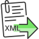

<!-- Development > Component reference > Readers > XMLXPathReader -->

### XMLXPathReader



| [Short description](xmlxpathreader.md#short-description) |
| --- |
| [Ports](xmlxpathreader.md#ports) |
| [Metadata](xmlxpathreader.md#metadata) |
| [XMLXPathReader attributes](xmlxpathreader.md#xmlxpathreader-attributes) |
| [Details](xmlxpathreader.md#details) |
| [Best practices](xmlxpathreader.md#best-practices) |
| [See also](xmlxpathreader.md#see-also) |

#### Short description

**XMLXPathReader** reads data from XML files.
> [!NOTE]
> Which XML Component?
> Generally, use [XMLExtract](xmlextract.md). It is fast and has a GUI to map elements to records. It is based on SAX.
>
> [XMLReader](xmlreader.md) can use more complex XPath expressions than **XMLExtract**, e.g. it allows you you to reference siblings. On the other hand, this **XMLReader** is slower and needs more memory than **XMLExtract**. **XMLReader** is based on DOM.
>
> **XMLReader** supersedes the original **XMLXPathReader**. **XMLXPathReader** can use more complex XPath expressions than **XMLExtract**. **XMLXPathReader** uses DOM.

| Data source | Input ports | Output ports | Each to all outputs | Different to different outputs[[1]](xmlxpathreader.md#xmlxpathreader-footnote1) | Transformation | Transf. req. | Java | CTL | Auto-propagated metadata |
| --- | --- | --- | --- | --- | --- | --- | --- | --- | --- |
| XML file | 0-1 | 1-n | **⨯** | **✓** | **⨯** | **⨯** | **⨯** | **⨯** | **⨯** |

| 1 |  The component sends different data records to different output ports using return values of the transformation. For more information, see [Return values of transformations](transformations.md#return-values-of-transformations). **XMLExtract** and **XMLXPathReader** send data to ports as defined in their **Mapping** or **Mapping URL** attribute. |
| --- | --- |

#### Ports

| Port type | Number | Required | Description | Metadata |
| --- | --- | --- | --- | --- |
| Input | 0 | **⨯** | For port reading. See [Reading from input port](examples-of-file-url-in-readers.md#reading-from-input-port). | One field (`byte`, `cbyte`, `string`). |
| Output | 0 | **✓** | For correct data records | Any[[1]](xmlxpathreader.md#xmlxpathreader-ports-fn01) |
| 1-n | [[2]](xmlxpathreader.md#xmlxpathreader-footnote3) | For correct data records | Any[[1]](xmlxpathreader.md#xmlxpathreader-ports-fn01) (each port can have different metadata) |  |

| 1 |  Metadata on each output port does not need to be the same. Metadata can use [Autofilling functions](metadata-records-and-fields.md#autofilling-functions). **Note:**`source_timestamp` and `source_size` functions work only when reading from a file directly (if the file is an archive or it is stored in a remote location, timestamp will be empty and size will be 0). |
| --- | --- |

| 2 |  Other output ports are required if mapping requires that. |
| --- | --- |

#### Metadata

Metadata on each output port does not need to be the same.

Metadata can use [Autofilling functions](metadata-records-and-fields.md#autofilling-functions). **Note:**`source_timestamp` and `source_size` functions work only when reading from a file directly (if the file is an archive or it is stored in a remote location, timestamp will be empty and size will be 0).

#### XMLXPathReader attributes

| Attribute | Req | Description | Possible values |
| --- | --- | --- | --- |
| Basic |  |  |  |
| File URL | yes | Specifies which data source(s) will be read (XML file, input port, dictionary). See [Supported file URL formats for Readers](examples-of-file-url-in-readers.md). |  |
| Charset |  | Encoding of records that are read.  The default encoding depends on DEFAULT_CHARSET_DECODER in defaultProperties. | UTF-8 \| <other encodings> |
| Data policy |  | Determines what should be done when an error occurs. For more information, see [Data policy](data-policy.md). | Strict (default) \| Controlled[[1]](xmlxpathreader.md#xmlxpathreader-attributes-1) \| Lenient |
| Mapping URL | [[2]](xmlxpathreader.md#xmlxpathreader-attributes-2) | An external text file containing the mapping definition. For more information, see [XMLXPathReader mapping definition](xmlxpathreader.md#xmlxpathreader-mapping-definition). |  |
| Mapping | [[2]](xmlxpathreader.md#xmlxpathreader-attributes-2) | Mapping the input XML structure to output ports. For more information, see [XMLXPathReader mapping definition](xmlxpathreader.md#xmlxpathreader-mapping-definition). |  |
| Advanced |  |  |  |
| XML features |  | A sequence of individual `true`/`false` expressions related to XML features which should be validated. The expressions are separated from each other by a semicolon. For more information, see [XML features](xml-features.md). |  |
| Number of skipped mappings |  | The number of mappings to be skipped continuously throughout all source files. See [Selecting input records](selecting-input-records.md). | 0-N |
| Max number of mappings |  | The maximum number of records to be read continuously throughout all source files. See [Selecting input records](selecting-input-records.md). | 0-N |

| 1 | Controlled data policy in **XMLXPathReader** does not send error records to edge. Records are written to the log. |
| --- | --- |

| 2 | One of these has to be specified. If both are specified, **Mapping URL** has higher priority. |
| --- | --- |

#### Details

**XMLXPathReader** reads data from XML files (using the `DOM` parser). It can also read data from compressed files, input port, and dictionary.

This component is slower and needs more memory than [XMLExtract](xmlextract.md), which can read XML files too. [XMLReader](xmlreader.md) supersedes the *XMLXPathReader*.
Example 376. Mapping in XMLXPathReader

```xml
<Context xpath="/employees/employee" outPort="0">
    <Mapping nodeName="salary" cloverField="basic_salary"/>
    <Mapping xpath="name/firstname" cloverField="firstname"/>
    <Mapping xpath="name/surname" cloverField="surname"/>
    <Context xpath="child" outPort="1" parentKey="empID" generatedKey="parentID"/>
    <Context xpath="benefits" outPort="2" parentKey="empID;jobID" generatedKey="empID;jobID"
                              sequenceField="seqKey" sequenceId="Sequence0">
        <Context xpath="financial" outPort="3" parentKey="seqKey" generatedKey="seqKey"/>
    </Context>
    <Context xpath="project" outPort="4" parentKey="empID;jobID" generatedKey="empID;jobID">
        <Context xpath="customer" outPort="5" parentKey="projName;projManager;inProjectID;Start"
                                  generatedKey="joinedKey"/>
    </Context>
</Context>
```

> [!NOTE]
> The nested structure of `<Context>` tags is similar to the nested structure of XML elements in input XML files.
>
> However, the **Mapping** attribute does not need to copy all XML structure, it can start at the specified level inside the whole XML file.

##### XMLXPathReader Mapping definition

1. Every **Mapping** definition (both the contents of the file specified in the **Mapping URL** attribute and the **Mapping** attribute) consists of `<Context>` tags which contain also some attributes and allow mapping of element names to Clover fields.
2. Each `<Context>` tag can surround a serie of nested `<Mapping>` tags. These allow to rename XML elements to Clover fields.
3. Each of these `<Context>` and `<Mapping>` tags contains some [XMLXPathReader Context Tag attributes](xmlxpathreader.md#xmlxpathreader-context-tag-attributes) and [XMLXPathReader Mapping Tag attributes](xmlxpathreader.md#xmlxpathreader-mapping-tag-attributes), respectively.
   > [!IMPORTANT]
   > By default, mapping definition is **implicit**. Therefore elements (e.g. `salary`) are automatically mapped onto fields of the same name (`salary`) and you do **not** have to write:
   >
   >
   > ```xml
   > <Mapping xpath="salary" cloverField="salary"/>
   > ```
   >
   >
   > Thus, use explicit mapping only to populate fields with data from distinct elements.
4. **XMLXPathReader Context Tags and Mapping Tags**
   - **Empty Context Tag (Without a Child)**
     `<Context xpath="xpathexpression"`[XMLXPathReader Context Tag attributes](xmlxpathreader.md#xmlxpathreader-context-tag-attributes)`/>`
   - **Non-Empty Context Tag (Parent with a Child)**
     `<Context xpath="xpathexpression"`[XMLXPathReader Context Tag attributes](xmlxpathreader.md#xmlxpathreader-context-tag-attributes)`>`
     `(nested Context and Mapping elements (only children, parents with one or more children, etc.)`
     `</Context>`
   - **Empty Mapping Tag (Renaming Tag)**
     - `xpath` is used:
       `<Mapping xpath="xpathexpression"`[XMLXPathReader Mapping Tag attributes](xmlxpathreader.md#xmlxpathreader-mapping-tag-attributes)`/>`
     - `nodeName` is used:
       `<Mapping nodeName="elementname"`[XMLXPathReader Mapping Tag attributes](xmlxpathreader.md#xmlxpathreader-mapping-tag-attributes)`/>`
5. **XMLXPathReader Context Tag and Mapping Tag attributes**
   1) **XMLXPathReader Context Tag attributes**
   - `xpath`
     Required
     The xpath expression can be any XPath query.
     Example: `xpath="/tagA/…/tagJ"`
   - `outPort`
     Optional
     The number of output port to which data is sent. If not defined, no data from this level of **Mapping** is sent out using such level of **Mapping**.
     Example: `outPort="2"`
   - `parentKey`
     Both `parentKey` and `generatedKey` must be specified.
     Sequence of metadata fields on the next parent level separated by a semicolon, colon, or pipe. The number and data types of all these fields must be the same in the `generatedKey` attribute or all values are concatenated to create a unique string value. In such a case, key has only one field.
     Example: `parentKey="first_name;last_name"`
     Equal values of these attributes assure that such records can be joined in the future.
   - `generatedKey`
     Both `parentKey` and `generatedKey` must be specified.
     Sequence of metadata fields on the specified level separated by a semicolon, colon, or pipe. The number and data types of all these fields must be the same in the `parentKey` attribute or all values are concatenated to create a unique string value. In such a case, key has only one field.
     Example: `generatedKey="f_name;l_name"`
     Equal values of these attributes assure that such records can be joined in the future.
   - `sequenceId`
     When a pair of `parentKey` and `generatedKey` does not insure unique identification of records, a sequence can be defined and used.
     Id of the sequence.
     Example: `sequenceId="Sequence0"`
   - `sequenceField`
     When a pair of `parentKey` and `generatedKey` does not insure unique identification of records, a sequence can be defined and used.
     A metadata field on the specified level in which the sequence values are written. Can serve as `parentKey` for the next nested level.
     Example: `sequenceField="sequenceKey"`
   - `namespacePaths`
     Optional
     Default namespaces that should be used for the `xpath` attribute specified in the `<Context>` tag.
     Pattern: `namespacePaths='prefix1="URI1";…;prefixN="URIN"'`
     Example: `namespacePaths='n1="http://www.w3.org/TR/html4/";n2="http://ops.com/"'`.
     > [!NOTE]
     > Remember that if the input XML file contains a default namespace, this `namespacePaths` must be specified in the corresponding place of the **Mapping** attribute. In addition, `namespacePaths` is inherited from the `<Context>` element and used by the `<Mapping>` elements.

2) **XMLXPathReader Mapping Tag attributes**

- `xpath`
  Either `xpath` or `nodeName` must be specified in `<Mapping>` tag.
  XPath query.
  Example: `xpath="tagA/…/salary"`
- `nodeName`
  Either `xpath` or `nodeName` must be specified in `<Mapping>` tag. Using `nodeName` is faster than using `xpath`.
  XML node that should be mapped to Clover field.
  Example: `nodeName="salary"`
- `cloverField`
  Required
  Clover field to which XML node should be mapped.
  Name of the field in the corresponding level.
  Example: `cloverFields="SALARY"`
- `trim`
  Optional
  Specifies whether leading and trailing white spaces should be removed. By default, it removes both leading and trailing white spaces.
  Example: `trim="false"` (white spaces will not be removed)
- `namespacePaths`.
  Optional
  Default namespaces that should be used for the `xpath` attribute specified in the `<Mapping>` tag.
  Pattern: `namespacePaths='prefix1="URI1";…;prefixN="URIN"'`
  Example: `namespacePaths='n1="http://www.w3.org/TR/html4/";n2="http://ops.com/"'`.
  > [!NOTE]
  > Remember that if the input XML file contains a default namespace, this `namespacePaths` must be specified in the corresponding place of the **Mapping** attribute. In addition, `namespacePaths` is inherited from the `<Context>` element and used by the `<Mapping>` elements.

##### Multivalue Fields

The component **XMLXPathReader** does not support reading of multivalue fields. See [Multivalue Fields](multivalue-fields.md). If you need to read multivalue fields from XML, use [XMLExtract](xmlextract.md) or [XMLReader](xmlreader.md).

#### Best practices

We recommend users to explicitly specify **Charset**.

#### See also

| [XMLExtract](xmlextract.md) |
| --- |
| [XMLReader](xmlreader.md) |
| [XMLWriter](extxmlwriter.md) |
| [Common properties of components](components.md#common-properties-of-components) |
| [Specific attribute types](components.md#specific-attribute-types) |
| [Common properties of Readers](common-of-readers.md) |
| [Readers comparison](common-of-readers.md#readers-comparison) |
