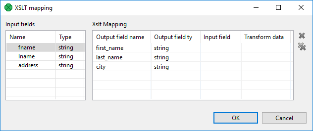

<!-- Development > Component reference > Transformers > XSLTransformer -->

### XSLTransformer


| [Short description](xsltransformer.md#short-description) |
| --- |
| [Ports](xsltransformer.md#ports) |
| [XSLTransformer attributes](xsltransformer.md#xsltransformer-attributes) |
| [Details](xsltransformer.md#details) |
| [Best practices](xsltransformer.md#best-practices) |
| [See also](xsltransformer.md#see-also) |

#### Short description

**XSLTransformer** transforms input data records using an XSL transformation (XSLT ~.0 and XSLT 2.0 are supported).

| Same input metadata | Sorted inputs | Inputs | Outputs | Java | CTL | Auto-propagated metadata |
| --- | --- | --- | --- | --- | --- | --- |
| - | **⨯** | 0-1 | 0-2 | **⨯** | **⨯** | **⨯** |

#### Ports

| Port type | Number | Required | Description | Metadata |
| --- | --- | --- | --- | --- |
| Input | 0 | **⨯** | For input data records | Any1 |
| Output | 0 | **⨯** | For transformed data records | Any2 |
| 1 | **⨯** | For rejected data records | Input 0 with fields named `errorMessage` and `rejectedField` |  |

#### Metadata

**XSLTransformer** does not propagate metadata to the output port 0.

Metadata on the output port 1 must include two string fields named `errorMessage` and `rejectedField`. These fields receive the information about the error that has occurred.

Metadata on the output port 1 may contain any number of fields from input (same names and types). Rejected record is then copied to the output port 1, together with the error information.

#### XSLTransformer attributes

| Attribute | Req | Description | Possible values |
| --- | --- | --- | --- |
| Basic |  |  |  |
| XSLT file | [[1]](xsltransformer.md#xsltransformer-attributes-fn01) | External file defining the XSL transformation. |  |
| XSLT | [[1]](xsltransformer.md#xsltransformer-attributes-fn01) | XSL transformation defined in the graph. |  |
| Mapping | [[2]](xsltransformer.md#xsltransformer-attributes-fn02) | A sequence of individual mappings for output fields separated from each other by a semicolon. Each individual mapping has the following form: `$outputField:=transform($inputField)` (if `inputField` should be transformed according to the XSL transformation) or `$outputField:=$inputField` (if `inputField` should not be transformed). |  |
| XML input file or field | [[2]](xsltransformer.md#xsltransformer-attributes-fn02)[[3]](xsltransformer.md#xsltransformer-attributes-fn03) | URL of file, dictionary or field serving as input. |  |
| XML output file or field | [[2]](xsltransformer.md#xsltransformer-attributes-fn02)[[3]](xsltransformer.md#xsltransformer-attributes-fn03) | URL of file, dictionary or field serving as output. |  |
| Advanced |  |  |  |
| Create directories |  | If set to `true`, non-existing directories in the **XML output file or field** attribute path are created. | false (default) \| true |
| Output charset |  | Character encoding of the output. | UTF-8 (default) \| other encoding |

| 1 |  One of these attributes must be set. If both are set, **XSLT file** has higher priority. |
| --- | --- |

| 2 |  One of these attributes must be set. If more are set, **Mapping** has the highest priority. |
| --- | --- |

| 3 |  Either both or neither of them must be set. They are ignored if **Mapping** is defined. |
| --- | --- |

#### Details

The **XSLTransformer** component does XSL transformation of an input and writes the transformation result to the output. The input and output can be specified by a file URL, dictionary or field. The XSL transformation can be loaded from an external file or defined in the component.

##### Mapping

**Mapping** can be defined using the following wizard.


*Figure 413. XSLT Mapping*

Assign the input fields from the **Input fields** pane on the left to the output fields by dragging and dropping them in the **Input field** column of the right pane. Select which of them should be transformed by setting the **Transform data** option to true. By default, fields are not transformed.

The resulting **Mapping** can look like this:

```ctl
$0.first_name:=transform($0.fname);$0.last_name:=$0.lname;$0.city:=$0.address;
```

Remember that you must set either the **Mapping** attribute, or a pair of the following two attributes: **XML input file or field** and **XML output file or field**. These define the input and output file, dictionary or field. If you set **Mapping**, these two other attributes are ignored even if they are set.

#### Best practices

We recommend users to explicitly specify **Output charset**.

#### See also

| [Common properties of components](components.md#common-properties-of-components) |
| --- |
| [Specific attribute types](components.md#specific-attribute-types) |
| [Common properties of Transformers](common-of-transformers.md) |
| [Transformers comparison](common-of-transformers.md#transformers-comparison) |
