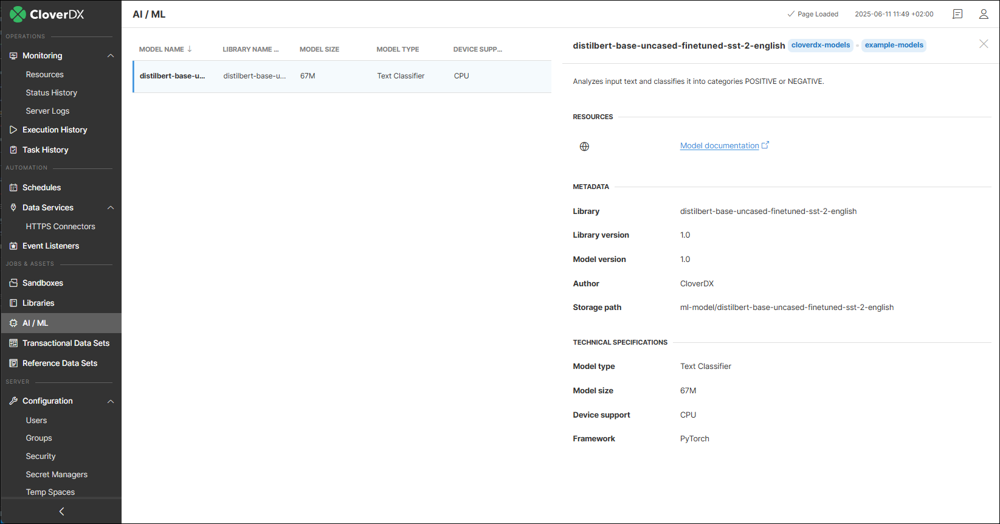

<!-- Automation and operations > Libraries, Sandboxes, and AI / ML Models modules > AI / ML Models module -->

## 15. AI / ML Models module

The **AI / ML Models module** lists machine learning modules installed through CloverDX libraries in the [**Libraries module**](libraries.md). It provides a quick overview of each module, including related library information and additional technical specifications.
> [!TIP]
> For customers looking to explore the capabilities of [AI components](../developer/ai-components.md), the setup can be accelerated by using the [official Docker image for AI workloads](https://hub.docker.com/r/cloverdx/cloverdx-server-ai). This image includes a pre-configured CloverDX Server as well as drivers and additional software needed to take advantage of hardware acceleration of AI workloads. The image must be deployed on a machine with NVIDIA GPU to use the GPU acceleration.

