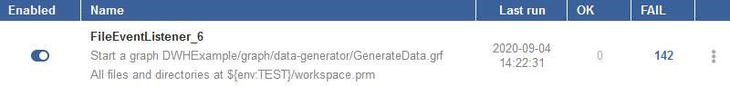
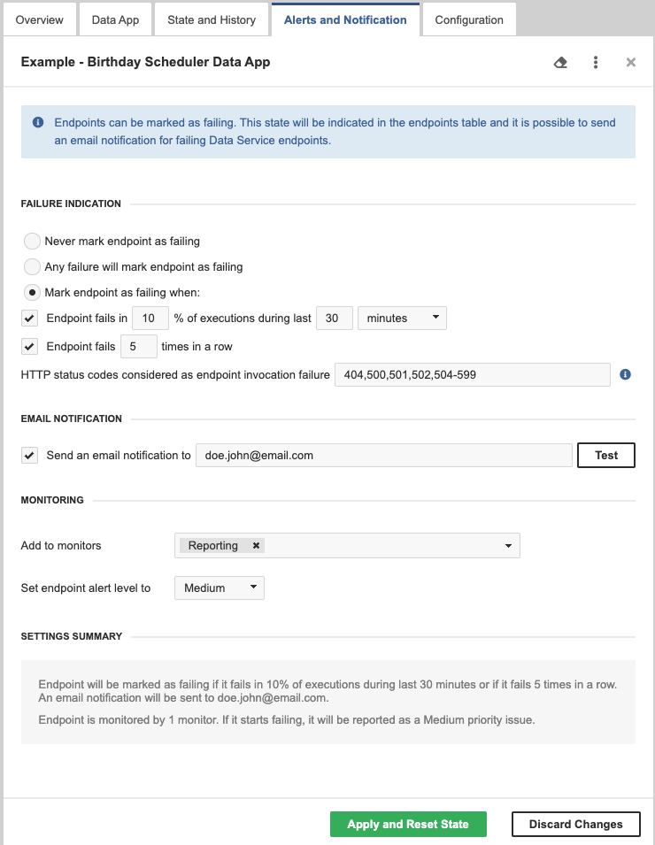
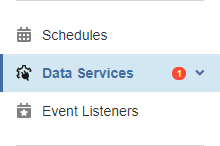
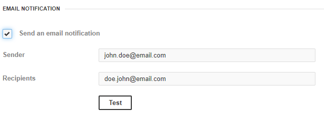
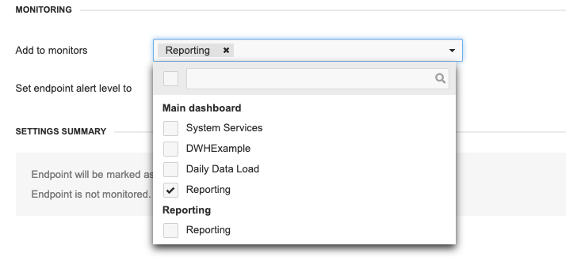
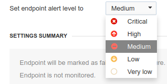

<!-- Automation and operations > Automation > Alerts and notifications -->

## 7. Alerts and notifications

| [No failure notification](alerts-and-notification.md#no-failure-notification) |
| --- |
| [Any failure](alerts-and-notification.md#any-failure) |
| [Threshold specification](alerts-and-notification.md#threshold-specification) |
| [Threshold](alerts-and-notification.md#threshold) |
| [Failure Filtering](alerts-and-notification.md#failure-filtering) |
| [Types of failures](alerts-and-notification.md#types-of-failures) |
| [Failure Notification](alerts-and-notification.md#failure-notification) |
| [E-mail Notification](alerts-and-notification.md#email-notification) |
| [Monitoring](alerts-and-notification.md#monitoring) |
| [Alert Level](alerts-and-notification.md#alert-level) |

The **Alerts and Notification** tab allows setting the condition when a trigger (*[Schedule](scheduling.md)*, *[Data Service endpoint](data-services.md)* or *[Event Listeners](../operations/listeners.md)*) is marked as failing. You can also set up email notifications for the failures here and set up monitoring in the Operations Dashboard.

### No failure notification

The **Never mark trigger as failing** option disables the failure notification in the Server UI. If you set this option and the trigger fails, it will not be marked as failing. However, the number of failures for Data Services and Event Listeners will be incremented.

*Figure 62. Never mark trigger as failing option chosen*

### Any failure

The **Any failure will mark trigger as failing** option considers the trigger failing even if a single failure occurs.

This choice is suitable for infrequently running triggers.

*Figure 63. Data Service - Alerts and Notification*

### Threshold specification

You can set threshold to

- any failure
- percentage of unsuccessful executions within a time interval
- fixed number of failures in a row

### Threshold

The **Mark trigger as failing when** option sets the trigger as failing when a threshold is reached. The threshold can be specified as a *percentage of failing executions* or as a *number of failing executions in a row*.

This choice is suitable for frequently running triggers.

*Figure 64. Data Service - Alerts and Notification*

### Failure Filtering

For Data Services, you can also select HTTP status codes which should be considered by **CloverDX Server** as an endpoint invocation failure.

Select the HTTP status codes by entering individual codes or ranges of codes separated by commas. By default, codes 404, 500, 501, 502 and 504-599 are considered as an endpoint invocation failure. Leaving the field blank means that **CloverDX Server** considers all HTTP status codes from the range 400-599 as invocation failure.
> [!NOTE]
> Ignored Error Codes
> By default, **CloverDX Server** does **not** consider the following HTTP status codes as failures:
>
> - 503: The code is returned when invoking a manually disabled endpoint.
> - 401: The code means the user has not been authorized. Many HTTP clients don’t use preemptive authentication, send the first request without credentials and handle 401 status by sending another authenticated request.
>
> You may add these status codes to the Failure Filtering field to treat them as failures.

### Types of failures:

- all triggers fail when the executed task fails
- a File Event Listener also fails when checking the file system fails (e.g. insufficient permissions, non-existing directory, bad credentials)
- a JMS Message Listener also fails when the JMS connection fails (e.g. classpath issue, wrong credentials)
- a Universal Event Listener also fails when the triggering Groovy code fails
- a Data Service also fails when it returns a 4xx or 5xx HTTP status code

### Failure Notification

If a trigger fails, it is shown in the table of Schedules, Data Services or Event Listeners, respectively. Additionally, the number of failing triggers is shown in the main menu.

*Figure 65. Some Data Service is failing*

### Email Notification

You can also set an email notification. This email notification works additionally to the notification in the Server UI. It sends an email when the health state of a trigger changes. An email is also sent if the trigger was failing and you manually reset its health state.

*Figure 66. E-mail Notification*

With the **Test** button, you can send a testing email to the addresses of the recipients. If the sender is not set by a user it will be resolved from [clover.smtp.sender](../admin/list-of-properties.md#lop-clover-smtp-sender) property and if the property is not set, the sender will be the same as first recipient.

Email notifications require a working connection to a SMTP server.

### Monitoring

You can add the trigger to Monitors ([Operations Dashboard](ops-dashboard.md)) directly from the Alerts and Notification tab.

*Figure 67. Adding trigger to monitors*

### Alert Level

Alert levels are used on the Operations Dashboard. They show you the severity of problems and help you decide which ones to address first.

You can set the alert level for each trigger. When multiple triggers start failing, highest level triggers and monitors are shown first and they are also “more red”.

You can use the following alert levels, Medium is the default:

- Critical
- High
- Medium
- Low
- Very Low

*Figure 68. Alert level selection*
