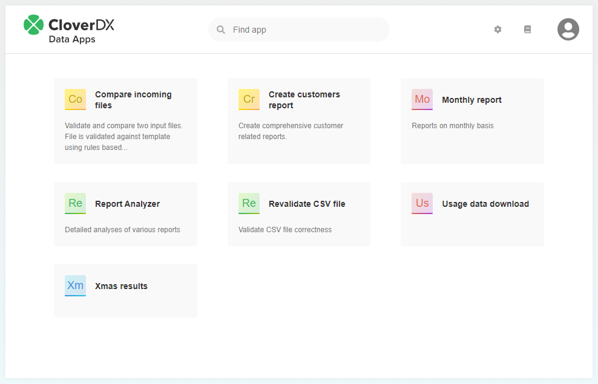
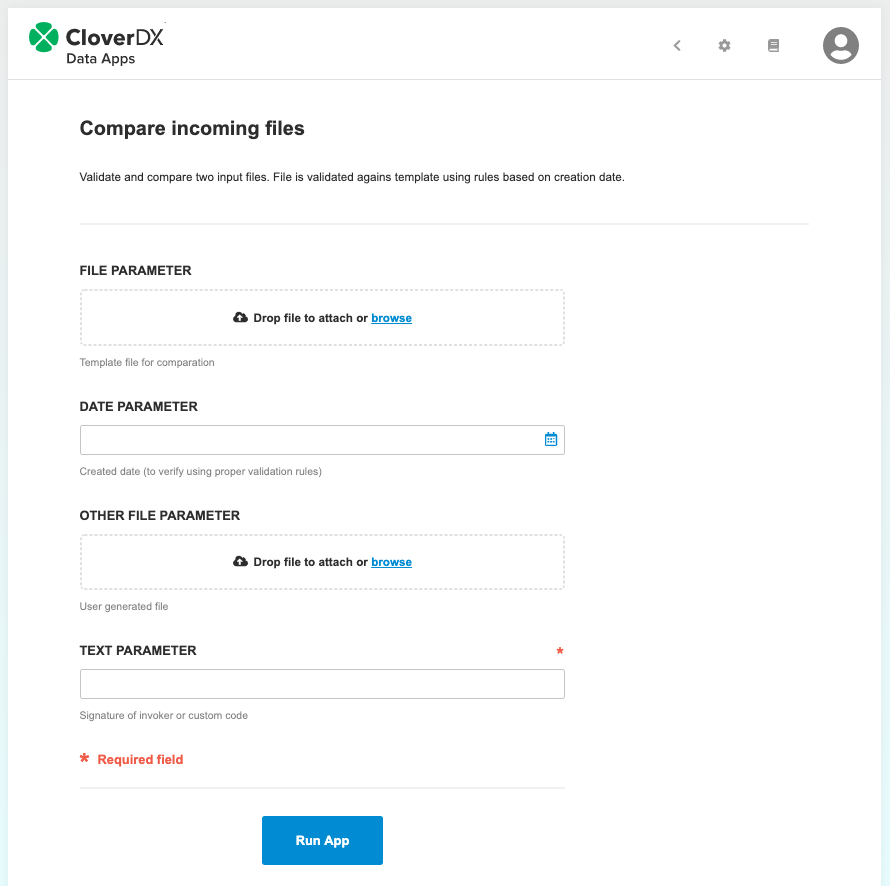
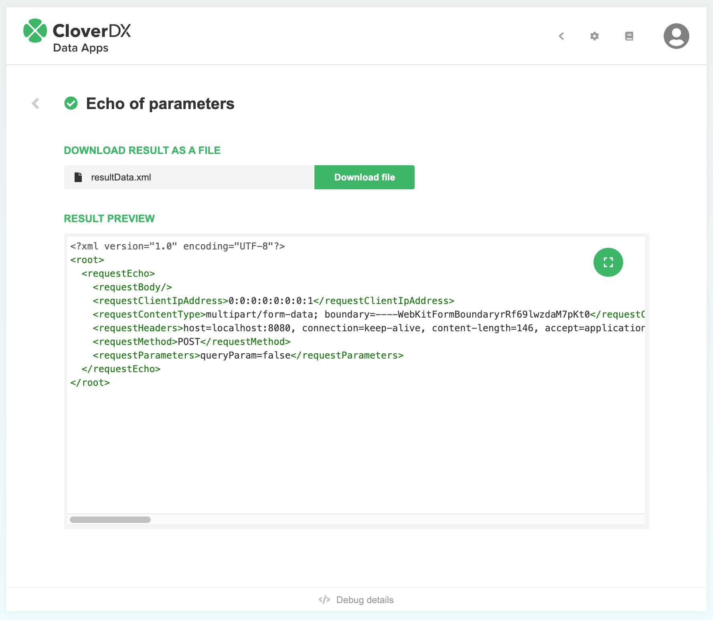
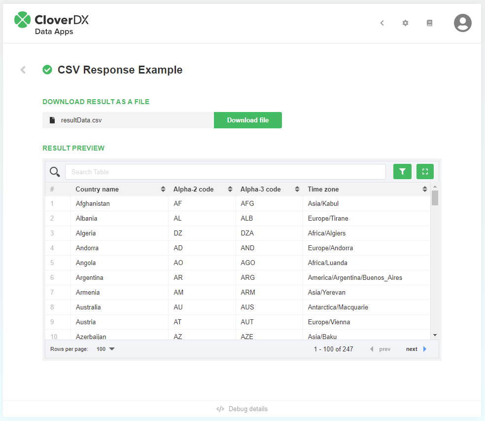
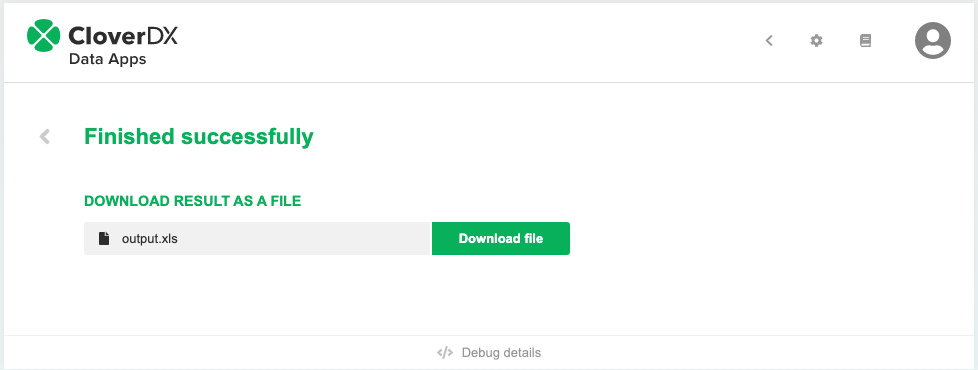
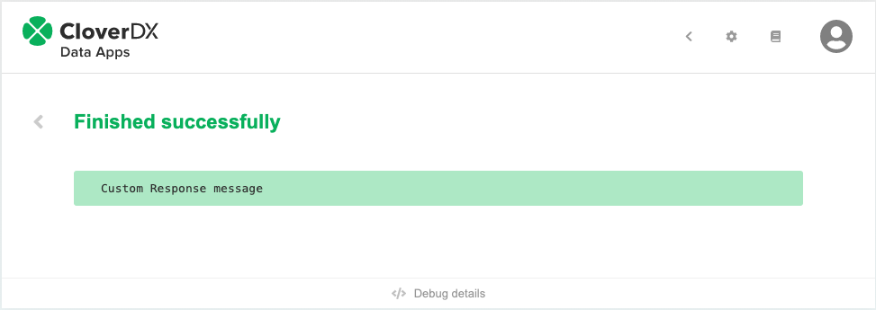
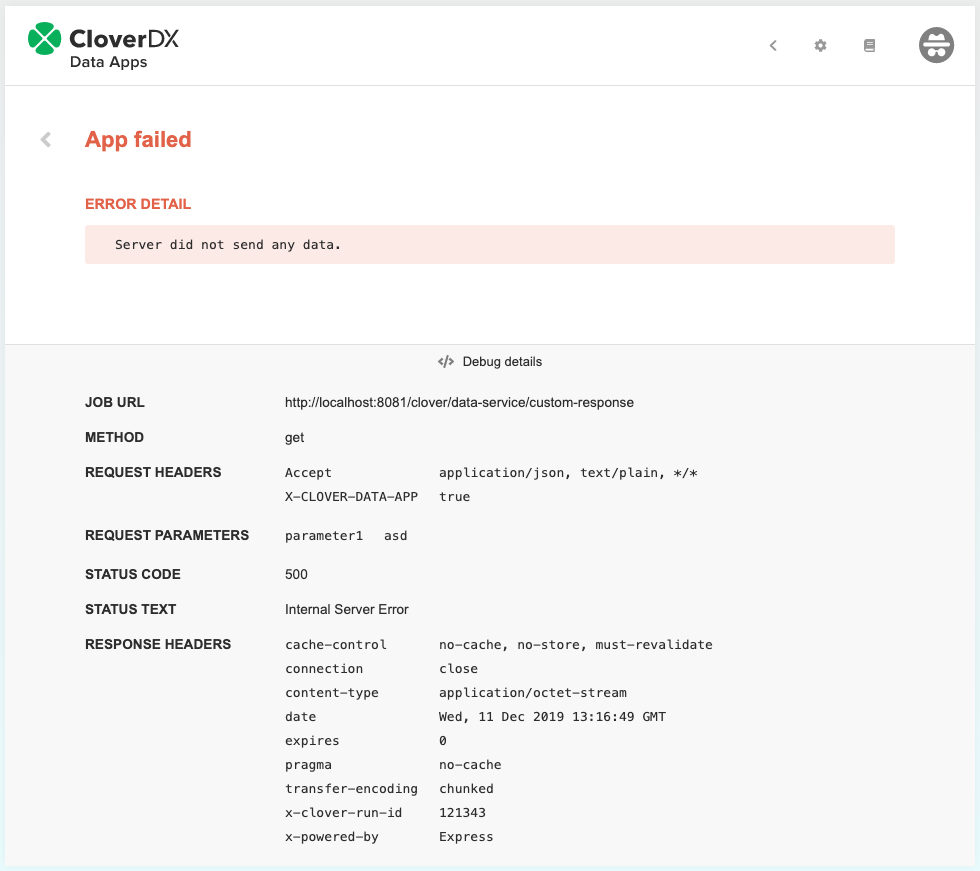
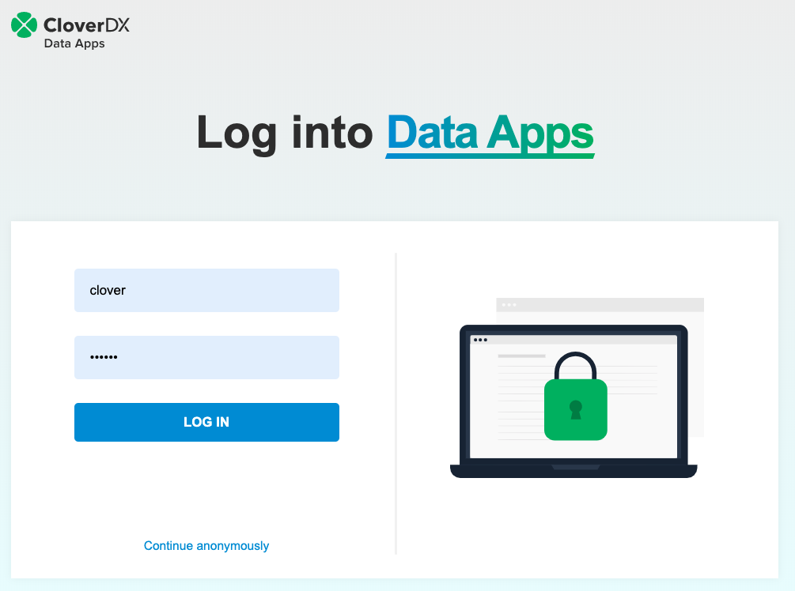
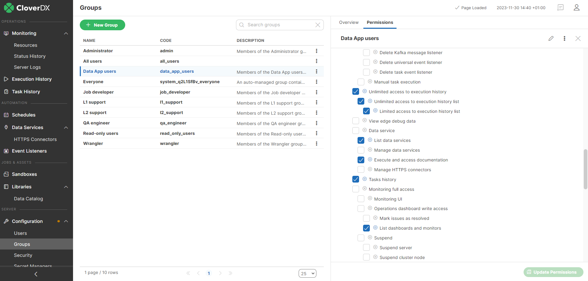
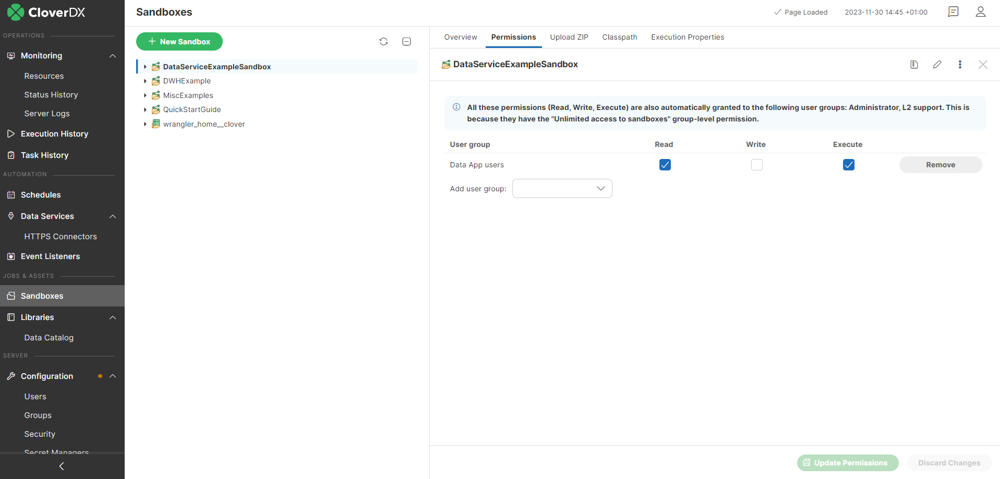

<!-- Automation and operations > Automation > Data Apps -->

## 6. Data Apps

### Data Apps Catalog

Data Apps Catalog contains available apps. Each app is backed by a single Data Service. By default, apps are presented as a simple alphabetically ordered list but they can also be grouped by category or sandbox name. This can be accomplished by selecting the corresponding Group By option from the Settings menu (under the gear icon in the upper right corner). The additional option in the menu called Compact View makes the presentation of the apps shorter by hiding their descriptions. You can search the catalog by app name, description, category, or sandbox. Categories and sandboxes are searched only if the corresponding Group By option is selected. The search is case insensitive.

By default, there is a generated icon with color code based on the first letter of the application name to simplify orientation in the list of available Data Apps. Custom icon image can be defined in backed Data Service job for even better user experience, see Data Service **Endpoint Configuration** in Designer documentation.

*Figure 58. Data Apps Catalog*

### Single Data App form

The Data App form collects user input and triggers the execution of the job. Form elements are generated based on the input parameters of the backing Data Service. Required parameters are marked with * (asterisk) character. After filling in the form, trigger execution using the Run App button.

The Data Apps can be customized using JavaScript, see [Customizing Data Apps](../developer/data-service.md#customizing-data-apps).

*Figure 59. Data App form*

### Responses

Success or fail response is presented to the user based on HTTP status code and HTTP headers. The most important headers are Content-type and Content-disposition. For response types of JSON, XML, CSV and plain text both a download link and a data preview are shown on the page. When using file or custom response checking the 'Set Content-Disposition as attachment' checkbox will disable the preview and only a file download is offered.

The response preview may contain partial data only to limit the memory usage of the browser. The response preview has syntax highlighting for JSON and XML. For CSV, the data is rendered as a table with searching, sorting, paging and column filtering features. Multiple columns can be used to sort the table by holding shift key when clicking on subsequent column headers. Column filtering is hidden by default and need to be enabled using the filter button in the right upper corner. The response preview can be switched to expanded mode using the button in the right upper corner. Escape button can be used to exit the expanded mode.

|  |  |  |  |
| --- | --- | --- | --- |

### Debugging & troubleshooting

After receiving a response from the server debug information about the Data App execution is available at the bottom of the Data App UI. The panel is expanded upon clicking the Debug Details footer. It shows additional information about the request and the response that can be useful for troubleshooting errors with the execution, such as the request parameters, request headers and run ID.

*Figure 60. Data App debugging*

### Authentication

Data Apps uses same authentication mechanism as CloverDX Server Console. CloverDX user accounts in clover or LDAP domain can be used for authentication.

*Figure 61. Data App login*

Data Apps can be used in anonymous mode. The user does not have to log in in such a case. The list of available Data Apps only contains apps based on Data Services which do not require authentication.

### Permissions

Access to Data App is controlled by the combination of sandboxes and Data Services permissions.

To create a user, who is able to use the Data Apps, but will not have access to CloverDX Server Console, follow these steps:

- Create a new group (eg. Business User Group)
- In the permissions tab for this group check **Sandboxes** and **Data Service** permission
- Create a user and assign them to the Business User group
- Go to the Sandboxes module and add read and execute permissions for the sandbox containing the Data Services which are used for Data Apps

|  |  |
| --- | --- |

Use Sandboxes permissions to control access to a set of the Data Services located in one Sandbox.

Whether a Data App appears in the Data Catalog can also be controlled by the **Hide this Data App from Data App Catalog** setting in the Configuration tab of the related Data Service. Refer [here](data-services.md#configuration-tab) for more information.
