<!-- Automation and operations > Automation > Data Services -->

## 5. Data Services

### Data Services overview

**Data Services** allow you to deploy a web service. The architecture of data services is described in our [documentation for developers](../developer/data-service.md). This section describes the Server-side functionality of the Data Services.

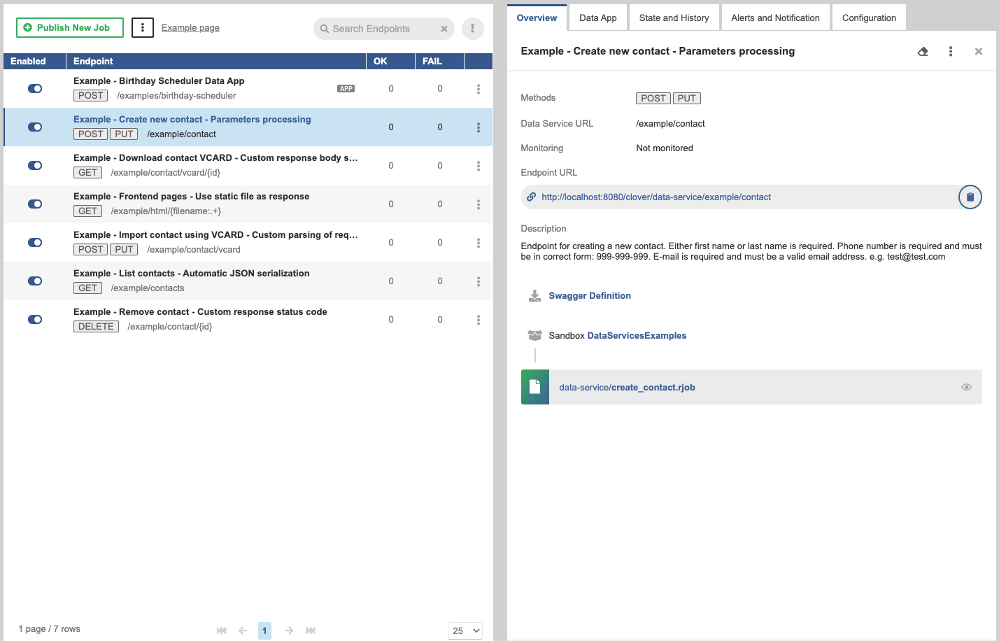
*Figure 32. Data Services*

The **Data Service** can be accessible via:

- **HTTP (default)**
  Requests are accepted via the HTTP protocol on the same port as the Server. This is suitable for Data Services that do not require authentication.
- **HTTPS**
  If you need a secure connection, you should configure Data Service to listen on HTTPS: create an [HTTPS Connector](data-services.md#https-connectors) and use it in one or more Data Service endpoints. This way, you can configure a service listening on HTTPS port without restarting the Server. You can create multiple HTTPS Connectors and use it, for example, per consumer service. One Data Service endpoint can use only one HTTPS Connector.

You can publish the same data service job in multiple configurations. First, publish the job, then add an HTTPS Connector to it; after that, you can publish the job again with a different configuration. If a job is reconfigured to use an HTTPS Connector where it conflicts with another job, a failure occurs and the job has to be unpublished and republished.

Data Service can send you a [notification](data-services.md#alerts-and-notification-tab) if a failure occurs. You can set the [threshold](alerts-and-notification.md#threshold-specification) (number of subsequent failures or percentage) and the way of notification (in the Server’s UI or via [email](alerts-and-notification.md#email-notification)).

To investigate failed requests, you can use [history of the particular endpoint](data-services.md#state-and-history-tab). Optionally, you can set the Data Service endpoint run to be recorded in [Execution History](data-services.md#configuration-tab).

Data Services are not processed by the job queue by default. Enqueueing of Data Services can be enabled globally or for specific Data Services, see [Job queue](job-queue.md) for more details.

### User Interface

Data Services user interface contains two main tabs: [*Endpoints*](data-services.md#list-of-data-services) and [HTTPS connectors](data-services.md#https-connectors).

#### Endpoints

**Endpoints** tab consists of useful [*buttons*](data-services.md#buttons) in the top, [*list of data services*](data-services.md#list-of-data-services) and tabs with configuration of the particular data service.

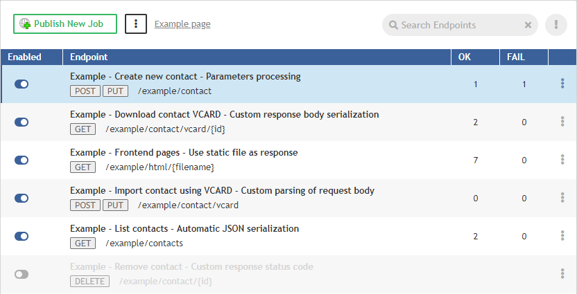
*Figure 33. Endpoints*

##### Buttons

In the top of the **Endpoints** tab, there are five control elements.

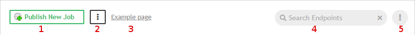
*Figure 34. Data Service endpoints*

1. Creates a new Data Service job.
2. The three-dot-button has the following menu.
   *Open Data App Catalog*.
   *Open Endpoint Documentation Catalog*.
   *Download Swagger Definition Catalog*.
   *Unpublish Data Services Examples*.
   *Import Data Services Configuration*.
   *Export Data Services Configuration*.
3. Link to Data Services example.
4. Search function.
5. Filter to show all, or only failing and invalid Data Services.

#### List of Data Services

The **Data Services** tab contains list of all data services on the Server.

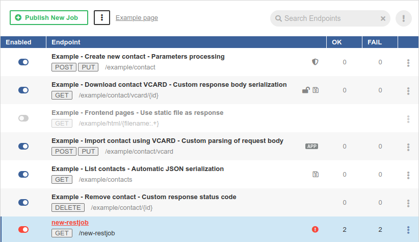
*Figure 35. List of Data Services*

- The button in the left column serves to enable () or disable () the service (e.g. temporary disable due to maintenance). A disabled Data Service returns the HTTP status code 503.
- In the second column, there are **Endpoint title**, **method(s)** and a part of **endpoint URL**.
  Icon decorators indicate these endpoint states:
   - The Data Service does not require authentication.
   - The Data Service saves the job execution record in Execution History.
   - The Data Service is marked as failing.
   - The Data Service is available on HTTPS.
   - The Data App is enabled for this endpoint.
- The third and fourth columns contain query statistics.
- The last column contains a menu with Data Service actions **Unpublish**, **Reset Endpoint State** and **Enable/Disable App**.

#### Overview tab

The **Overview** tab contains overview of the particular endpoint. To display the **Overview** tab, click the particular line in the list of endpoints.

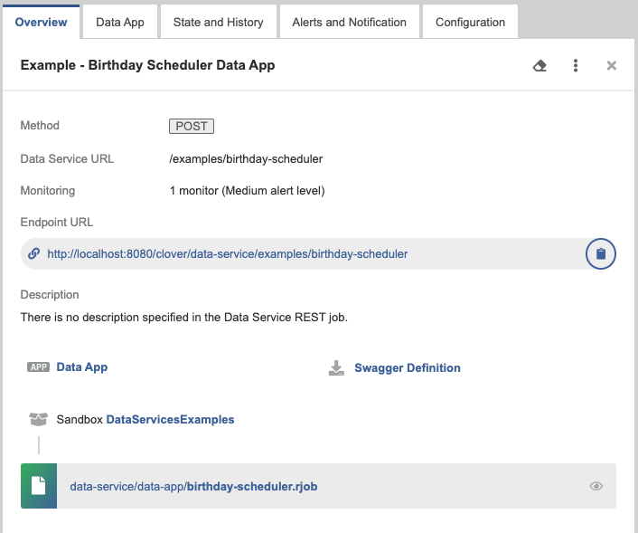
*Figure 36. Data Service Overview tab*

- **Endpoint title** is in the top of the tab’s pane. It is the endpoint title specified in Designer on the **Endpoint Configuration** tab.
- **Methods** - indicates endpoint methods.
- **Data Service URL** - the configurable part of **Endpoint URL**. It can be set from Designer
- **Endpoint URL** - URL of the endpoint. This URL serves the requests.
  The **Copy link** () button copies the link to the clipboard.
- **Data App** - link to the Data App. Displayed only if Data App is enabled for the endpoint.
- **Description** - contains a user-defined description of the Data Service. It can be set in Designer.
- **Swagger Definition** - allows you to download a [swagger file](https://swagger.io/specification/) with the definition of the Data Service.
- **Sandbox** - sandbox containing the data service `.rjob` file.
- **REST job file** is a file name and path relative to the sandbox.

#### Data App tab

The **Data App** tab displays a simple form generated from the definition of the Data Service. You can fill in the form and execute the service using the **Run App** button. For more information, see [Data Apps](data-apps.md).

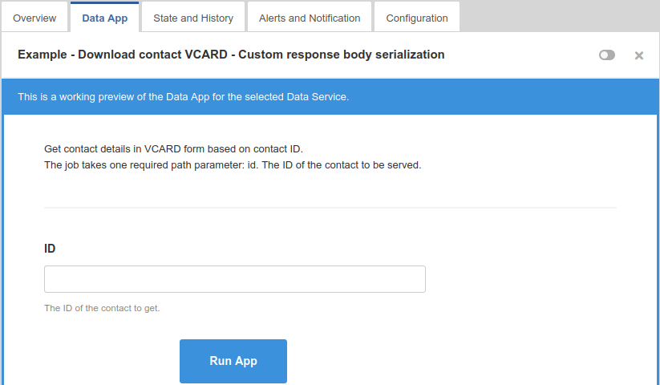
*Figure 37. Data Service - Data App tab*

#### State and History tab

The **State and History** tab shows invocation history of the particular Data Service. It contains a summary of the endpoint state in the top and a list of query details in the bottom. If the job is configured to save a record in execution history, the list also contains link to the **Execution History**.

You can filter records based on the time interval or you can list only the failures.

Here you can reset the state of the data service. For example, the data service endpoint was failing, you fixed it and you would like to be notified if it fails again.

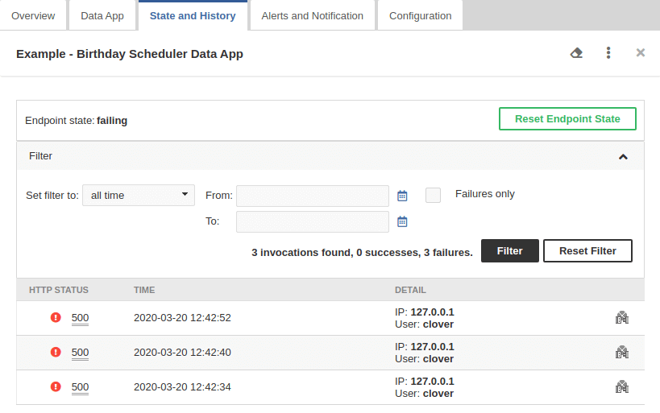
*Figure 38. Data Service - State and History*

#### Alerts and Notification tab

The Alerts and Notification tab allows setting the condition when a Data Service endpoint is marked as failing. You can also set up email notifications for the failures here and set up monitoring in the Operations Dashboard. See [Alerts and Notification](alerts-and-notification.md) for more details.

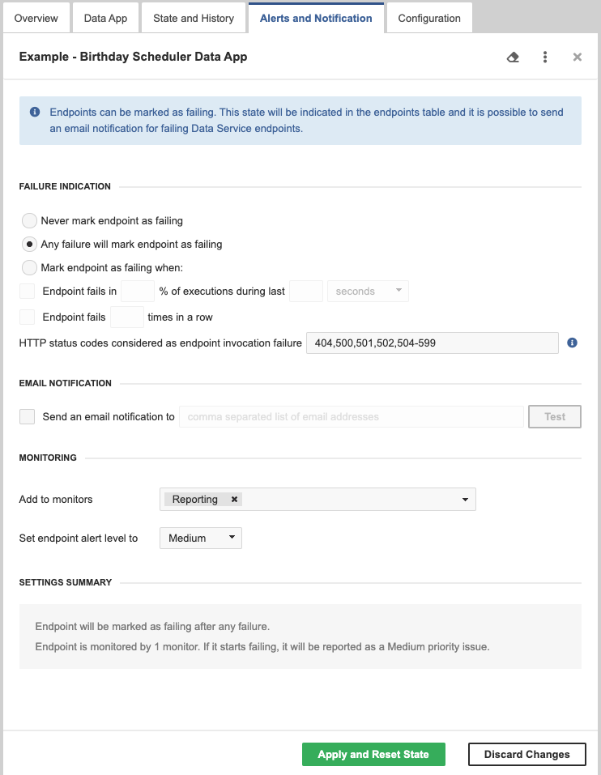
*Figure 39. Data Service endpoint - Alerts and Notification*

#### Configuration tab

The **Configuration** tab allows you to disable the endpoint authentication, enable saving records in [Execution History](execution-history-main.md#execution-history-viewing-job-runs) or hide Data Apps from the Data App Catalog.

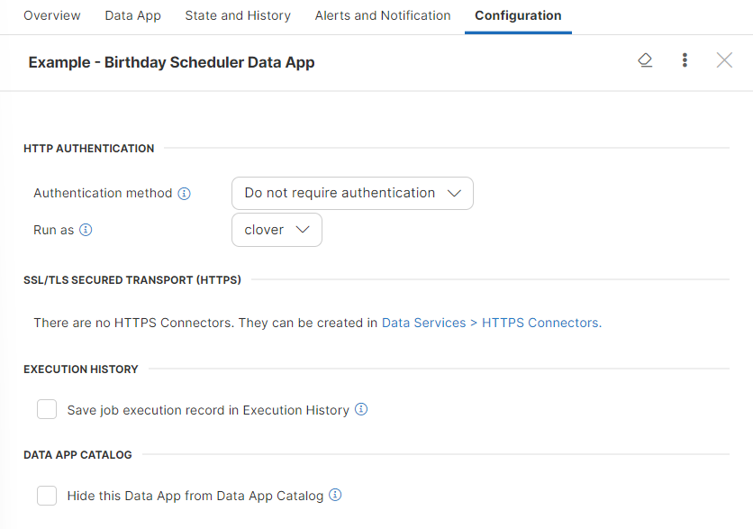
*Figure 40. Data Service*

Data Services can be configured to require credentials or not. If the Data Service does not require credentials, the user to run it should be set in its configuration with the **Run As** option.

You can configure the data service to **save job execution record in Execution History**. The saving job execution record has a performance impact. Use this option only for:

- infrequently called endpoints
- endpoints that are not in production environment
- endpoints to be debugged

If you have a Data Service that includes a Data App you want to keep private, you can use the **Hide this Data App from Data App Catalog** checkbox to prevent it from appearing in the [Data App Catalog](data-apps.md#data-apps-catalog). This allows you to maintain control over app accessibility while still allowing users with appropriate permissions to run it through other methods.

By default, Data Apps are visible in the Data App Catalog based on [user permissions](data-apps.md#permissions). Checking the **Hide this Data App from Data App Catalog** box will completely remove the app from the Catalog for all users. However, this setting does not affect Data App permissions. Users with execute permission for the app’s parent sandbox can still run the app, either by calling it from the Data Services module in the Server Console or by accessing it directly via its URL.

This setting is primarily intended for scenarios where you want an app to be hidden by default but still accessible through specific methods, often via a redirect from another app. Note that this setting has no effect on Data Services that are not classified as Data Apps.

#### Catalog of services

The *Catalog of services* is a list of data services allowing the user to view the documentation and test the service.

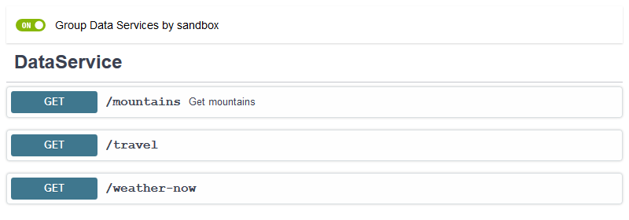
*Figure 41. Global catalog of services*

The details can be accessed by clicking the header. The first click displays the details, the second one fold the details back.

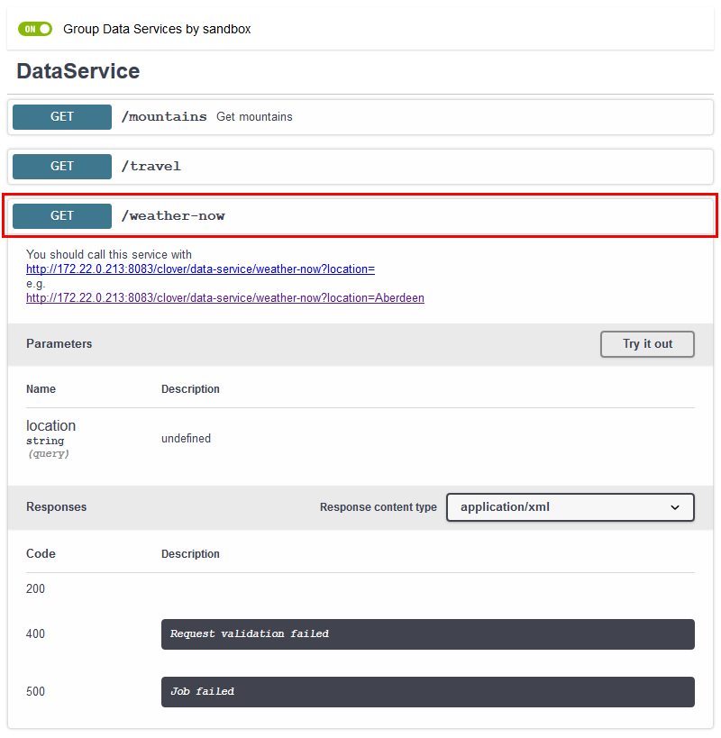
*Figure 42. Global catalog of services*

In the *Catalog of Services*, the end points can be grouped by sandbox or ordered by URL.

#### Built-in Data Service examples

**CloverDX Server** contains built-in set of Data Service examples. The Data Service examples can be published from the **Data Services** tab.

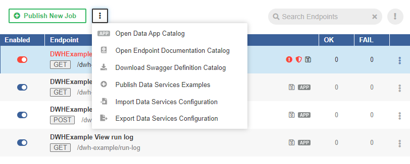
*Figure 43. Data Services - publishing the examples*

The published examples are displayed among the others in the list of Data Services.

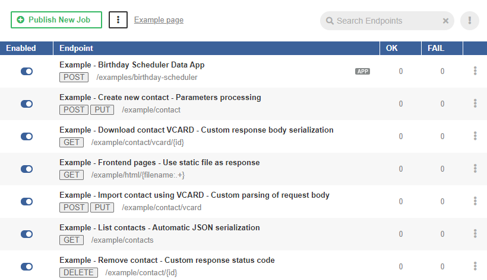
*Figure 44. Data Services - published the examples*

#### HTTPS connectors

The **Data Service** can be accessible via HTTPS. The configuration of HTTPS is in **Data Services** ****HTTPS Connectors**.
> [!WARNING]
> Supported SSL protocols
> As of **CloverDX Server** 5.6 only TLS v1.2 protocol is supported by HTTPS connectors.

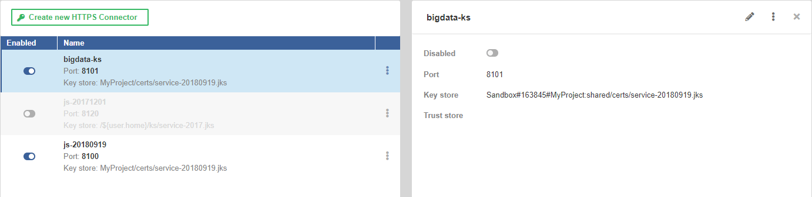
*Figure 45. HTTPS connectors*

As a key store, we support the Java Key Store (`.jks`) and PKCS #12 key store (`.p12` or `.pfx`) formats.

As a trust store, we support the Java Key Store (`.jks`) format.

On the left hand side, there is a list of available HTTPS Connectors. On the right, there are details of the connector selected from the list. The **New HTTPS Connector** button creates a new HTTPS Connector.

##### List of HTTPS connectors

The list of HTTPS Connectors shows available connectors. You can change the order by clicking on **Name** or **Enabled** in the header.

The button in the first column enables or disables the connector. Disabling the connector that is being used by Data Service makes the Data Service invalid.

The middle column shows the connector’s name, port, path to the key store and path to the trust store.

The **…​** button offers an option to delete the connector.

##### New HTTPS connector

The **New HTTPS Connector** tab serves to create a new HTTPS Connector that can be used by one or more Data Services. One Data Service can use only one HTTPS Connector.

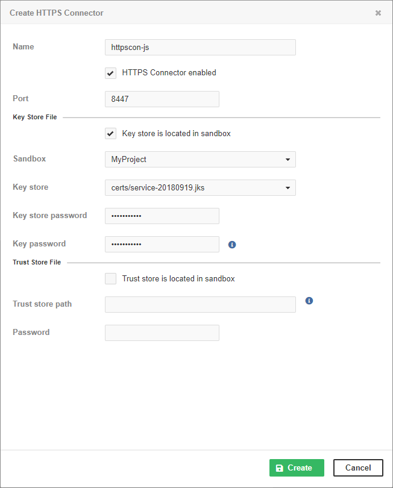
*Figure 46. HTTPS Connectors*

| Name | Description |
| --- | --- |
| Name | The name of the HTTPS Connector. The name should be unique. It is displayed in the list of HTTPS Connectors on the Endpoint’s Configuration tab. |
| HTTPS Connector enabled | The checkbox enables or disables the HTTPS Connector to listen on the specified port. Stopping an HTTPS Connector that is being used by a Data Service makes the Data Service invalid. |
| Port | The TCP port used by the HTTPS Connector. The port must not be occupied by another HTTPS Connector or any other program. If the Data Service is Deployed on **CloverDX cluster**, it listens on this port on all cluster nodes. If you use a firewall, set it to allow incoming connections to this port. If you use SELinux, it must be configured to allow **CloverDX Server** to use this TCP port. |
| Key store is located in sandbox | The checkbox switches between absolute paths to key store and paths relative to the Server sandbox. If selected, **Sandbox** and **Key store** items are displayed. Otherwise, you will see **Key store path**. The recommended way is to store the key stores out of the sandbox. |
| Sandbox | A sandbox with the key store. |
| Key store | The key store within the sandbox. |
| Key store path | An absolute path to the Java KeyStore. You can use environment variables, system properties of JVM and configuration parameters of the Server as a part of the path. Usually, you will use `${sandboxes.home}` here. |
| Key store password | The password to the Java KeyStore. |
| Key password | The password to the key in the KeyStore. |
| Trust store is located in sandbox | The checkbox switches between absolute paths to trust store and paths relative to the Server sandbox. If selected, you can enter **Sandbox** and **Trust store** options. Otherwise, you will see **Trust store path**. |
| Sandbox | The sandbox containing the trust store. |
| Trust store | The trust store within the sandbox. |
| Trust store path | The absolute path to the trust store. You can use environment variables, system properties of JVM and configuration parameters of the Server as a part of the path. Usually, you will use `${sandboxes.home}` here. |
| Password | The password to the trust store. |

To create a data service listening on HTTPS, you need a key store with a server certificate. You can create one with the following command:

```bash
keytool -keystore service.jks -genkey -keyalg rsa -keysize 3072 -alias serverName
```

As a key store, we support the Java Key Store (JKS) (`.jks`) and PKCS #12 key store (`.p12` or `.pfx`) formats.

As a trust store, we support the JKS (`.jks`) format.

For security reasons, we recommend you to put the key store outside the Server sandbox.

### Using Data Services

| [Deploying Data Service](data-services.md#deploying-data-service) |
| --- |
| [Publishing and unpublishing Data Service from sandbox](data-services.md#publishing-and-unpublishing-data-service-from-sandbox) |
| [Publishing Data Service examples](data-services.md#publishing-data-service-examples) |
| [Changing Data Service to anonymous](data-services.md#changing-data-service-to-anonymous) |
| [Running Data Service on HTTPS](data-services.md#running-data-service-on-https) |
| [Running Data Service on HTTPS on cluster](data-services.md#running-data-service-on-https-on-cluster) |
| [Monitoring Data Service](data-services.md#monitoring-data-service) |
| [Testing Data Service](data-services.md#testing-data-service) |
| [Performance tuning](data-services.md#performance-tuning) |
| [Exporting Data Service configuration](data-services.md#exporting-data-service-configuration) |
| [Importing Data Service configuration](data-services.md#importing-data-service-configuration) |
| [Avoiding premature marking of Data Service as failing](data-services.md#avoiding-premature-marking-of-data-service-as-failing) |
| [Looking up particular data service](data-services.md#looking-up-particular-data-service) |
| [Resetting State of failing Data Service endpoint](data-services.md#resetting-state-of-failing-data-service-endpoint) |

#### Deploying Data Service

To deploy **Data Service** from the Server, go to **Data Services** tab, click **Publish Data Service job** and choose a sandbox and `.rjob` file.

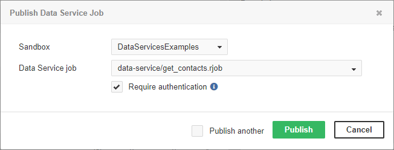
*Figure 47. Publishing Data Service job*

You can choose between Data Service with or without required authentication. In the latter case, the Data Service will run under the specified account.

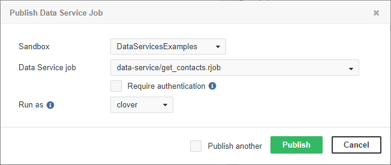
*Figure 48. Publishing Data Service job that does not require authentication*

##### Publishing multiple jobs

To deploy multiple jobs, tick the **Publish another** checkbox. After deploying one job, the dialog for publishing Data Service is displayed again to let you enter the next one.

#### Publishing and unpublishing Data Service from sandbox

You can deploy Data Service directly from a sandbox. To do so, you need the read access to the sandbox and **List Data Services** and **Manage Data Services** privileges.

In the **Sandboxes** section of the Server GUI, select a data service to be published/unpublished. In the top right corner of the overview, there are options for publishing or unpublishing the data service, as well as editing, showing data service in Execution History, downloading/downloading as ZIP and deleting the data service.

#### Publishing Data Service examples

**CloverDX Server** contains a built-in set of Data Service examples. These examples are not deployed by default.

The Data Service examples can be deployed directly from the **Data Services** tab. If you do not have any Data Service deployed, click the **Publish Data service Examples** link.

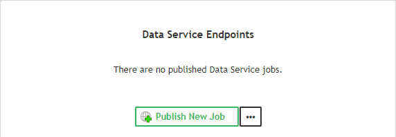
*Figure 49. Publishing Data Service examples*

If there is an existing Data Service, the button to publish examples is in the menu accessible under the three-dot-button.


*Figure 50. Publishing Data Service examples - II*

See [Built-in Data Service Examples](data-services.md#built-in-data-service-examples).

#### Changing Data Service to anonymous

By default, the Data Service requires a client to send the credentials. To create the Data Service that does not require authentication, switch to the **Configuration** tab in the Data Service **Detail** pane and change **Authentication method** to *Do not require authentication*. The Data service runs with privileges of an existing user; therefore, you should set the *Run as* field to the suitable user. This user should have permissions necessary to run the Data Service.

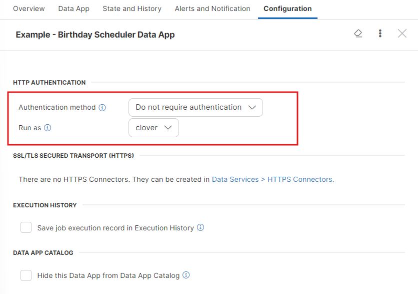
*Figure 51. Configuring Anonymous Data Service*

In the list of Data Services, the Data Service that does not require credentials is indicated by unlocked padlock icon.

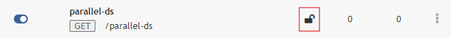
*Figure 52. Data Service without authentication*

#### Running Data Service on HTTPS

By default, the Data Service runs on HTTP and you can configure it to run on HTTPS.

To run Data Service on HTTPS, create a new **HTTPS Connector**.

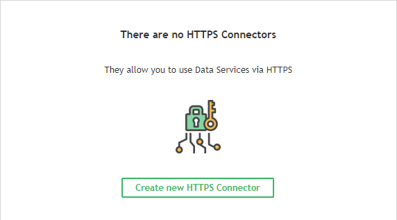
*Figure 53. Creating a new Data Service connector*

Enter a name, port, keystore path, and keystore and key passwords.


*Figure 54. Creating a new Data Service connector II*

In **Data Services** ****Endpoints**, select the Data Service to be running on HTTPS and switch to the **Configuration** tab.

Select the HTTPS connector from the combo box and click the **Save & Apply** button. Now, the Data Service runs on HTTPS.

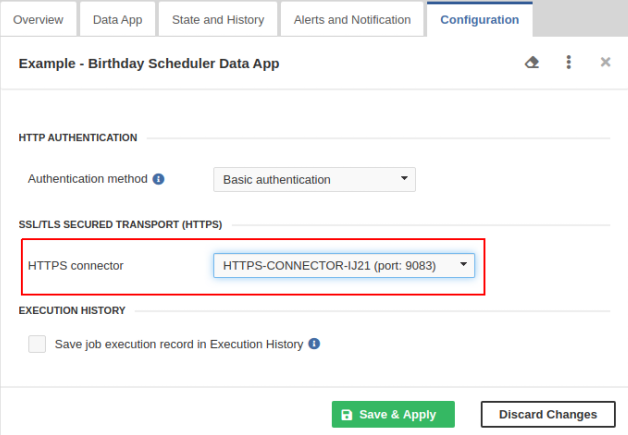
*Figure 55. Using the HTTPS Connector in Data Service endpoint*

You can have more independent HTTPS contexts running on one Server. There can be multiple Data Services running on the same HTTPS context.

#### Running Data Service on HTTPS on cluster

This case extends the case of [Running Data Service on HTTPS](data-services.md#running-data-service-on-https). Different cluster nodes have different domain names, but the Java KeyStore has to have one certificate. There are two way to solve the problem with certificates.

- Use a wildcard certificate. The keystore file should be placed on the shared file system.
- Use different certificates for each cluster node. The keystores with the certificates must be on the same path on all cluster nodes.

#### Monitoring Data Service

To see the activity of Data Service, use the list of Data Services. There you can see the main overview of data services.

The state of a particular Data Service is on the *State and History* tab.

#### Testing Data Service

To test the Data Service, select the Data Service in the list, switch to the **Data App** tab and click the **Run App** button. See [Data App usage](data-apps.md#single-data-app-form) for more information.

#### Performance tuning

To improve performance, do not save job execution records in [Execution History](../operations/execution-history-main.md). To do so, do not tick *Save job execution records in Execution History* on *Configuration* tab.

#### Exporting Data Service configuration

You can export the Data Service configuration from **Data Services** ****Endpoints** tab. Click the three-dot-button and select **Export Data Services Configuration** from context menu.

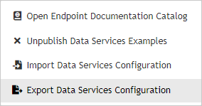
*Figure 56. Data Services - Export*

The Data Services configuration will be exported.

You can also export Data Service configuration in **Configuration** ****Export** See [Server configuration export](../admin/server-config.md#server-configuration-export).

#### Importing Data Service configuration

You can import the Data Service configuration from **Data Services** ****Endpoints**. Click the three-dot-button and select **Import Data Services Configuration** from the context menu.

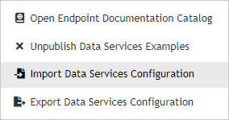
*Figure 57. Data Services - Import*

You can also import the Data Service configuration directly in **Configuration** ****Import** See [Server configuration import](../admin/server-config.md#server-configuration-import).

#### Avoiding premature marking of Data Service as failing

Data Service might prematurely switch to a failing state if the failure indication is set up to switch to a failing state after a given percentage of executions fails in a given time window. E.g. First execution fails.

To avoid this, you can set the minimum number of events necessary to be taken into account when calculating the change of Data Service state. It can be set with the `trigger.failure.ratio.min.record.count` configuration property. The default value is 3 executions.

It can be set in **Configuration** ****Setup** ****Configuration File**. Add a line containing

```properties
trigger.failure.ratio.min.record.count=3
```

to the configuration file.

You can set it to any reasonable positive integer. This configuration is valid for all Data Services available on the Server.

See also [List of configuration properties](../admin/list-of-properties.md).

#### Looking up Particular Data Service

If you have multiple Data Services available, you can search for a specific Data Service:

If you know the endpoint name, you can look it up. Enter the text into the **Search endpoints** field and click the **Refresh** button. The Data Services will be filtered.

The entered text will be searched in the title of the Data Service, in the name of the request method, in the name of `.rjob` file and in the path that the Data Service uses.

If you would like to see invalid endpoints only, click the **failing and invalid only** icon. The both filters can be combined.

To switch off the filters, click the **Show All** button.

#### Resetting state of failing Data Service endpoint

If the Data Service endpoint is in the failing state and the problem has been fixed, you can reset the endpoint state manually.

To reset the state, open the details of the endpoint, switch to the **Alerts and Notification** tab and click the **Apply and Reset State** button.

If the endpoint has an email address set, a notification email will be sent to this address.

#### Enabling CORS filter

CORS (Cross-Origin Resource Sharing) is a mechanism that allows browsers to give a web application running at one origin, access to resources from another origin.

In order to grant an application access to Data Service endpoints, CORS response headers have to be properly configured using `dataservice.access.control.*` configuration properties. See the list of [Data Service configuration properties](../admin/list-of-properties.md#lop-data-services).

For example, using the following configuration, any web application will be allowed to access Data Service endpoints using GET requests:

```properties
dataservice.access.control.allow.origin=*
dataservice.access.control.allow.methods=GET
```

### Custom HTTP headers

#### X-Clover-Save-Run-Record

Data Services accept a custom HTTP header `X-Clover-Save-Run-Record`. The possible values of the header are `TRUE` and `FALSE` (case insensitive).

This header overrides the endpoint’s configuration to save the run record or not.

When testing Data Service from the Data App tab, this header is sent with `TRUE` value.

Testing Data Service from Designer creates a record in Execution History regardless of it being published or not.

#### X-Clover-Error-Message

In case of an error, the value of the `X-Clover-Error-Message` header determines whether the error message is sent back to the client. The possible values of the header are `TRUE` and `FALSE` (case insensitive).

Data Service executed via **Data App** automatically sends the header with the value set to true. The error message is then displayed in the **Debug details** section.

### Data Services on cluster

Data Service jobs can run on cluster in the same way as they run on **CloverDX Server**. When a Data Service is published, the endpoint is available and can be executed on all cluster nodes. The Data Service is always executed on the node where the HTTP request is received.

CloverDX cluster does not proxy or distribute requests among the nodes. If you would like to distribute the workload of a Data Service among the cluster nodes, we recommend using an external load balancer.
