<!-- Automation and operations > Operations > Execution History -->

## 10. Execution History

Understanding how your tasks have performed in the past is crucial for optimizing your CloverDX Server automations. This chapter dives into the functionalities that provide insight into past executions.

- **Execution History** offers a comprehensive view of all jobs executed by the Server, including transformation graphs and jobflows. This section details how to leverage Execution History to troubleshoot failures, examine job parameters used in specific runs, and gain valuable insights into your automation processes.
- **Job Inspector** takes job examination a step further by providing a graphical user interface to view details of past executions directly from the CloverDX Server Console. It provides a similar view to what you would see when executing a job in CloverDX Designer, allowing you to visualize the job’s design, components, and data flow. Job Inspector enables you to track job progress, investigate past executions, and identify potential configuration or data issues that might be causing problems. This functionality is designed to streamline operations for DataOps and DevOps teams, and aid in understanding processes and generating accurate error reports for development teams.

### Execution History - viewing job runs

**Execution History** shows the history of all jobs that the Server has executed – transformation graphs, jobflows and Wrangler jobs. You can use it to find out why a job failed, see the parameters that were used for a specific run, and much more.

The table shows basic information about the job: Run ID, Node, Job file, Executed by, Status, and time of execution. After clicking on a row in the list, you can see additional details of the respective job, such as associated log files, parameter values, tracking and more.
> [!NOTE]
> Some jobs might not appear in the Execution History list. These are jobs that have disabled persistence for increased performance (for example, Data Services do not store the run information by default).

#### Filtering and ordering

Use the Filter panel to filter the view. By default, only parent tasks are shown (Show executions children) – e.g. master nodes in a Cluster and their workers are hidden by default.

Use the up and down arrows in the table header to sort the list. By default, the latest job is listed first.

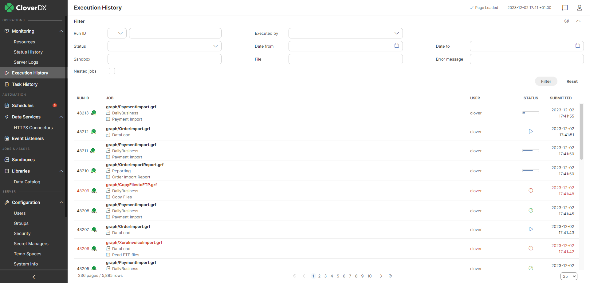
*Figure 128. Execution History - executions table*

When some job execution is selected in the table, the detail info is shown on the right side.

| Name | Description |
| --- | --- |
| Run ID | A unique number identifying the run of the job. Server APIs usually return this number as a simple response to the execution request. It is useful as a parameter of subsequent calls for specification of the job execution. |
| Execution type | A type of a job as recognized by the Server. STANDALONE for graph, JOBFLOW for Jobflow, MASTER for the main record of partitioned execution in a Cluster, PARTITION_WORKER for the worker record of partitioned execution in a Cluster. |
| Parent run ID | A run ID of the parent job. Typically the jobflow which executed this job, or master execution which encapsulates this worker execution. |
| Root run ID | A run ID of the root parent job. Job execution which wasn’t executed by another parent job. |
| Execution group | Jobflow components may group sub-jobs using this attribute. See the description of Jobflow components for details. |
| Nested jobs | Indication that this job execution has or has not any child execution. |
| Node | In Cluster mode, it shows the ID of the Cluster node which this execution was running on. |
| Executor | If it runs on Worker, it contains the text "worker". |
| Executed by | The user who executed the job. Either directly using some API/GUI or indirectly using the scheduling or event listeners. |
| Sandbox | The sandbox containing a job file. For jobs which are sent together with an execution request, so the job file doesn’t exist on the Server site, it is set to the "default" sandbox. |
| Job file | A path to a job file, relative to the sandbox root. For jobs which are sent together with an execution request, so the job file doesn’t exist on the Server site, it is set to generated string. |
| Job version | The revision of the job file. A string generated by **CloverDX Designer** and stored in the job file. |
| Status | See [Job statuses](execution-history-main.md#job-statuses). |
| Submitted | Server date-time (and time zone) when the execution request arrived. The job can be enqueued before it starts, see [Job queue](job-queue.md) for more details. |
| Started | Server date-time (and time zone) of the execution start. If the job was enqueued, the Started time is the actual time that it was taken from the queue and started. see [Job queue](job-queue.md) for more details. |
| Finished | Server date-time (and time zone) of the execution finish. |
| Duration | Execution duration |
| Error in component ID | If the job failed due the error in a component, this field contains the ID of the component. |
| Error in component type | If the job failed due the error in a component, this field contains type of the component. |
| Error message | If the job failed, this field contains the error description. |
| Exception | If the job failed, this field contains error stack trace. |
| Input parameters | A list of input parameters passed to the job. A job file can’t be cached, since the parameters are applied during loading from the job file. The job file isn’t cached, by default. **Note:** you can display whitespace characters in parameters' values by checking the **Show white space characters** option. |
| Input dictionary | A list of dictionary elements passed to the job. A dictionary is used independently of job file caching. |
| Output dictionary | A list of dictionary elements at the moment the job ends. |

##### Job statuses

Below is the list of job statuses in CloverDX Server and their explanation:

| Icon | Status | Description |
| --- | --- | --- |
|  | NOT AVAILABLE | Initial job state before changing to *Ready, Enqueued, or Error*. |
|  | READY | Job is ready to start. |
|  | ENQUEUED | Job is waiting in the job queue, waiting to be picked up. See [Job queue logic](job-queue.md#job-queue-algorithm) for more information. |
| 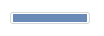 | RUNNING | Job is currently in progress. |
|  | FINISHED OK | Job completed successfully. |
| 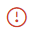 | ERROR | Job ended with an error. |
|  | ABORTED | Job was manually stopped via CloverDX Server Console, Designer, API, or by using the [abort job](tasks.md#abort-job) task. |
|  | UNKNOWN | Job was interrupted, likely due to a CloverDX Server restart. |

##### Hierarchy tree

For jobs which have some children executions, e.g. partitioned or jobflows also an executions hierarchy tree is shown.

| Icon | Description |
| --- | --- |
|  | Indicates a graph job type. |
|  | Indicates a subgraph job type. |
|  | Indicates a jobflow job type. |

If a job fails, the icon of the respective job changes to indicate the error (). If a child of a job fails, both the child’s and parent’s icon indicate the error.

Other icons in the hierarchy tree indicate a job execution type:  - standalone job, 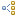 - master job executing other jobs, i.e. partition workers,  - partition worker executed by master job.

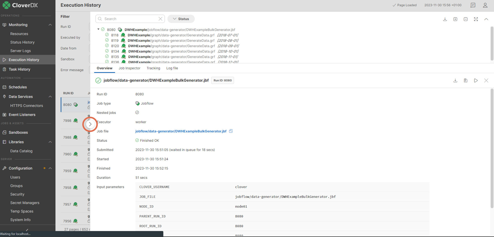
*Figure 129. Execution History - overall perspective*
> [!TIP]
> By clicking the arrow on the left side of the detail pane (see the figure above), you can expand the detail pane for easier analysis of job logs.

Executions hierarchy may be rather complex, so it’s possible to filter the content of the tree by the fulltext filter. However when the filter is used, the selected executions aren’t hierarchically structured.

#### Job Inspector tab

The **Job Inspector** tab, contains viewing tool for selected job. See: [Job Inspector](execution-history-main.md#job-inspector)

#### Tracking tab

The **Tracking** tab, contains details about the selected job:

| Attribute | Description |
| --- | --- |
| Component ID | The ID of the component. |
| Component name | The name of the component. |
| Status | Status of data processing in the respective component.  - FINISHED_OK: data was successfully processed - ABORTED: data processing has been aborted - N_A: status unknown - ERROR: an error occurred while data was processed by the component |
| CPU | CPU usage of the component. |
| Alloc | The cumulative number of bytes on heap allocated by the component during its lifetime. |
| Port | Component’s ports (both input and output) that were used for data transfer. |
| Records | The number of records transferred through the port of the component. |
| kB | Amount of data transferred in kB. |
| Records/s | The number of records processed per second |
| KB/s | Data transfer speed in KB. |
| Records/s peak | The peak value of **Records/s**. |
| KB/s peak | The peak value of **KB/s**. |

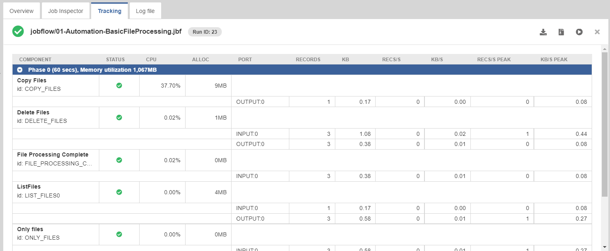
*Figure 130. Execution History - Tracking*

#### Log file tab

In the **Log file** tab, you can see the log of the job run with detailed information. A log with a green background indicates a successfully run job, while a red background indicates an error.

You can download the log as a plain text file by clicking **Download log** or as a `zip` archive by clicking **Download log (zipped)**.

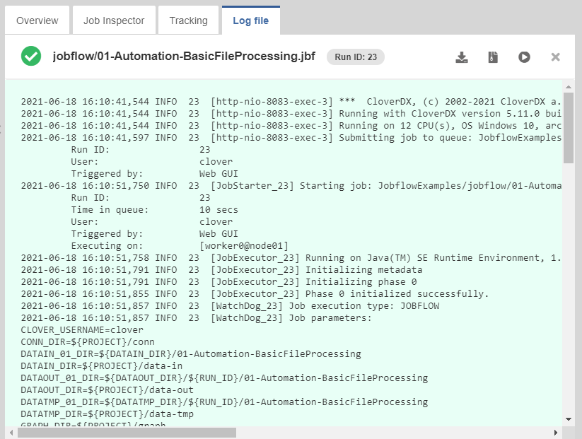
*Figure 131. Execution History - Tracking*

### Job Inspector

#### Overview

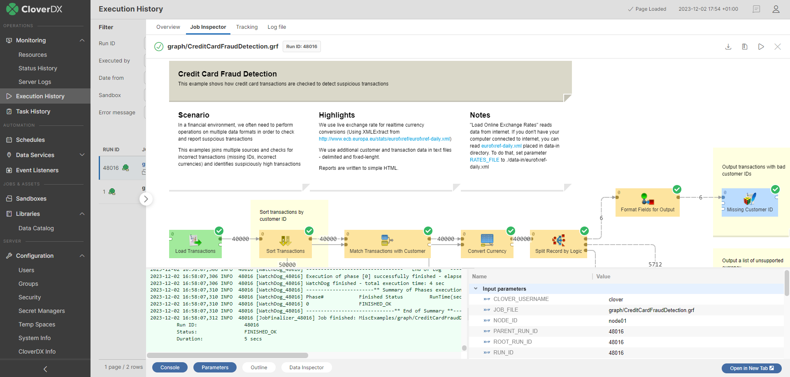
*Figure 132. Job Inspector in Execution History*

The Job Inspector is a graphical tool, allowing authenticated users to view, track progress or investigate past executions from CloverDX Server Console. It is designed to help DataOps and DevOps team operate more efficiently in production environments, where using CloverDX Designer may be undesirable or impossible.

Job Inspector aims to provide tools necessary to check for configuration and data issues, helping support personnel to better understand processes and thus allowing them to create more accurate error reports for development teams.

It allows [running jobs manually](execution-history-main.md#running-jobs-manually) and setting their input parameters, which can be useful for troubleshooting.

By design, Job Inspector will never allow making any changes to any job of CloverDX Server.

The tool is read-only, it does not allow editing of the displayed job.

#### Quickstart

The Job Inspector is available in the Sandboxes and Execution History sections.

##### Sandboxes

To open Job Inspector in Sandboxes, select a job and open the Job Inspector tab in the detail of the job.

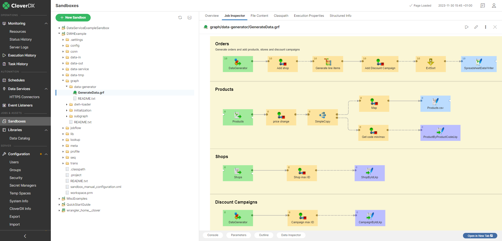
*Figure 133. Job Inspector in sandboxes*

##### Execution History

To open Job Inspector in Execution History, select a job run from the list and open the Job Inspector tab in the detail of the run.

When the Job Inspector is opened from the Execution History, it contains not only job content but also information about the job run - numbers of records, component statuses and run execution log. Error message is available for failed components. It’s possible to inspect component’s configuration and metadata on the edges.

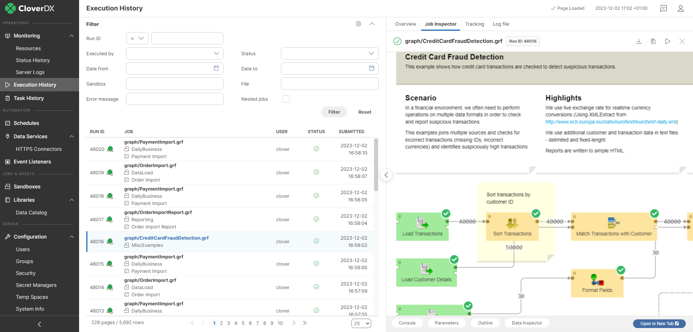
*Figure 134. Job Inspector in Execution History*

#### Using the Job Inspector

##### Job panel

Is the main section of Job Inspector. Job panel visualizes data flow using Components and Edges. Its contents are responsive and allow basic interaction. The selection of any item on this panel will show its properties in the Detail panel. For larger transformations, it is possible to move the view using mouse drag action. Zoom in/out is via mouse wheel. Other panels can be opened or closed using the buttons below the Job panel.

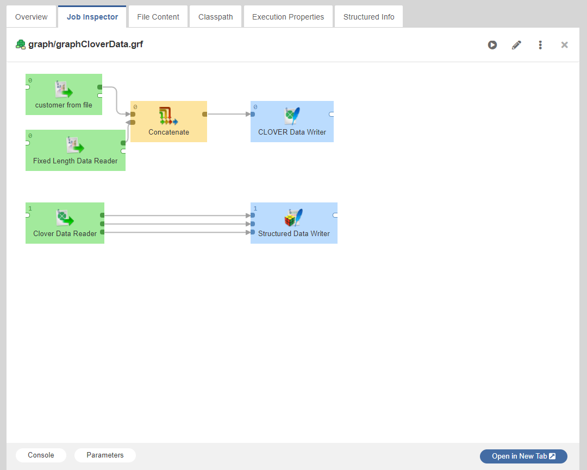
*Figure 135. Job Inspector - Job panel*

##### Detail panel

When there is an item active, the Detail panel is visible and shows different content based on the active item.

In general, the Detail panel shows the active item’s settings and properties. In the case of a Component that was terminated due to an error, it also shows an error message as a cause of failure.

Detail panel for components contains two lists:

- *Configured properties* - list of properties configured by a user
- *Default properties* - rest of the component properties with default values

Moreover, when component has an error status, error detail is displayed here.

Detail panel for edges contains info about metadata.

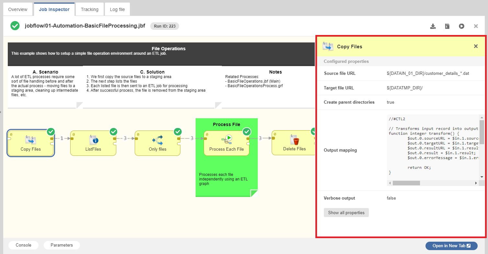
*Figure 136. Job Inspector - Detail panel*

##### Log panel

Log panel is specific for jobs, currently running or executed in the past - i.e. only available when Job Inspector is opened from Execution History module.

It is possible to show / hide the Log panel using the button, located below Job Inspector.

Log panel displays execution log, same as is available in a separate tab of CloverDX Server’s Execution History module or CloverDX Designer’s Console view.

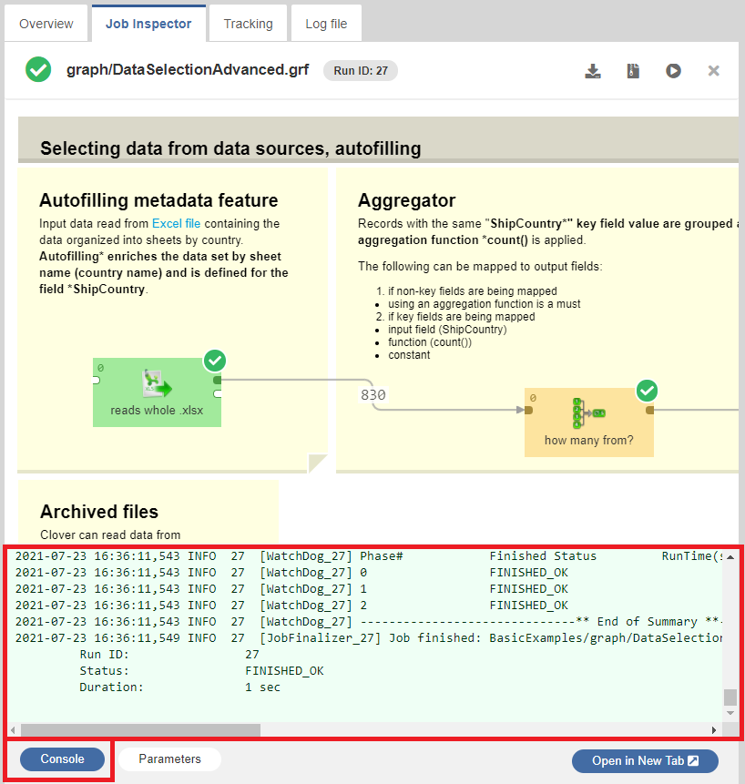
*Figure 137. Job Inspector - Log panel*

##### Parameters panel

Job parameters ([Parameters](../developer/parameters.md)) are key-value pairs used for job configuration. They allow executing the same job with different inputs, making the jobs reusable.

Parameters may help you understand what the job does. When a job fails, it is often necessary to find out which input caused the job to fail, so they are very useful for troubleshooting.

Job Inspector can display job parameters in one of the bottom panels. They are divided into three categories:

- *Input parameters* - parameters that were set when the job was executed
- *Internal parameters* - parameters stored internally in the current job file
- *Linked parameters* - parameters from linked .prm files

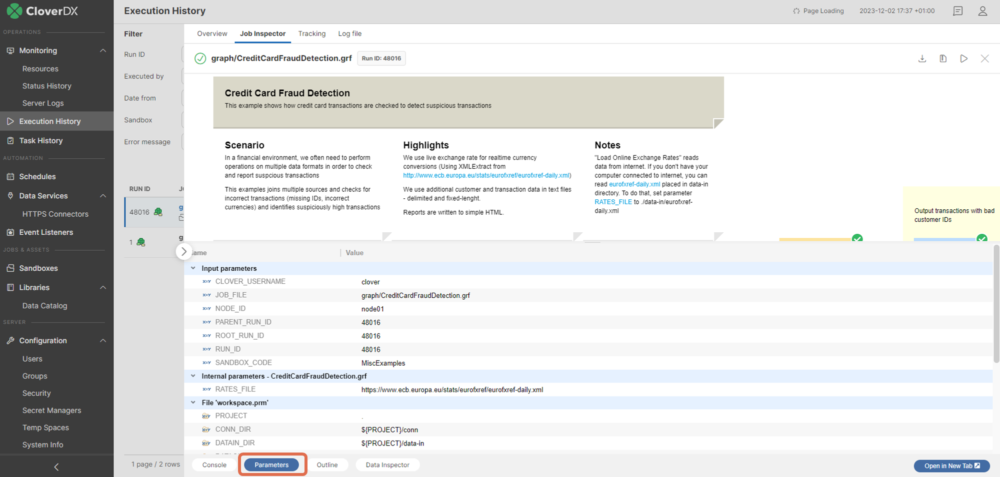
*Figure 138. Job Inspector - Parameters panel*

##### Outline panel

Outline panel is a read-only panel that contains list of elements used in job and their properties. It is similar to the Outline pane in the Designer ([Outline pane](../developer/designer-layout.md#outline-pane)).

- *Connections* - See [Connections](../developer/connections.md)
- *Sequences* - See [Sequences](../developer/sequences.md)
- *Lookups* - See [Lookup tables](../developer/lookup-tables.md)
- *Dictionary* - See [Dictionary](../developer/dictionary.md)

Clicking the "Outline" button opens the panel.

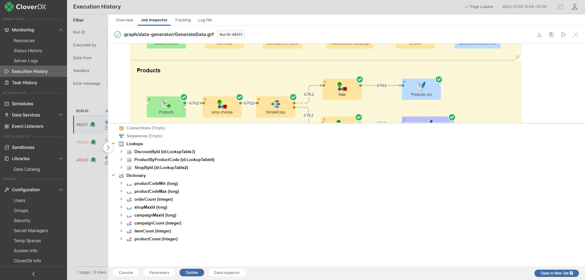
*Figure 139. Job Inspector - Outline Panel*

##### Data Inspector Panel

Like in [Designer](../developer/edge.md#data-inspector), Data Inspector can show sample data flowing through the selected edge of a running or finished job execution. By default, only the first 1000 records are saved for every edge.

The data is not available, unless the job is executed with data debugging enabled. Debug mode is enabled by default when the job is [executed manually](execution-history-main.md#running-jobs-manually) from Sandboxes or Execution History, or using Designer. For automated jobs (triggered by Schedules or Event Listeners), it is necessary to set `debug_mode=true` in [Execution properties](sandboxes.md#execution-properties).

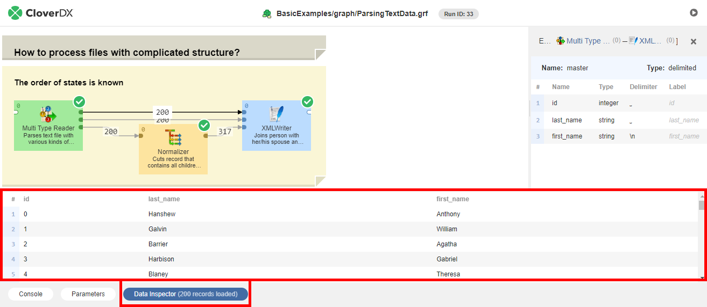
*Figure 140. Job Inspector - Data Inspector panel*

#### Running jobs manually

You can use Job Inspector to run a job manually and then observe the execution. Job Inspector will show live component statuses and the numbers of records on edges of the running job. You can also set the input parameters for the execution.

In order to run a job, press the **Run/Restart** button in the toolbar. A dialog will appear, allowing you to set the input parameters, if necessary. If the server is suspended, Run/Restart dialog requires explicit confirmation of execution on suspended server.

By default, the executed job will save edge data for viewing in [Data Inspector](execution-history-main.md#data-inspector-panel). You can prevent it by unchecking the **Enable Data Inspector** checkbox.

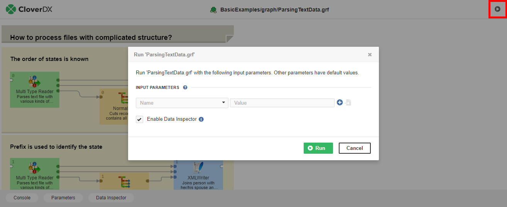
*Figure 141. Job Inspector - running jobs manually*

#### Job Inspector in separate browser tab

You can open Job Inspector on a separate page outside of the Server Console via the "Open in New Tab" button. It is possible to copy the URL and send it to a colleague.

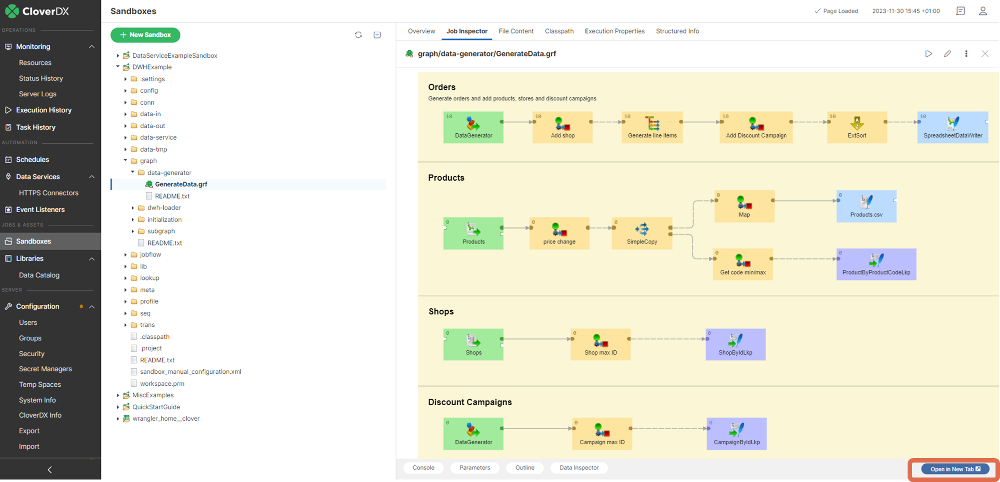
*Figure 142. Job Inspector - Open in New Tab button*

#### Configuration

There are configuration properties related to the Job Inspector, see:

- *[job.inspector.refreshing.interval](../admin/list-of-properties.md#lop-job-inspector-refreshing-interval)*
- *[job.inspector.request.timeout](../admin/list-of-properties.md#lop-job-inspector-request-timeout)*
