<!-- Automation and operations > Operations > Server logs & troubleshooting > Job queue logic and troubleshooting -->

### Job queue logic and troubleshooting

#### Overview

Job queue in **CloverDX Server** manages commands for execution of jobs (graphs, jobflows, subgraphs etc.) and determines when to actually start a job. Its main goals are:

- protection from CPU overloading
- protection from heap memory exhaustion
- good performance of executed jobs

The job queue receives commands to execute a job, determines when to start each specific job and potentially queues the commands for later execution. It starts the jobs based on load of the system (CPU and memory). If the load is low the jobs can be started immediately. If the load is high, the jobs wait in the queue until the load decreases.

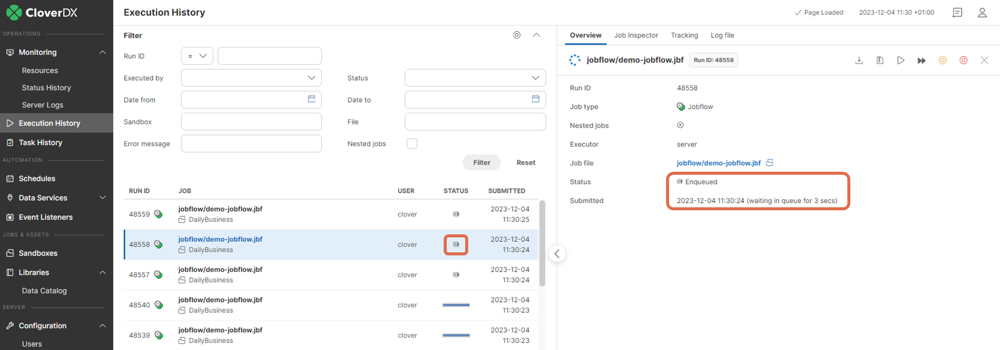
*Figure 113. Executions History with enqueued jobs*
> [!NOTE]
> Job queue is a feature introduced in CloverDX 5.7.0. Before this version, all jobs were started immediately when requested. This could lead to very high CPU load or heap memory consumption, especially if a large number of job execution requests came at the same time.

#### Quickstart

The job queue is enabled by default and is configured with good defaults - no configuration is necessary before first use. Its configuration can be tweaked, see [Job queue configuration](job-queue.md#configuration) below.

Jobs can be in the Enqueued state when they’re waiting in the queue to start:

*Figure 114. Enqueued job*

Jobs have *Submitted* and Started times:

- *Submitted* - time when the request to start the job was received. If the job was enqueued, this is the time the job was added to the queue.
- *Started* - time when the job was actually started. If the job was enqueued, this is the time the job was taken from the queue and started its execution. Until the job is actually started, the *Started* time is empty. If the job was not enqueued but it was started immediately, then the *Started* time is the same as Submitted time

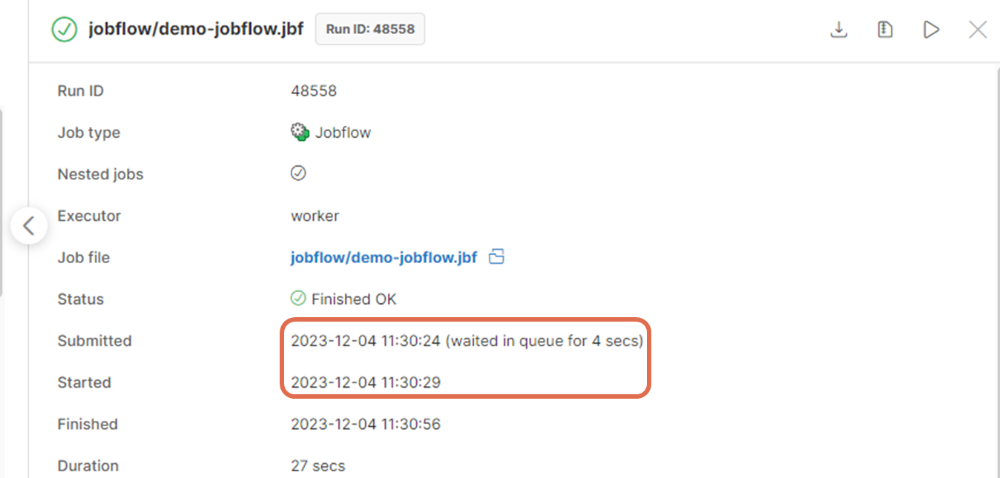
*Figure 115. Executions History - Submitted and Started times*

The **Monitoring page** shows information about the job queue:

- *Running jobs* - number of jobs currently running (i.e. not waiting in the job queue)
- *Enqueued jobs* - number of jobs currently waiting in the job queue
- *Jobs graph* - shows graphs for the number of running and enqueued jobs in time

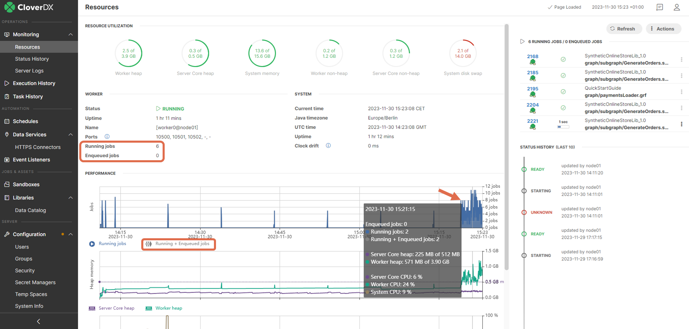
*Figure 116. Monitoring - job queue information*

#### Architecture

The job queue receives commands for job execution and determines when to actually start them to achieve its goals:

- protection from CPU overloading
- protection from heap memory exhaustion
- good performance of executed jobs

The above goals are achieved by the job queue by starting only a limited number of jobs so that the CPU load and heap memory usage are kept within limits. The queue cannot completely protect from CPU overloading or heap memory exhaustion because of limitations of the JVM, but it can significantly lower the probability of such a situation. On the other hand it needs to start enough jobs so that the performance capabilities of the system are well used and overall data processing performance is not lowered.

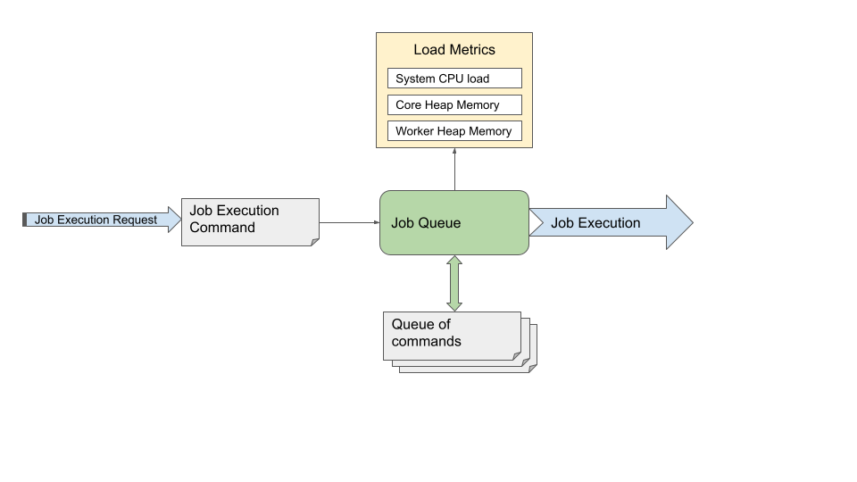
*Figure 117. Job queue architecture*

- *Job execution request* - request to start a job. The request can come from users in **Server Console, Designer, API, CloverDX** internal components etc.
- *Job execution command* - information about which job is to be executed, its configuration (e.g. graph parameters) and configuration of its environment (e.g. log level).
- *Job queue* - the core of the Job queue. When it receives a *job execution command*, it decides whether the job can be started immediately or whether it will be enqueued. The job queue regularly checks load metrics and jobs in the queue to determine which jobs can be taken from the queue and started.
- *Queue* - contains *execution commands* for enqueued jobs, these jobs will be started later. Jobs are started in order that provides expected behavior and best performance. The order depends on the jobs *Submit* time (i.e. when the execution request arrived, older jobs are typically started earlier), hierarchy of the jobs (i.e. Subgraphs of a job are typically started earlier than completely different jobs) and additional conditions. Jobs waiting in the queue are in the *Enqueued* state.
- *Load metrics* - metrics about system CPU load and heap memory usage of **CloverDX Server** and **Worker**.
- *Job execution* - starts and runs a job

Jobs have *Submitted* and *Started* times:

- *Submitted* - time when the request to start the job was received (regardless of whether the job was enqueued or not).
- *Started* - time when the job was actually started. If the job was enqueued, this is the time the job was taken from the queue and started its execution. Until the job is actually started, the *Started* time is empty. If the job was not enqueued but it was immediately started, then the *Started* time is the same as *Submitted* time.

To start an enqueued job immediately, you can use the [Start Enqueued Job Immediately](job-queue.md#start-enqueued-job-immediately) action in the Executions History.

It is possible to disable queue on specific jobs via the [queueable](../developer/jobconfig.md#graph-config-properties-queueable) execution property.

#### Load metrics

Job queue uses the following metrics to measure load on the system:

- *System CPU load* - total CPU load of the system, includes all processes running on the system - **CloverDX Server Core**, **Worker** and all other processes. A CPU intensive process running outside of **CloverDX Server** can cause high system CPU load.
- *Core heap memory usage* - used Java heap memory in **CloverDX Server Core**. This memory is mostly used by internal **Server** logic.
- *Worker heap memory usage* - used Java heap memory in **CloverDX Server Worker**. This memory is mostly used by running jobs.

##### Types of load

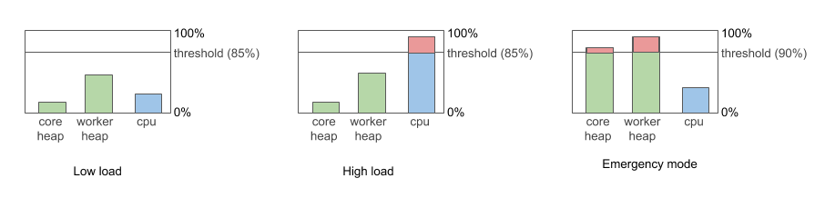
*Figure 118. Types of Load*

- *Low load* - system CPU load is below 85%
- *High load* - system CPU load is more than 85%
- *Emergency mode* - Worker or Core heap is more than 90% full. See section below for more details.

##### CPU load detection

On Windows systems the job queue might be unable to detect current system CPU load because of limited Windows permissions. When this happens the job queue behaves as if CPU load is 0% which means that jobs are executed immediately instead of being enqueued when CPU load is too high. To detect CPU load properly the Windows user used to run **CloverDX Server** must be part of Windows user groups *Performance Log Users* and *Performance Monitor Users*.

The **Monitoring page** displays warning when system CPU load is not being detected properly.

#### Emergency mode

If more than 90% of Java heap memory is used on **Server Core** or **Worker**, then the queue enters **Emergency Mode**. This mode is designed to protect **Core** and **Worker** from running out of heap. In emergency mode, the queue starts just a minimal number of jobs to allow the currently running jobs to finish, e.g. it starts subgraphs. The queue automatically exits the emergency mode if the heap memory usage drops below 90%.

The emergency mode depends only on heap memory usage, not on CPU load - so the queue can enter emergency mode even if CPU load is low.

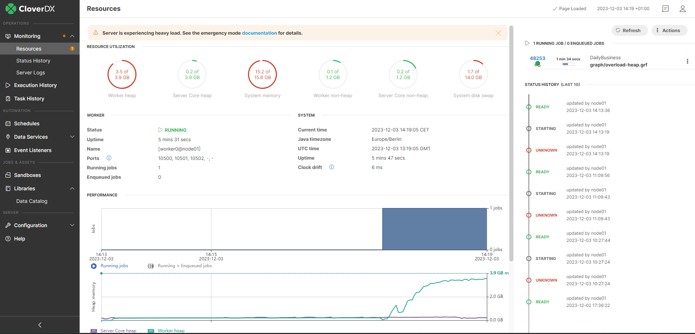
*Figure 119. Emergency mode in Monitoring*

Emergency mode is indicated in the job queue log (see [Job queue log](logging.md#job-queue-log)), coreLowMem means that **Server Core** is low on free heap, workerLowMem means that **Worker** is low on free heap.

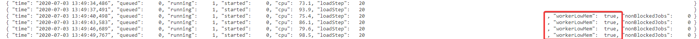
*Figure 120. Emergency mode in job queue log*

#### Job queue algorithm

The following describes the internal algorithm of the job queue in more detail:

- When a job execution command is received by the queue, the queue determines whether the job will be started immediately, or enqueued. The decision is based on load metrics:
  - if the load is low (CPU load <= 85%), the job is started immediately and it’s released from queue
  - If the load is high (CPU load > 85%), queue is in emergency mode or there are already enqueued jobs, then the job is enqueued.
- The job queue regularly (10 times per second, see [jobqueue.checkInterval](../admin/list-of-properties.md#lop-jobqueue-checkinterval) configuration property) checks the current load and based on that it can start some of the enqueued jobs:
  - If the load is low, it starts a new batch of enqueued jobs. The batch size is automatically adjusted by the queue. The batch size is also called *load step*, and its limits can be configured via [jobqueue.initialLoadStep](../admin/list-of-properties.md#lop-jobqueue-initialloadstep), [jobqueue.minLoadStep](../admin/list-of-properties.md#lop-jobqueue-minloadstep) and [jobqueue.maxLoadStep](../admin/list-of-properties.md#lop-jobqueue-maxloadstep) configuration properties.
  - If the load is high, it doesn’t start any enqueued job.
  - If the load meets emergency mode conditions, the queue enters emergency mode and keeps starting only a minimum number of jobs until it exits the emergency mode. See [Job queue Emergency Mode](job-queue.md#emergency-mode) for more details.

#### Impact

The job queue affects a wide range of **CloverDX Server’s** functionality:

- *Data Services (and Data Apps)* - **Data Services** are not processed by the job queue by default - enqueued **Data Services** might cause timeouts on the clients calling them. It is possible to enable enqueueing of all **Data Services** (via the [jobqueue.dataservice.enabled](../admin/list-of-properties.md#lop-jobqueue-dataservice-enabled) configuration property), e.g. when using **Data Services** for orchestration of job executions. It is also possible to enable enqueuing of specific **Data Services** via the [queueable](../developer/jobconfig.md#graph-config-properties-queueable) execution property.
- *Event Listeners and Schedules:*.
  - jobs started from event listeners or schedules can be enqueued and started later
  - the *job started* event in Event Listeners is triggered when the job is actually started, i.e. ifit was enqueued then it’s triggered when the job is taken from the queue
  - the *job timeout* event in Event Listeners is triggered based on the time the job was running,the time when the job was enqueued is not taken into account
- [max_running_concurrently](../developer/jobconfig.md#graph-config-properties-max-running-concurrently) and [enqueue_executions](../developer/jobconfig.md#graph-config-properties-enqueue-executions) execution properties - functionality of these properties is kept, and they are evaluated after the job queue for now. So the job queue enqueues jobs and starts their execution without being affected by these execution properties. When the job startup begins after the queue, Server makes sure these execution properties are respected.
- *APIs* - clients of **CloverDX Server’s APIs** must be aware that jobs can be enqueued:
  - querying for the job’s state after launching it can return Enqueued
  - Started time can be empty - if the job is currently enqueued
  - filtering jobs by time uses *Submitted* time, not *Started*
- *Cluster* - each node of the cluster has its own job queue. Cluster load balancer is aware of the job queues of all cluster nodes. When the load balancer decides on which cluster node a job will be executed, it takes job queue size into account. The load balancer prioritizes nodes that have an empty job queue (i.e. nodes that have low load and don’t need to enqueue jobs). Nodes that have job queue enabled ignore the `cluster.lb.memory.limit` and `cluster.lb.cpu.limit` configuration properties - protection from high CPU and heap memory usage is provided by the queue, see [Jobs load balancing properties](../admin/cluster-setup-index.md#jobs-load-balancing-properties).
- *Cluster job partitions* - job in cluster can be partitioned to run on multiple nodes (see [Sandboxes in cluster](../admin/cluster-setup-index.md#sandboxes-in-cluster)). Each of the partitions can be enqueued, while the master job that orchestrates them is never partitioned.
- *Server suspend* - when suspending the server (see [Suspending the Server](monitoring.md#5-suspending-server-core)), all currently running and enqueued jobs are left to finish their execution. When using the suspend at once action, all running and enqueued jobs are immediately aborted.

#### Scenarios

This section describes some common scenarios that can happen in relation to job queue.

- *Job does not start immediately* - when running a job (e.g. from **Server Console**), the job can be enqueued and start later. Job queue enqueues a job in case of high load or emergency mode - look in performance graphs in **Monitoring**, queue log and performance log. Enqueued jobs are started in order based on Submit time, so executions requested earlier are typically started earlier too.
- *Enqueued job is needed to start immediately* - if a job is enqueued and you need it to start immediately, e.g. to meet a data processing deadline, then you can use the [Start Enqueued Job Immediately](job-queue.md#start-enqueued-job-immediately) action to manually force the job to start.
- *Job launched by schedule or event listener doesn’t start immediately* - jobs launched by schedules and even listeners can be also enqueued, e.g. a job can start later than its scheduled start time. You can disable enqueuing on a job by the [queueable](../developer/jobconfig.md#graph-config-properties-queueable) execution property.
- *Subjobs must run in parallel* - if some subjobs of a parent job must run in parallel, the job queue could break this condition. In such a case you can disable enqueuing on the subjobs by the [queueable](../developer/jobconfig.md#graph-config-properties-queueable) execution property.
- *Jobs are enqueued even if CPU load is low* - job queue can be in Emergency mode in case of high heap memory usage, see [Job queue Emergency Mode](../operations/job-queue.md#emergency-mode).
- *High number of enqueued jobs* - the job queue is probably enqueuing jobs because of high CPU or heap memory load - look in performance graphs in **Monitoring**, queue log and performance log.
- *Increasing number of enqueued jobs* - if the number of enqueued jobs continues to increase, this means that the server keeps getting more job execution requests than it can process. The job queue protects the server from overload. In this case investigate who is sending the job execution requests, e.g. client side of the server APIs.
- *Maximum size of job queue* - the number of jobs that can be enqueued is limited (by default the limit is 100 000, configurable via [jobqueue.maxQueueSize](../admin/list-of-properties.md#lop-jobqueue-maxqueuesize) configuration property). If the limit is reached, job executions fail with “Maximum size of job queue was reached. You may want to consider increasing CloverDX Server property "jobqueue.maxQueueSize". Job execution with run ID 140000 aborted at 23:05:23” error message.

#### Troubleshooting

**CloverDX Server** provides the following troubleshooting capabilities related to job queue:

##### Executions History

The **Executions History** shows the following job queue related information:

- *Status* - the job table shows the Enqueued status for enqueued jobs. It is possible to also filter on the status (e.g. to find all currently enqueued jobs).
- *Submitted and Started time* - details of a job run show the *Submitted* and *Started* time. If the job waited in the queue, the wait duration is shown near the *Submitted* time.

*Figure 121. Executions History with enqueued jobs*

##### Start enqueued job immediately

It is possible to manually force an enqueued job to start immediately via the **Start enqueued job immediately** action in Executions History. This can be used to override the job queue algorithm on systems under high load, e.g. to quickly start a job that needs to start now to meet a deadline.

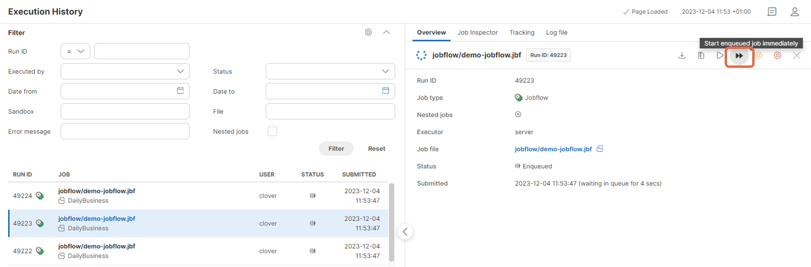
*Figure 122. Start Enqueued Job Immediately*

##### Monitoring

The **Monitoring** page show the following job queue related information:

- *Running jobs* - number of jobs that are currently running (not enqueued)
- *Enqueued jobs* - number of jobs currently waiting in the queue
- *Jobs graph* - shows graphs for the number of running and enqueued jobs in time. You can correlate this with the CPU and memory graphs below

*Figure 123. Monitoring - job queue information*

##### Logs

Server logs provide the following job queue related information:

- [Job queue log](..operations/logging.md#job-queue-log) - log that regularly prints information related to job queue, e.g. queue size, CPU load, emergency mode reason etc. It’s similar in structure to [Performance log](logging.md#performance-log).
- [Performance Log](logging.md#performance-log) - the performance log contains a “jobQueue” column that shows the size of the job queue. This is useful to correlate job queue size to system load, number of running jobs and other performance metrics.
- `all.log` - if a job is enqueued and started later, then the `all.log` contains 2 entries - one for Submitting the job to the queue, and one for the actual start of the job (shows also duration waited in the queue).
  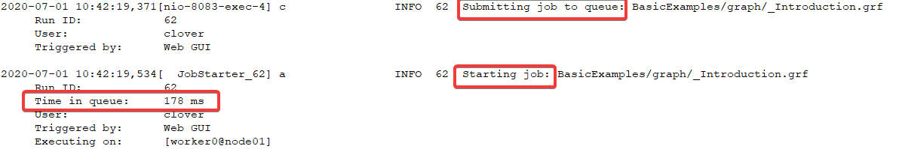
  *Figure 124. all.log - entries for enqueued job*
  If the job is not enqueued, then only the start is logged in the all.log.
  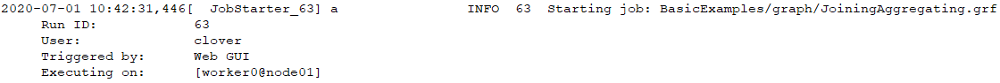
  *Figure 125. all.log - entries for not enqueued job*
- *Job log* - log of each job contains information in case the job was enqueued - first a message that it was submitted to the queue, then a message that it was actually started.
  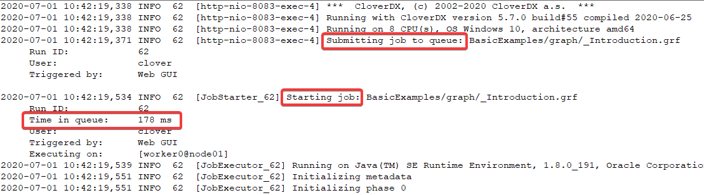
  *Figure 126. Job log - messages if job was enqueued*
- *Jobs forced to start immediately* - if an enqueued job was manually forced to start immediately via the [Start Enqueued Job Immediately](job-queue.md#start-enqueued-job-immediately) action, this will be visible in the job log and `all.log`.
  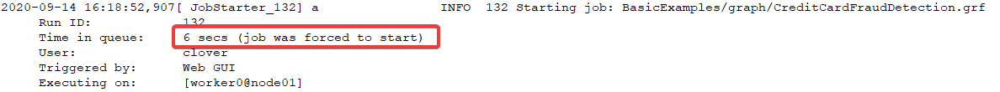
  *Figure 127. Job log - messages if job was forced to start*

#### Configuration

The job queue does not require any configuration by default. However its behavior can be tweaked via configuration properties, see [Job queue](../admin/list-of-properties.md#lop-job-queue) configuration properties for details. The most useful configuration properties are:

- `jobqueue.enabled=true` - set to false to disable job queue globally. If the job queue is disabled, all jobs are started immediately when their execution request arrives.
- `jobqueue.dataservice.enabled=false` - by default **Data Services (and Data Apps)** are not processed by the job queue, but started immediately (see [Data Services and job queue](job-queue.md#job-queue-data-services)). You can enable enqueueing of Data Services via this property.
- `jobqueue.systemCpuLimit=0.85` - system CPU load (0.85 is 85%) which is considered high and causes jobs to be enqueued.
- `jobqueue.coreHeapUsageLimit=0.90` - usage of **CloverDX Server Core** heap memory (0.90 is 90%), above which the job queue enters emergency mode.
- `jobqueue.workerHeapUsageLimit=0.90` - usage of **CloverDX Server Worker** heap memory (0.90 is 90%), above which the job queue enters emergency mode

It is possible to disable queue on specific jobs via the [queueable](../developer/jobconfig.md#graph-config-properties-queueable) execution property. The execution property can be also used to enable queue on specific Data Services.

#### Limitations

##### Persistence

The job queue contents are not persisted between **CloverDX Server** restarts. So if some jobs are enqueued and the server is restarted, then after the server starts the jobs are not enqueued anymore but will be in UNKNOWN state (same as for running jobs) and will not be started later.

##### Protection heuristics

The protection from CPU overload and heap memory exhaustion provided by the job queue is not absolute. Because of JVM architecture it’s not possible to completely prevent these issues. The job queue manages load of the server to lower the probability of these issues based on heuristics.
