<!-- Automation and operations > Libraries, Sandboxes, and AI / ML Models modules > Libraries -->

## 14. Libraries

### Introduction

A **CloverDX** library is a redistributable package, which can contain reusable [graphs](../developer/part-graph-elements-structures-tools.md), [subgraphs](../developer/subgraphs.md), [jobflows](../developer/part-jobflow.md), [data services](../developer/data-services.md), or [metadata](../developer/metadata.md). Libraries offer significant improvements to code reusability and sharing in **CloverDX**. Because libraries can be installed [multiple times](libraries.md#multiple-library-instances), they provide an easy option to quickly clone your solutions and set them up with different parameters and permissions to control users' visibility and allowed operations for individual libraries.

### Development

Libraries are developed in **CloverDX Designer** as projects, which are then exported to a library `.clib` file, and deployed to **CloverDX Server**. Depending on the options selected during [library export](../developer/export-library.md), and assigned [permissions](libraries.md#permissions-tab), public elements from installed libraries become available for [use](libraries.md#usage) in **CloverDX Server**, **CloverDX Designer**, or **CloverDX Wrangler**.

Public elements can be:

- **Subgraphs**
- **Graphs** and **jobflows**
- **Data Services**
- **Metadata**
- **Machine learning models**

If you want to develop your custom libraries, refer to our libraries documentation for developers [here](../developer/libraries-dev.md).
> [!TIP]
> You can take advantage of our ready-to-use libraries in the [CloverDX Marketplace](https://marketplace.cloverdx.com/) repository, which includes solutions to quickly integrate with interfaces like *Hubspot* or *Google Drive*, or solutions that can help you easily encrypt and decrypt your data or implement Python scripts.

### Usage

#### Subgraphs

Public subgraphs become available for use in **CloverDX Designer**, where they can be added as components in server projects. For more information on the usage from the Designer perspecitve, refer [here](..designer/libraries.md#usage).

Subgraphs exported as **Data Source** or **Data Target Connectors** become available in the [Data Catalog](../user/data-catalog.md) in **CloverDX Wrangler**. For more information on how to configure access to individual connectors for specific user groups, see [Permissions Tab.](libraries.md#permissions-tab)

For more information on Data Source and Data Target Connectors from the Wrangler perspective, refer to our [Data Source Connectors](../user/data-sources-data-targets.md#data-source-connectors) and [Data Target Connectors](../user/data-sources-data-targets.md#data-target-connectors) sections in the Wrangler documentation.

#### Graphs, jobflows

When creating a new [schedule](scheduling.md) or [event listener](listeners.md) in **CloverDX Server**, installed libraries are available in the **Sandbox** dropdown, and public graphs and jobflows from the libraries are available to be selected for scheduling.

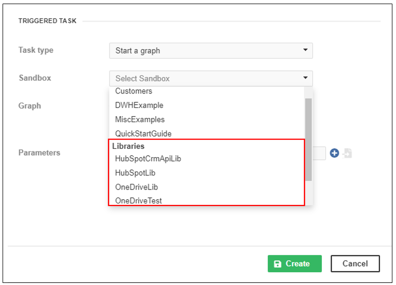
*Figure 145. Libraries in schedulers*

##### Initialization job

A graph or jobflow selected as a library **initialization job** during library export can be used to set up a configuration that cannot be set ahead of time during the development process. For example, in our CloverDX Marketplace [OneDrive](https://marketplace.cloverdx.com/OneDriveLib_1.0.html) library, an initialization graph is used to generate values for SharePoint *Site ID* and *Drive ID parameters*, which are dependent on the configured OAuth2 connection.

For more information on how to tell if a library has an initilation job and how to run it, see [Initialization job](libraries.md#initialization-job).

For recommendations on initialization job development, refer to our documenation for developers [here](..designer/libraries.md#).

##### Health Check job

A graph or jobflow selected as a library **Health Check job** can be used to, e.g., ensure that an OAuth2 connection is still valid or that a connection to a 3rd party interface or database is working. The job is periodically run via its associated **health check [schedule](scheduling.md)** which can be set in the [installation dialog](libraries.md#installation-settings) or any time later. You can also run the job manually. If the schedule fails, the library is marked as failing in the list of libraries:

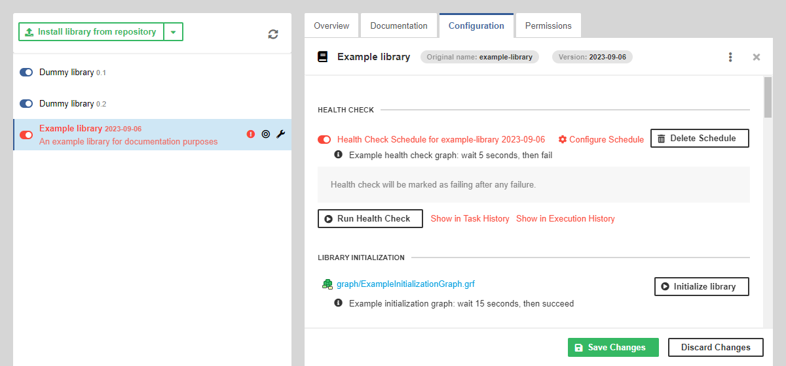
*Figure 146. Library with a failing health check schedule*

You can inspect the previous runs of the job in *Task History* and *Execution History*. When the library is enabled or disabled, the state change is propagated to its health check schedule. For each library, there can be only one such schedule.

For more information, see [Health Check Job Configuration.](libraries.md#health-check-job)

#### Data Services

Data Services from installed libraries can be [deployed](data-services.md#deploying-data-service) in **CloverDX Server**.

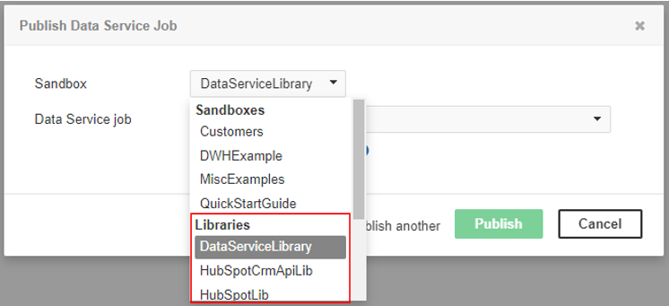
*Figure 147. Libraries Data Services*

#### Machine Learning Models

Models from installed libraries can be used by AI components (via **Server model** property).

### Installation

Libraries can be installed in the **Libraries** module in the **CloverDX Server** console. Only users assigned to a [user group](../admin/groups.md) that has one of the following permission combinations are allowed to install libraries:

- [Manage libraries](../admin/groups.md#permission-manage-libraries) AND [Sandboxes - unlimited](../admin/groups.md#permission-sandboxes-unlimited)
- [Manage libraries](../admin/groups.md#permission-manage-libraries) AND [Create sandbox](../admin/groups.md#permission-create-sandbox)

Installed libraries create a special type of public shared [sandbox](../operations/sandboxes.md) with read-only permissions. Internally, the packages are unpacked into the `${libraries.home}` directory, which, by default, points to the *libraries* sub-directory located in `${sandboxes.home}`. See [sandboxes.home](../admin/list-of-properties.md#lop-sandboxes-home) and [libraries.home](../admin/list-of-properties.md#lop-libraries-home) for more information.

Libraries to be installed can be loaded by either selecting a single `.clib` file from a local directory or by selecting them to be installed from a [library repository](libraries.md#library-repository).
> [!NOTE]
> **CloverDX** libraries may have a specified minimum and maximum supported CloverDX version. See [Incompatible library](libraries.md#library-incompatible-with-server) for more information.

#### Single library upload

To load a single library for installation from a local directory click on the dropdown next to the **Install library from repository** button, and select the desired `.clib` file to be loaded.

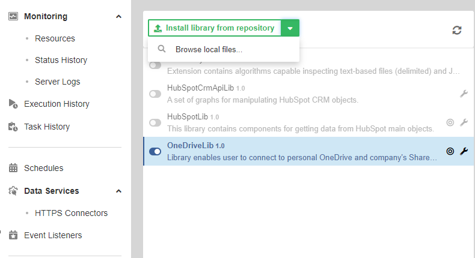

#### Library repository

Library repositories allow you to share your libraries. A repository is a local or remote directory with `.clib` archives, each containing one library. When browsing libraries in a repository, users can easily see additional information like the library version, library description, or its [public elements](libraries.md#development) on the **Overview** tab. If a library includes a documentation page, it will be displayed on a separate **Documentation** tab.

Some libraries might be incompatible with your current **CloverDX** Server version. These libraries will be marked with a warning icon to indicate potential issues. See [Library incompability](libraries.md#library-incompatible-with-server) for more information.

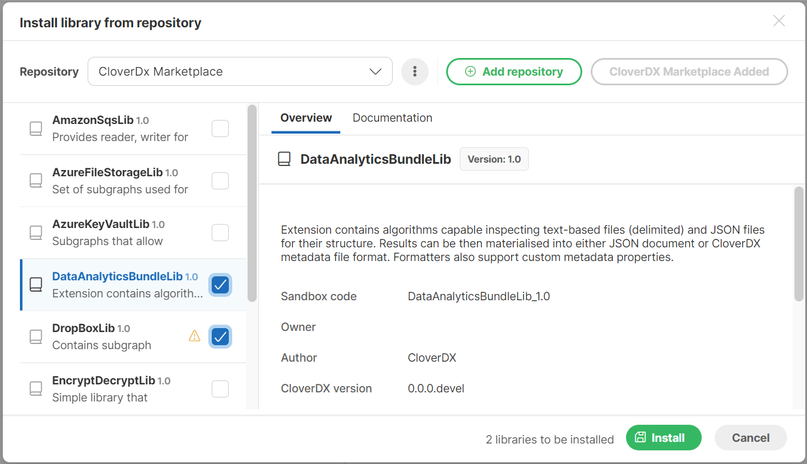
*Figure 148. Library repository*

Repositories can be local or remote. Currently, we support the following remote protocols: **FTP**, **SFTP**, **Amazon S3**, **Azure Blob Storage**, **SMB**, and **SMB2**.

In **CloverDX Server**, you can add one or more repositories by using the **Add repository** button and then browse through the repositories and install selected libraries.
> [!NOTE]
> Our [**CloverDX Marketplace**](https://marketplace.cloverdx.com), which includes a collection of CloverDX libraries that implement various functionalities, is automatically added during **CloverDX Server** installation with an empty database. For existing Server installations, the **CloverDX Marketplace** repository can be added by clicking on the **Add CloverDX Marketplace** button. After performing this step, the button will become disabled and will indicate that the repository has already been added. The **CloverDX Marketplace** repository (its URL is `az-blob://cloverdx.blob.core.windows.net/marketplace-repository`) can be located in the **Repository** dropdown.

#### Installation settings

When a library is selected to be installed, the following settings are available:

- **Enable** switch: Defaults to *false*. We recommend installing all new libraries with this option disabled. Once a library is enabled, all public elements from the library become available for [use](libraries.md#usage) by **all authenticated users** of the Server. Installing new libraries as *Disabled* will prevent users from using the libraries until they are fully configured. The state of the library (**Enabled/Disabled**) can be changed at any time in the list of installed libraries by a user assigned to a user group that has the following permissions combination:
  - [Manage libraries](../admin/groups.md#permission-manage-libraries) AND [Suspend sandbox](../admin/groups.md#permission-suspend-sandbox) AND the **EXECUTE** library-level permission for the given library on the [Permissions tab](libraries.md#permissions-tab)
- **Health Check**: Only available if the library defines a [Health Check job](libraries.md#health-check-job); defaults to *false*. If checked, a [schedule](scheduling.md) is created to check whether the library is working properly every 24 hours (the schedule is disabled by default and its settings can be adjusted later; see [Health Check configuration](libraries.md#health-check-job) for more information). The schedule can be also created any time after installation, but it always requires the following permissions:
  - [Manage libraries](../admin/groups.md#permission-manage-libraries) AND [Create schedule](../admin/groups.md#permission-create-schedule) AND [Edit sandbox](../admin/groups.md#permission-edit-sandbox) AND the **WRITE** library-level permission for the given library on the [Permissions tab](libraries.md#permissions-tab)
- **Library ID**: If not populated, it defaults to the *Library Name* entered during [library export](../developer/export-library.md). Setting a different *Library ID* will allow you to install the same library version multiple times. See [Installation logic](libraries.md#installation-logic) for more information. Library ID does not have to be populated if you only need one instance of the library. Library IDs cannot be changed after installation.
- **Label**: If not populated, it defaults to the *Library Name* entered during [library export](../developer/export-library.md). Setting a different label will change the library name in all the places where the library is used (CloverDX Designer Component Palette, Data Catalog in CloverDX Wrangler, or schedulers or listeners in CloverDX Server). Labels of installed libraries can be changed on the **Overview tab** of a library detail after clicking on the **Edit** button. See [Library editing](libraries.md#library-editing) for more information.
- **Overwrite already installed libraries**: This option can be used to overwrite an installed library, if the library **name**, **version**, and **library ID** match. See [Installation logic](libraries.md#installation-logic) for more information.

Note that the library **Version** is not editable; it comes up as specified during [library export](../developer/export-library.md).
> [!NOTE]
> Libraries incompatible with your **CloverDX** version are marked with a warning icon. While installation is possible, the library’s functionality cannot be guaranteed. See [Library incompability](libraries.md#library-incompatible-with-server) for more information.

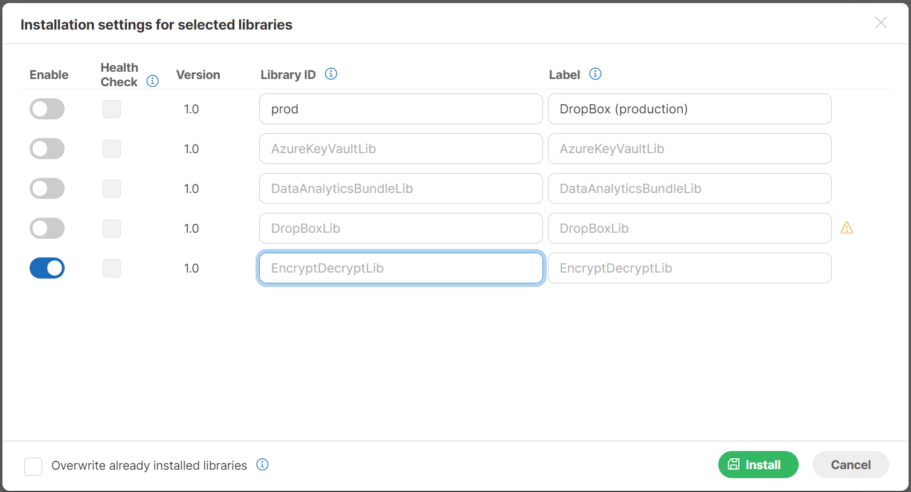
*Figure 149. Library installation*

#### Installation logic

The **Libraries** module offers great variability when installing libraries, which allows you to:

1. Overwrite an existing library with an updated version of the same library.
2. Install multiple library versions.
3. Install the same library multiple times.

This provides administrators with flexibility when managing libraries: libraries can be quickly installed, updated, or copied, and each installed library instance configured with different parameters or permissions.

- To **overwrite** an already installed library, the library **name**, **version**, and **library ID** of the new library need to match, and the **Overwrite already installed libraries** option needs to be selected when installing such a library. If the **Overwrite already installed libraries** option is not selected, the matching (already installed) libraries are skipped.
- To **install a new library version**, export the library project with a different version: When [exporting](../developer/export-library.md) a project to a library in **CloverDX Designer**, the library version needs to be specified. The version then comes up in the list of installed libraries next to the library name. If the library project is updated and exported with a new version, when installing the **new library version** a new library instance will be created. Multiple versions of the same library can co-exist and be utilized as needed, or the old library version can be disabled or deleted if it is no longer needed.

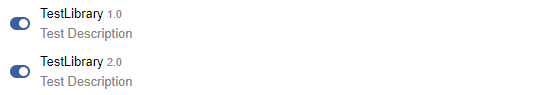
*Figure 150. Multiple library versions*

- To **install the same library multiple times**, make sure to populate a unique **library ID** during installation to differentiate it from the previously installed instances. See [Multiple library instances](libraries.md#multiple-library-instances) for more information.

#### Multiple library instances

Installing multiple instances of the same library can save you time if there is a need to handle the same data from multiple sources (e.g., when pulling the same data from different databases or different connection profiles), or when using the same data source but needing a way to limit the output based on user’s level of access (e.g., limit one group of users to see only a specific set of customer information).

To provide an example of how to use multiple library instances, let’s take our [Xero library](https://marketplace.cloverdx.com/XeroLib_1.0.html), which can pull information from the Xero accounting system. Let’s assume your company has two branches, one in the United Kingdom and one in the United States. You want to make the data source connectors from the Xero library available for use in the [Data Catalog](../user/data-catalog.md) in **CloverDX Wrangler** and want users to access data from their branch only.

##### Installation and configuration steps

- Install the Xero library twice with different library IDs (*Xero_UK* and *Xero_US*).

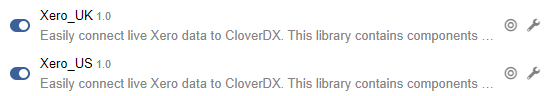
*Figure 151. Multiple instances of Xero library*

- On the [Configuration tab](libraries.md#configuration-tab), configure each library instance with its OAuth2 connection, and tenant ID (consult the [library documentation](https://marketplace.cloverdx.com/XeroLib_1.0.html) for the configuration steps). You can also set the date format based on the country (*dd/MM/yyyy* or *MM/dd/yyyy*).

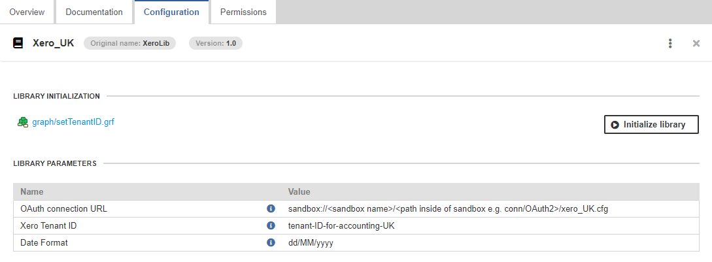
*Figure 152. Configuration for UK branch*

*Figure 153. Configuration for US branch*

- Create new [user accounts](../admin/users.md) and two new [user group](../admin/groups.md) (in our case *Accounting_UK* and *Accounting_US*). Since these users will need access only to **CloverDX Wrangler**, the user groups are set up with only the default Wrangler permissions, i.e., *Create sandbox* and *Access to Wrangler app*.
- On the [Permissions tab](libraries.md#permissions-tab) set up the library-level permissions and the **Data Source Connectors** permissions for each library instance to be visible and available for use only to their respective user group.

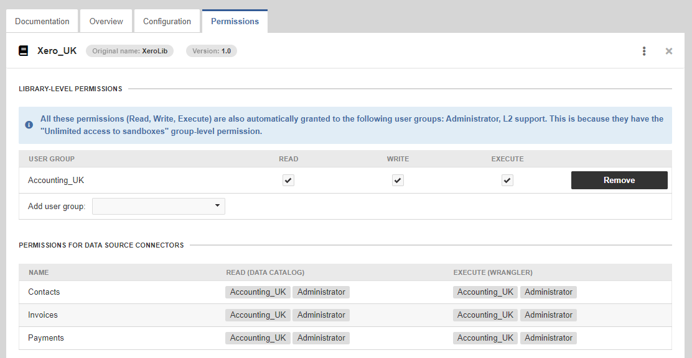
*Figure 154. Permissions for UK branch*

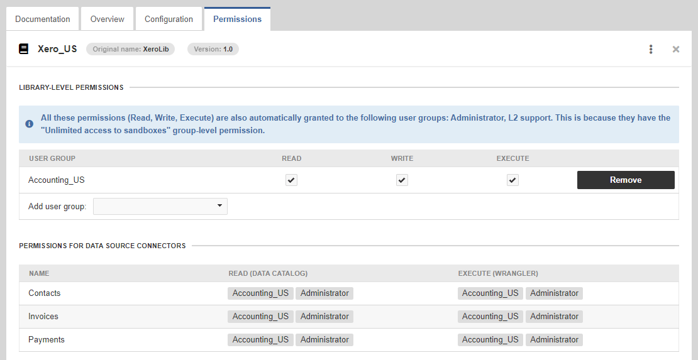
*Figure 155. Permissions for US branch*

- [Enable](libraries.md#installation-settings) the library instances. After logging into **CloverDX Wrangler**, users will have access only to the data source connectors from their branch.

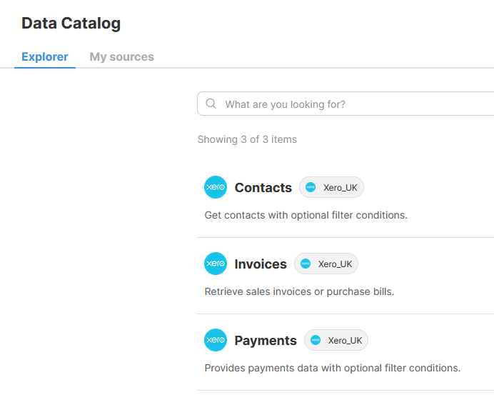
*Figure 156. Wrangler Data catalog for UK branch*

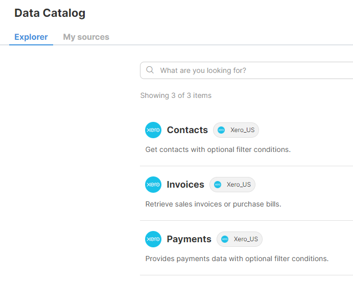
*Figure 157. Wrangler Data catalog for US branch*

### Overview tab

The **Overview** tab displays basic information about the selected library and lists the [public resources](libraries.md#development) the library includes.

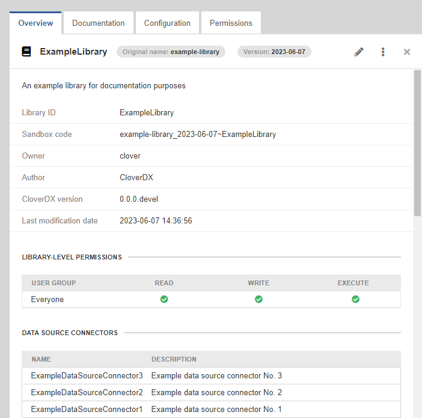
*Figure 158. Library Overview tab*

If your installed library is not compatible with your **CloverDX** version, a warning message shows up at the top of the **Overview** tab. See [Library incompability](libraries.md#library-incompatible-with-server) for more information.

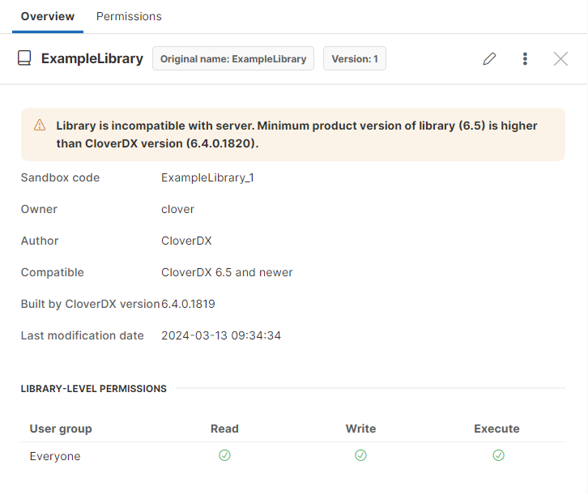
*Figure 159. Library Overview tab with warning message*

| Field | Description |
| --- | --- |
| Library name | Library name displays the library name specified when [exporting](../developer/export-library.md) the project into a library, or the name that was entered in the **Label** field when installing the library. This is the name under which the library is available to all users (e.g., in the Scheduler or Event Listeners, or the Component Palette in the Designer). See [Library editing](libraries.md#library-editing) for more information on how to change a library name. |
| Original name | If a library name was changed during installation by specifying a custom **Label**, or if the original library name was changed by [editing](libraries.md#library-editing) the library and modifying the **Label**, the original library name (as specified during library export), will be displayed next to the current library name. This will allow you to keep track of the original name. |
| Library version | Displays the library version specified during [library export](../developer/export-library.md). Library versions are not editable. |
| Library ID | Library ID will be displayed when a different library ID was entered when installing the library.  Library IDs can be used to install libraries multiple times. See [Installation logic](libraries.md#installation-logic) for more information. |
| Description | Displays library description as specified during library export. Library descriptions are displayed when reviewing libraries in repositories or the list of installed libraries. Library descriptions can be changed. See [Library editing](libraries.md#library-editing) for more information. |
| Sandbox code | Displays the library sandbox name. |
| Owner | Displays the username of the user who installed the library. Library owners have access to the **Configuration** and **Permission** tabs even when they are not granted the **WRITE** library-level permission. See [Permissions tab](libraries.md#permissions-tab) for more information. |
| Author | Displays the author of the library project as specified during library export. |
| CloverDX version | CloverDX version is automatically assigned based on the version of **CloverDX Designer** from which the library was exported. |
| Last Modification Date | Displays the date and time of library export from **CloverDX Designer**. |
| Library-level Permissions | Displays an overview of the library-level permissions on the [Permissions tab](libraries.md#permissions-tab). |
| Data Source Connectors, Data Target Connectors, Subgraphs, Graphs, Jobflows, Rest Jobs, Metadata sections | Lists the public library resources. |

### Documentation tab

To add additional information that might be important to other users, or to keep track of changes in libraries, library documentation can be optionally added before exporting a project into a library. See [exporting to library](../developer/export-library.md) for more information on how a documentation page can be added.

If a documentation file is present in a library, a **Documentation** tab will be displayed when displaying the library in a library repository and when reviewing the installed library detail in the **Libraries** section.

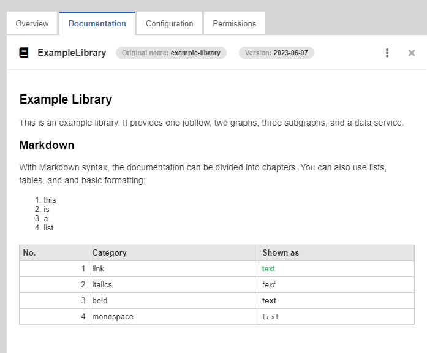
*Figure 160. Library Documentation tab*

### Configuration tab

The **Configuration** tab is visible only to users assigned to a user group that has one of the following permissions combinations:

- [Manage libraries](../admin/groups.md#permission-manage-libraries) + [Sandboxes - unlimited](../admin/groups.md#permission-sandboxes-unlimited)
- [Manage libraries](../admin/groups.md#permission-manage-libraries) + [Edit sandbox](../admin/groups.md#permission-edit-sandbox) + the **WRITE** library-level permission for the given library on the [Permissions tab](libraries.md#permissions-tab) OR the user is the library [owner](libraries.md#library-owner)

Depending on the library design, additional configuration steps might need to be performed after a library installation. Library configuration is performed in the **Configuration tab**. When reviewing the list of installed libraries, the following indicators related to library configuration or its health might appear in a library record:

| Icon | Description |
| --- | --- |
|  | [Library has an initialization job.](libraries.md#initialization-job) |
|  | [Library has configurable parameters.](libraries.md#configurable-parameters) |
|  | [Library has unresolved dependencies.](libraries.md#dependencies) |
|  | [Library Health Check](libraries.md#health-check-job) job is running. |
|  | [Library Health Check](libraries.md#health-check-job) job has failed. |
|  | [Library is incompatible with server.](libraries.md#library-incompatible-with-server) |

#### Initialization job

If a library has an initialization job (see [Initialization job usage](libraries.md#initialization-job)), it is indicated by a bullseye icon.

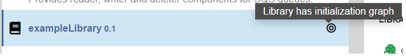
*Figure 161. Library has an initialization job*

A library initialization job (a graph or jobflow) can be used after installation to **CloverDX Server** by server administrators. Users with the [Manage libraries](../admin/groups.md#permission-manage-libraries) permission can run the initialization even when the library is [disabled](libraries.md#installation-settings).

The initialization job will come up in the **Library Initialization** section. You can run the job by clicking on the **Initialize library** button, even when the library is disabled. Note that you can use any other method for executing the initialization job ([REST API](rest-api.md), scheduler, etc.).

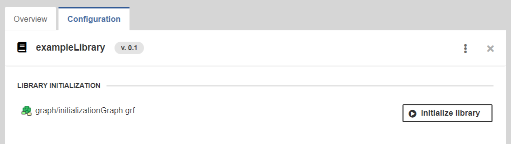
*Figure 162. Library initialization*

#### Health Check job

If your library includes a [Health Check job](libraries.md#health-check-job), which was enabled during library [installation](libraries.md#installation-settings), a schedule is automatically created in the **Schedules** module. The schedule is set to run every 24 hours and its status defaults to the library status (i.e., the schedule is disabled if the library is installed as disabled). To quickly get to the schedule detail, click on the "Health Check Schedule for <library name>" link. You can adjust its scheduled time or set up alerts and notifications on the **Alerts and Notification tab** as needed. The schedule can also be added to a monitor to be tracked in the [**Monitoring module**](ops-dashboard.md).

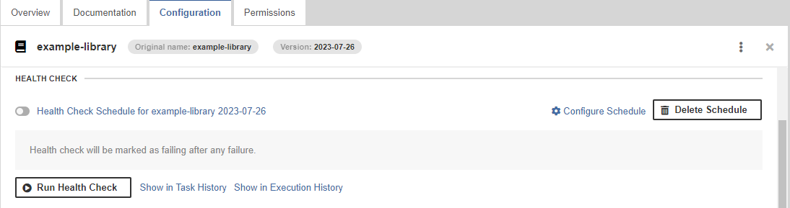
*Figure 163. Installed Health Check job*

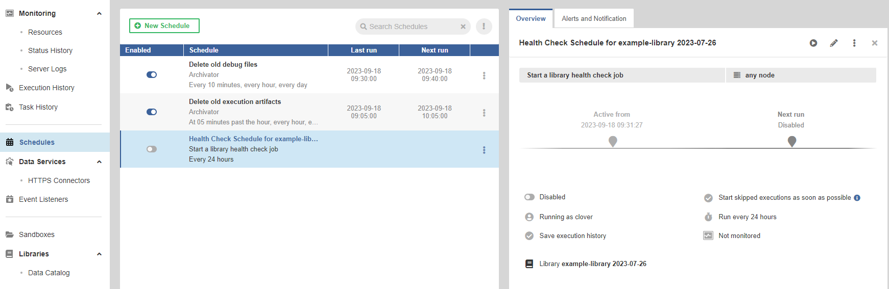
*Figure 164. Created Health Check schedule*

The schedule is automatically enabled if you enable the library, but you can disable it in the library **Configuration tab** by using the switch button next to the Health Check schedule. You can also run the Health Check job manually by clicking on **Run Health Check**.

To quickly display the job task or execution history, click on **Show in Task History** or **Show in Execution History**, respectively.

If you did not enable the Health Check job during library [installation](libraries.md#installation-settings), you can create the schedule by clicking on **Schedule Health Check**.

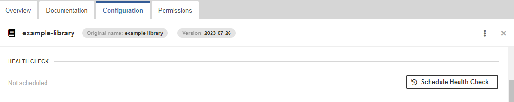
*Figure 165. Unscheduled Health Check job*

If the Health Check job fails, an exclamation mark appears in the library record, and the library is highlighted in red.

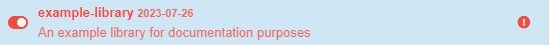
*Figure 166. Failed Health Check job*

#### Configurable parameters

If a library includes configurable parameters (see [exporting a library](../developer/export-library.md) for more information), it is indicated by a wrench icon.

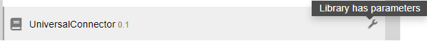
*Figure 167. Library has configurable parameters*

The supported parameter types are `String`, `Secure String`, `Boolean`, `Integer`, `Decimal`, and `Enumeration`. The parameter’s description is shown as an “i” icon with a tooltip.

All such parameters are displayed in the **Library Parameters** section, where their values can also be populated.
> [!NOTE]
> Note that to be able to modify values of secure parameters, users need to be assigned to a [user group](../admin/groups.md) that has the [Secure parameters administration](../admin/groups.md#permission-secure-parameters-administration) permission enabled.

If there is a parameter with an invalid value, the wrench icon will turn red to indicate that there is an issue and there will be an exclamation mark next to the affected parameter.

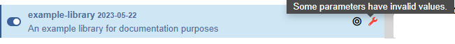
*Figure 168. Library has some parameters with invalid values*

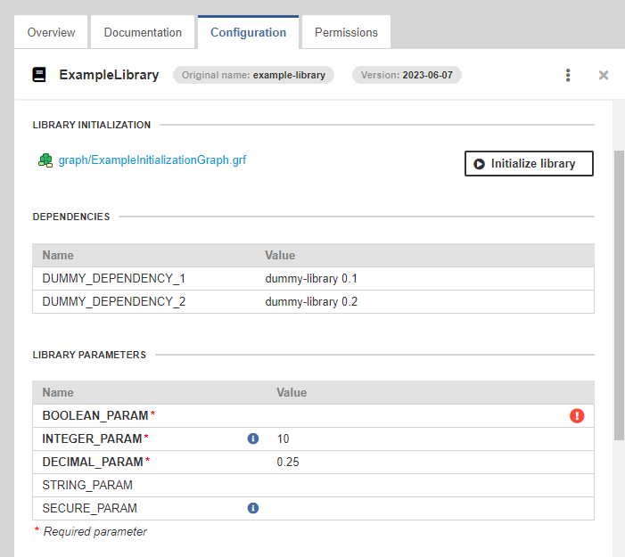
*Figure 169. Library parameters*

#### OAuth2 connections

All implemented OAuth2 connections in a library appear on the **Configuration tab**, where they can be reviewed, updated, authorized, or re-authorized. Unused OAuth2 connections, i.e., connections present in a library project which are not used in any of the public or internal (sub)graphs, are not displayed.
> [!NOTE]
> When exporting a library project, all OAuth2 connections are **always exported as unauthorized** even when they were authorized in **CloverDX Designer** during the development stage. After library installation, all used OAuth2 connections will need to be authorized again in **CloverDX Server**.

Each OAUth2 connection appears in a separate section on the **Configuration tab**, and its title includes the filename of the related *.cfg* file, and the provider of the OAuth2 connection (e.g., *Google, Azure, generic*),

All connections that need to be authorized have the **Authorize** button under them, and a note stating that the connection is not authorized. You can review and modify the connection properties if needed. If any of the connection properties are changed, the **Authorize** button becomes disabled until the changes are saved.

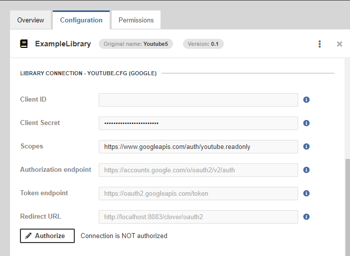
*Figure 170. Unauthorized connection*

By clicking on the **Authorize** button, you are redirected to the provider’s website to complete the authorization process. If the authorization process is successful, the button label changes to **Re-authorize**, and the note changes to indicate that the connection is authorized.

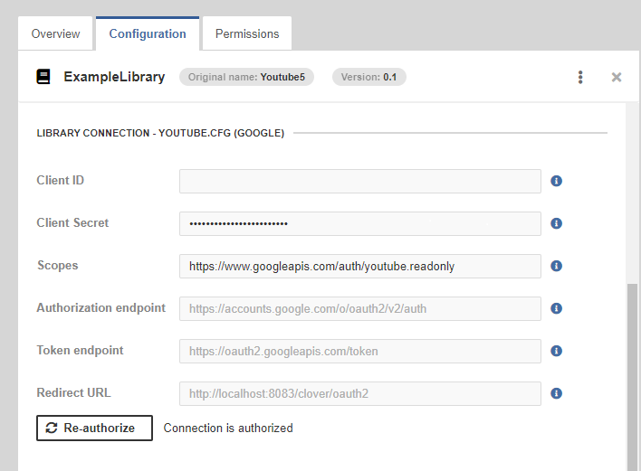
*Figure 171. Authorized connection*

#### Dependencies

If there is a dependency on another library, the **Configuration tab** will show the dependencies in the **Dependencies** section. If there is a dependent library missing, a red icon is displayed in the library list to indicate that there is an unresolved dependency, a warning is displayed in the **Configuration tab**, and the missing dependency is highlighted in the **Dependency** section.

If the referenced library is installed under the same name, it is linked automatically; otherwise, you must resolve the dependency manually.
> [!NOTE]
> After resolving dependencies manually, the dependency warning will automatically disappear but it is not possible to check if the dependency was resolved correctly until the library jobs or data connectors are used. If a dependency is resolved incorrectly, the library jobs or data connectors might fail even when there is no dependency warning.
> [!NOTE]
> It is important to set the same library permissions on all the dependent libraries to ensure that library jobs or data connectors can run successfully. For more information see [permissions](libraries.md#permissions-tab).

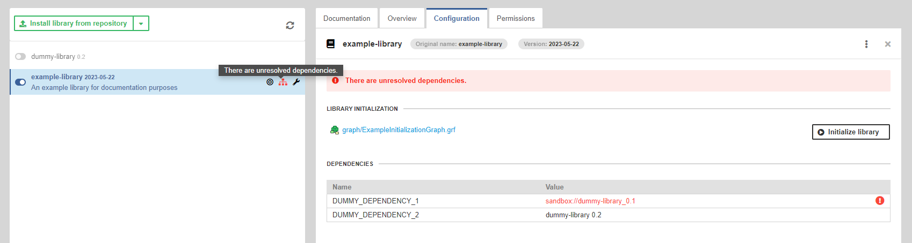
*Figure 172. Library has unresolved dependencies*

#### Incompatible library

**CloverDX** libraries may have specific version compatibility requirements. During development process it is possible to specify the minimum and/or maximum CloverDX version with which the library is compatible. If your **CloverDX Server** version falls outside a library’s supported range, it might not function correctly. This could lead to unexpected behavior or errors. While you can still install the library, it’s highly recommended to use libraries that are compatible with your **CloverDX Server** version to ensure optimal performance and avoid potential issues. If your installed library is imcompatible with your **CloverDX Server** version, a warning appears in the **Overview** tab and a warning icon is displayed in the library list.

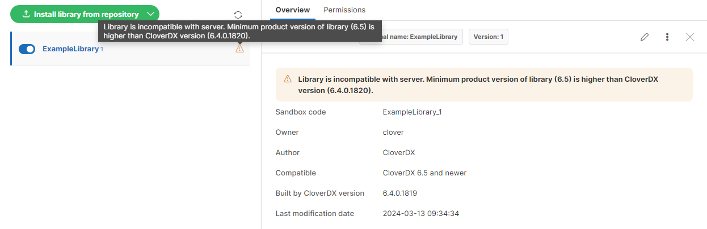
*Figure 173. Installed incompatible library*

### Permissions tab

On the **Permissions tab**, library-level permissions for libraries, data source connectors, and data target connectors can be set. In combination with the permissions set at the [user group](../admin/groups.md) level, it is possible to control library and data connector visibility and allowed operations in **CloverDX Server**, **CloverDX Designer**, and **CloverDX Wrangler**.

Only users assigned to a [user group](../admin/groups.md) that has one of the following permission combinations are allowed to view the **Permissions** tab:

- [Manage libraries](../admin/groups.md#permission-manage-libraries) + [Sandboxes - unlimited](../admin/groups.md#permission-sandboxes-unlimited)
- [Manage libraries](../admin/groups.md#permission-manage-libraries) + [Edit sandbox](../admin/groups.md#permission-edit-sandbox) + the **WRITE** library-level permission for the given library on the [Permissions tab](libraries.md#permissions-tab) OR the user is the library [owner](libraries.md#library-owner)

The tab includes separate sections for library-level permissions that affect the visibility and allowed operations in **CloverDX Server** and **CloverDX Designer**, and for **data source connectors** and **data target connectors** in the [Data Catalog](../user/data-catalog.md) in **CloverDX Wrangler** if any are present in the given library.
> [!NOTE]
> Any change in library permissions will automatically log out all users assigned to the affected group from all their active sessions and force them to log in again.

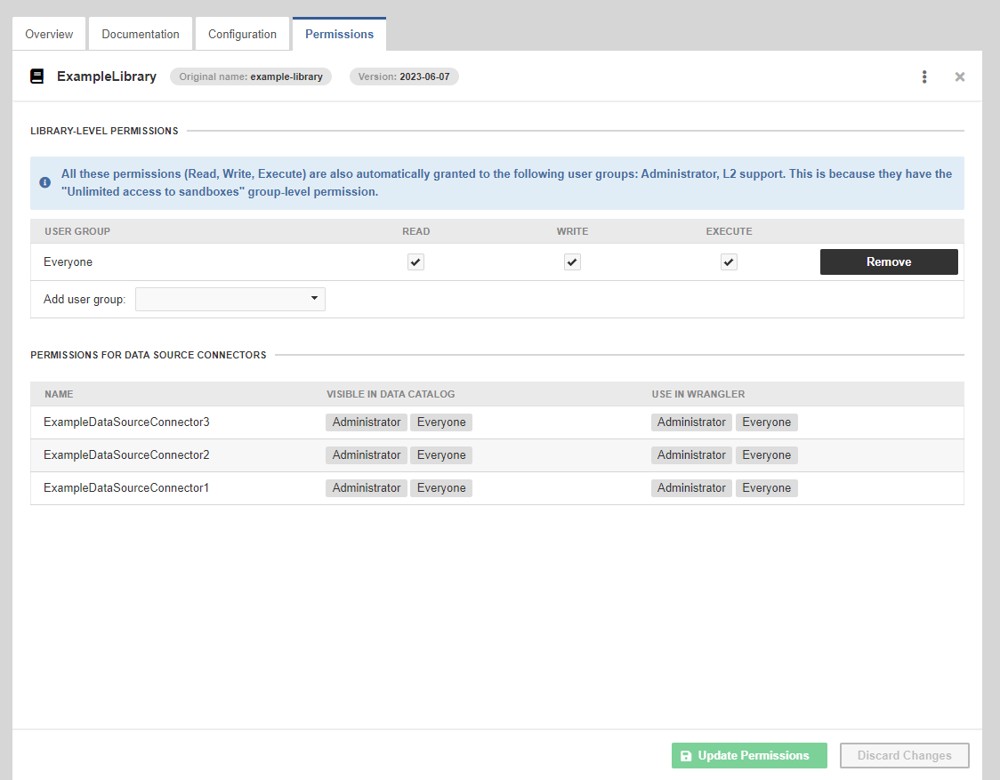
*Figure 174. Permissions tab*
> [!NOTE]
> Any changes performed in the tab will be saved only after clicking on the **Update Permissions** button.

#### Library-level permissions

The library-level permissions allow the following permissions to be set:

- **READ**: controls if a user group can see the library in the list of libraries, and [other places](libraries.md#usage) in **CloverDX Server** and **CloverDX Designer**.
- **WRITE**: in combination with the [Edit sandbox](../admin/groups.md#permission-edit-sandbox) permission, controls if a user group can see the library **Configuration** and **Permissions** tabs, and edit information on these tabs.
- **EXECUTE**: controls if a user group can execute graphs, subgraphs, jobflows, or data services from the [public interface](libraries.md#development) of the library.
> [!NOTE]
> When there are [library dependencies](libraries.md#dependencies), it is important to set the same library permissions on all the dependent libraries to ensure that library jobs or data connectors can run successfully.

#### Data connectors permissions

Data source and data target connector permissions are set individually for each data connector by linking a user group to permission. To add a user group to a permission, click in the column to activate the edit mode, and select the desired user group from the list. To remove a group, click on the X button on the right side of the group.

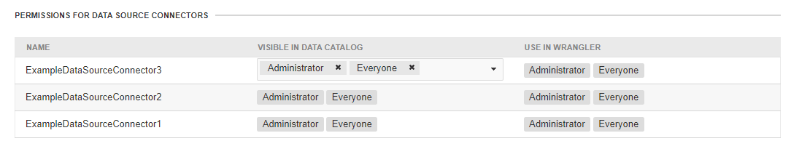
*Figure 175. Adding or removing user groups*

The data connector permissions allow the following permissions to be set:

- **VISIBLE IN DATA CATALOG**: controls if a user group can see the data connector in the **Data Catalog** in **CloverDX Wrangler**. Users with only the READ permission will not be able to see data preview or add the connector to their sources.
- **USE IN WRANGLER**: controls if a user group can add the data connector to their sources and use it Wrangler jobs.

#### Data connector permissions logic

Users assigned to a user group that has the [Sandboxes - unlimited](../admin/groups.md#permission-sandboxes-unlimited) permission are automatically granted all the library-level and data connector permissions. For other user groups, it is important to set both the library-level permissions and data source or data target connector permissions in the same way. This is because data connectors run on **CloverDX Server** to generate and display data on the Wrangler side. Having the same permissions for the libraries in which they are installed, and for the data connectors themselves, will ensure that the data connectors will be able to generate and display data successfully.

To make the configuration easier, there is a check in place, which will display a warning if there is a discrepancy between the library-level and data connector permissions. The warning will state which permissions and for which user groups will be ignored, and a warning icon will be displayed next to the group. The configuration can still be saved even when warnings are present; however, it is strongly recommended to correct the permission setup and remove all such warnings to ensure that the data connector can run without an issue.
> [!NOTE]
> When a library that includes data connectors is dependent on other libraries, it is important to set the same library-level permissions on all the dependent libraries as well to ensure that the data connectors can run successfully.

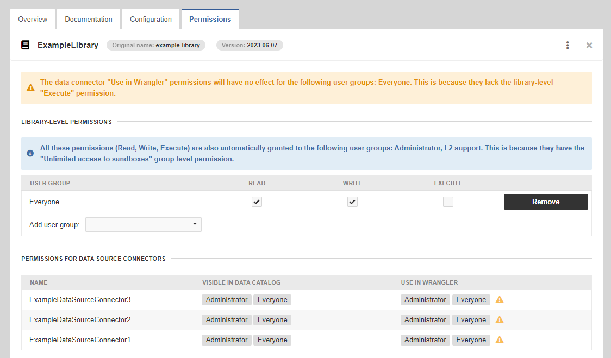
*Figure 176. Data source connector permissions warning*

### Library editing

Click on the **Edit** button in the upper right corner of the **Overview** tab to access the Edit mode, which allows you to modify the [Label](libraries.md#libraries-library-name) (Library name) or [Description](libraries.md#libraries-description) of a library.

Only users assigned to a [user group](../admin/groups.md) that has one of the following permissions combinations are allowed to edit libraries:

- [Manage libraries](../admin/groups.md#permission-manage-libraries) AND [Sandboxes - unlimited](../admin/groups.md#permission-sandboxes-unlimited)
- [Manage libraries](../admin/groups.md#permission-manage-libraries) AND [Edit sandbox](../admin/groups.md#permission-edit-sandbox) AND the **WRITE** library-level permission for the given library on the [Permissions tab](libraries.md#permissions-tab) (OR the user is the library [owner](libraries.md#library-owner))

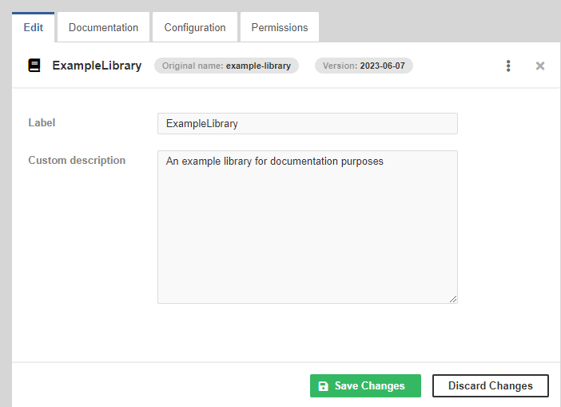
*Figure 177. Library editing*

### Library deleting

To delete an installed library click on the library that should be removed and use the ⋮ menu on any of the tabs to display the **Delete library** option.

Only users assigned to a [user group](../admin/groups.md) that has one of the following permissions combinations are allowed to delete libraries:

- [Manage libraries](../admin/groups.md#permission-manage-libraries) AND [Sandboxes - unlimited](../admin/groups.md#permission-sandboxes-unlimited)
- [Manage libraries](../admin/groups.md#permission-manage-libraries) AND [Delete Sandbox](../admin/groups.md#permission-delete-sandbox) AND the **WRITE** library-level permission for the given library on the [Permissions tab](libraries.md#permissions-tab) (OR the user is the library [owner](libraries.md#library-owner))

### Library and library repository configuration exports

Installed *Library* and *Library Repository* information can be easily [exported](../admin/server-config.md#server-configuration-export) in the **CloverDX Server** Console under *Configuration > Export*.

### Library and library repository configuration import

When you [import library or library repository configuration](../admin/server-config.md#server-configuration-import) in the **CloverDX Server** Console under *Configuration > Import*, **CloverDX Server** tries to find imported libraries in the list of installed libraries. If they are found they will be updated, otherwise, they will be installed from available repositories. Libraries are matched according to their original name, version, and library ID.

### Library management through REST API

Libraries can be installed and managed programmatically using our REST API. The REST API can be used to perform the following:

- Retrieve information about available libraries.
- Upload and install new libraries.
- Update, disable, enable, and delete existing libraries.
- Initialize libraries and schedule/run health checks to ensure their proper functioning.

Refer to the **REST API Catalog** within the **CloverDX** Console for instructions and code samples.
