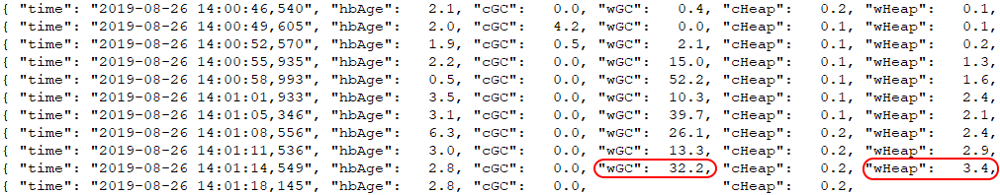
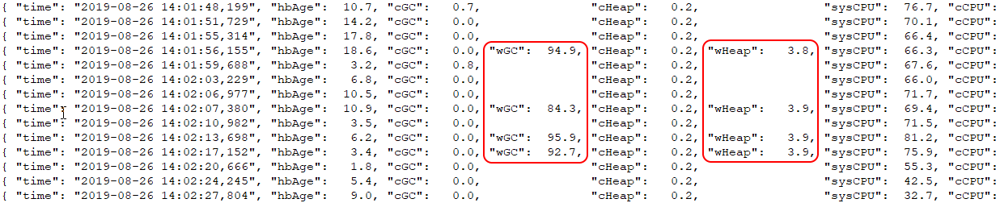
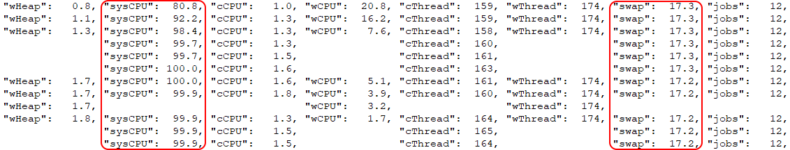
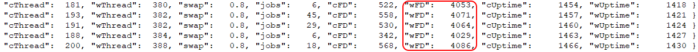

<!-- Automation and operations > Operations > Server logs & troubleshooting > Logging -->

### Logging

#### Server logs directory

**CloverDX Server** application logs[[1]](logging.md#log-directory-fn-01) are written to the directory specified by the `cloverlogs.dir` property. The value of this property is dynamically determined[[2]](logging.md#log-directory-fn-02) by the following hierarchy:

1. [logging.dir](../admin/list-of-properties.md#lop-logging-dir) system property, if specified
2. [clover.home](../admin/list-of-properties.md#lop-clover-home) system property, if specified
3. `java.io.tmpdir` system property

In all cases, logs are written to a subdirectory named `cloverlogs` within the base directory determined by the hierarchy above. The `cloverlogs.dir` property value can be reviewed under **Configuration > CloverDX Info** in the **CloverDX Server** console.

The `java.io.tmpdir` system property typically points to a common system temporary directory, such as `/tmp` on most systems or `$TOMCAT_HOME/temp` on Apache Tomcat.

| 1 | Execution log files directory is controlled by a different configuration property, see [Graph run logs](logging.md#graph-run-logs) for more information. |
| --- | --- |
| 2 | This property is dynamically determined and modifying it is not recommended as it can lead to unexpected behavior. |

#### Logging framework in CloverDX Server

**CloverDX Server** uses the log4j2 library for logging, with separate log4j2 configuration files for the Server core and Server worker processes.

The configuration files are located in the following directories:

- **Server core:**`[CloverDX Server install directory]/webapps/clover/WEB-INF/log4j2.xml`
- **Worker:**`[CloverDX Server install directory]/webapps/clover/WEB-INF/worker/cloveretl.server.worker.jar/log4j2.xml`
> [!NOTE]
> If you want to customize the logging configuration, do not customize these configuration files because they will be overwritten when you upgrade to a new version. Instead, follow the steps under [Logging customization](logging.md#logging-customization).

##### Default logging logic
> [!NOTE]
> The default logging logic was modified in version 6.4. See below for more information.

In **CloverDX** version 6.4, the logging logic has been enhanced to increase log file capacity and improve log file organization. Enhanced log file capacity enables extended logging durations, providing a more comprehensive historical record. Additionally, automatic compression optimizes storage utilization, and date-based filenames facilitate efficient log organization and retrieval, streamlining troubleshooting and analysis processes.

This change affects the following log files in **CloverDX Server**:

- *all.log*
- *performance.log*
- *worker.log*

**Previous behavior:**

- Log file size limit:
  - *all.log* and *worker.log*: 5MB
  - *performance.log*: 10MB
- When the size limit was reached:
  - The previous file is renamed and a +1 extension is added (e.g., all.log.1)
- Maximum of 10 files were kept for each log type.

**New behavior:**

- All log files now have a maximum size of 20MB.
- When the size limit is reached OR when a new day begins:
  - The previous file is automatically compressed into a GZ archive.
  - The filename is updated to include the date and +1 is added (e.g., all.2024-03-23.1.log.gz).
  - Maximum of 20 files are kept for each log type, with older files being automatically rewritten.

Existing log files in the old format will be gradually converted to the new format as they are filled or when a new day begins.

The log4j2 configuration file contains commented-out sections for the previous logging logic. If you want to revert to the previous logging behavior, you can modify the relevant sections in the configuration file for the server Core and enable the previously commented-out logic.

See [Logging framework in CloverDX Server](logging.md#logging-framework-in-cloverdx-server) for more information on where to find the default log4j2 configuration file for server Core. For more information on how to customize logging, see the [Logging customization](logging.md#logging-customization) section below.

##### Logging customization

You can customize the logging configuration for both Server core and worker by supplying your `log4j2.xml` files:

- **Server core:**
  1. Define a new system property `log4j.configurationFile` with the full path to the file:
     -Dlog4j.configurationFile=file:///C:/path/to/log4j2-server.xml
     or
     -Dlog4j.configurationFile=file:///opt/path/to/log4j2-server.xml
  2. Restart **CloverDX Server**.
- **Worker:**
  1. Using [worker.jvmOptions](../admin/list-of-properties.md#lop-worker-jvmoptions), define a new system property `log4j.configurationFile` with the full path to the file:
     worker.jvmOptions= -Dlog4j.configurationFile=file:///C:/path/to/log4j2-worker.xml
     or
     worker.jvmOptions= -Dlog4j.configurationFile=file:///opt/path/to/log4j2-worker.xml
  2. Restart Worker.
> [!IMPORTANT]
> You must provide a complete configuration as the supplied file will completely override the log4j2 configuration shipped with **CloverDX Server**. It is, therefore, best to copy out and modify the configuration shipped with Server (see [Logging framework in CloverDX Server](logging.md#logging-framework-in-cloverdx-server) for file locations).
>
> If you used a custom Log4j configuration in **CloverDX Server** 5.1 and older, you will have to [migrate to Log4j2 configuration](https://logging.apache.org/log4j/2.x/manual/migration.html) in **CloverDX Server** 5.2.
>
> For configuration details, see [Configuration of Log4j2](https://logging.apache.org/log4j/2.x/manual/configuration.html).

**Note:** since such a configuration overrides the default configuration, it may influence Graph run logs. So your own log configuration has to contain the following fragment to preserve Graph run logs:

```xml
<logger name="Tracking" additivity="false">
  <level value="debug"/>
</logger>
```

#### Other useful logging settings

These system properties allow for logging of HTTP requests/responses to stdout:

Client side:

`com.sun.xml.ws.transport.http.client.HttpTransportPipe.dump=true` (For more information, see the [Working with CloverDX Server projects](../developer/server-projects-usage.md).)

Server side:

`com.sun.xml.ws.transport.http.HttpAdapter.dump=true`

#### Designer-Server integration logs

The logging of Designer-Server integration can be enabled with [logging.logger.server_integration.enabled](../admin/list-of-properties.md#lop-logging-logger-server-integration-enabled) configuration property. The name of the log file is `server-integration.log`.

The log format is date and time, IP address of Designer, user name, operation, result of the operation (success/failure) and duration in milliseconds.

```
2018-03-07 16:42:00,525 10.0.3.2 user=clover, operation=executeGraph SUCCESS duration=576 ms
```

#### Performance log

The performance log measures performance metrics that are useful for diagnostics of incidents such as slowdown of processing, restarts of Worker or Server Core etc. The metrics are such as CPU load, Java heap size, number of open files etc. CloverDX logs values of the metrics in regular intervals into the performance log.

Example of the performance log:


*Figure 105. Performance log example*

In the above example, the jobs in Worker require large heap space, which will soon cause the Worker’s heap to fill and garbage collector to consume all CPU time of the Worker. The Worker will stop responding to Server and will be restarted.

Each line of the performance log is one entry, which is a JSON. The line contains a timestamp and values of metrics from Server Core and Worker. There can be short gaps in the log, e.g. under very high load the Worker might not be able to send the metric values for every entry. Long gaps indicate a more severe issue.

The performance log can be found in:

- Server Console
  **Monitoring > Server Logs > PERFORMANCE** page
- `{java.io.tmpdir}/cloverlogs/performance.log`

The performance log can be disabled by setting configuration property `logging.logger.performance.enabled=false`

| Metric Label in Log | Metric | Description | Unit | Collected in |
| --- | --- | --- | --- | --- |
| time | Timestamp | Date and time when metrics in this entry were collected.  The timestamps should be even, i.e. there should not be significant time gaps between the log entries. By default, Server logs the metrics every 3 seconds. If the log entry contains only metrics from Worker (i.e. Server Core wasn’t able to collect the metrics), then the timestamp will be for the time when Worker collected the metrics. | timestamp | core/worker |
| hbAge | Heartbeat age | Age of latest Worker heartbeat (Worker sends regular heartbeat to Server Core to report its health). Measured as a difference between the current time and the time when the latest Worker heartbeat was received by Server Core.  Heartbeat age should be typically a few seconds. Tens of seconds indicate a problem, typically overloaded Worker or Server Core. For example when running out of free heap the Worker will spend its time in GC and will have less capacity to send heartbeat. When the heartbeat age gets over a limit value (about a minute), the Server Core will restart the Worker. | seconds | core |
| cGC | Server Core garbage collector activity | Percentage of CPU time spent in garbage collection for the Server Core, since the time of previous performance log entry.  Typical values should be <20%, with occasional higher spikes. Long intervals of high GC activity indicate that the Server Core is running out of free heap. | 0-100% | core |
| wGC | Worker garbage collector activity | Percentage of CPU time spent in garbage collection for the Worker, since the time of previous performance log entry.  Typical values should be <20%, with occasional higher spikes. Long intervals of high GC activity indicate that the Worker is running out of free heap. High Worker GC activity will often be accompanied by short gaps in metrics reported by the Worker. | 0-100% | worker |
| cHeap | Server Core heap usage | Amount of used java heap memory in Server Core JVM.  The value of used heap can rise up to maximum heap size of Server Core. The maximum heap size of Server Core is set as the heap size for the Application Container running CloverDX Server, e.g. via the -Xmx argument. Look in the `all.log` to find the maximum heap size - Server Core logs system information when starting. As the used heap size nears the maximum heap size, Server Core GC activity will increase. | GB | core |
| wHeap | Worker heap usage | Amount of used java heap memory in Worker JVM.  The value of used heap can rise up to maximum heap size of Worker. Maximum size of Worker heap is set in the Worker configuration (Configuration > Setup > Worker, or worker.maxHeapSize configuration property). Additionally, Worker logs the maximum Worker heap size in the `worker.log` as part of system information log. As the used heap size nears the maximum heap size, Worker GC activity will increase. | GB | worker |
| sysCPU | System CPU load | Total CPU load of the machine on which Server runs. The system CPU load is caused by all processes running on the machine. The measured CPU load is average over last 10 seconds.  If the system CPU load is significantly higher than the sum of Worker and Server Core CPU load for a long time, this indicates another CPU demanding process is running on the machine. Alternatively, high swap usage can cause high system CPU load. | 0-100% | core |
| cCPU | Server Core process CPU load | CPU load that Server Core process introduces on the system. The Server Core CPU load is average over last 10 seconds.  Typically, the Server Core CPU load should be low (<10%), as most processing is done by jobs running in the Worker. | 0-100% | core |
| wCPU | Worker process CPU load | CPU load that Worker process introduces on the system. The Worker CPU load is average over last 10 seconds. | 0-100% | worker |
| jobs | Running jobs | Number of currently running CloverDX jobs. If this Server is part of CloverDX Cluster, only jobs running on this node are counted. | number | core |
| jobQueue | Size of job queue | Number of currently enqueued CloverDX jobs, see [Job queue](job-queue.md) for more information about the job queue. If this Server is part of CloverDX Cluster, only jobs enqueued on this node are counted. | number | core |
| cThread | Server Core threads | Number of currently live threads in Server Core JVM.  Typical values are up to hundreds. If the values continuously increase that can indicate a thread leak. | number | core |
| wThread | Worker threads | Number of currently live threads in Worker JVM.  Typical values are up to hundreds or low thousands. If the values continuously increase that can indicate a thread leak. | number | worker |
| swap | System swap | Amount of memory swapped by OS to disk.  Swap should be used as little as possible, as swapped processes are significantly slower. On Linux, swap should be in hundreds of MB or less. | GB | core |
| cFD | Server Core file descriptors | Number of currently used file descriptors by Server Core.  This metric is **not available on Windows**. If the values continuously increase that can indicate a file descriptor leak. Maximum number of open file descriptors has a limit configured in the OS. | number | core |
| wFD | Worker file descriptors | Number of currently used file descriptors by Worker.  This metric is **not available on Windows**. If the values continuously increase that can indicate a file descriptor leak. Maximum number of open file descriptors has a limit configured in the OS. | number | worker |
| cUptime | Server Core uptime | Uptime of Server Core, i.e. of the Application Container running Server Core. | seconds | core |
| wUptime | Worker uptime | Uptime of Worker.  Useful metric to see when the Worker was restarted - the uptime is re-set to 0. | seconds | worker |

**Example scenarios:**

- **Out of heap memory** - if the Server Core or Worker run out of heap, it will be visible in the performance log by high GC activity (cGC or wGC) and by their heap usage (cHeap or wHeap) rising to the max heap available.
  
  *Figure 106. Worker running out of heap example*
- **High swap usage** - if the system swap is used too much (e.g. several GB) as indicated by the swap metric, then CloverDX will be typically slowed down noticeably, e.g. the jobs will run much slower. This can be caused by insufficient system memory for the heap size (remember that Java needs memory outside of heap). Or some other process is taking the memory. This is often accompanied by high system CPU load.
  
  *Figure 107. High swap usage example*
- **Low limit of file descriptors** - CloverDX uses a high number of open files for high performance processing. Default OS limit on maximum open files can be low (e.g. 4096). If the file descriptor metrics (cFD or wFD) rise to a high number and then an issue occurs (typically accompanied by "Too many open files" exceptions in all.log or job logs), then the cause is low limit on maximum open file descriptors (see [Maximum number of open files](../admin/postinstallation-configuration.md#maximum-number-of-open-files) in our documentation).
  
  *Figure 108. Low file descriptor limit example*
- **Other process creating CPU load** - if the system CPU load (sysCPU) is high, and significantly higher than Server Core + Worker CPU loads (cCPU + wCPU), then there’s probably some other process producing high CPU load.

#### Job queue log

The job queue log contains metrics useful for analyzing job queue behavior (see [Job queue](job-queue.md)). CloverDX logs values of the metrics in regular 3 second intervals into the job queue log.

Each line of the queue log is one entry, which is a JSON. The line contains a timestamp and values of metrics.

The job queue log can be found in:

- Server Console **Monitoring > Server Logs > Job queue**
- `{java.io.tmpdir}/cloverlogs/job-queue.log`

| Metric Label in Log | Metric | Description | Unit |
| --- | --- | --- | --- |
| time | time | Date and time when metrics in this entry were collected.  The timestamps should be even, i.e. there should not be significant time gaps between the log entries. By default, Server logs the metrics every 3 seconds. | timestamp |
| queued | Queue Size | Number of enqueued jobs waiting for execution. The jobs are in the *Enqueued* state.  Maximum queue length is configurable [jobqueue.maxQueueSize](../admin/list-of-properties.md#lop-jobqueue-maxqueuesize). | number |
| running | Running jobs | Number of currently running CloverDX jobs. If this Server is part of CloverDX Cluster, only jobs running on this node are counted. | number |
| started | Started jobs in interval | Number of jobs started in the time interval from the previous log entry (3 seconds). Jobs that have queueing disabled (e.g. Data Services, jobs with queueable execution property set to `false` etc.) are not counted. The number includes both jobs that were enqueued and those that were not (but could have been). | number |
| cpu | System CPU load | Total CPU load of the machine on which Server runs. The system CPU load is caused by all processes running on the machine. | 0-100% |
| loadStep | Load Step | This value represents number of enqueued jobs started in one batch, see [Job queue Algorithm](job-queue.md#job-queue-algorithm) for more details.  If there are available resources, this queue executes `loadStep` number of jobs at once.  **Advanced metric.** | number |
| queueExecutions | Queue Executions Counter | This value counts events when the job queue starts a new batch of enqueued jobs.  This counter is reset if the job queue becomes empty or `loadStep` has been increased.  **Advanced metric.** | number |
| avgCpu | Average CPU load | Average CPU load measurement, which is used for heuristic that can increase `loadStep`.  **Advanced metric.** | 0-100% |
| coreLowMem | Core Low Memory Mode | Core heap memory consumption exceeded safety threshold, queue enters emergency mode (see [Job queue Emergency Mode](job-queue.md#emergency-mode)). | boolean |
| workerLowMem | Worker Low Memory Mode | Worker heap memory consumption exceeded safety threshold, queue enters emergency mode (see [Job queue Emergency Mode](job-queue.md#emergency-mode)). | boolean |
| nonBlockedJobs | Running jobs not blocked | Counts currently running jobs, used only in emergency mode.  **Advanced metric.** | number |

#### Monitor log

The **Monitor log** tracks changes of Monitors which are part of the [Operations Dashboard](ops-dashboard.md). The Monitor log contains entries such as deteriorating or improving health of a Monitor, which items started to fail and which recovered, manual reset of health state of monitored items etc. This allows you to analyze what was happening to your data processing in the past.

The Monitor log can be found in:

- Server Console **Monitoring > Server Logs > Monitor** page
- `{java.io.tmpdir}/cloverlogs/monitor.log`


*Figure 109. Monitor log*

#### Server Audit logs (disabled by default)

*Server Audit Log* logs operations called on *ServerFacade* and *JDBC proxy* interfaces.

*Audit logging* is disabled by default. Audit logging can be enabled by setting (adding) the value of CloverDX property `logging.logger.server_audit.enabled` to true. In server GUI, you can change the property value in **Configuration** ****Setup** ****Configuration File**.

The name of output file is `server-audit.log`. The file is in the same directory as main server log files. Default log level is DEBUG, so all operations which may do any change or another important operations (e.g. login or openJdbcConnection) are logged. To enable logging of all operations, change log level to TRACE in the log4j configuration.

Each logged operation is logged by two messages: entering method and exiting method (if the exception is raised, it’s logged instead of output parameters)

- Entering method (marked as "inputParams"). All method’s parameters (except for passwords) are printed.
- Exiting method (marked as "outputParams"). Method’s return value is printed.
- Exception in method (marked as "EXCEPTION"). Exception’s stacktrace is printed.

Message also contains:

- username, if the user is known
- client IP address, if it’s known
- Cluster node ID
- Interface name and the operation name

Values of transient and lazy initialized (in entity classes) fields and fields with binary content are not printed.

#### Graph run logs

Each graph or jobflow run has its own log file – for example, in the Server Console, section [Execution History](execution-history-main.md#execution-history-viewing-job-runs).

By default, these log files are saved in the subdirectory cloverLogs/graph in the directory specified by `java.io.tmpdir` system property.

It’s possible to specify a different location for these logs with the CloverDX `graph.logs_path` property. This property does not influence main Server logs.

#### Application server logs

If you use Apache Tomcat, it logs into `$CATALINA_HOME/logs/catalina.out` file.

##### Access log in Apache Tomcat

If you need to log all requests processed by the server, add the following code to `$CATALINA_HOME/conf/server.xml`.

```xml
<Valve className="org.apache.catalina.valves.AccessLogValve" directory="logs"
    prefix="localhost_access_log" suffix=".txt"
    pattern="%h %l %u %t %D %r %s %b" />
```

The format defined above has following meaning

```
[IP address] [date-time] [processing duration in milliseconds] [method] [URL] [protocol+version] [response code] [response size]
```

The log will look like the next line

```
172.17.30.243 - - [13/Nov/2014:12:53:03 +0000] 2 "POST /clover/spring-rpc/clusterNodeApi HTTP/1.1" 200 1435"
```

See also *[Valve](https://tomcat.apache.org/tomcat-9.0-doc/config/valve.html)* in documentation on Apache Tomcat.
