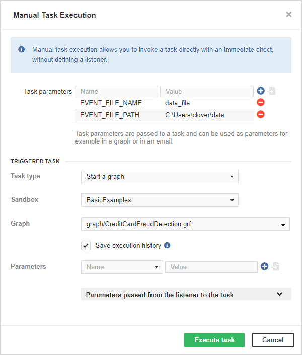

<!-- Automation and operations > Automation > Manual task execution -->

## 4. Manual task execution

A manual task execution allows you to invoke a task directly with an immediate effect, without defining and triggering an event.

There are a number of task types that are usually associated with a triggering event, such as a file listener or a graph/jobflow listener. You can execute any of these tasks manually.

Additionally, you can specify task parameters to simulate a source event that would normally trigger the task. The following is a figure displaying how a 'file event' could be simulated. The parameters for various event sources are listed in the [Job parameters](../developer/parameters.md#built-in-execution-parameters).

*Figure 31. Web GUI - "Manual task execution" form*

### Using Manual Task Execution

In the Server GUI, switch to the **Event Listeners** tab. In the **New Listener** drop-down menu, select the **Manual Task Execution** option.

Choose the task type you would like to use. See documentation on chosen tasks:

| [Send an Email](tasks.md#send-an-email) |
| --- |
| [Execute Shell Command](tasks.md#execute-shell-command) |
| [Start a Graph](tasks.md#start-a-graph) |
| [Start a Jobflow](tasks.md#start-a-jobflow) |
| [Abort job](tasks.md#abort-job) |
| [Archive Records](tasks.md#archive-records) |
| [Send a JMS Message](tasks.md#send-a-jms-message) |
| [Execute Groovy Code](tasks.md#execute-groovy-code) |

If the server is suspended, form requires explicit confirmation of execution on suspended server.

To access the **Manual Task Execution** form, you need [Manual task execution permission](../admin/groups.md#permission-manual-task-execution).
