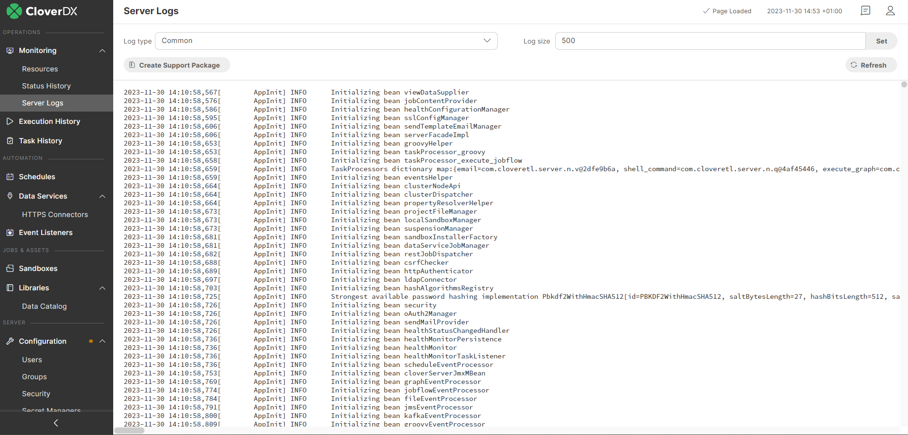

<!-- Automation and operations > Operations > Server logs & troubleshooting > Server Logs in Server Console -->

### Server Logs in Server Console

The **Server Logs** section allows you to quickly display the latest **CloverDX Server** log messages. In a cluster environment, users can select a node to display the log files for. Since the log messages that are displayed in this section are collected in memory, the maximum number of messages is relatively low by default, but it can be easily changed by modifying the value in the *Log size* field and clicking on the **Set** button.

By clicking on the **Create Support Package** button, you will be redirected to the **System Info** section under **Configuration**, where you can easily generate a [Support Package](support-package.md), which will allow you to automatically zip up and download the full log files.

For more information on what type of logging is used in **CloverDX Server**, how it can be modified, and how to read the log files, see [Logging](logging.md).

The full log files, in plain text format, reside on the server in a directory defined by configurable parameters. See [Logs directory](logging.md#server-logs-directory) for more information.

The following **Log types** are available to be displayed:

- **COMMON** - displays information related to Server core and worker processes, start and end times of job executions, successful and unsuccessful logins, etc.
  The file name of the related log file in the filesystem is `all.log`.
- **WORKER** - displays worker-related information (e.g. when a worker process was stopped or started, and it lists job start and end times).
  The file name of the related log file in the filesystem is `worker-[node_name].log`.
- **CLUSTER** - displays cluster-related messages. It contains information on job delegation across nodes and other types of messages related to cluster communication.
  The file name of the related log file in the filesystem is `node.log`.
- **DATA SERVICES** - displays information related to data services, e.g., login information, target URI, IP address, or returned HTTP code.
  The file name of the related log file in the filesystem is `data-service.log`.
- **AUDIT** - displays information about operations triggered by the **CloverDX Server** core, e.g., job execution calls. This log is disabled by default. Refer [here](logging.md#server-audit-logs-disabled-by-default) for more information about how to enable it and what kind of information it logs.
  The file name of the related log file in the filesystem is `server-audit.log`.
- **USER ACTIONS** - displays user-related operations, e.g. login, logout, user creation, and file synchronization triggered by changes in Server projects.
  The file name of the related log file in the filesystem is `user-action.log`.
- **SERVER INTEGRATION** - displays information related to the interaction between CloverDX Designer and Server.
  The file name of the related log file in the filesystem is `server-integration.log`.
- **PERFORMANCE** - displays performance-related information, e.g. heartbeat age between core and worker, used worker and core heap space, system, core and worker CPU, or worker and core uptime. More information about how to read this log file can be found [here](logging.md#performance-log).
  The file name of the related log file in the filesystem is `performance.log`.
- **JOB QUEUE** - displays information related to jobs processing, e.g., the number of currently queued and running jobs, and the current system CPU.
  The file name of the related log file in the filesystem is `job-queue.log`.
- **MONITOR** - displays information related to [monitors](ops-dashboard.md), e.g., creation and deletion of monitors, changes in monitor states, or the number of failing items in monitors.
  The file name of the related log file in the filesystem is `monitor.log`.
- **REMOTE DATA MANAGER** - displays details of remote access to data sets in the Data Manager if [remote Data Manager](../admin/data-manager-administration.md#data-manager-configuration) is configured. It includes information like the IP address of the remote Server, the configured user and client name of the remote connection, the type of action performed (such as read or write), and how long the operation took.
  The file name of the related log file in the filesystem is `remote-data-manager.log`.

*Figure 110. Server Logs*
