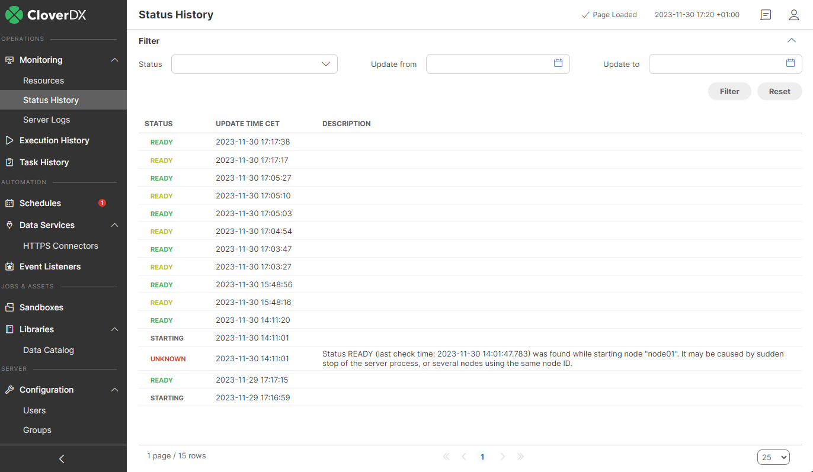
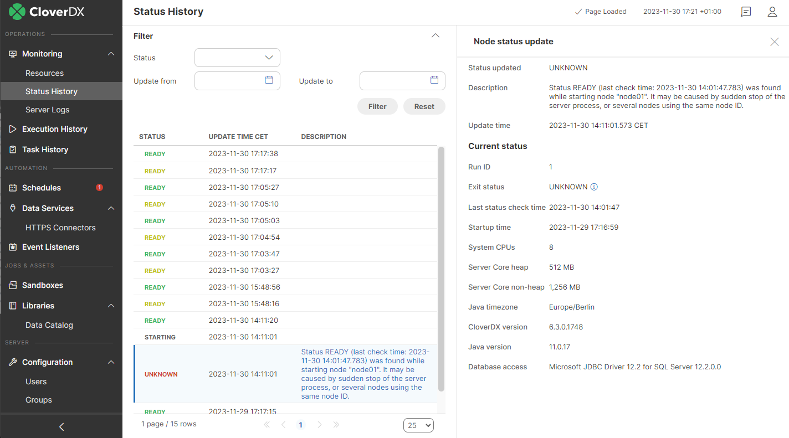

<!-- Automation and operations > Operations > Monitoring > Status History -->

### Status History

In this section you can review a list of changes in node statuses; in a cluster environment, you will be able to see statuses from all nodes. By clicking on a specific record, you can display additional information.

*Figure 103. Status History*

*Figure 104. Status History Detail*
